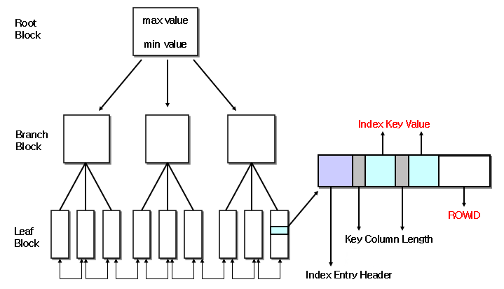
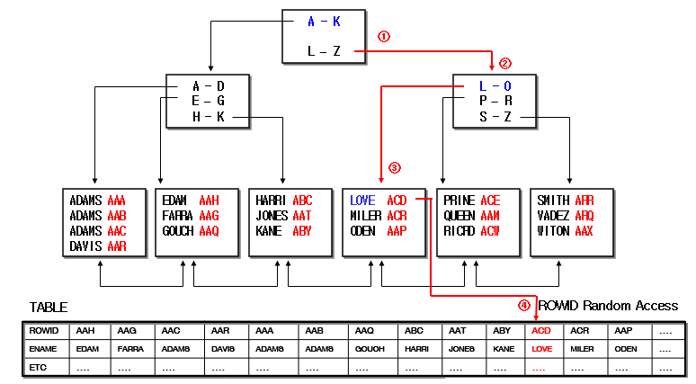
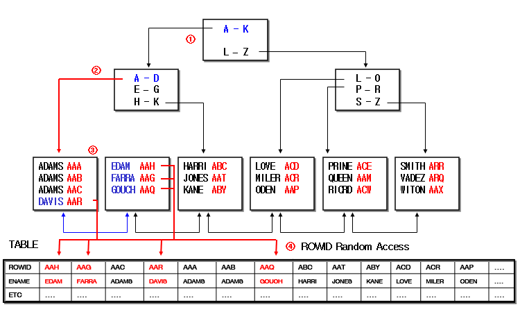

### 6.1.1 인덱스의 개념

- 인덱스 개념
  - 테이블의 row와 하나씩  대응되는 **별도의 객체** 독립적인 저장 공간을 보유
  - Optimizer가 최적의 실행경로를 설정하는데 중요한Factor가 됨
  - 구성 : 인덱스를 생성시킨 **컬럼의 값(VALUE)** + 그 행의 **논리적 주소(ROWD)**
  - 성능 향상 	
    - 인덱스를 이용하여 별도의 정렬 없이 결과 추출
    - 물리적인 디스크 I/O 감소
- 참고사항
  - 인덱스를 사용하는 효율적인 질의문을 작성한다고 하여, 질의문을 기존과 다르게 작성하는 것은 아님
  - 인덱스는 단지 자료에 더 빠르게 접근할 수 있는 수단을 제공
  - 인덱스 활용 원리를 알고, 인덱스 설계를 어떻게 하느냐가 더욱 중요

### 6.1.2 데이터 접근 방식

- Index 이용한 접근 방식

```sql
SELECT empno, ename, job        
FROM emp                              
WHERE job between '부장' and '이사'
```

[INDEX(JOB)]

| INDEX-KEY | ROWD               |
| --------- | ------------------ |
| 과장      | 0000A95B.0002.0001 |
| 부장      | 000062BE.0001.0001 |
| 이사      | 000069C5.0001.0001 |

[TABLE(EMP)]

| EMPNO | ENAME | JOB  |
| ----- | ----- | ---- |
| 7654  | 펭빠  | 부장 |
| 7934  | 펭하  | 이사 |
| 7432  | 펭펭  | 과장 |

[SORT된 결과(JOB)]

| EMPNO | ENAME | JOB  |
| ----- | ----- | ---- |
| 7654  | 펭빠  | 부장 |
| 7934  | 펭하  | 이사 |

- Full Table Scan

```sql
SELECT empno, ename, job        
FROM emp                              
WHERE job between '부장' and '이사'
```

[TABLE(EMP)]

| EMPNO | ENAME | JOB  |
| ----- | ----- | ---- |
| 7654  | 펭빠  | 부장 |
| 7934  | 펭하  | 이사 |
| 7432  | 펭펭  | 과장 |

[SORT 안 된 결과]

| EMPNO | ENAME | JOB  |
| ----- | ----- | ---- |
| 7654  | 펭빠  | 부장 |
| 7934  | 펭하  | 이사 |
| 7827  | 펭수  | 부장 |

### 6.1.3 B*Tree Index

- B*Tree Index 구조
  - 가장 범용적으로 사용되는 인덱스(OLTP, DW..)
  - Leaf Block에 각 value와 Rowid를 포함
  - Leaf Block의 값은 정렬되어 있음
  - 인덱스를 통한 Table의 1 row 조회 시 비교적 빠른 안정적인 속도 제공



- B*Tree Index 데이터 접근 예시1

```sql
SELECT ....
WHERE ENAME = 'LOVE'
```



- B*Tree Index 데이터 접근 예시2

```sql
SELECT ....
WHERE ENAME BETWEEN ‘DAVIS’ 
AND ‘GOUCH’
```



### 6.1.4 인덱스의 종류

- 인덱스 컬럼의 Unique 여부에 따른 분류
  - Unique Index
  - Non-Unique Index
- 인덱스 컬럼 수에 따른 분류
  - Single Column Index
  - Composite Index
- 물리적 구분에 따른 인덱스
  - B*Tree Index
  - Cluster Index
  - Bitmap Index
- 기타 인덱스
  - Function based Index
- 특이사항
  - Unique 및 Primary Key 제약조건 정의 시 내부적으로 Unique Index 생성
  - Foregin Key 제약조건의 경우는 Index 생성하지 않음
    - 반드시 명시적인 인덱스 생성 필요

### 6.2.1 인덱스 적용 대상

- 어떤 테이블에 인덱스를 만들까?
  - 중, 대형규모의 테이블(6블럭 이상)
    - 테이블의 크기가 5~6블럭 이하인 것은 인덱스를 만들지 않고 테이블을 FULL SCAN해도 무방
  - 일반적으로 약 10 ~ 15% 이내의 데이터 요구인 경우
  - **무작위접근(Random Access)**이 빈번한 테이블
    - 단순 보관용이거나 전체 조회용일 경우에는 인덱스를 생성하지 않음
  - 특정 **범위/순서**의 데이터조회가 필요한 테이블
  - 테이블에 접근하지 않고 인덱스만으로 데이터 요규를 해결하고자 하는 경우
  - Join의 연결고리가 되는 컬럼의 테이블
  - 참조무결성을 지정한 경우 연결고리가 되는 컬럼을 테이블

### 6.2.2 인덱스 컬럼 선정 기준

- 어떤 컬럼을 선정 할까?

  - **분포도(Cardinality)**가 좋은 컬럼은 단독으로 생성하여 활용도 향상

    - 10 ~ 15% 넘지 않도록

  - 자주 조합되어 사용되는 컬럼의 경우 **결합인덱스** 생성

  - **가능한 모든 접근경로(Access Path)**를 만족시킬 수 있는 범용적 인덱스 생성

  - 수정이 빈번히 일어나지 않는 컬럼을 선정

  - **외부키 및 조인의 연결고리**로 사용된 컬럼

  - **정렬기준**으로 자주 사용되는 컬럼

  - **분포도(%)** = 1 / 컬럼의 값 종류 X 100

    ​                   = 데이터별 평균 row수 / 테이블의 총 row수 X 100

188p

