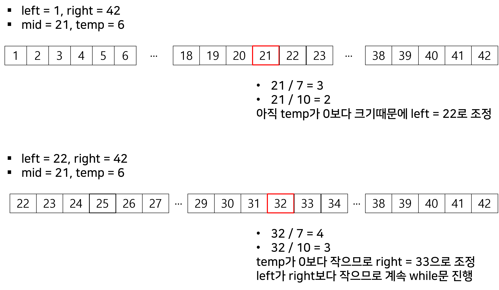

# [프로그래머스] 입국심사 파이썬

###### 문제 설명

n명이 입국심사를 위해 줄을 서서 기다리고 있습니다. 각 입국심사대에 있는 심사관마다 심사하는데 걸리는 시간은 다릅니다.

처음에 모든 심사대는 비어있습니다. 한 심사대에서는 동시에 한 명만 심사를 할 수 있습니다. 가장 앞에 서 있는 사람은 비어 있는 심사대로 가서 심사를 받을 수 있습니다. 하지만 더 빨리 끝나는 심사대가 있으면 기다렸다가 그곳으로 가서 심사를 받을 수도 있습니다.

모든 사람이 심사를 받는데 걸리는 시간을 최소로 하고 싶습니다.

입국심사를 기다리는 사람 수 n, 각 심사관이 한 명을 심사하는데 걸리는 시간이 담긴 배열 times가 매개변수로 주어질 때, 모든 사람이 심사를 받는데 걸리는 시간의 최솟값을 return 하도록 solution 함수를 작성해주세요.

##### 제한사항

- 입국심사를 기다리는 사람은 1명 이상 1,000,000,000명 이하입니다.
- 각 심사관이 한 명을 심사하는데 걸리는 시간은 1분 이상 1,000,000,000분 이하입니다.
- 심사관은 1명 이상 100,000명 이하입니다.

##### 입출력 예

| n    | times   | return |
| ---- | ------- | ------ |
| 6    | [7, 10] | 28     |

##### 입출력 예 설명

가장 첫 두 사람은 바로 심사를 받으러 갑니다.

7분이 되었을 때, 첫 번째 심사대가 비고 3번째 사람이 심사를 받습니다.

10분이 되었을 때, 두 번째 심사대가 비고 4번째 사람이 심사를 받습니다.

14분이 되었을 때, 첫 번째 심사대가 비고 5번째 사람이 심사를 받습니다.

20분이 되었을 때, 두 번째 심사대가 비지만 6번째 사람이 그곳에서 심사를 받지 않고 1분을 더 기다린 후에 첫 번째 심사대에서 심사를 받으면 28분에 모든 사람의 심사가 끝납니다.

## 문제풀이

- 처음에는 이분탐색을 어떻게 적용해여 할 지 고민이었다. 그냥 시간대로 1명씩 배분해서 남은 시간을 다시 계산하고 이런식으로 구성해서 풀어야 하나 했다.
- 하지만 다시 생각해보면 가장 적게 걸리는 시간과 최대로 걸리는 시간을 left, right로 놓아서 강의에서 들었던 이분탐색으로 탐색하면 될 것 같았다.
  - 중간값을 구해서 해당 시간을 시간 리스트에 있는 시간으로 나눈 몫으로 심사자들을 지우면 시간이 부족한지 넘치는지 확인이 가능할 것 같았다.
- 그래서 right에는 리스트에서 최솟값 x n을 하여서 걸리는 최댓값을 설정하였다.
  - max로 하지않은 이유는 예시에서 나온것처럼 [7,10]이 있으면 7분을 계속 기다리지 10분을 계속 기다리지는 않을 것이기 때문이다.

```python
right = min(times) * n
left = 1
answer = 0
```

- 그 다음에는 while을 돌면서 mid 값을 구한다.

```python
while left <= right:
      mid = (right + left) // 2
```

- mid 값을 구한 후 times에 있는 시간으로 mid를 나눠서 몫을 구하고 해당 몫을 temp에서 빼서 사람들이 몇명 빠지는지 파악한다.

```python
while left <= right:
      mid = (right + left) // 2
      temp = n
      for i in times:
          temp -= mid // i
```

- temp가 0보다 작으면 충분히 심사를 받은 것이니 answer를 mid로 하고 오른쪽 시간 구간을 조정한다.
- 만약에 아직 심사자가 있으면 왼쪽 구간을 조정한다.

```python
while left <= right:
      mid = (right + left) // 2
      temp = n
      for i in times:
          temp -= mid // i
          if temp <= 0:
              answer = mid
              right = mid - 1
              break
      if temp > 0:
          left = mid + 1
```



## 제출답안

```python
def solution(n, times):
    right = min(times) * n
    left = 1
    answer = 0
    while left <= right:
        mid = (right + left) // 2
        temp = n
        for i in times:
            temp -= mid // i
            if temp <= 0:
                answer = mid
                right = mid - 1
                break
        if temp > 0:
            left = mid + 1
    return answer
```

