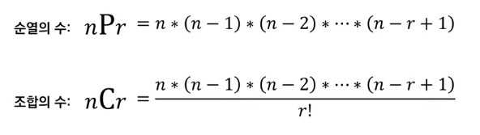

# 11강: 파이썬 문법 - 자주 사용되는 표준 라이브러리

### 실전에서 유용한 표준 라이브러리

- **내장함수** : 기본 입출력 함수부터 정렬 함수까지 기본적인 함수들을 제공한다.
  - 파이썬 프로그램을 작성할 때 없어서는 안 되는 필수적인 기능을 포함하고 있다.
- **itertools** : 반복되는 형태의 데이터를 처리하기 위한 유용한 기능들
  - 특히 순열과 조합 라이브러리는 토딩 테스트에서 자주 사용된다.
- **heapq** : 힙 자료구조를 제공
  - 일반적으로 우선순위 큐 기능을 구현하기 위해 사용된다.
    - 최단경로 
- **bisect** : 이진 탐색 기능을 제공합니다.
- **collections** : 덱(deque), 카운터(Counter) 등의 유용한 자료구조를 포함한다.
- **math** : 필수적인 수학적 기능 제공
  - 팩토리얼, 제곱근, 최대공약수, 삼각함수 관련 함수부터 파이와 같은 상수를 포함

### 자주 사용되는 내장 함수

```python
# sum()
result = sum([1,2,3,4,5])
print(result)
> 15

# min(), max()
min_result = min(7,3,5,2)
max_result = max(7,3,5,2)
print(min_result, max_result)
> 2 7

# eval()
result = eval("(3+5)*7")
print(result)
> 56

# sorted()
result = sorted([9,1,8,5,4])
reverse_result = sorted([9,1,8,5,4],reverse=True)
print(result)
print(reverse_result)
> [1,4,5,8,9]
  [9,8,5,4,1]
    
# sorted() with key
array = [("홍길동", 35),("이순신", 75),("아무게", 50)]
result = sorted(array, key = lambda x:x[1], reverse=True)
print(result)
>
[("이순신", 75),("아무게", 50),("홍길동", 35)]
```

### 순열과 조합

- **순열** : 서로 다른 n개에서 서로 다른 r개를 선택하여 일렬로 나열하는 것
  - {'A','B','C}에서 세 개를 선택하여 나열하는 경우 : 'ABC','ACB','BAC','BCA','CAB','CBA'
- **조합** : 서도 다른 n개에서 순서에 생관 없이 서로 다른 r개를 선택하는 것
  - {'A','B','C}에서 순서를 고려하지 않고 두 개를 뽑는 경우 : 'AB', 'AC', 'BC'



- 모든 경우의 수가 얼마일지 짐작한다.
- 순열의 수를 구했을 때 천만 일억을 넘어갈 때 시간 초과.
- 그래서 두 가지 고려

#### 순열

```python
from itertools import permutations
data = ['A', 'B', 'C']
result = list(permutations(data,3)) # 모든 순열 구하기
print(result)
>
[('A','B','C'),('A','C','B'),('B','A','C'),('B','C','A'),('C','A','B'),('C','B','A')]
```

#### 조합

```python
from itertools import combinations
data = ['A', 'B', 'C']
result = list(combinations(data,2)) #2개를 뽑는 모든 조합 구하기
print(result)
>
[ ('A','B'), ('A','C'), ('B','C')]
```

### 중복 순열과 중복 조합

```python
from itertools import product
data = ['A', 'B', 'C']
result = list(product(data,repeat=2)) # 2개를 뽑는 모든 순열 구하기 (중복 허용)
print(result)

from itertools import combinations_with_replacement
data = ['A', 'B', 'C']
result = list(combinations_with_replacement(data,2)) #2개를 뽑는 모든 조합 구하기 (중복 허용)
print(result)
```

### Counter

- collections 라이브러리의 **Counter**는 등장 횟수를 세는 기능 제공
- 리스트와 같은 반복 가능한 객체가 주어졌을 때 __내부의 원소가 몇 번씩 등장했는지__ 알려준다.

```python
from collections  import Counter

counter = Counter(['red','blue','red','green','blue','blue'])

print(counter['blue']) # 'blue'가 등장한 횟수 출력
print(counter['green']) # 'green'이 등장한 횟수 출력
print(dict(counter)) # 사전 자료형 반환
>
3
1
{'red' : 2, 'blue' : 3, 'green' : 1}
```

### 최대 공약수와 최소 공배수

- math 라이브러리의 gcd() 함수를 이용할 수 있다.

```python
import math
# 최소 공배수(LCM)를 구하는 함수
def lcm(a,b):
    return a * b // math.gcd(a,b)
a = 21
b = 14

print(math.gcd(21,14)) # 최대 공약수 (GCD) 계산
print(lcm(21,14)) # 최소 공배수 (LCM) 계산
>
7
42
```

- 원주율, 제곱근 등 사용 가능하다.

