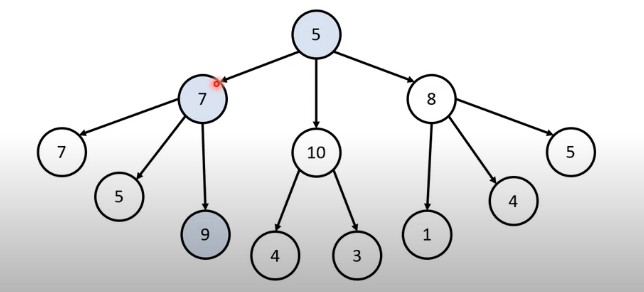
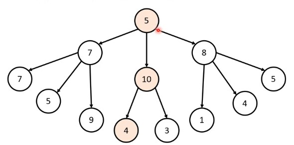

# 12강: 그리디 알고리즘 개요

### 그리디 알고리즘 (탐욕법)

- 현재 상황에서 지금 당장 좋은 것만 고르는 방법
- 최소한의 아이디어를 떠올릴 수 있는 능력을 요구
- 정당성 분석이 중요
  - 단순히 가장 좋아 보이는 것을 반복적으로 선택해도 최저의 해를 구할 수 있는지 검토한다.

**[문제 상황]** 루트 노드부터 시작하여 거쳐 가는 노드 값의 합을 최대로 만들고 싶다.

- Q. 최적의 해는 무엇인가요?



- 5-> 7-> 9로 가는게 가장 큰값

- Q. 단순히 매 상황에서 가장 큰 값만 고른다면 어떻게 될까?



- 최적의 해 21보다 작지만 19를 얻는다.
- 일번적인 상황에서 그리디 알고리즘은 최적의 해를 보장할 수 없을 때가 많다.
- 탐욕법으로 얻은 해가 최적의 해가 되는 상황에서, 이를 추론 할 수 있어야 문제를 풀 수 있다.

### <문제> 거스름 돈: 문제 설명

- 당신은 음식점의 계산을 도와주는 점원입니다. 카운터에는 거스름돈으로 사용할 500원, 100원, 50원, 10원짜리 동전이 무한히 존재한다고 가정합니다. 손님에게 거슬러 주어야 할 돈이 N원일 대 거슬러 주어야 할 동전의 최소 개수를 구하세요. 단, 거슬러 줘야 할 돔 N은 항상 10의 배수입니다.

### <문제> 거스름 돈: 문제 해결 아이디어

- **가장 큰 화폐 단위** 부터 돈을 거슬러 주면 된다.
- N원을 거술러 줘야 할 때, 가장 먼저 500원으로 거슬러 줄 수 있을 만큼 거슬러 준다.
  - 이후 100원, 50원, 10원짜리 동전을 차례대로 거슬러 줄 수 있을 만큼 거슬러 주면 된다.
- N = 1,260일 때의 예시를 확인해 보자.

**[Step 0]** 초기 단계 - 남은 돈: 1,260원

> 본래 점원이 거슬러  줘야 할 돈은 보이지 않고 잔돈 무더기가 보여야 논리적으로 맞다. 이해를 돕고자 미리 거스름돈을 시각적으로 표현하였다.

점원 : 500원 X 2개 , 100원 X 2개,  50원 X 1개, 10원 X 1개

손님 : 아무것도 없는 상태

| 화폐단위         | 500  | 100  | 50   | 10   |
| ---------------- | ---- | ---- | ---- | ---- |
| 손님이 받은 개수 | 0    | 0    | 0    | 0    |

**[Step 1]**- 남은 돈: 260원

점원 : 100원 X 2개,  50원 X 1개, 10원 X 1개

손님 : 500원 X 2개

| 화폐단위         | 500  | 100  | 50   | 10   |
| ---------------- | ---- | ---- | ---- | ---- |
| 손님이 받은 개수 | 2    | 0    | 0    | 0    |

 **[Step 2]**- 남은 돈: 60원

점원 : 50원 X 1개, 10원 X 1개

손님 :  500원 X 2개 , 100원 X 2개

| 화폐단위         | 500  | 100  | 50   | 10   |
| ---------------- | ---- | ---- | ---- | ---- |
| 손님이 받은 개수 | 2    | 2    | 0    | 0    |

 **[Step 3]**- 남은 돈: 10원

점원 : 10원 X 1개

손님 :  500원 X 2개 , 100원 X 2개, 50원 X 1개, 

| 화폐단위         | 500  | 100  | 50   | 10   |
| ---------------- | ---- | ---- | ---- | ---- |
| 손님이 받은 개수 | 2    | 2    | 1    | 0    |

**[Step 4]**- 남은 돈: 0원

점원 : 아무것도 없는 상태

손님 :  500원 X 2개 , 100원 X 2개, 50원 X 1개, 10원 X 1개

| 화폐단위         | 500  | 100  | 50   | 10   |
| ---------------- | ---- | ---- | ---- | ---- |
| 손님이 받은 개수 | 2    | 2    | 1    | 1    |

### <문제> 거스름 돈: 정당성 분석

- 가장 큰 화폐 단위부터 돈을 거술러 주는 것이 최적의 해를 보장하는 이유는 무엇일까?
  - 가지고 있는 동전 중에서 **큰 단위가 항상 작은 단위의 배수이므로 작은 단위의 동전들을 종합해 다른 해가 나올 수 없기 때문** 이다.
- 만약에 800원을 거술러 주어야 하는데 화폐 단위가 500원, 400원, 100원이라면 어떻게 될까?
  - 400원 X 2개가 최적
  - 500원은 400원의 배수가 아니다.
- 그리디 알고리즘 문제에서는 이처럼 문제 풀이를 위한 최소한의 아이디어를 떠올리고 이것이 정당한 지 검토할 수 있어야 한다.
  - 10원으로 다 거슬러 주거나 랜덤으로 다 거슬러 줄 수 있다. 가장 큰 단위로 거슬러 주면 최적이지 않을까?

### <문제> 거스름 돈: 답안 예시 (Python)

```python
n = 1260
count = 0

# 큰 단위의 화폐부터 차례대로 확인하기
array = [500, 100, 50, 10]

for coin in array:
	count += n // coin # 해당 화폐로 거술러 줄 수 있는 동전의 개수 세기
    n %= coin # 거슬러 준 후 나머지 
print(count)
```

### <문제> 거스름 돈: 시간 복잡도 분석

- 화폐의 종류가 K라고 할 때, 소스코드의 시간 복잡도는 **O(K)** 다.
  - 반복문은 화폐의 개수만큼 반복된다.
- 이 알고리즘의 시간 복잡도는 거슬러줘야 하는 금액과는 무관하며, 동전의 총 종류에만 영향을 받는다.

### <문제> 거스름 돈: 답안 예시 (C++)

```c++
#include <bits/stdc++.h>

using namespace std:

int n = 1260;
int cnt; # 전역변수로 초기화된 값은 기본적으로 0으로 설정된다.

int coinTypes[4] = {500, 100, 50, 10};

int main(void) {
    for (int i = 0; i < 4; i++){
        cnt += n / coinTypes[i];
        n %= coinTypes[i];
    }
    cnt << cnt << '\n';
}
```

### <문제> 거스름 돈: 답안 예시 (Java)

```java
public class Main {
    
    public static void main(String[] args) {
        int n = 1260;
        int cnt = 0;
        int[] coinTypes = {500, 100, 50, 10};
        
        for (int i = 0; i < 4; i++){
            cnt += n / coinTypes[i];
            n %= coinTypes[i];
        }
        
        Sysyem.out.println(cnt);
    }
}
```

