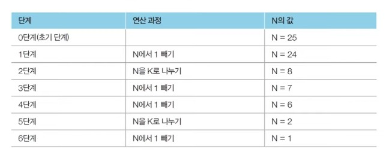
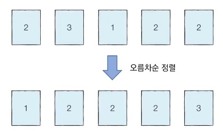
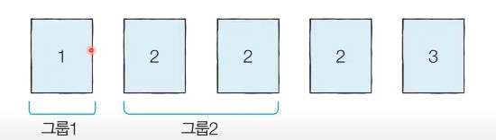

# 13강: 그리디 유형 문제 풀이 + ATM문제

### <문제> 1이 될 때까지 : 문제 설명

- 어떠한 수 **N이 1이 될 때까지** 다음의 두 돠정 중 하나를 반복적으로 선택하여 수행하려고 한다. 단, 두번째 연산은 N이 K로 나누어 떨어질 때만 선택할 수 있다.
  1. N에서 1을 뺀다.
  2. N을 K로 나눈다.
- 예를 들어 N이 17, K가 4라고 가정한다. 이때 1번의 과정을 한 번 수행하면 N은 16이 된다. 이후에 2번의 과정을 두 번 수행하면  N은 1이 된다. 결과적으로 이 경우 전체 과정을 실행한 횟수는 3이 된다. 이는 N을 1로 만드는 최소 횟수이다.
- N과 K가 주어질 때 N이 1이 될 때까지 1번 혹은 2번의 **과정을 수행해야 하는 최소 횟수**를 구하는 프로그램을 작성하라.

### <문제> 1이 될 때까지 : 문제 조건

난이도 : 1개, 풀이시간 15분, 시간제한 2초, 메모리제한 128MB

- 입력조건 : 첫째 줄에 N(1<=N<=100,000)과 K(2<=K<=100,000)가 공백을 기준으로 하여 각각 자연수로 주어진다.
- 첫째 줄에 N이 1이  될 때까지 1번 혹은 2번의 과정을 수행해야 하는 횟수의 최솟값을 출력한다.
- 입력예시 

```
25 5
```

- 출력 예시

```
2
```

### <문제> 1이 될 때까지 : 문제 해결 아이디어

- 주어진 N에 대하여 **최대한 많이 나누기**를 수행하면 된다.
- N의 값을 줄일 때 **2 이상의 수로 나누는 작업**이 **1을 빼는 작업보다** 수를 훨씬 많이 줄일 수 있다.
- 예를 들어 N = 25, K = 3일 때는 다음과 같다.



### <문제> 1이 될 때까지 : 정당정 분석

- **가능하면 최대한 많이 나누는 작업**이 최적의 해룰 항상 보장할 수 있을까?
- N이 아무리 큰 수여도, K로 계속 나눈다면 기하급수적으로 빠르게 줄일 수 있다.
- 다시 말해 K가 2 이상이기만 하면, K로 나누는 것이 1을 빼는 것보다 항상 빠르게 N을 줄일 수 있다.
  - 또한 N은 항상 1에 도달하게 된다. (최적의 해 성립)

#### 내가 작성한 코드

```python
n,k = map(int, input().split())
cnt= 0
while n > 1:
  if n % k != 0:
    n -=1
    cnt += 1
  else:
    n = n / k
    cnt += 1

print(cnt)
>
25 5
2
```

1. 우선 n과 k 에 값을 받아온다. 
2. cnt에 횟수를 담는다.
3. 만약 n이 1보다 크다면 계속 진행하라.
   1. n을 k로 나누었을 때 0이 아니면 1을 빼고 1이면 n을 k로 나눈다.
4. 최종 결과를 출력한다.

### <문제> 1이 될 때까지 : 답안 예시 (Python)

```python
# N, K를 공백을 기준으로 구분하여 입력 받기
n, k = amp(int, input().split())

result = 0

while True:
    # N이 K로 나누어 떨어지는 수가 될 때까지 빼기
    target = (n // k) * k
    result += (n - target)
    n = target
    # N이 K보가 작을 때 (더 이상 나눌 수 없을 때) 반복문 탈출
    if n < k:
        break
       # K로 나누기
    result += 1
    n //= K
result += (n - 1)
print(result)
```

- 조건이 100,000이하라서 매번 확인해줄수도 있다.

### <문제> 1이 될 때까지 : 답안 예시 (C++)

```c++
# include <bits/stdc++.h>

using namespace std;

int n,k;
int result;

int main(void){
    cin >> n >> k;
    while (ture) {
        // N이 K로 나누어 떨어지는 수가 될 때까지 빼기
        int target = (n / k) * k;
        result += ( n - target);
        n = target;
        // N이 K보다 작을 때 (더 이상 나눌 수 없을 때) 반복문 탈출
        in (n < k ) break;
        result++;
        n /= k            
    }
    // 마지막으로 남은 수에 대하여 1씩 빼기
    result += (n - 1)
        cout << result << '\n';
}
```

### <문제> 1이 될 때까지 : 답안 예시 (Java)

```java
import java.util.*;
public class Main {
    public static void main(String[] args) {
        Scanner sc = new Scanner(System.in);
        
        // N, K를 공백을 기준으로 구분하여 입력 받기
        int n = sc.nextInt();
        int k = sc.nextInt();
        int result = 0;
        
        while (ture) {
            // N이 K로 나누어 떨어지는 수가 될 때까지 빼기
            int target = (n / k) * k
                result += (n - target)
                n = target;
            // N이 K보다 작을 때 (더 이상 나눌 수 없을 때) 반복문 탈출
            if ( n < k) break;
            // K로 나누기
            result += 1;
            n /= k
        }
        // 마지막으로 남은 수에 대하여 1씩 빼기
        result += (n - 1)
            System.out.printIn(result);
    }
}
```

### <문제> 곱하기 혹은 더하기: 문제 설명

- 각 자리가 숫자(0부터 9)로만 이루어진 문자열 S가 주어졌을 때, 왼쪽부터 오른쪽으로 하나씩 모든 숫자를 확인하며 숫자 사이에 'x' 혹은 '+' 연산자를 넣어 결과적으로 **만들어질 수 있는 가장 큰 수를 구하는 프로그램**을 작성하라. 단, +보다 x를 먼저 계산하는 일반적인 방식과는 달리, **모든 연산은 왼쪽에서부터 순서대로** 이루어 진다고 가정한다.
- 예를 들어 02984라는 문자열로 만들 수 있는 가장 큰 수는 ((((0 + 2) x 9) x 8) x 4) = 576이다. 또한 만들어질 수 있는 가장 큰 수는 항상 20억 이하늬 정수가 되도록 입력이 주어진다.

- 기본 int형이 약 21억까지 값이 형성될 수 있다.

### <문제> 곱하기 혹은 더하기: 문제 조건

- 난이도 : 1개, 풀이시간 : 30분, 시간제한 : 1초, 메모리 제한 : 128MB, 기출 : Facebook 인터뷰
- 입력조건 : 첫째 줄에 여러 개의 숫자로 구성된 하나의 문자열 S가 주어진다. (1<= S의 길이 <= 20)
- 출력 조건 : 첫째 줄에 만들어질 수 있는 가장 큰 수를 출력한다.
- 입력 예시 1

```
02984
```

- 출력 예시 1

```
576
```

- 입력 예시 2

```
567
```

- 출력 예시 2

```
210
```

### <문제> 곱하기 혹은 더하기: 문제 해결 아이디어

- 대부분의 경우 '+' 보다는 'x'가 더 값을 크게 만든다.
  - 예를 들어 5 + 6 = 11 이고, 5 x 6 = 30 이다.
- 다만 두 수 중에서 하나라도 '0' 혹은 '1'인 경우, 곱하기보다는 더하기를 수행하는 것이 효율적이다.
- 따라서 **두 수에 대하여 연산을 수행할 때, 두 수 중에서 하나라도 1 이하인 경우에는 더하며, 두 수가 모든 2 이상인 경우에는 곱하연 정답**이다.

### <문제> 곱하기 혹은 더하기: 답안 예시 (Python)

```python
data = input()

# 첫 번째 문자를 숫자로 변경하여 대입
result = int(data[0])

for i in range(1, len(data)):
    # 두 수 중에서 하나라도 '0' 혹은 '1'인 경우, 곱하기보다는 더하기 수행
    num = int(data[i])
    if num <= 1 or result <= 1:
        result += num
    else:
        result *= num
print(result)
```

### <문제> 곱하기 혹은 더하기: 답안 예시 (C++)

```c++
# include <bits/stdc++.h>

using namespace std;

string str;

int main(void){
    cin >> str;
    
    // 첫 번재 문자를 숫자로 변경한 값을 대입
    long long result = str[0] - '0';
    
    for (int i = 1; i < str.size(); i++){
        // 두 수 중에서 하나라도 '0' 혹은 '1'인 경우, 곱하기보다는 더하기 수행
        int num = str[i] - '0';
        if (num <= 1 || result <= 1) result += num;
        else result *= num;
    }
    cout << result << '\n';
}
```

### <문제> 곱하기 혹은 더하기: 답안 예시 (Java)

```java
import java.util.*;
public class Main {
    public static void main(String[] args) {
        Scanner sc = new Scanner(System.in);
        String str = sc.next();
        
        // 첫 번째 문자를 숫자로 변경한 값을 대입
        long result = str.charAt(0) - '0';
        for  (int i = 1;i < str.length(); i++) {
            // 두 수 중에서 하나라도 '0' 혹은 '1'인 경우, 곱하기보다는 더하기 수행
            int num = str.charAt(i) - '0';
            if (num <= 1 || result <= 1) {
                result += num;
            }
            else {
                result *= num;
            }
        }
        System.out.printLn(result);
    }
}
```

### <문제> 모험가 길드 : 문제 설명

- 한 마을에 모험가가 N명 있다. 모험가 길드에서는 N명의 모험가를 대상으로 '공포도'를 측정했는데, '공포도'가 놓은 모험가는 쉽게 공포를 느껴 위험 상황에서 제대로 대처할 능력이 떨어진다.
- 모험가 길드장인 동빈이는 모험가 그룹을 안전하게 구성하고자 __공포도가 X인 모험가는 반드시 X명 이상으로 구성한 모험가 그룹에 참여__해야 여행을 떠날 수 있도록 규정했다.
- 동빈이는 최대 몇 개의 모험가 그룹을 만들 수 있는지 궁금하다. N명의 모험가에 대한 정보가 주어졌을 때, **여행을 떠날 수 있는 그룹 수의 최댓값**을 구하는 프로그램을 작성하시오.

- 예를 들어 N = 5이고, 각 모험가의 공포도가 다음과 같다고 가정하자.

````
2 3 1 2 2
````

- 이 경우 그룹 1에 대한 공포도가 1,2,3 인 모험가를 한 명식 넣고, 그룹 2에 공포도가 2인 남은 두명을 넣게 되면 총 2개의 그룹을 만들 수 있다.
- 또한 몇 명의 모험가는 마을에 그대로 남아 있어도 되기 때문에, 모든 모험가를 특정한 그룹에 넣을 필요는 없다.

### <문제> 모험가 길드 : 문제 조건

- 난이도 : 1개, 풀이 시간 : 30분, 시간 제한 : 1초, 메모리 제한 : 128MB, 기출 : 핵심 유형
- 입력조건 : 첫째 줄에 모험가의 수 N이 주어진다. (1 <= N <= 100,000)
  - 둘때 줄에 각 모험가의 공포도의 값을 N 이하의 자연수로 주어지며, 각 자연수는 공백으로 구분합니다.
- 출력 조건  : 여행을 떠날 수 있는 그룹 수의 최댓값을 출력한다.

- 입력예시

```
5
2 3 1 2 2
```

- 출력 예시

```
2
```

#### 내가 작성한 코드

```python
n = int(input())
m = list(map(int,input().split()))

m.sort()

result = 0
cnt = 0
for i in range(1,n+1):
    result = n % m[-i]
    cnt += 1
    if result == 1:
        break;
print(cnt)
```

1. n과 m을 받아온다.
2. 정렬한다.
3. 뒤에서 큰 숫자부터 나눠서 나머지가 1이되면 중단하고, 그 때까지 개수를 센다.

### <문제> 모험가 길드 : 문제 해결 아이디어

- 오름차순 정렬 이후에 공포도가 가장 낮은 모험가부터 하나씩 확인한다.



- 앞에서부터 공포도를 하나씩 확인하며 **'현재 그룹에 포함된 모험가의 수'가 '현재 확인하고 있는 공포도' 보다 크거나 같다면 이를 그룹으로 설정**하면 된다.



- 이러한 방법을 이용하면 공포도가 오름차순으로 정렬되어 있다는 점에서, 항상 최소한의 모험가의 수만 포함하여 그룹을 결성하게 된다.

### <문제> 모험가 길드 : 답안 예시 (Python)

```python
n = int(input())
data = list(map(int, input().split()))
data.sort()

result = 0 # 총 그룹의 수
count = 0  # 현재 그룹에 포함된 모험가의 수

for i in data: # 공포도를 낮은 것부터 하나씩 확인하며
    count += 1 #현재 그룹에 해당 모험가를 포함시키기
    if count >= i: #현재 그룹에 포함된 모험가의 수가 현재의 공포도 이상이라면, 그룹 결성
        result += 1 #총 그룹의 수 증가시키기
        count = 0 #현재 그룹에 초함된 모험가의 수 초기화
print(result) # 총 그룹의 수 출력
```

### <문제> 모험가 길드 : 답안 예시 (C++)

```c++
# include <bits/stdc++.h>

using namespace std;

int n;
vector<int> arr;

int main(void){
    cin >> n;
    
    for (inti = 0; i < n; i++){
        int x;
        cin >> x;
        arr.push_back(x);
    }
    sort(arr.begin(), arr.end());
    
    int result = 0; // 총 그룹의 수
    int cnt = 0; // 현재 그룹에 포함된 모험가의 수
    for (int i = 0; i < n; i++){//공포도를 낮은 것부터 하니싹 확인하며
    	cnt +=1;//현재 그룹에 해당 모험가를 포함시키기
    	if (cnt >= arr[i]){//현재 그룹에 포함된 모험가의 수가 현재의 공포도 이상이라면, 그룹 결성
        	result += 1;//총 그룹의 수 증가시키기
        	cnt = 0;//현재 그룹에 포함된 모험가의 수 초기화
        }
    }
    cout << result << '\n'; // 총 그룹의 수 출력
}
```

### <문제> 모험가 길드: 답안 예시 (Java)

```java
import java.util.*;

public class Main {
    
    public static int n;
    public static ArrayList<Integer> arrayList = new ArratList<>();
    
    public static void main(String[] args) {
        Scanner sc = new Scanner(System.in);
        n = sc.nextInt();
        
        for  (int i = 0; i < n;i++) {
            arrayList.add(sc.nextInt());
        }
        Collections.sort(arrayList);
        
        int result = 0; // 총 그룹의 수
        int count = 0; // 현재 그룹에 포함된 모험가의 수
        for (int i =0; i < n;i++) {//공포도를 낮은 것부터 하니싹 확인하며
        	count += 1;//현재 그룹에 해당 모험가를 포함시키기
        	if (count >= arrayList.get[i]){//현재 그룹에 포함된 모험가의 수가 현재의 공포도 이상이라면, 그룹 결성
            	result += 1;//총 그룹의 수 증가시키기
            	count = 0;//현재 그룹에 포함된 모험가의 수 초기화
            }
        }
        System.out.printIn(result);
    }
}
```

### <문제> ATM

```python
n = int(input())
m = list(map(int,input().split()))

m.sort()

result = 0
sum_cnt = []
for i in m:
    result += i
    sum_cnt.append(result)
print(sum(sum_cnt))
```

1. n과 m을 받는다.
2. 정렬한다.
3. 앞에서부터 누적으로 더해서 마지막에 출력한다.