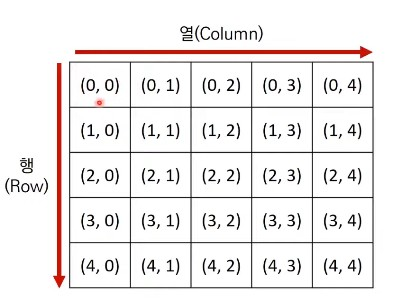
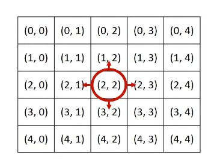
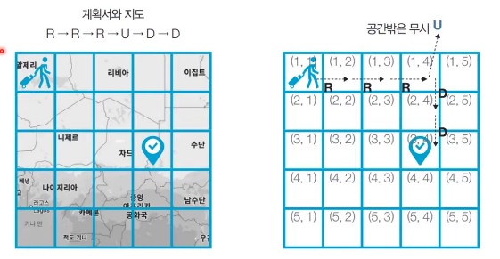

# 14강: 구현 유형 개요 + We love kriii

### 구현(Implementation)

- 머릿속에 있는 알고리즘을 소스코드로 바꾸는 과정
- 흔히 알고리즘 대회에서 구현 유형의 문제란 무엇일까?
  - **풀이를 떠올리는 것은 쉽지만 소스코드로 옮기기 어려운 문제**
- 구현 유형의 예시
  - 알고리즘은 간단한데 코드가 지나칠 만큼 길어지는 문제
  - 실수 연산을 다루고, 특정 소수점 자리까지 출력해야 하는 문제
  - 문자열을 특정한 기준에 따라서 끊어 처리해야 하는 문제
  - 적절한 라이브러리를 찾아서 사용해야 하는 문제
    - 대표적으로 모든 순열과 조합을 찾는 것
- 일반적으로 알고리즘 문제에서의 2차원 공간은 **행렬(Matrix)**의 의미로 사용

```python
for i in range(5):
	for j in range(5):
        print('(',i,',',j,')', end=' ')
    print()
```



- 시뮬레이션 및 완전 탐색 문제에서는 2차원 공간에서의 **방향 벡터**가 자주 활용된다.

```python
# 동, 북, 서,남
dx = [0,-1,0,1]
dy = [1,0,-1,0]

# 현재 위치
x,y= 2,2

for i in range(4):
	# 다음 위치
	nx = x + dx
	ny = n + dy
	print(nx, ny)
```



### <문제> 상하좌우 : 문제 설명

- 여행가 A는 **N x N** 크기의 정사각형 공간 위에 서 있다. 이 공간은 1 x 1 크기의 정사각형으로 나누어져 있다. 가장 왼쪽 위 좌표는 (1,1)이며, 가장 오른쪽 아래 좌표는 (N, N)에 해당한다. 여행가 A는 **상, 하, 좌, 우 방향으로 이동** 할 수 있으며, 시작 좌표는 항상 **(1,1)** 이다. 우리 앞에는 여행가 A가 이동할 계획이 적힌 계획서가 놓여 있다.
- 계획서에는 하나의 줄에 띄어쓰기를 기준으로 하여 L, R, U, D중 하나의 문자가 반복적으로 적혀있다. 각 문자의 의미는 다음과 같다.
  - L : 왼쪽으로 한 칸 이동
  - R : 오른쪽으로 한 칸 이동
  - U: 위로 한 칸 이동
  - D : 아래로 한 칸 이동
- 이때 여행가 A가 N x N 크기의 정사각형 공간을 벗어나는 움직임은 무시됩니다. 예를 들어 (1,1)의 위치에서 L 혹은 U를 만나면 무시됩니다. 다음은 N = 5인 지도와 계획서입니다.



- 난이도 : 1개, 풀이시간 : 15분, 시간제한 : 2초, 메모리 제한 : 128MB
- 입력조건 
  - 첫째 줄에 공간의 크기를 나타내는 N이 주어진다.(1<=N<=100)
  - 둘째 줄에 여행가 A가 이동할 계획서 내용이 주어진다. (1<= 이동 횟수 <= 100)
- 출력 조건
  - 첫째 줄에 여행가 A가 최종적으로 도착할 지점의 좌표(X,Y)를 공백을 기준으로 구분하여 출력한다.
- 입력 예시

```\
5
R R R U D D 
```

- 출력 예시

```
3 4
```

### <문제> 상하좌우 : 문제 해결 아이디어

- 일련의 명령에 따라서 개체를 차례대로 이동시킨다는 점에서 **시뮬레이션 유형**으로도 분류되며 구현이 중요한 대표적인 문제 유형
  - 다만, 알고리즘 교재나 문제 풀이 사이트에 따라서 다르게 일컬을 수 있으므로, 코딩 테스트에서의 시뮬레이션 유형, 구현 유형, 완전 탐색 유형은 서로 유사한 점이 많다는 정도로만 기억하자.

### <문제> 상하좌우 : 답안 예시 (Python)

```python
# N 입력 받기
n = int(input())

x,y = 1,1

move = input().split()

# L, R, U, D 에 따른 이동 방향
dx = [0,0,-1,1]
dy = [-1,1,0,0]
move_dir = ['L', 'R', 'U','D']

# 이동 계획을 하니씩 확인하기
for mo in move:
    for i in range(len(move_dir)):
        if mo == move_dir[i]:
            nx = x + dx[i]
            ny = y + dy[i]
    # 공간을 벗어나는 경우 무시
    if nx <1 or nx > n or ny < 1 or ny > n:
        continue
	# 이동 수행
    x,y = nx, ny
print(x,y)
```

### <문제> 상하좌우 : 답안 예시 (C++)

```c++
#include <bits/stdc++.h>
using namespace std;

int n;
string plans;
int x = 1, y = 1;

// L, R, U, D에 따른 이동 방향
int dx[4] = {0, 0, -1, 1};
int dy[4] = {-1, 1, 0, 0};
char moveTypes[4] = {'L', 'R', 'U', 'D'};
int main(void) {
    cin >> n;
    cin.ignore(); // 버퍼 비우기
    getline(cin, plans);
    // 이동 계획을 하나씩 확인하기
    for (int i = 0; i < plans.size(); i++) {
        char plan = plans[i];
        // 이동 후 좌표 구하기
        int nx = -1, ny = -1;
        for (int j = 0; j < 4; j++) {
            if (plan == moveTypes[j]) {
                nx = x + dx[j];
                ny = y + dy[j];
            }
        }
        // 공간을 벗어나는 경우 무시
        if (nx < 1 || ny < 1 || nx > n || ny > n) continue;
        // 이동 수행
        x = nx;
        y = ny;
    }
    cout << x << ' ' << y << '\n';
    return 0;
}
```

### <문제> 상하좌우 : 답안 예시 (Java)

```java
import java.util.*;

public class Main {

    public static void main(String[] args) {
        Scanner sc = new Scanner(System.in);

        // N을 입력받기
        int n = sc.nextInt();
        sc.nextLine(); // 버퍼 비우기
        String[] plans = sc.nextLine().split(" ");
        int x = 1, y = 1;

        // L, R, U, D에 따른 이동 방향 
        int[] dx = {0, 0, -1, 1};
        int[] dy = {-1, 1, 0, 0};
        char[] moveTypes = {'L', 'R', 'U', 'D'};

        // 이동 계획을 하나씩 확인
        for (int i = 0; i < plans.length; i++) {
            char plan = plans[i].charAt(0);
            // 이동 후 좌표 구하기 
            int nx = -1, ny = -1;
            for (int j = 0; j < 4; j++) {
                if (plan == moveTypes[j]) {
                    nx = x + dx[j];
                    ny = y + dy[j];
                }
            }
            // 공간을 벗어나는 경우 무시 
            if (nx < 1 || ny < 1 || nx > n || ny > n) continue;
            // 이동 수행 
            x = nx;
            y = ny;
        }

        System.out.println(x + " " + y);
    }

}
```

### We love kriii문제

- ACM-ICPC 인터넷 예선, Regional, 그리고 World Finals까지 이미 2회씩 진출해버린 kriii는 미련을 버리지 못하고 왠지 모르게 올 해에도 파주 World Finals 준비 캠프에 참여했다. 대회를 뜰 줄 모르는 지박령 kriii를 위해서 격려의 문구를 출력해주자.

```python
for _ in range(2):
    print('강한친구 대한육군',end='\n')
```

