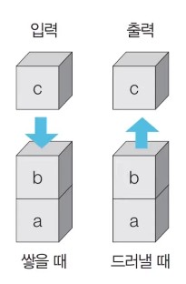

# 16강: 스택과 큐 자료구조 + 문제

### 그래프 탐색 알고리즘 : DFS/BFS

- 탐색 : 많은 양의 데이터 중에서 **원하는 데이터를 찾는 과정**
- 대표적인 그래프 탐색 알고리즘 : DFS/BFS
- **DFS/BFS는 코딩 테스트에서 매우 자주 등장하는 유형**
  - 특히 국내 대기업에서 자주 출제된다.

### 스택 자료구조

- 먼저 들어 온 데이터가 나중에 나가는 형식(선입후출)
  - 먼저 입력되는 데이터가 나중에 출력된다.
- **입구와 출구가 동일한 형태**



### 스택 동작 예시

**삽입(5)** - 삽입(2) - 삽입(3) - 삽입(7) - 삭제() - 삽입(1) - 삽입(4) - 삭제()

​     5

**삽입(5) - 삽입(2)** - 삽입(3) - 삽입(7) - 삭제() - 삽입(1) - 삽입(4) - 삭제()

​    5              2

**삽입(5) - 삽입(2) - 삽입(3)** - 삽입(7) - 삭제() - 삽입(1) - 삽입(4) - 삭제()

​    5              2             3

**삽입(5) - 삽입(2) - 삽입(3) - 삽입(7)** - 삭제() - 삽입(1) - 삽입(4) - 삭제()

​    5              2             3              7

**삽입(5) - 삽입(2) - 삽입(3) - 삽입(7) - 삭제()** - 삽입(1) - 삽입(4) - 삭제()

​    5              2             3              7삭제 ----------------------------------------> OUT

**삽입(5) - 삽입(2) - 삽입(3) - 삽입(7) - 삭제() - 삽입(1)** - 삽입(4) - 삭제()

​    5              2             3                                           1

**삽입(5) - 삽입(2) - 삽입(3) - 삽입(7) - 삭제() - 삽입(1) - 삽입(4)** - 삭제()

​    5              2             3                                           1              4

**삽입(5) - 삽입(2) - 삽입(3) - 삽입(7) - 삭제() - 삽입(1) - 삽입(4) - 삭제()**

​    5              2             3                                           1              4삭제---->OUT

### 스택 구현 예제 (Python)

```python
stack = []

# 삽입(5) - 삽입(2) - 삽입(3) - 삽입(7) - 삭제() - 삽입(1) - 삽입(4) - 삭제()
stack.append(5)
stack.append(2)
stack.append(3)
stack.append(7)
stack.pop()
stack.append(1)
stack.append(4)
stack.pop()

print(stack[::-1]) # 최상단 원소부터 출력
print(stack()) # 최하단 원소부터 출력
>
[1, 3, 2, 5]
[5, 2, 3, 1]
```

- 상수시간 O(1) 이다.
- 리스트의 가장 왼쪽 원소가 가장 먼저 들어왔던 원소

### 스택 구현 예제 (C++)

```c++
# include <bits/stdc++.h>

using namespace std;

stack<int> s;

int main(void) {
	s.push(5);
    s.push(2);
    s.push(3);
    s.push(7);
    s.pop();
    s.push(1);
    s.push(4);
    s.pop();
    // 스택의 최상단 원소부터 출력
    while (!s.empty()) {
        cout << s.top() << ' ';
        s.pop();
    }
}
>
[1 3 2 5]
```

### 스택 구현 예제 (Java)

```java
import java.util.*;

public class Main {
	
    public static void main(String[] args) {
        Stack<Integer>5 = new Stack<>();
        
        //삽입(5) - 삽입(2) - 삽입(3) - 삽입(7) - 삭제() - 삽입(1) - 삽입(4) - 삭제()
        s.push(5);
        s.push(2);
        s.push(3);
        s.push(7);
        s.pop();
        s.push(1);
        s.push(4);
        s.pop();
        // 스택의 최상단 원소부터 출력
        whilw (!s.empty()) {
            System.out.print(s.peek() + ' ');
            s.pop();
        }   
    }
}
>
1 3 2 5
```

### 큐 자료구조

- 먼저 들어온 데이터가 먼저 나가는 형식(선입선출)
- **입구와 출구가 모두 뚫려 있는 터널과 같은 형태**
  - 일종의 대기열


### 큐 동작 예시

**삽입(5)** - 삽입(2) - 삽입(3) - 삽입(7) - 삭제() - 삽입(1) - 삽입(4) - 삭제()

​     5    

**삽입(5) - 삽입(2)** - 삽입(3) - 삽입(7) - 삭제() - 삽입(1) - 삽입(4) - 삭제()

​     2              5 

**삽입(5) - 삽입(2) - 삽입(3)** - 삽입(7) - 삭제() - 삽입(1) - 삽입(4) - 삭제()

​      3             2             5 

**삽입(5) - 삽입(2) - 삽입(3) - 삽입(7)** - 삭제() - 삽입(1) - 삽입(4) - 삭제()

​      7             3             2             5 

**삽입(5) - 삽입(2) - 삽입(3) - 삽입(7) - 삭제()** - 삽입(1) - 삽입(4) - 삭제()

​      7             3             2             5삭제  ------------------------------> OUT

**삽입(5) - 삽입(2) - 삽입(3) - 삽입(7) - 삭제() - 삽입(1)** - 삽입(4) - 삭제()

​     1              7             3             2             

**삽입(5) - 삽입(2) - 삽입(3) - 삽입(7) - 삭제() - 삽입(1) - 삽입(4)** - 삭제()

​      4            1              7             3             2    

**삽입(5) - 삽입(2) - 삽입(3) - 삽입(7) - 삭제() - 삽입(1) - 삽입(4) - 삭제()**

​      4            1              7             3             2 삭제  ------------------> OUT

최종 : 4 1 7 3

### 큐 구현 예제 (Python)

- 리스트로 사용시 시간복잡도가 높아서 `deque` 라이브러리 사용
  - 스택과 큐의 장점 모두 사용
  - 시간복잡도 : 상수시간 O(1)

```python
from collections import deque

# 큐 구현을 위해 deque 라이브러리 사용
queue = deque()

# 삽입(5) - 삽입(2) - 삽입(3) - 삽입(7) - 삭제() - 삽입(1) - 삽입(4) - 삭제()
queue.append(5)
queue.append(2)
queue.append(3)
queue.append(7)
queue.popleft()
queue.append(1)
queue.append(4)
queue.popleft()

print(queue) # 먼저 들어온 순서대로 출력
queue.reverse()
print(queue) # 나중에 들어온 원소부터 출력
>
deque([3, 7, 1, 4])
deque([4, 1, 7, 3])
```

- 리스트에서 원소를 꺼낸 뒤 원소 자리를 다시 재정비해야하니 시간이 오래 걸린다.

### 큐 구현 예제 (C++)

```c++
# include <bits/stdc++.h>
using namespace std;

queue<int> q; //q에 정수형 원소가 들어간다.

int main(void) {
    p.push(5);
    p.push(2);
    p.push(3);
    p.push(7);
    p.pop();
    p.push(1);
    p.push(4);
    q.pop();
    // 먼저 들어온 원소부터 추출
    while (!q.empty()) {
        cout << q.front() << ' ';
        q.pop();
    }
}
>
3 7 1 4
```

### 큐 구현 예제 (Java)

```java
import java.util.*;

public class Main {
    
    public static void main(String[] args) {
        Queue<Integer> q = new LinkedList<>();
        
        // 삽입(5) - 삽입(2) - 삽입(3) - 삽입(7) - 삭제() - 삽입(1) - 삽입(4) - 삭제()
        q.offer(5);
        q.offer(2);
        q.offer(3);
        q.offer(7);
        q.poll();
        q.offer(1);
        q.offer(4);
        q.poll();
        // 먼저 들어온 원소부터 추출
        while (!q.isEmpty()) {
            System.out.print(q.poll() + ' ');
        }
    }
}
>
3 7 1 4
```

- poll : 원소를 빼는것 뿐만 아니라 바로 출력해준다.

### <문제> 스택

```python
import sys

input=sys.stdin.readline

n = int(input())

stack = []

def func(x):
    if x[0] == 'push':
        stack.append(x[1])
    elif x[0] == 'pop':
        if len(stack) > 0:
            print(stack[-1])
            stack.pop()
        else:
            print(-1)
    elif x[0] == 'size':
        print(len(stack))
    elif x[0] == 'empty':
        if len(stack) == 0:
            print(1)
        else:
            print(0)
    else:
        if len(stack) > 0:
            print(stack[-1])
        else:
            print(-1)


for i in range(n):
    texxt = input().split()
    func(texxt)
>
7
pop
-1
top
-1
push 123
top
123
pop
123
top
-1
pop
-1
```

- 어차피 문자열을 받는 거라 인덱싱해서 문자를 비교해서 if 구문을 만들면 된다.

### <문제 > 큐

```python
from collections import deque


n = int(input())

queue = deque()


def func(x):
    if x[0] == 'push':
        queue.append(x[1])
    elif x[0] == 'pop':
        if len(queue) > 0:
            print(queue[0])
            queue.popleft()
        else:
            print(-1)
    elif x[0] == 'size':
        print(len(queue))
    elif x[0] == 'empty':
        if len(queue) == 0:
            print(1)
        else:
            print(0)
    elif x[0] == 'front':
        if len(queue) > 0:
            print(queue[0])
        else:
            print(-1)
    else:
        if len(queue) > 0:
            print(queue[-1])
        else:
            print(-1)

for i in range(n):
    texxt = input().split()
    func(texxt)
>
15
push 1
push 2
front
1
back
2
size
2
empty
0
pop
1
pop
2
pop
-1
size
0
empty
1
pop
-1
push 3
empty
0
front
3
```

- deque를 import한다.
- 스택과 비슷하다. 다만 인덱스 시작을 다르게 하면 된다.