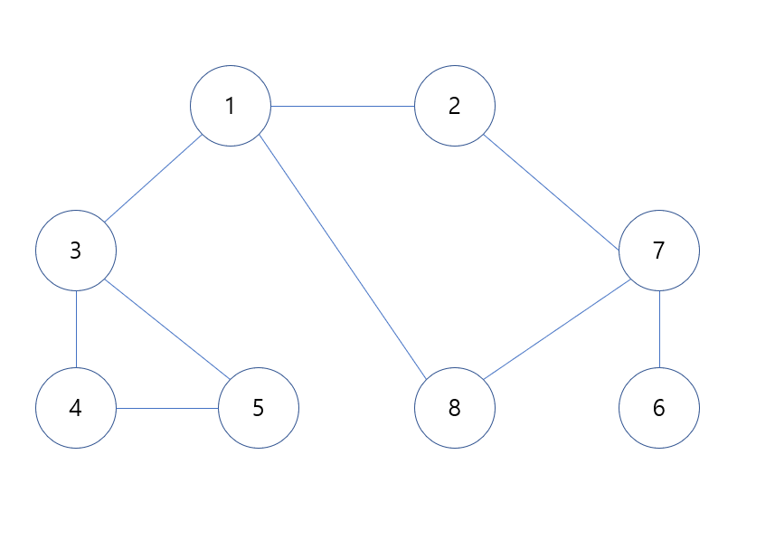
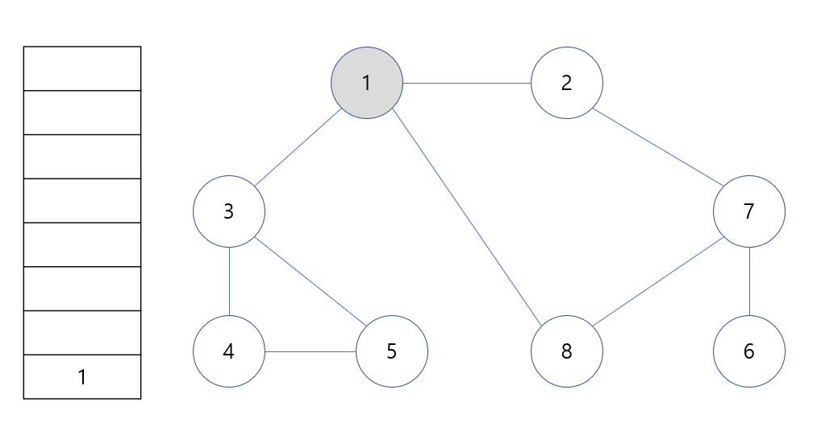
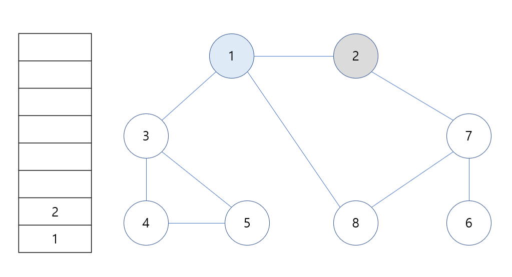
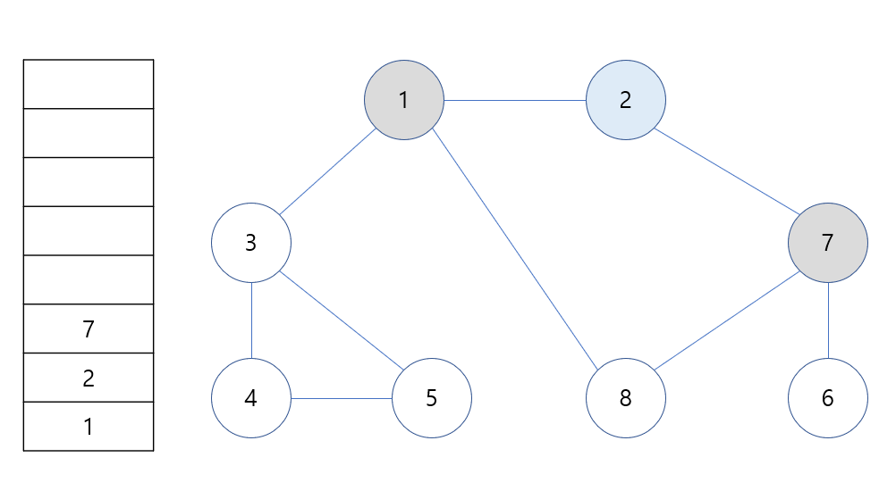
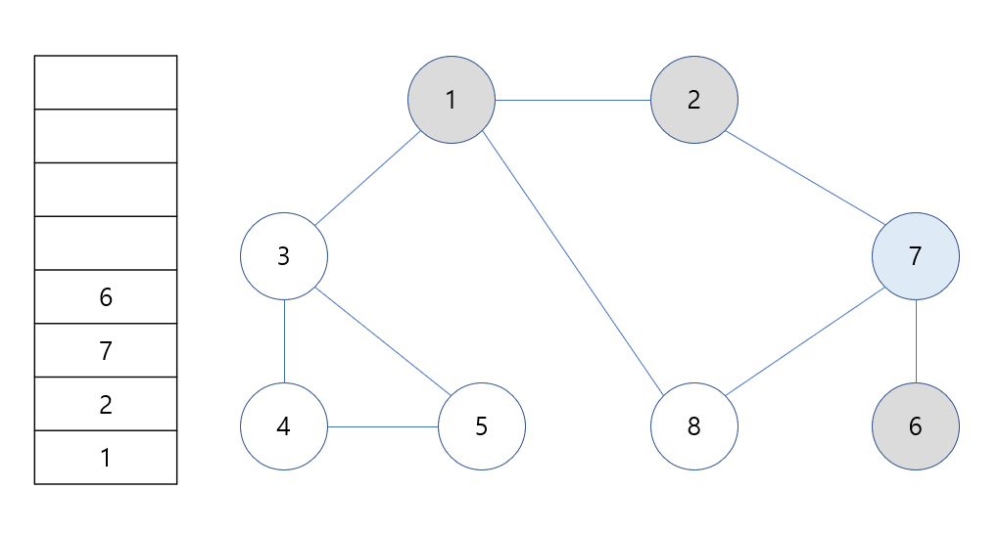
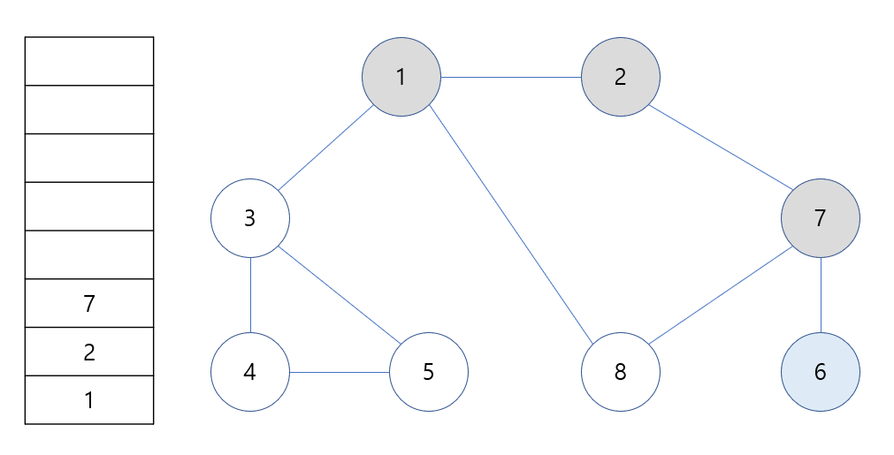
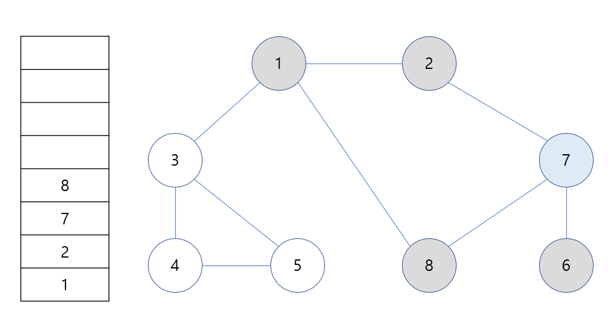
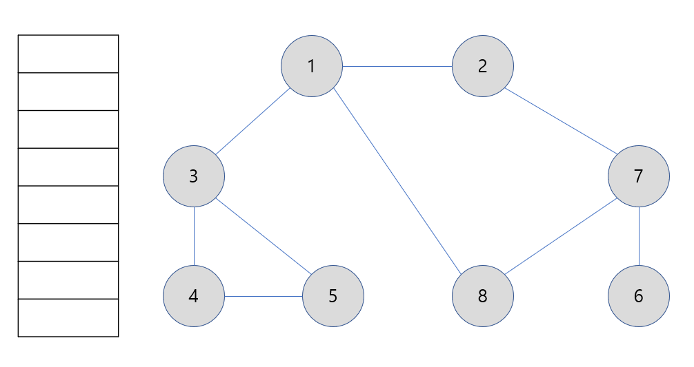

# 18강: DFS 알고리즘 + 바이러스

### DFS ( Depth-First- Search)

- **깊이 우선 탐색**이라고도 부르며 그래프에서 **깊은 부분을 우선적으로 탐색하는 알고리즘**

- **스택 자료구조(혹은 재귀함수)를 이용**
  1. 탐색 시작 노드를 스택에 삽입하고 방문 처리
  2. 스택의 최상단 노드에 방문하지 않은 인접한 노드가 하나라도 있으면 그 노드를 스택에 넣고 방문 처리, 방문하지 않은 노드가 없으면 스택에서 최상단 노드 추출
  3. 더 이상 2번의 과정을 수행할 수 없을 때까지 반복

### DFS 동작 예시

#### [Step 0] 그래프 준비 ( 방문 기준 : 번호가 낮은 인접 노드부터)

- 시작 노드 : 1



#### [Step 1] 시작 노드인 '1'을 스택에 삽입하고 방문 처리



#### [Step 2] 스택의 최상단 노드인 '1'에 방문하지 않은 인접 노드 '2', '3', '8'이 있음

- 이 중에서 가장 작은 노드인 '2'를 스택에 넣고 방문 처리



#### [Step 3] 스택의 최상단 노드인 '2'에 방문하지 않은 인접 노드 '7'이 있음

- '7' 번 노드를 스택에 넣고 방문 처리



#### [Step 4] 스택의 최상단 노드인 '7'에 방문하지 않은 인접 노드 '6', '8' 이 있음

- 이 중에서 가장 작은 노드인 '6'을 스택에 넣고 방문 처리



- 더 이상 들어갈 수 없다면 돌아와서 다시 깊게 들어간다.

#### [Step 5] 스택의 최상단 노드인 '6'에 방문하지 않은 인접 노드가 없음

- 따라서 스택에서 '6'번 노드를 꺼냄



#### [Step 6] 스택의 최상단 노드인 '7'에 방문하지 않은 인접 노드 '8' 이 있음

- '8'번 노드를 스택에 넣고 방문 처리



- 이러한 과정을 반복했을 때 **전체 노드의 탐색 순서(스택에 들어간 순서)**

**탐색순서 : 1 -> 2 -> 7 -> 6 -> 8 -> 3 -> 4 -> 5**



### DFS 소스코드 예제 (Python)

```python
# DFS 메서드 정의
def dfs(graph, v, visited):
    # 현재 노드를 방문 처리
    visited[v] = True
    print(v, end='')
    # 현재 노드와 연결된 다른 노드를 재귀적으로 방문
    for i in graph[v]:
        if not visited[i]:
            dfs(graph, i, visited)
# 각 노드가 연결된 정보를 표현 (2차원 리스트)
graph = [
    [],
    [2, 3, 8],
    [1, 7],
    [1, 4, 5],
    [3, 5],
    [3, 4],
    [7], 
    [2, 6, 8],
    [1, 7]
]
# 각 노드가 방문된 정보를 표현 (1차원 리스트)
visited = [False] * 9

# 정의된 DFS 함수 호출
dfs(graph, 1, visited)
>
1 2 7 6 8 3 4 5
```

### DFS 소스코드 예제 (C++)

```c++
  
#include <bits/stdc++.h>

using namespace std;

bool visited[9];
vector<int> graph[9];

// DFS 함수 정의
void dfs(int x) {
    // 현재 노드를 방문 처리
    visited[x] = true;
    cout << x << ' ';
    // 현재 노드와 연결된 다른 노드를 재귀적으로 방문
    for (int i = 0; i < graph[x].size(); i++) {
        int y = graph[x][i];
        if (!visited[y]) dfs(y);
    }
}

int main(void) {
    // 노드 1에 연결된 노드 정보 저장 
    graph[1].push_back(2);
    graph[1].push_back(3);
    graph[1].push_back(8);
    
    // 노드 2에 연결된 노드 정보 저장 
    graph[2].push_back(1);
    graph[2].push_back(7);
    
    // 노드 3에 연결된 노드 정보 저장 
    graph[3].push_back(1);
    graph[3].push_back(4);
    graph[3].push_back(5);
    
    // 노드 4에 연결된 노드 정보 저장 
    graph[4].push_back(3);
    graph[4].push_back(5);
    
    // 노드 5에 연결된 노드 정보 저장 
    graph[5].push_back(3);
    graph[5].push_back(4);
    
    // 노드 6에 연결된 노드 정보 저장 
    graph[6].push_back(7);
    
    // 노드 7에 연결된 노드 정보 저장 
    graph[7].push_back(2);
    graph[7].push_back(6);
    graph[7].push_back(8);
    
    // 노드 8에 연결된 노드 정보 저장 
    graph[8].push_back(1);
    graph[8].push_back(7);
    
    dfs(1);
}
```

### DFS 소스코드 예제 (Java)

```java
import java.util.*;

public class Main {

    public static boolean[] visited = new boolean[9];
    public static ArrayList<ArrayList<Integer>> graph = new ArrayList<ArrayList<Integer>>();

    // DFS 함수 정의
    public static void dfs(int x) {
        // 현재 노드를 방문 처리
        visited[x] = true;
        System.out.print(x + " ");
        // 현재 노드와 연결된 다른 노드를 재귀적으로 방문
        for (int i = 0; i < graph.get(x).size(); i++) {
            int y = graph.get(x).get(i);
            if (!visited[y]) dfs(y);
        }
    }

    public static void main(String[] args) {
        // 그래프 초기화
        for (int i = 0; i < 9; i++) {
            graph.add(new ArrayList<Integer>());
        }

        // 노드 1에 연결된 노드 정보 저장 
        graph.get(1).add(2);
        graph.get(1).add(3);
        graph.get(1).add(8);
        
        // 노드 2에 연결된 노드 정보 저장 
        graph.get(2).add(1);
        graph.get(2).add(7);
        
        // 노드 3에 연결된 노드 정보 저장 
        graph.get(3).add(1);
        graph.get(3).add(4);
        graph.get(3).add(5);
        
        // 노드 4에 연결된 노드 정보 저장 
        graph.get(4).add(3);
        graph.get(4).add(5);
        
        // 노드 5에 연결된 노드 정보 저장 
        graph.get(5).add(3);
        graph.get(5).add(4);
        
        // 노드 6에 연결된 노드 정보 저장 
        graph.get(6).add(7);
        
        // 노드 7에 연결된 노드 정보 저장 
        graph.get(7).add(2);
        graph.get(7).add(6);
        graph.get(7).add(8);
        
        // 노드 8에 연결된 노드 정보 저장 
        graph.get(8).add(1);
        graph.get(8).add(7);

        dfs(1);
    }

}
```

### <문제> 바이러스

```python
computer={}

n=int(input())
m=int(input())

for i in range(n):
    computer[i+1] = set()

for j in range(m):
    a, b = map(int,input().split())
    computer[a].add(b)
    computer[b].add(a)

        
def dfs(start, computer):
    for i in computer[start]:
        if i not in infection:
            infection.append(i)
            dfs(i, computer)
            
infection = []
dfs(1, computer)
print(len(infection)-1)
```

1. 키와 벨류값으로 관리하기 위헤 dict를 만든다.
2. 우선 집합으로 관리하기 위해 set()을 n개만큼 만든다.
3. 이제 노드 연결된 m만큼 만든다.
   1. a,b를 받아서 서로 연결되었다는 표시를 줘야한다.
   2. 그래서 키와 벨류를 서로 append를 해야 서로 값을 가진다.
4. dfs를 실행한다.
   1. 딕셔너리 값에 값이 있어야 infection을 더한다. 값이 서로 겹치는게 없으면 이 구문에 들어가지 않는다.
5. 최종으로 1을 제외해야 하니 1을 빼고 출력한다.