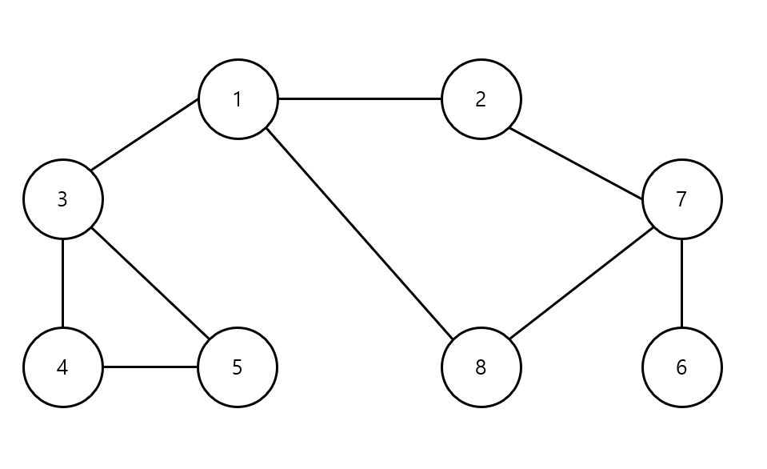
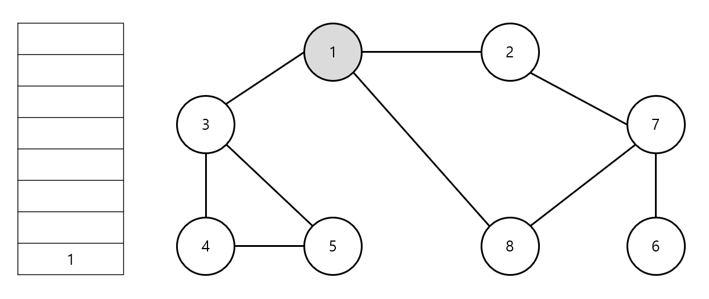
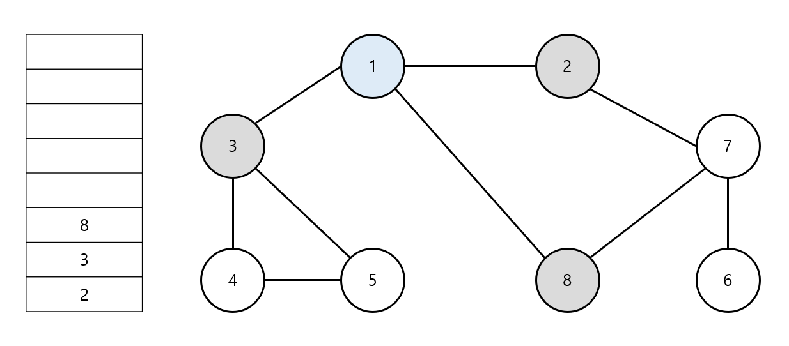
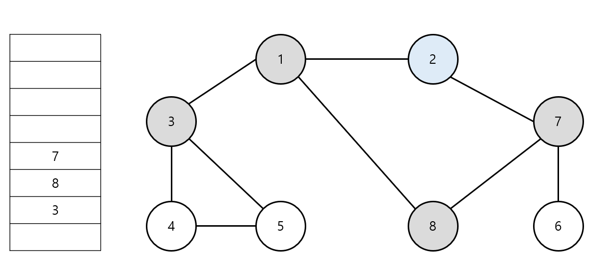
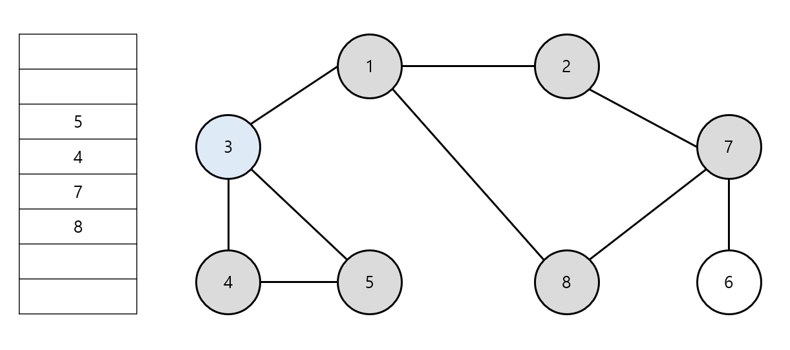
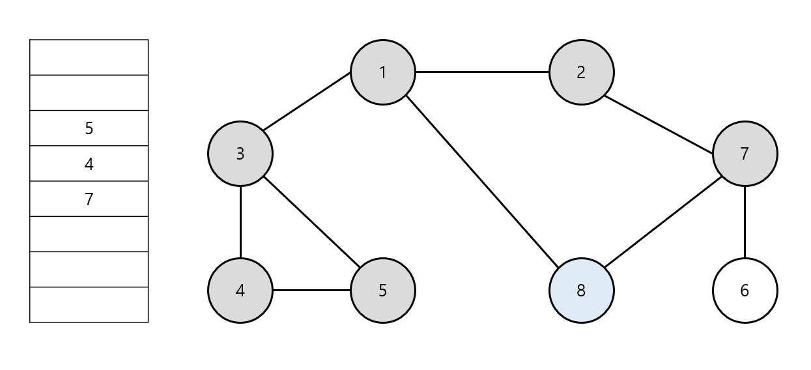
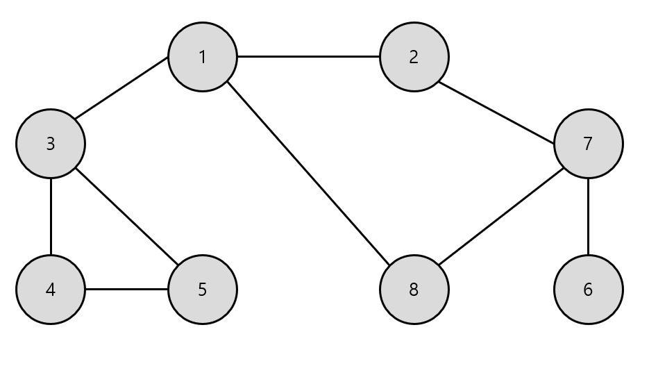

# 19강: BFS 알고리즘 + 미로찾기

### BFS ( Breadth - First  Search)

- **너비 우선 탐색**이라고도 부르며, 그래프에서 **가까운 노드부터 우선적으로 탐색하는 알고리즘**

- **큐 자료구조**이용
  1. 탐색 시작 노드를 큐에 삽입하고 방문 처리
  2. 큐에서 노드를 꺼낸 뒤에 해당 노드의 인접 노드 중에서 방문하지 않은 노드를 모두 큐에 삽입하고 방문 처리
  3. 더 이상 2번의 과정을 수행할 수 없을 때까지 반복

- 각 프로그래밍마다 큐 자료구조 이용 방법 숙지

### BFS 동작 예시 

- **[Step 0]** 방문 기준 : 번호가 낮은 인접 노드부터
  - 시작 노드 : 1



- **[Step 1]** 시작 노드인 '1'을 큐에 삽입하고 방문 처리



- 위에서 들어와서 아래로 나간다고 가정

- **[Step 2]** 큐에서 노드 '1'을 꺼내 방문하지 않은 인접 노드 '2'. '3', '8'을 큐에 삽입하고 방문 처리



- 작은 노드부터 들어간다고 가정

- **[Step 3]** 큐에서 노드 '2'를 꺼내 방문하지 않은 인접 노드 '7'을 큐에 삽입하고 방문 처리



- **[Step 4]** 큐에서 노드 '3'을 꺼내 방문하지 않은 인접 노드 '4', '5'를 큐에 삽입하고 방문 처리



- **[Step 5]** 큐에서 노드 '8'을 꺼내 방문하지 않은 인접 노드가 없으므로 무시



- 이러한 과정을 반복하여 **전체 노드의 탐색 순서**(큐에 들어간 순서)



탐색순서 : 1->2->3->8->7->4->5->6

### BFS 소스코드 예제 (Python)

```python
from collections import deque

#BFS 메서드 정의
def bfs(graph, start, visited):
    # 큐(Queue) 구현을 위해 deque 라이브러리 사용
    queue = deque([(start)]
    # 현재 노드를 방문 처리
    visited[start] = True
    # 큐가 빌 때까지 반복
    while queue:
    	# 큐에서 하나의 원소를 뽑아 출력하기
    	v = queue.popleft()
        print(v, end='')
        # 아직 방문하지 않은 인접한 원소들을 큐에 삽입
        for i in graph[v]:
        	if not visited[i]:
                  queue.append(i)
                  visited[i] = True
# 각 노드가 연결된 정보를 표현 (2차원 리스트)
graph = [
    [],
    [2, 3, 8],
    [1, 7],
    [1, 4,  5],
    [3, 5],
    [3, 4],
    [7],
    [2, 6, 8],
    [1, 7]
]
# 각 노드가 방문된 정보를 표현 (1차원 리스트)
visited = [False] * 9
bfs(graph, 1, visited)
>
1 2 3 8 7 4 5 6
```

### BFS 소스코드 예제 (C++)

```c++
#include <bits/stdc++.h>

using namespace std;

bool visited[9];
vector<int> graph[9];

// BFS 함수 정의
void bfs(int start) {
    queue<int> q;
    q.push(start);
    // 현재 노드를 방문 처리
    visited[start] = true;
    // 큐가 빌 때까지 반복
    while(!q.empty()) {
    	// 큐에서 하나의 원소를 뽑아 출력
        int x = q.front();
        q.pop();
        cout << x << ' ';
        // 해당 원소와 연결된, 아직 방문하지 않은 원소들을 큐에 삽입
        for(int i = 0; i < graph[x].size(); i++) {
            int y = graph[x][i];
            if(!visited[y]) {
                q.push(y);
                visited[y] = true;
            }
        }
    }
}

int main(void) {
    // 노드 1에 연결된 노드 정보 저장 
    graph[1].push_back(2);
    graph[1].push_back(3);
    graph[1].push_back(8);
    
    // 노드 2에 연결된 노드 정보 저장 
    graph[2].push_back(1);
    graph[2].push_back(7);
    
    // 노드 3에 연결된 노드 정보 저장 
    graph[3].push_back(1);
    graph[3].push_back(4);
    graph[3].push_back(5);
    
    // 노드 4에 연결된 노드 정보 저장 
    graph[4].push_back(3);
    graph[4].push_back(5);
    
    // 노드 5에 연결된 노드 정보 저장 
    graph[5].push_back(3);
    graph[5].push_back(4);
    
    // 노드 6에 연결된 노드 정보 저장 
    graph[6].push_back(7);
    
    // 노드 7에 연결된 노드 정보 저장 
    graph[7].push_back(2);
    graph[7].push_back(6);
    graph[7].push_back(8);
    
    // 노드 8에 연결된 노드 정보 저장 
    graph[8].push_back(1);
    graph[8].push_back(7);
    
    bfs(1);
}
```

### BFS 소스코드 예제 (Java)

```java
import java.util.*;

public class Main {

    public static boolean[] visited = new boolean[9];
    public static ArrayList<ArrayList<Integer>> graph = new ArrayList<ArrayList<Integer>>();

    // BFS 함수 정의
    public static void bfs(int start) {
        Queue<Integer> q = new LinkedList<>();
        q.offer(start);
        // 현재 노드를 방문 처리
        visited[start] = true;
        // 큐가 빌 때까지 반복
        while(!q.isEmpty()) {
            // 큐에서 하나의 원소를 뽑아 출력
            int x = q.poll();
            System.out.print(x + " ");
            // 해당 원소와 연결된, 아직 방문하지 않은 원소들을 큐에 삽입
            for(int i = 0; i < graph.get(x).size(); i++) {
                int y = graph.get(x).get(i);
                if(!visited[y]) {
                    q.offer(y);
                    visited[y] = true;
                }
            }
        }
    }

    public static void main(String[] args) {
        // 그래프 초기화
        for (int i = 0; i < 9; i++) {
            graph.add(new ArrayList<Integer>());
        }

        // 노드 1에 연결된 노드 정보 저장 
        graph.get(1).add(2);
        graph.get(1).add(3);
        graph.get(1).add(8);
        
        // 노드 2에 연결된 노드 정보 저장 
        graph.get(2).add(1);
        graph.get(2).add(7);
        
        // 노드 3에 연결된 노드 정보 저장 
        graph.get(3).add(1);
        graph.get(3).add(4);
        graph.get(3).add(5);
        
        // 노드 4에 연결된 노드 정보 저장 
        graph.get(4).add(3);
        graph.get(4).add(5);
        
        // 노드 5에 연결된 노드 정보 저장 
        graph.get(5).add(3);
        graph.get(5).add(4);
        
        // 노드 6에 연결된 노드 정보 저장 
        graph.get(6).add(7);
        
        // 노드 7에 연결된 노드 정보 저장 
        graph.get(7).add(2);
        graph.get(7).add(6);
        graph.get(7).add(8);
        
        // 노드 8에 연결된 노드 정보 저장 
        graph.get(8).add(1);
        graph.get(8).add(7);

        bfs(1);
    }

}
```

### <문제> 미로찾기

```python
from collections import deque

n, m = map(int,input().split())

miro_list=[]
for i in range(n):
     miro_list.append(list(map(int,input())))

dx = [-1,1,0,0]
dy = [0,0,-1,1]

def bfs(x,y):
    queue = deque()
    queue.append((x,y))
    while queue:
        x,y = queue.popleft()
    
        for i in range(4):
            nx = x + dx[i]
            ny = y + dy[i]

            if nx < 0 or ny < 0 or nx >= n  or ny >=m:
                continue
            if miro_list[nx][ny] == 0:
                continue
            if miro_list[nx][ny] == 1:
                miro_list[nx][ny] = miro_list[x][y] + 1
                queue.append((nx,ny))
    return   miro_list[n - 1][m - 1]

print(bfs(0,0))
```

1. deque를 사용하기 위해 import한다.
2. 사용자에게서 n,m값을 받아온다.
3. 2중 리스트를 만들어서 해당 인덱스에 값을 저장한다.
4. 이동한 상,하,좌,우를 정의한다.
5. deque를 이용하여 인접한 열에 방문했다는 표시를 한다.
6. queue가 빌때까지 계속 while을 돌린다.
   1. 우선 처음 들어온 값을 꺼내서 상,하,좌,우 방문한다.
   2. 미로를 벗어나거나 벽이면 무시한다.
   3. 처음 방문하는 곳이면 해당 노드에 이전 노드에 +1을 한다.
   4. 그 다음에 해당 인덱스를 다시 queue에 넣고 인접하지 않은 열이 있는지 없는지 처리한 후 빠져나온다.
7. 가장 오른쪽 아래에 해당하는 인덱스를 주어서 값을 리턴한다.