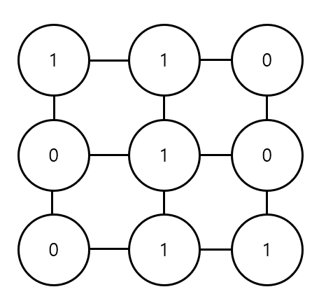
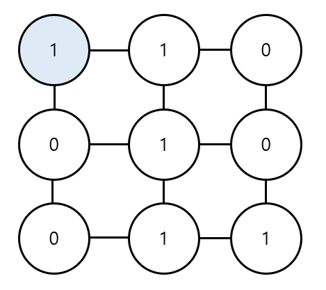
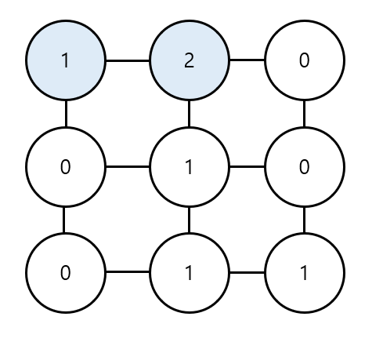
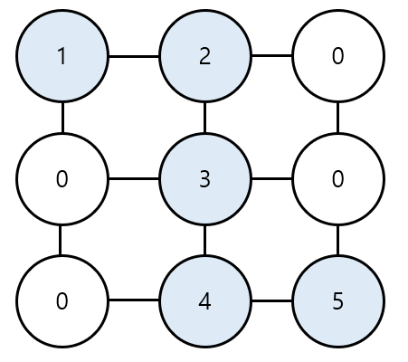

# 20강: DFS & BFS 기초 문제 풀이 + 케빈 베이컨의 6단계 법칙

### <문제> 음료수 얼려 먹기 : 문제 설명

- N x M 크기의 얼음 틀 존재. 구멍이 뚫려있는 부분은 0, 칸막이가 존재하는 부분은 1로 표시. 구멍이 뚫려있는 부분끼리 상, 하, 좌, 우로 붙어 있는 경우 서로 연결되어 있는 것으로 간주
- 이때 얼음 틀의 모양이 주어졌을 때 생성되는 총 아이스크림의 개수를 구하는 프로그램을 작성하시오.
- 난이도 : 1개반, 풀이시간 : 30분, 시간제한 : 1초, 메모리제한 : 128MB
- 입력 조건
  - 첫 번째 줄에 얼음 틀의 세로 길이 N과 가로 길기 M이 주어진다. (1 <=N, M <= 1,000)
  - 두 번째 줄부터 N + 1번째 줄까지 얼음 틀의 형태가 주어진다.
  - 이때 구멍이 뚫려있는 부분은 0, 그렇지 않은 부분은 1이다.
- 출력 조건
  - 한 번에 만들 수 있는 아이스크림의 개수를 출력
- 입력 예시

```
4 5
00110
00011
11111
00000
```

- 출력 예시

```
3
```

### <문제> 음료수 얼려 먹기 : 문제 해결 아이디어

1. 특정한 지점의 구변 상, 하, 좌, 우를 살펴본 뒤에 주변 지점 중에서 값이 '0'이면서 아직 방문하지 않은 지점이 있다면 해당 지점을 방문
2. 방문한 지점에서 다시 상, 하, 좌, 우를 살펴보면서 방문을 진행하는 과정을 반복하면, **연결된 모든 지점을 방문**할 수 있음
3. 모든 노드에 대하여 1 ~ 2번의 과정을 반복하며, 방문하지 않은 지점의 수를 카운트

### <문제> 음료수 얼려 먹기 : 답안 예시 (Python)

```python
# DFS로 특정 노드를 방문하고 연결된 모든 노드들도 방문
def dfs(x,y):
    # 주어진 범위를 벗어나는 경우에는 즉시 종료
    if x <= -1 or x >=n or y <= -1 or y >= m:
        return False
    # 현재 노드를 아직 방문하지 않았다면
    if graph[x][y] == 0:
        # 해당 노드를 방문 처리
        graph[x][y] = 1
        # 상,하,좌,우의 위치들도 모두 재귀적으로 호출
        dfs(x -1, y)
        dfs(x,y - 1)
        dfs(x + 1, y)
        dfs(x , y + 1)
        return True
    return False
# N, M을 공백을 기준으로 구분하여 입력 받기
n, m = map(int, input().split())

# 2차원의 리스트 맵 정보 입력 받기
graph = []
for i in range(n):
    graph.append(list(map(int, input().split())))

#모든 노드(위치)에 대하여 음료수 채우기
result = 0
for i in range(n):
    for j range(m):
        #현재 위치에서 DFS 수행
        if dfs(i,j) == True:
            result +=1
            
print(result) # 정답 출력
```

### <문제> 음료수 얼려 먹기 : 답안 예시 (C++)

```c++
#include <bits/stdc++.h>

using namespace std;

int n, m;
int graph[1000][1000];

// DFS로 특정 노드를 방문하고 연결된 모든 노드들도 방문
bool dfs(int x, int y) {
    // 주어진 범위를 벗어나는 경우에는 즉시 종료
    if (x <= -1 || x >=n || y <= -1 || y >= m) {
        return false;
    }
    // 현재 노드를 아직 방문하지 않았다면
    if (graph[x][y] == 0) {
        // 해당 노드 방문 처리
        graph[x][y] = 1;
        // 상, 하, 좌, 우의 위치들도 모두 재귀적으로 호출
        dfs(x - 1, y);
        dfs(x, y - 1);
        dfs(x + 1, y);
        dfs(x, y + 1);
        return true;
    }
    return false;
}

int main() {
    // N, M을 공백을 기준으로 구분하여 입력 받기
    cin >> n >> m;
    // 2차원 리스트의 맵 정보 입력 받기
    for (int i = 0; i < n; i++) {
        for (int j = 0; j < m; j++) {
            scanf("%1d", &graph[i][j]);
        }
    }
    // 모든 노드(위치)에 대하여 음료수 채우기
    int result = 0;
    for (int i = 0; i < n; i++) {
        for (int j = 0; j < m; j++) {
            // 현재 위치에서 DFS 수행
            if (dfs(i, j)) {
                result += 1;
            }
        }
    }
    cout << result << '\n'; // 정답 출력 
}
```

### <문제> 음료수 얼려 먹기 : 답안 예시 (Java)

```
import java.util.*;

public class Main {

    public static int n, m;
    public static int[][] graph = new int[1000][1000];

    // DFS로 특정 노드를 방문하고 연결된 모든 노드들도 방문
    public static boolean dfs(int x, int y) {
        // 주어진 범위를 벗어나는 경우에는 즉시 종료
        if (x <= -1 || x >=n || y <= -1 || y >= m) {
            return false;
        }
        // 현재 노드를 아직 방문하지 않았다면
        if (graph[x][y] == 0) {
            // 해당 노드 방문 처리
            graph[x][y] = 1;
            // 상, 하, 좌, 우의 위치들도 모두 재귀적으로 호출
            dfs(x - 1, y);
            dfs(x, y - 1);
            dfs(x + 1, y);
            dfs(x, y + 1);
            return true;
        }
        return false;
    }

    public static void main(String[] args) {
        Scanner sc = new Scanner(System.in);

        // N, M을 공백을 기준으로 구분하여 입력 받기
        n = sc.nextInt();
        m = sc.nextInt();
        sc.nextLine(); // 버퍼 지우기

        // 2차원 리스트의 맵 정보 입력 받기
        for (int i = 0; i < n; i++) {
            String str = sc.nextLine();
            for (int j = 0; j < m; j++) {
                graph[i][j] = str.charAt(j) - '0';
            }
        }

        // 모든 노드(위치)에 대하여 음료수 채우기
        int result = 0;
        for (int i = 0; i < n; i++) {
            for (int j = 0; j < m; j++) {
                // 현재 위치에서 DFS 수행
                if (dfs(i, j)) {
                    result += 1;
                }
            }
        }
        System.out.println(result); // 정답 출력 
    }

}
```

### <문제> 미로 탈출 : 문제 설명

- 캐릭처 위치는 (1,1)이며 미로의 출구는 (N,M)의 위치에 존재하며 한 번에 한 칸씩 이동가능
  - 이때 괴물이 있는 부분은 0으로, 괴물이 없는 부분은 1로 표시
  - 미로는 반드시 탈출할수 있는 형태로 제시됨
- 캐릭터가 탈출하기 위해 움직여야 하는 최소 칸의 개수를 구하라
  - 칸을 셀 때는 시작 칸과 마지막 칸을 모두 포함해서 계산

- 난이도 : 1개 반, 풀이 시간 : 30분, 시간제한 : 1초, 메모리 제한 : 128MB
- 입력 조건
  - 첫째 줄에 두 정수 N, M (4<=N, M<=200)이 주어진다. 다음 N개의 줄에는 각각 M개의 정수 (0 혹은 1)로 미로의 정보가 주어진다. 각각의 수들은 공백 없이 붙어서 입력으로 제시됨. 또한 시작칸과 마지막 칸은 항상 1
- 출력 조건
  - 첫째 줄에 최소 이동 칸의 개수를 출력
- 입력 예시

```
5 6
101010
111111
000001
111111
111111
```

- 출력 예시

```
10
```

### <문제> 미로 탈출 : 문제 해결 아이디어

- 상, 하, 좌, 우로 연결된 모든 노드로의 거리가 1로 동일
  - 따라서 (1,1) 지점부터 BFS를 수행하여 모든 노드의 최단 거리 값을 기록하면 해결 가능
- 예시 3x3 크기의 미로

```
110
010
011
```



- **[Step 1]** 처음에 (1,1)의 위치에서 시작



- **[Step 2]** (1,1) 좌표에서 상, 하, 좌, 우로 탐색을 진행하면 바로 옆 노드인 (1, 2) 위치의 노드를 방문하게 되고 새롭게 방문하는 (1, 2) 노드의 값을 2로 바꾼다.



- **[Step 3]** 마찬가지로 BFS를 계속 수행하면 결과적으로 다음과 같이 최단 경로의 값들이 1씩 증가하는 형태로 변경됨



### <문제> 미로 탈출 : 답안 예시 (Python)

```python
# BFS 소스코드 구현
from collections import deque

def bfs(x,y):
    # 큐 (queue) 구현을 위해 deque 라이브러리 사용
    queue = deque()
    queue.append((x,y))
    # 큐가 빌 때까지 반복하기
    while queue:
        x,y = queue.popleft()
        for i in range(4):
            nx = x + dx[i]
            ny = y + dx[i]
            # 미로 찾기 공간을 벗어난 경우 무시
            if nx < 0 or nx >= n or ny < 0 or ny >= m:
                continue
            #  해당 노드를 처음 방문하는 경우에만 최단 거리 기록
            if graph[nx][ny] == 1:
                graph[nx][ny] = graph[x][y] + 1
                queue.append((nx,ny))
    return graph[n - 1][m - 1]

#N, M을 공백을 기준으로 구분하여 입력받기
n , m = map(int, input().split())

#2차원 리스트의 맵 정보 입력 받기
graph = []
for i in range(n):
    graph.append(list(map(int,input())))
    
# 이동할 네 가지 방향 정의(상, 하, 좌, 우)
dx = [-1,1,0,0]
dy = [0,0,-1,1]

# BFS를 수행한 결과 출력
print(bfs(0,0))
```

### <문제> 미로 탈출 : 답안 예시 (C++)

```c++
#include <bits/stdc++.h>

using namespace std;

int n, m;
int graph[201][201];

// 이동할 네 가지 방향 정의 (상, 하, 좌, 우) 
int dx[] = {-1, 1, 0, 0};
int dy[] = {0, 0, -1, 1};

int bfs(int x, int y) {
    // 큐(Queue) 구현을 위해 queue 라이브러리 사용 
    queue<pair<int, int> > q;
    q.push({x, y});
    // 큐가 빌 때까지 반복하기 
    while(!q.empty()) {
        int x = q.front().first;
        int y = q.front().second;
        q.pop();
        // 현재 위치에서 4가지 방향으로의 위치 확인
        for (int i = 0; i < 4; i++) {
            int nx = x + dx[i];
            int ny = y + dy[i];
            // 미로 찾기 공간을 벗어난 경우 무시
            if (nx < 0 || nx >= n || ny < 0 || ny >= m) continue;
            // 벽인 경우 무시
            if (graph[nx][ny] == 0) continue;
            // 해당 노드를 처음 방문하는 경우에만 최단 거리 기록
            if (graph[nx][ny] == 1) {
                graph[nx][ny] = graph[x][y] + 1;
                q.push({nx, ny});
            } 
        } 
    }
    // 가장 오른쪽 아래까지의 최단 거리 반환
    return graph[n - 1][m - 1];
}

int main(void) {
    // N, M을 공백을 기준으로 구분하여 입력 받기
    cin >> n >> m;
    // 2차원 리스트의 맵 정보 입력 받기
    for (int i = 0; i < n; i++) {
        for (int j = 0; j < m; j++) {
            scanf("%1d", &graph[i][j]);
        }
    }
    // BFS를 수행한 결과 출력
    cout << bfs(0, 0) << '\n';
    return 0;
}
```

### <문제> 미로 탈출 : 답안 예시 (Java)

```java
import java.util.*;

class Node {

    private int index;
    private int distance;

    public Node(int index, int distance) {
        this.index = index;
        this.distance = distance;
    }

    public int getIndex() {
        return this.index;
    }
    
    public int getDistance() {
        return this.distance;
    }
}

public class Main {

    public static int n, m;
    public static int[][] graph = new int[201][201];

    // 이동할 네 가지 방향 정의 (상, 하, 좌, 우) 
    public static int dx[] = {-1, 1, 0, 0};
    public static int dy[] = {0, 0, -1, 1};

    public static int bfs(int x, int y) {
        // 큐(Queue) 구현을 위해 queue 라이브러리 사용 
        Queue<Node> q = new LinkedList<>();
        q.offer(new Node(x, y));
        // 큐가 빌 때까지 반복하기 
        while(!q.isEmpty()) {
            Node node = q.poll();
            x = node.getIndex();
            y = node.getDistance();
            // 현재 위치에서 4가지 방향으로의 위치 확인
            for (int i = 0; i < 4; i++) {
                int nx = x + dx[i];
                int ny = y + dy[i];
                // 미로 찾기 공간을 벗어난 경우 무시
                if (nx < 0 || nx >= n || ny < 0 || ny >= m) continue;
                // 벽인 경우 무시
                if (graph[nx][ny] == 0) continue;
                // 해당 노드를 처음 방문하는 경우에만 최단 거리 기록
                if (graph[nx][ny] == 1) {
                    graph[nx][ny] = graph[x][y] + 1;
                    q.offer(new Node(nx, ny));
                } 
            } 
        }
        // 가장 오른쪽 아래까지의 최단 거리 반환
        return graph[n - 1][m - 1];
    }

    public static void main(String[] args) {
        Scanner sc = new Scanner(System.in);

        // N, M을 공백을 기준으로 구분하여 입력 받기
        n = sc.nextInt();
        m = sc.nextInt();
        sc.nextLine(); // 버퍼 지우기

        // 2차원 리스트의 맵 정보 입력 받기
        for (int i = 0; i < n; i++) {
            String str = sc.nextLine();
            for (int j = 0; j < m; j++) {
                graph[i][j] = str.charAt(j) - '0';
            }
        }

        // BFS를 수행한 결과 출력
        System.out.println(bfs(0, 0));
    }

}
```

### <문제> 케빈 베이컨의 6단계 법칙

```python
n,m = map(int, input().split())

INF = int(1e9)

firend_list = [[INF] * (n+1) for _ in range (n+1)]

for i in range(1,n+1):
    for j in range(1,n+1):
        if i == j:
            firend_list[i][j] = 0

for _ in range(1,m+1):
    a,b = map(int,input().split())
    firend_list[a][b] = 1
    firend_list[b][a] = 1
    
for i in range(1,n+1):
    for a in range(1, n+1):
        for b in range(1, n+1):
            firend_list[a][b] = min(firend_list[a][b],firend_list[a][i] + firend_list[i][b])
            
           
                    
min_list = {}
for r in range(1,n+1):
    a = (sum(firend_list[r])-INF)
    min_list[r] = a

result = sorted(min_list.items(), key=lambda x :x[1])[0]  
print(result[0])
```

1. n과 m을 받는다.
2. 최소랑 비교하기 위해 무한대를 리스트에 넣는다.
3. 1,1과 같이 같은 행렬은 0으로 채운다.
4. 친구끼리 1씩 넣어준다.
5. 그 다음에 하나씩 탐험해서 숫자를 추가한다.
6. 최소를 확인하기 위해 행별로 더하고 10000을 뺀다.
7. 오름차순으로 정렬하고 맨 처름값만 가져와서 출력한다.