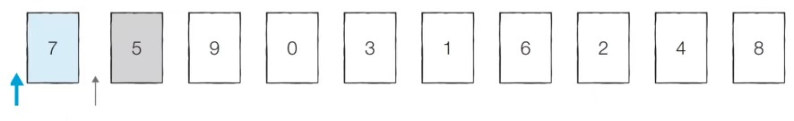
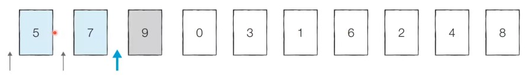
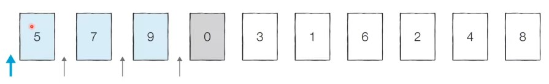
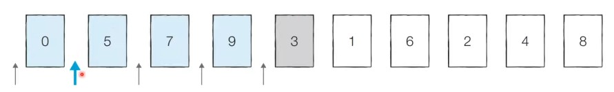
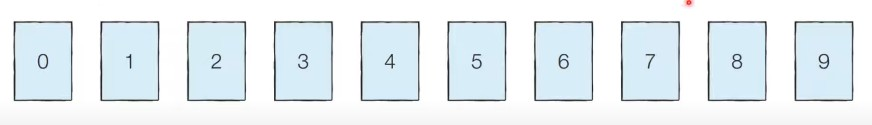
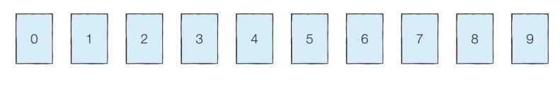

# 22강: 삽입 정렬 + 백준 문제

- 처리되지 않은 데이터를 하나씩 골라 **적절한 위치에 삽입**
- 선택 정렬에 비해 구현 난이도가 높음, 일반적으로 더 효율적으로 동작

### 삽입 정렬 예시

- **[Step 0]** 첫 번째 데이터 '7'은 그 자체로 정렬이 되어 있다고 판단하고, 두  번째 데이터인 '5'가 어떤 위치로 들어갈지 판단한다. '7'의 왼쪽으로 들어가거나 오른쪽으로 들어가거나 두 경우만 존재



- **[Step 1]** 이어서 '9'가 어떤 위치로 들어갈지 판단



- **[Step 2]** 이어서 '0'이 어떤 위치로 들어갈지 판단



- **[Step 3]** 이어서 '3'이 어떤 위치로 들어갈지 판단



- 이러한 과정을 반복하면 다음과 같은 정렬 완료



### 삽입 정렬 소스코드 (Python)

```python
array = [7, 5, 9, 0, 3, 1, 6, 2, 4, 8]

for i in range(1,len(array)):
    for j in range(i, 0, -1):#인덱스 i부터 1까지 1씩 감소하며 반복하는 문법
        if array[j] < array[j-1]: # 한 칸씩 왼쪽으로 이동
            array[j], array[j-1] = array[j-1],array[j]
        else: #자기보다 작은 데이터를 만나면 그 위치에서 멈춤
            break
print(array)
>
[0, 1, 2, 3, 4, 5, 6, 7, 8, 9]
```

### 삽입 정렬 소스코드 (C++)

```c++
#include <bits/stdc++.h>

using namespace std;

int n = 10;
int arr[10] = {7, 5, 9, 0, 3, 1, 6, 2, 4, 8};

int main(void) {
    for (int i = 1; i < n; i++) {
        // 인덱스 i부터 1까지 감소하며 반복하는 문법
        for (int j = i; j > 0; j--) {
            // 한 칸씩 왼쪽으로 이동
            if (arr[j] < arr[j - 1]) {
                swap(arr[j], arr[j - 1]);
            }
            // 자기보다 작은 데이터를 만나면 그 위치에서 멈춤
            else break;
        }
    }
    for(int i = 0; i < n; i++) {
        cout << arr[i] << ' ';
    }
}
```

### 삽입 정렬 소스코드 (Java)

```java
  
import java.util.*;

public class Main {

    public static void main(String[] args) {

        int n = 10;
        int[] arr = {7, 5, 9, 0, 3, 1, 6, 2, 4, 8};

        for (int i = 1; i < n; i++) {
            // 인덱스 i부터 1까지 감소하며 반복하는 문법
            for (int j = i; j > 0; j--) {
                // 한 칸씩 왼쪽으로 이동
                if (arr[j] < arr[j - 1]) {
                    // 스와프(Swap)
                    int temp = arr[j];
                    arr[j] = arr[j - 1];
                    arr[j - 1] = temp;
                }
                // 자기보다 작은 데이터를 만나면 그 위치에서 멈춤
                else break;
            }
        }

        for(int i = 0; i < n; i++) {
            System.out.print(arr[i] + " ");
        }
    }

}
```

### 삽입 정렬의 시간 복잡도

- O(N<sup>2</sup>)이며, 선택 정렬과 마찬가지로 반복문이 두 번 중첩되어 사용됨
- <u>현재 리스트의 데이터가 거의 정렬되어 있는 상태라면 매우 빠르게 동작</u>
  - 최선의 경우 O(N)의 시간 복잡도를 가짐
  - 이미 정렬된 상태에서 다시 삽입 정렬을 수행한다면?



- 왼쪽 원소랑 비교하기 때문에 위치 탐색은 선형인데 바로 멈춰버린다. 상수시간으로 대체된다.

### <문제> 통계학

```python
from collections import Counter


def mean(x):
    a = int(round(sum(x) / len(x),0))
    return a


def median(x):
    x = sorted(x)
    if len(x) < 2:
        b = x[0]
    elif len(x) >= 2 and len(x) % 2 == 1:
        idx = int(len(x) / 2)
        b = x[idx]
    elif len(x) >= 2 and len(x) % 2 == 0:
        idx1, idx2 = int(len(x) / 2) , int(len(x) / 2) + 1
        b = (x[idx1] + x[idx2]) / 2
        
    return b

def mode(x):
    cnt = Counter(x).most_common()
    cnt = sorted(cnt, key=lambda x:(-x[1],x[0]))[:2]
    if len(x) > 1:
        if cnt[0][1] == cnt[1][1]:
            k = cnt[1][0]
        else :
            k = cnt[0][0]
    else:
        k = cnt[0][0]
    
    return k

def range_func(x):
    d = max(x) - min(x)
    return d


n = int(input())

num_list = []
for i in range(n):
    num_list.append(int(input()))

    
print(mean(num_list))
print(median(num_list))
print(mode(num_list))
print(range_func(num_list))
>
5
-1
-2
-3
-1
-2
-2
-2
-1
2
```

- Counter는 빈도세주는 함수이다.

### <문제> 소트인사이드

```python
num_list = list(input())

for i in range(len(num_list)):
    max_index = i
    for h in range(i,len(num_list)):
        if num_list[i] > num_list[h]:
            continue
        else:
            max_index = h
            num_list[i], num_list[h] = num_list[h],num_list[i]

print(''.join(num_list))
>
2143
4321
```

