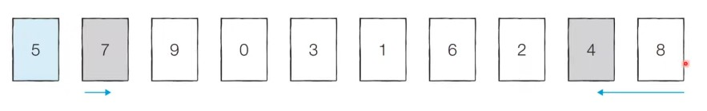
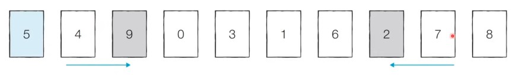
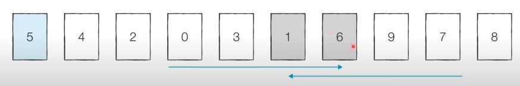
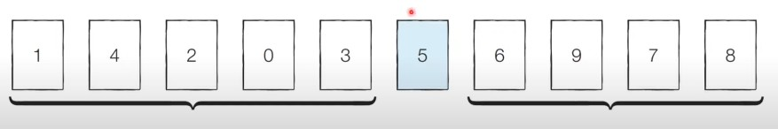
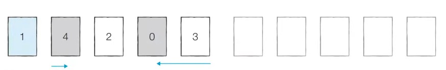
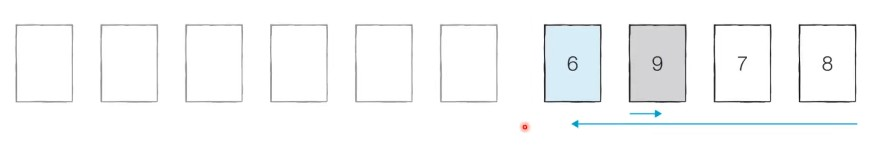
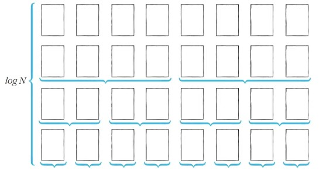
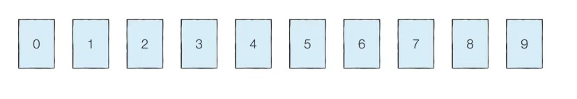

# 23강: 퀵 정렬 + 백준 좌표 정렬하기

### 퀵 정렬

- <u>기준 데이터를 설정</u> 하고 그 **기준보다 큰 데이터와 작은 데이터의 위치를 바꾸는 방법**
- 일반적인 상황에서 가장 많이 사용되는 정렬 알고리즘 중 하나
- 병합 정렬과 더불어 대부분의 프로그래밍 언어의 정렬 라이브러리의 근간이 되는 알고리즘
- 가장 기본적인 퀵 정렬은 **첫 번째 데이터를 기준 데이터(Pivot)로 설정** 하는 것

### 퀵 정렬 동작 예시

- **[Step 0]** 현재 피벗의 값은 '5'이다. 왼쪽에서부터 '5'보다 큰 데이터를 선택하므로 '7'이 선택되고, 오른쪽에서부터 '5'보다 작은 데이터를 선택하므로 '4'가 선택된다. 이제 이 두 데이터의 위치를 서로 변경한다.



- **[Step 1]** 현재 피벗의 값은 '5'이다. 왼쪽에서부터 '5'보다 큰 데이터를 선택하므로 '9'가 선택되고, 오른쪽에서부터 '5'보다 작은 데이터를 선택하므로 '2'가 선택된다. 이제 이 두 데이터의 위치를 서로 변경한다.



- **[Step 2]** 현재 피벗의 값은 '5'이다. 왼쪽에서부터 '5'보다 큰 데이터를 선택하므로 '6'가 선택되고, 오른쪽에서부터 '5'보다 작은 데이터를 선택하므로 '1'이 선택된다. 단, 이처럼 **위치가 엇갈리는 경우 '피벗'과 '작은 데이터'의 위치를 서로 변경**한다.



- **[분할 완료]** 이제 '5'의 왼쪽에 있는 데이터는 모두 5보다 작고, 오른쪽에 있는 데이터는 모두 '5'보다 크다는 특징을 있다. 이렇게 <u>피벗을 기준으로 데이터 묶음을 나누는 작업</u>을 **분할(Divide)**이라고 한다.



- **[왼쪽 데이터 묶음 정렬]** 왼쪽에 있는 데이터에 대해서 마찬가지로 정렬을 수행한다.
  - 재귀적으로 수행되고 범위가 점점 좁아진다.



- **[오른쪽 데이터 묶음 정렬]** 오른쪽에 있는 데이터에 대해서 마찬가지로 정렬을 수행한다. 
  - 이러한 과정을 반복하면 전체 데이터에 대해 정렬이 수행된다.



### 퀵 정렬이 빠른 이유 : 직관적인 이해

- 이상적인 경우 분할이 절반씩 일어난다면 전체 연산 횟수로 O(NlogN)를 기대할 수 있다.
  - **너비 X 높이** = N X logN = NlogN



### 퀵 정렬의 시간 복잡도

- **O(NlogN)**의 시간 복잡도를 가진다.
- 하지만 최악의 경우 **O(N<sup>2</sup>)** 의 시간복잡도를 가진다.
  - 첫 번째 원소를 피벗으로 삼을 때, 이미 정렬된 배열에 대해서 퀵 정렬을 수행하면 어떻게 될까?



### 퀵 정렬 소스코드 : 일반적인 방식 (Python)

```python
array = [5, 7, 9, 0, 3, 1, 6, 2, 4, 8]

def quick_sort(array, start, end):
    if start >= end:# 원소가 1개인 경우 종류
        return
    pivot = start # 피벗은 첫 번째 원소
    left = start + 1
    right = end
    while(left <= right):
        # 피벗보다 큰 데이터를 찾을 때까지 반복
        while(left <= end and array[left] <= array[pivot]):
            left +=1
        # 피벗보다 작은 데이터를 찾을 때까지 반복
        whle(right > start and array[right] >= array[pivot]):
            right -=1
        if(left > right): #엇갈렸다면 작은 데이터와 피벗을 교체
            array[right],array[pivot] = array[pivot], array[right]
        else:# 엇갈리지 않았다면 작은 데이터와 큰 데이터를 교체
            array[left], array[pivot] = array[right], array[left]
    # 분할 이후 왼쪽 부분과 오른쪽 부분에서 각각 정렬 수행
    quick_sort(array, start , right - 1)
    quick_sort(array, right + 1 , end)
quick_sort(array, 0 , len(array) - 1)
print(array)
>
[0, 1, 2, 3, 4, 5, 6, 7, 8, 9]
```

### 퀵 정렬 소스코드 : 일반적인 방식 (C++)

```c++
  
#include <bits/stdc++.h>

using namespace std;

int n = 10;
int arr[10] = {7, 5, 9, 0, 3, 1, 6, 2, 4, 8};

void quickSort(int* arr, int start, int end) {
    if (start >= end) return; // 원소가 1개인 경우 종료
    int pivot = start; // 피벗은 첫 번째 원소
    int left = start + 1;
    int right = end;
    while (left <= right) {
        // 피벗보다 큰 데이터를 찾을 때까지 반복
        while (left <= end && arr[left] <= arr[pivot]) left++;
        // 피벗보다 작은 데이터를 찾을 때까지 반복
        while (right > start && arr[right] >= arr[pivot]) right--;
        // 엇갈렸다면 작은 데이터와 피벗을 교체
        if (left > right) swap(arr[pivot], arr[right]);
        // 엇갈리지 않았다면 작은 데이터와 큰 데이터를 교체
        else swap(arr[left], arr[right]);
    }
    // 분할 이후 왼쪽 부분과 오른쪽 부분에서 각각 정렬 수행
    quickSort(arr, start, right - 1);
    quickSort(arr, right + 1, end);
}

int main(void) {
    quickSort(arr, 0, n - 1);
    for (int i = 0; i < n; i++) {
        cout << arr[i] << ' ';
    }
}
```

### 퀵 정렬 소스코드 : 일반적인 방식 (Java)

```java
import java.util.*;

public class Main {

    public static void quickSort(int[] arr, int start, int end) {
        if (start >= end) return; // 원소가 1개인 경우 종료
        int pivot = start; // 피벗은 첫 번째 원소
        int left = start + 1;
        int right = end;
        while (left <= right) {
            // 피벗보다 큰 데이터를 찾을 때까지 반복
            while (left <= end && arr[left] <= arr[pivot]) left++;
            // 피벗보다 작은 데이터를 찾을 때까지 반복
            while (right > start && arr[right] >= arr[pivot]) right--;
            // 엇갈렸다면 작은 데이터와 피벗을 교체
            if (left > right) {
                int temp = arr[pivot];
                arr[pivot] = arr[right];
                arr[right] = temp;
            }
            // 엇갈리지 않았다면 작은 데이터와 큰 데이터를 교체
            else {
                int temp = arr[left];
                arr[left] = arr[right];
                arr[right] = temp;
            }
        }
        // 분할 이후 왼쪽 부분과 오른쪽 부분에서 각각 정렬 수행
        quickSort(arr, start, right - 1);
        quickSort(arr, right + 1, end);
    }

    public static void main(String[] args) {
        int n = 10;
        int[] arr = {7, 5, 9, 0, 3, 1, 6, 2, 4, 8};

        quickSort(arr, 0, n - 1);

        for(int i = 0; i < n; i++) {
            System.out.print(arr[i] + " ");
        }
    }

}
```

### 퀵 정렬 소스코드 : 파이썬의 장점을 살린 방식

```python
array = [5, 7, 9, 0, 3, 1, 6, 2, 4, 8]

def quick_sort(array):
    # 리스트가 하나 이하의 원소만을 담고 있다면 종료
    if len(array) <= 1:
        return array
    pivot = array[0] # 피벗은 첫 번째 원소
    tail = array[1:] # 피벗을 제외한 리스트
    
    left_side = [x for x in tail if x <= pivot] # 분할된 왼쪽 부분
    right_side = [x for x in tail if x > pivot] # 분할된 오른쪽 부분
    # 분할 이후 왼쪽 부분과 오른쪽 부분에서 각각 정렬을 수행하고, 전체 리스트 반환
    return quick_sort(left_side) + [pivot] + quick_sort(right_side)
print(quick_sort(array))
>
[0, 1, 2, 3, 4, 5, 6, 7, 8, 9]
```

### <문제> 좌표 정렬하기

```python
n = int(input())
num_list = []
for i in range(n):
    num_list.append(list(map(int,input().split())))

def sotred_x(x):
    if len(x) <= 1:
        return x
    pivot = x[0]
    tail  = x[1:]
    
    left_side = [ i for i in tail if i[0] < pivot[0] ]  + [ i for i in tail if i[0] == pivot[0] if i[1] < pivot[1]  ]
    right_side = [i for i in tail if i[0] > pivot[0] ]  + [ i for i in tail if i[0] == pivot[0] if i[1] > pivot[1]  ]
    
    
    return sotred_x(left_side) + [pivot] + sotred_x(right_side)

result = sotred_x(num_list)

for k in result:
    print(k[0],k[1], end='\n')

```

1. 변수가 [[1,2]] 처럼 2개여서 뒤에 같은 경우 2번째가 작은 순으로 부터 저장해서 만들었다.

