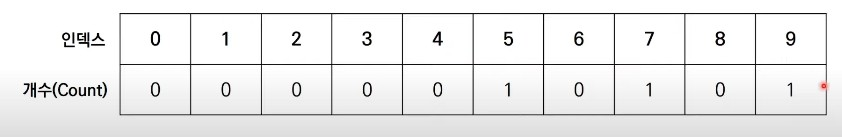

# 24강: 계수 정렬 + 백준 단어 정렬 문제

### 계수 정렬

- 특정한 조건이 부합할 때만 사용할 수 있지만 **매우 빠르게 동작하는** 정렬 알고리즘
  - **데이터의 크기 범위가 제한되어 정수 형태로 표현할 수 있을 때** 사용 가능
- 데이터의 개수가 N, 데이터(양수) 중 최댓값이 K 일 때 최악의 경우에도 수행 시간 **O(N+K)** 를 보장

### 계수 정렬 동작 예시

- **[Step 0]** 가장 작은 데이터부터 가장 큰 데이터까지의 범위가 모두 담길 수 있도록 리스트를 생성
- **정렬할 데이터** : 7 5 9 0 3 1 6 2 9 1 4 8 0 5 2


- **[Step 1]** 데이터를 하나씩 확인하며 데이터의 값과 동일한 인덱스의 데이터를 1씩 증가시킨다.
- **정렬할 데이터** : 7 5 9 0 3 1 6 2 9 1 4 8 0 5 2
- 7을 확인하여 1을 count하였다.


- **[Step 2]** 데이터를 하나씩 확인하며 데이터의 값과 동일한 인덱스의 데이터를 1씩 증가시킨다.
- **정렬할 데이터** : 7 5 9 0 3 1 6 2 9 1 4 8 0 5 2
- 5를 확인하여 1을 count하였다.


- **[Step 3]** 데이터를 하나씩 확인하며 데이터의 값과 동일한 인덱스의 데이터를 1씩 증가시킨다.
- **정렬할 데이터** : 7 5 9 0 3 1 6 2 9 1 4 8 0 5 2
- 9를 확인하여 1을 count하였다.



- **[Step 15]** 결과적으로 최종 리스트에는 각 데이터가 몇 번씩 등장했는지 그 횟수가 기록된다.
- **정렬할 데이터** : 7 5 9 0 3 1 6 2 9 1 4 8 0 5 2
- 각 원소가 몇 번 등장했는지 알 수 있다.


- **결과를 확인할 때** 는 리스트의 첫 번째 데이터부터 하나씩 그 값만큼 반복하여 인덱스를 출력


- 가장 작은 값부터 가장 큰 값까지 공간을 만들어야 하기때문에 공간복잡도는 높을 수 있으니 퀵정렬처럼 잘만 만나면 효과적이다.

### 계수 정렬 소스코드 (Python)

```python
# 모든 원소의 값이 0보다 크거나 같다고 가정
array = [7, 5, 9, 0, 3, 1, 6, 2, 9, 1, 4, 8, 0, 5, 2]
# 모든 범위를 포함하는 리스트 선언(모든 값은 0으로 초기화)
count = [0] * (max(array) + 1)

for i in range(len(array)):
    count[array[i]] +=1 # 각 데이터에 해당하는 인덱스의 값 증가

for i in range(len(count)) :# 리스트에 기록된 정렬 정보 확인
    for j in range(count[i]):
        print(i,end[' '])
>
0 0 1 1 2 2 3 4 5 5 6 7 8 9 9
```

### 계수 정렬 소스코드 (C++)

```c++
#include <bits/stdc++.h>
#define MAX_VALUE 9

using namespace std;

int n = 15;
// 모든 원소의 값이 0보다 크거나 같다고 가정
int arr[15] = {7, 5, 9, 0, 3, 1, 6, 2, 9, 1, 4, 8, 0, 5, 2};
// 모든 범위를 포함하는 배열 선언(모든 값은 0으로 초기화)
int cnt[MAX_VALUE + 1];

int main(void) {
    for (int i = 0; i < n; i++) {
        cnt[arr[i]] += 1; // 각 데이터에 해당하는 인덱스의 값 증가
    }
    for (int i = 0; i <= MAX_VALUE; i++) { // 배열에 기록된 정렬 정보 확인
        for (int j = 0; j < cnt[i]; j++) {
            cout << i << ' '; // 띄어쓰기를 기준으로 등장한 횟수만큼 인덱스 출력
        }
    }
}
```

### 계수 정렬 소스코드 (Java)

```java
import java.util.*;

public class Main {
	
    public static final int MAX_VALUE = 9;

    public static void main(String[] args) {
    	
        int n = 15;
        // 모든 원소의 값이 0보다 크거나 같다고 가정
        int[] arr = {7, 5, 9, 0, 3, 1, 6, 2, 9, 1, 4, 8, 0, 5, 2};
        // 모든 범위를 포함하는 배열 선언(모든 값은 0으로 초기화)
        int[] cnt = new int[MAX_VALUE + 1];

        for (int i = 0; i < n; i++) {
            cnt[arr[i]] += 1; // 각 데이터에 해당하는 인덱스의 값 증가
        }
        for (int i = 0; i <= MAX_VALUE; i++) { // 배열에 기록된 정렬 정보 확인
            for (int j = 0; j < cnt[i]; j++) {
                System.out.print(i + " "); // 띄어쓰기를 기준으로 등장한 횟수만큼 인덱스 출력
            }
        }
    }

}
```

### 계수 정렬의 복잡도 분석

- 계수 정렬의 시간 복잡도와 공간 복잡도는 모두 **O(N + K)** 이다.
  - 데이터 개수 **N**, 가장 큰 데이터 **K**
- 계수 정렬은 때에 따라서 심각한 비효율성을 초래할 수 있다.
  - 데이터가 0과 999,999로 단 2개만 존재하는 경우에는?
    - 총 100만개 만큼 만들어야 한다.
- 계수 정렬은 **동일한 값을 가지는 데이터가 여러 개 등장할 때** 효과적으로 사용할 수 있다.
  - 성적의 경우 100점을 맞은 학생이 여러 명일 수 있기 때문에 계수 정렬이 효과적이다.

### <문제> 단어 정렬

- 퀵 정렬

```python
n = int(input())
text_dic = {}

for i in range(n):
    a = input()
    text_dic[a] = 1

text_list = [[str(key),len(key)] for key in text_dic.keys()]

def sotred_x(x):
    if len(x) <= 1:
        return x
    pivot = x[0]
    tail  = x[1:]
    
    left_side = [ i for i in tail if i[1] < pivot[1] ]  + [ i for i in tail if i[1] == pivot[1] if i[0] < pivot[0]  ]
    right_side = [i for i in tail if i[1] > pivot[1] ]  + [ i for i in tail if i[1] == pivot[1] if i[0] > pivot[0]  ]
    
    
    return sotred_x(left_side) + [pivot] + sotred_x(right_side)

result = sotred_x(text_list)
for i in result:
    print(i[0],end='\n')
```

- 단어 중복이 안되니 딕셔너리로 키값을 받아서 중복을 제거하였다.

- 람다식

```python
n = int(input())

text_dic = {}

for i in range(n):
    text = input()
    text_dic[text] = 1
    
text_list = [[str(key),len(key)] for key in text_dic.keys()]
text_list = sorted(text_list,key=lambda x : (x[1],x[0]))


for i in text_list:
    print(i[0],end='\n')
```

### <문제2> 나이순 정렬 

```python
n = int(input())
join_list = []

for i in range(n):
    a,b = input().split()
    join_list.append([int(a),b,i])
    
def sotred_x(x):
    if len(x) <= 1:
        return x
    pivot = x[0]
    tail  = x[1:]
    
    left_side = [ i for i in tail if i[0] < pivot[0] ]  + [ i for i in tail if i[0] == pivot[0] if i[2] < pivot[2]  ]
    right_side = [i for i in tail if i[0] > pivot[0] ]  + [ i for i in tail if i[0] == pivot[0] if i[2] > pivot[2]  ]
    
    
    return sotred_x(left_side) + [pivot] + sotred_x(right_side)

result = sotred_x(join_list)
for i in result:
    print(i[0],i[1])
```

- 먼저 가입한 순이니 인덱스를 가치 저장하면 된다.
- 람다식

```python
n = int(input())
join_list = []

for i in range(n):
    a,b = input().split()
    join_list.append([int(a),b,i])
join_list = sorted(join_list, key=lambda x:(x[0],x[2]))    
for i in join_list:
    print(i[0],i[1])
```

