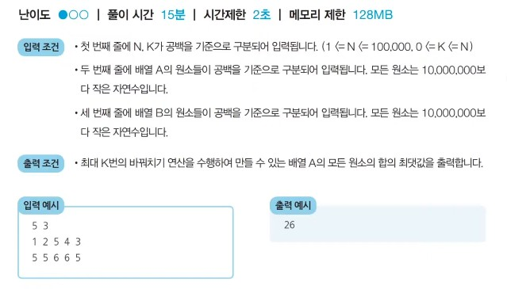

# 25강: 정렬 알고리즘 비교 및 기초 문제 풀이 + 백준 문제(로프, 회의실 배정)

### 정렬 알고리즘 비교하기

- 대부분의 프로그래밍 언어에서 지원하는 <u>표준 정렬 라이브러리는 최작의 경우에도 **O(NlogN)** 을 보장</u> 하도록 설계되어 있음

| 정렬 알고리즘 | 평균 시간 복잡도 | 공간 복잡도 |                             특징                             |
| :-----------: | :--------------: | :---------: | :----------------------------------------------------------: |
|   선택 정렬   | O(N<sup>2</sup>) |    O(N)     |                     아이디어가 매우 간단                     |
|   삽입 정렬   | O(N<sup>2</sup>) |    O(N)     |          데이터가 거의 정렬되어 있을 때는 가장 빠름          |
|    퀵 정렬    |     O(NlogN)     |    O(N)     |          대부분의 경우에 가장 적합하며, 충분히 빠름          |
|   계수 정렬   |     O(N + K)     |  O(N + K)   | 데이터의 크기가 한정되어 있는 경우에만 사용이 가능하지만 매우 빠르게 동작 |

### 선택 정렬과 기본 정렬 라이브러리 수행 시간 비교

```python
from random import randint
import time

# 배열에 10,000개의 정수를 삽입
array = []
for _ in rnage(10000):
    # 1부터 100사이의 랜덤한 정수
    array.append(randint(1,100))
    
# 선택 정렬 프로그램 성능 측정
start_time = time.time()

# 선택 정렬 프로그램 소스코드
for i in range(len(array)):
    min_index = i # 가장 작은 원소의 인덱스
    for j in range(i+1, len(array)):
        if array[min_index] > array[j]:
            min_index = j
    array[min_index],array[j] = array[j], array[min_index]
    
# 측정 종료
end_time = time.time()
# 수행 시간출력
print('선택 정렬 성능 측정 : ', end_time - start_time)

# 배열을 다시 무작위 데이터로 초기화
array = []
for _ in range(10000):
    # 1부터 100 사이의 랜덤한 정수
    array.append(randint(1,100))
    
# 기본 정렬 라이브러리 성능 측정
start_time = time.time()

# 기본 정렬 라이브러리 사용
array.sort()

#측정 종료
end_time = time.time()
#수행 시간 출력
print('기본 정렬 라이브러리 성능 측정 : ', end_time - start_time)
>
선택 정렬 성능 측정 : 35.841460943222046
기본 정렬 라이브러리 성능 측정 : 0.0013387203216552734
```

### <문제> 두 배열의 원소 교체 : 문제 설명

- 아무개는 두 개의 배열 A와 B를 가지고 있다. 두 배열은 N개의 원소로 구성되어 있으며, 배열의 원소는 모두 자연수이다.
- 아무개는 **최대 K 번의 바꿔치기** 연산을 수행할 수 있는데, 바꿔치기 연산이란 배열 A에 있는 원소 하나와 배열 B 에 있는 원소 하나를 골라서 두 원소를 바꾸는 것을 말한다.
- 아무개의 최종 목표는 배열 A의 모든 원소의 합이 최대가 되도록 하는 것이며, 여러분은 아무개를 도와야 한다.
- N, K, 그리고 배열 A와 B의 정보가 주어졌을 때, 최대 K번의 바꿔치기 연산을 수행하여 만들 수 있는 **배열  A의 모든 원소의 합의 최댓값을 출력**하는 프로그램을 작성하시오.

- 예를 들어 N = 5, K = 3이고, 배열  A와 B가 다음과 같다.
  - 배열 A = [1, 2, 5, 4, 3]
  - 배열 B = [5, ,5 ,6, 6, 5]
- 이 경우, 다음과 같이 세 번의 연산을 수행할 수 있다.
  - 연산 1) 배열 A의 원소 '1'과 배열  B의 원소 '6'을 바꾸기
  - 연산 2) 배열 A의 원소 '2'와 배열  B의 원소 '6'을 바꾸기
  - 연산 3) 배열  A의 원소 '3'과 배열 B의 원소 '5'를 바꾸기
- 세 번의 연산 이후 배열 A와 배열 B의 상태는 다음과 같이 구성된다.
  - 배열 A = [6, 6, 5, 4, 5]
  - 배열 B = [3, 5, 1, 2, 5]
- 이때 배열 A의 모든 원소의 합은 26이 되며, 이보다 더 합을 크게 만들 수 없다.



**내가 작성한 코드**

```python
n,k = map(int,input().split())


a_list = list(map(int,input().split()))
b_list = list(map(int,input().split()))   

a_list.sort()
b_list = sorted(b_list,reverse=True)

for i in range(k):
    a_list[i],b_list[i] = b_list[i],a_list[i]

print(sum(a_list))
```

### <문제> 두 배열의 원소 교체: 문제 해결 아이디어

- **핵심 아이디어** : <u>매번 배열 A에서 가장 작은 원소를 골라서, 배열 B에서 가장 큰 원소와 교체</u>한다.
- 가장 먼저 배열 A와 B가 주어지면  A에 대하여 오름차순 정렬하고, B에 대하여 내림차순 정렬
- 이후에 두 배열의 원소를 첫 번째 인덱스부터 차례로 확인하면서 A의 원소가 B의 원소보다 작을때에만 교체를 수행
- 두 배열의 원소가 최대 100,000개까지 입력될 수 있으므로, 최악의 경우 **O(NlogN)** 을 보장하는 정렬 알고리즘을 이용해야 한다.

### <문제> 두 배열의 원소 교체 : 답안 예시 (Python)

```python
n, k = map(int,input().split())

a_list = list(map(int,input().split()))
b_list = list(map(int,input().split())) 

a_list.sort()
b_list.sort(reverse=True)

for i in range(k):
    if a_list[i] < b_list[i]:
        a_list[i],b_list[i] = b_list[i],a_list[i]
    else:
        break
        
print(sum(a_list))
```

### <문제> 두 배열의 원소 교체 : 답안 예시 (C++)

```c++
#include <bits/stdc++.h>

using namespace std;

int n, k;
vector<int> a, b;

bool compare(int x, int y) {
    return x > y;
}

int main(void) {
    // N과 K를 입력받기
    cin >> n >> k;
    // 배열 A의 모든 원소를 입력받기
    for (int i = 0; i < n; i++) {
        int x;
        cin >> x;
        a.push_back(x);
    }
    // 배열 B의 모든 원소를 입력받기
    for (int i = 0; i < n; i++) {
        int x;
        cin >> x;
        b.push_back(x);
    }
    // 배열 A는 오름차순 정렬 수행
    sort(a.begin(), a.end());
    // 배열 B는 내림차순 정렬 수행
    sort(b.begin(), b.end(), compare);

    // 첫 번째 인덱스부터 확인하며, 두 배열의 원소를 최대 K번 비교 
    for (int i = 0; i < k; i++) {
        // A의 원소가 B의 원소보다 작은 경우
        if (a[i] < b[i]) swap(a[i], b[i]); // 두 원소를 교체
        // A의 원소가 B의 원소보다 크거나 같을 때, 반복문을 탈출
        else break;
    }

    // 배열 A의 모든 원소의 합을 출력
    long long result = 0;
    for (int i = 0; i < n; i++) {
        result += a[i];
    }
    cout << result << '\n';
}
```

###  <문제> 두 배열의 원소 교체 : 답안 예시 (Java)

```java
import java.util.*;

public class Main {

    public static void main(String[] args) {
        Scanner sc = new Scanner(System.in);

        // N과 K를 입력받기
        int n = sc.nextInt();
        int k = sc.nextInt();

        // 배열 A의 모든 원소를 입력받기
        Integer[] a = new Integer[n];
        for (int i = 0; i < n; i++) {
            a[i] = sc.nextInt();
        }
        // 배열 B의 모든 원소를 입력받기
        Integer[] b = new Integer[n];
        for (int i = 0; i < n; i++) {
            b[i] = sc.nextInt();
        }

        // 배열 A는 오름차순 정렬 수행
        Arrays.sort(a);
        // 배열 B는 내림차순 정렬 수행
        Arrays.sort(b, Collections.reverseOrder());

        // 첫 번째 인덱스부터 확인하며, 두 배열의 원소를 최대 K번 비교 
        for (int i = 0; i < k; i++) {
            // A의 원소가 B의 원소보다 작은 경우
            if (a[i] < b[i]) {
                // 두 원소를 교체
                int temp = a[i];
                a[i] = b[i];
                b[i] = temp;
            }
            // A의 원소가 B의 원소보다 크거나 같을 때, 반복문을 탈출
            else break;
        }

        // 배열 A의 모든 원소의 합을 출력
        long result = 0;
        for (int i = 0; i < n; i++) {
            result += a[i];
        }
        System.out.println(result);
    }

}
```

### <문제> 로프

**[퀵 소트]**

```python
n = int(input())

rope_list = []
for i in range(n):
    rope_list.append(int(input()))
    
def quick_sort(x):
    if len(x) <= 1:
        return x
    
    pivot = x[0]
    tail = x[1:]
    
    left_side = [x for x in tail if x > pivot]
    right_side = [x for x in tail if x <= pivot]
    
    return quick_sort(left_side) + [pivot] + quick_sort(right_side)


rope_list = quick_sort(rope_list)
max_num = rope_list[0]
for i in range(1,len(rope_list)):
    if (rope_list[i] * (i+1)) > max_num:
        max_num = rope_list[i] * (i+1)


print(max_num)
```

- 내림차순으로 정렬해서 맥스 값보다 해당 인덱스 리스트 값 * 길이를 해서 큰 값을 찾아 나가면 된다.

**[람다식]**

```python
n = int(input())

rope_list = []
for i in range(n):
    rope_list.append(int(input()))

rope_list.sort(reverse=True)
max_num = rope_list[0]
for i in range(len(rope_list)):
    if (rope_list[i] * (i+1)) > max_num:
        max_num = rope_list[i] *(i+1)


print(max_num)
```

### <문제> 회의실 배정

```python
n = int(input())
time_list = []

for i in range(n):
    time_list.append(list(map(int,input().split())))
    
time_list = sorted(time_list,key=lambda x :(x[1],x[0]))

meeting_room = 0
start_time = 0

for meeting_time in time_list:
    if meeting_time[0] >= start_time:
        start_time = meeting_time[1]
        meeting_room += 1
        
print(meeting_room)
```

- 회의 끝나는 시간에 맞춰서 옮겨야 하기 때문에 끝나는 시간을 먼저 오름차순으로 정렬하고 그 다음에 시작시간을 오름차순으로 정렬한다.
- 시작 시간을 계속 업데이트해서 찾아나간다.