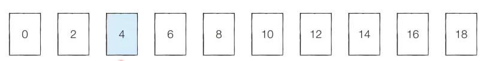
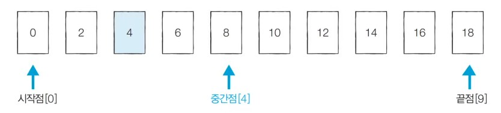
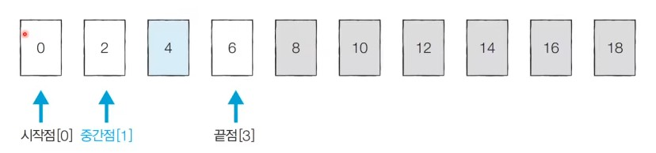
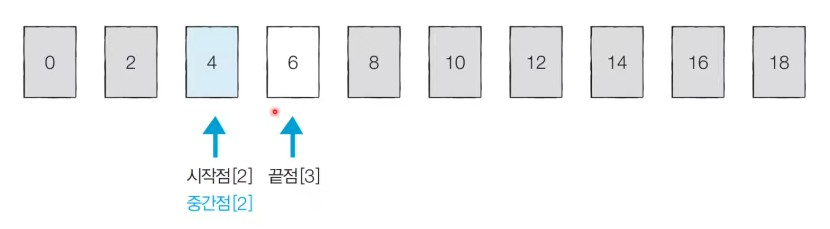
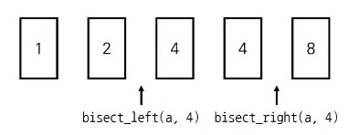

# 26강: 이진 탐색 개요 +  백준 문제(수 찾기, 숫자 카드 2 )

### 이진 탐색 알고리즘

- 순차 탐색 : 리스트 안에 있는 특정한 **데이터를 찾기 위해 앞에서부터 데이터를 하나씩 확인**하는 방법
- 이진 탐색 : 정렬되어 있는 리스트에서 **탐색 범위를 절반씩 좁혀가며 데이터를 탐색**하는 방법
  - 이진 탐색은 시작점, 끝점, 중간점을 이용하여 탐색 범위를 설정
  - 로그시간 복잡도

### 이진 탐색 동작 예시

- 이미 정렬된 10개의 데이터 중에서 값이 4인 원소를 찾는 예시를 살펴보자



- **[Step 1]** 시작점 : 0, 끝점 : 9, 중간점 : 4 (소수점 이하 제거)



- **[Step 2]** 시작점 : 0, 끝점 : 3, 중간점 : 1 (소수점 이하 제거)



- **[Step 3]** 시작점 : 2, 끝점 : 3, 중간점 : 2 (소수점 이하 제거)



### 이진 탐색의 시간 복잡도

- 단계마다 탐색 범위를 2로 나누는 것과 동일하므로 **연산 횟수는  log<sub>2</sub>N에 비례** 한다.
- 예를 들어 초기 데이터 개수가 32개일 때, 이상적으로 1단계를 거치면 16개가량의 데이터만 남는다.
  - 2단계를 거치면 8개 가량의 데이터만 남는다.
  - 3단계를 거치면 4개 가량의 데이터만 남는다.
- 이진 탐색은 탐색 범위를 절반씩 줄이며, 시간 복잡도는 **O(logN)** 을 보장한다.

### 이진 탐색 소스코드: 재귀적 구현 (Python)

```python
# 이진 탐색 소스코드 구현 (재귀 함수)
def binary_search(array, target, start, end):
    if start > end:
        return None
    mid = (start + end) // 2
    # 찾은 경우 중간점 인덱스 반환
    if array[mid] == target:
        return mid
    # 중간점의 값보다 찾고자 하는 값이 작은 경우 왼쪽 확인
    elif array[mid] > target:
        return binary_search(array, target, start, mid - 1)
    # 중간점의 값보다 찾고자 하는 값이 큰 경우 오른쪽 확인
    else:
        return binary_search(array, target, mid + 1, end)

# n(원소의 개수)과 target(찾고자 하는 값)을 입력 받기
n, target = list(map(int, input().split()))
# 전체 원소 입력 받기
array = list(map(int, input().split()))

# 이진 탐색 수행 결과 출력
result = binary_search(array, target, 0, n - 1)
if result == None:
    print("원소가 존재하지 않습니다.")
else:
    print(result + 1)
>
10 7
1 3 5 7 9 11 13 15 17 19
4

10 7
1 3 5 6 9 11 13 15 17 19
원소가 존재하지 않습니다.
```

### 이진 탐색 소스코드 : 반복문 구현 (Python)

```python
# 이진 탐색 소스코드 구현 (반복문)
def binary_search(array, target, start, end):
    while start <= end:
        mid = (start + end) // 2
        # 찾은 경우 중간점 인덱스 반환
        if array[mid] == target:
            return mid
        # 중간점의 값보다 찾고자 하는 값이 작은 경우 왼쪽 확인
        elif array[mid] > target:
            end = mid - 1
        # 중간점의 값보다 찾고자 하는 값이 큰 경우 오른쪽 확인
        else:
            start = mid + 1
    return None

# n(원소의 개수)과 target(찾고자 하는 값)을 입력 받기
n, target = list(map(int, input().split()))
# 전체 원소 입력 받기
array = list(map(int, input().split()))

# 이진 탐색 수행 결과 출력
result = binary_search(array, target, 0, n - 1)
if result == None:
    print("원소가 존재하지 않습니다.")
else:
    print(result + 1)
>
10 7
1 3 5 7 9 11 13 15 17 19
4

10 7
1 3 5 6 9 11 13 15 17 19
원소가 존재하지 않습니다.
```

### 이진 탐색 소스코드 : 반복문 구현 (C++)

```c++
#include <bits/stdc++.h>

using namespace std;

// 이진 탐색 소스코드 구현(반복문)
int binarySearch(vector<int>& arr, int target, int start, int end) {
    while (start <= end) {
        int mid = (start + end) / 2;
        // 찾은 경우 중간점 인덱스 반환
        if (arr[mid] == target) return mid;
        // 중간점의 값보다 찾고자 하는 값이 작은 경우 왼쪽 확인
        else if (arr[mid] > target) end = mid - 1;
        // 중간점의 값보다 찾고자 하는 값이 큰 경우 오른쪽 확인
        else start = mid + 1; 
    }
    return -1;
}

int n, target;
vector<int> arr;

int main(void) {
    // n(원소의 개수)와 target(찾고자 하는 값)을 입력 받기 
    cin >> n >> target;
    // 전체 원소 입력 받기 
    for (int i = 0; i < n; i++) {
        int x;
        cin >> x;
        arr.push_back(x);
    }
    // 이진 탐색 수행 결과 출력 
    int result = binarySearch(arr, target, 0, n - 1);
    if (result == -1) {
        cout << "원소가 존재하지 않습니다." << '\n';
    }
    else {
        cout << result + 1 << '\n';
    }
}
```

### 이진 탐색 소스코드 : 반복문 구현 (Java)

```java
import java.util.*;

public class Main {

    // 이진 탐색 소스코드 구현(반복문)
    public static int binarySearch(int[] arr, int target, int start, int end) {
        while (start <= end) {
            int mid = (start + end) / 2;
            // 찾은 경우 중간점 인덱스 반환
            if (arr[mid] == target) return mid;
            // 중간점의 값보다 찾고자 하는 값이 작은 경우 왼쪽 확인
            else if (arr[mid] > target) end = mid - 1;
            // 중간점의 값보다 찾고자 하는 값이 큰 경우 오른쪽 확인
            else start = mid + 1; 
        }
        return -1;
    }

    public static void main(String[] args) {
        Scanner sc = new Scanner(System.in);
        
        // 원소의 개수(n)와 찾고자 하는 값(target)을 입력받기 
        int n = sc.nextInt();
        int target = sc.nextInt();

        // 전체 원소 입력받기 
        int[] arr = new int[n];
        for (int i = 0; i < n; i++) {
            arr[i] = sc.nextInt();
        }

        // 이진 탐색 수행 결과 출력 
        int result = binarySearch(arr, target, 0, n - 1);
        if (result == -1) {
            System.out.println("원소가 존재하지 않습니다.");
        }
        else {
            System.out.println(result + 1);
        }
    }

}
```

### 파이썬 이진 탐색 라이브러리

- bisect_left(a, x) : 정렬된 순서를 유지하면서 배열 a에 x를 삽입할 가장 왼쪽 인덱스를 반환
- bisect_right(a,x) : 정렬된 순서를 유지하면서 배열 a에 x를 삽입할 가장 오른쪽 인덱스를 반환



```python
from bisect import bisect_left, bisect_right

a = [1,2,4,4,8]
x = 4

print(bisect_left(a,x))
print(bisect_right(a,x))
>
2
6
```

### 값이 특정 범위에 속하는 데이터 개수 구하기

```python
from bisect import bisect_left, bisect_right
# 값이 [left_value, right_value]인 데이터의 개수를 반환하는 함수
def count_by_range(a,left_value,right_value):
    right_index = bisect_right(a, right_value)
    left_index  = bisect_left(a, left_value)
    return right_index - left_index

#배열 선언
a = [1, 2, 3, 3, 3, 3, 4, 4, 8, 9]

#값이 4인 데이터 개수 출력
print(count_by_range(a,4,4))

#값이 [-1,3] 범위에 있는 데이터 개수 출력
print(count_by_range(a,-1,3))
>
2
6
```

### 파라메트릭 서치(Parametric Search)

- <u>최적화 문제를 결정 문제('예' 혹은 '아니오')로 바꾸어 해결하는 기법</u>
  - 예시 : 특정한 조건을 만족하는 가장 알맞은 값을 빠르게 찾는 최적화 문제
  - 탐색 범위를 좁혀가면서 찾는다.
- 일반적으로 코딩 테스트에서 파라메트릭 서치 문제는 **이진 탐색을 이용하여 해결** 할 수 있다.

### <문제> 수 찾기

```python
def binary_search(array,target,start,end):
    while start <= end:
        mid = (start + end) // 2
        
        if array[mid] == target:
            return mid
        elif array[mid] > target:
            end= mid - 1
        else:
            start = mid + 1
    return None

n = int(input())

n_list = list(map(int, input().split()))
n_list.sort()


m = int(input())

m_list = list(map(int,input().split()))


for i in m_list:
    result = binary_search(n_list,i,0,n-1)
    if result == None:
        print(0)
    else:
        print(1)
```

- 위에서 사용한 함수를 이용하면 바로 풀 수 있다.

### <문제> 숫자 찾기2

```python
from bisect import bisect_left , bisect_right

def count_by_range(a, left_value,right_value):
    right_index = bisect_right(a, right_value)
    left_index  = bisect_left(a, left_value)
    return right_index - left_index

n = int(input())
a_list = list(map(int, input().split()))
a_list.sort()
m = int(input())
b_list = list(map(int, input().split()))

for i in b_list:
    cnt = count_by_range(a_list,i,i)
    print(cnt)
```

- 똑같이 위에 식이랑 비슷하게 풀면 된다.