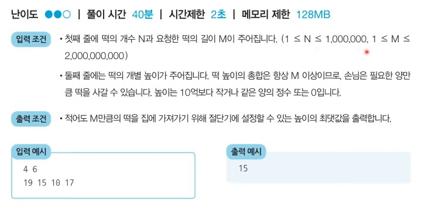
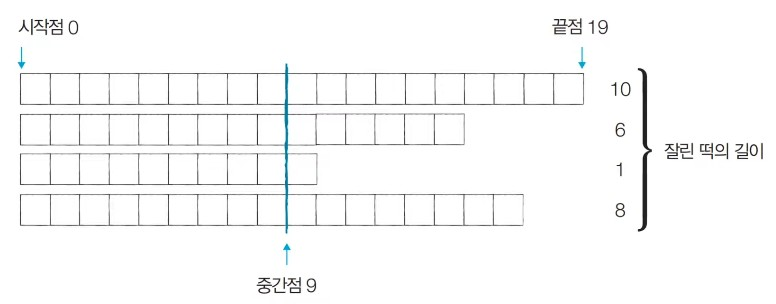
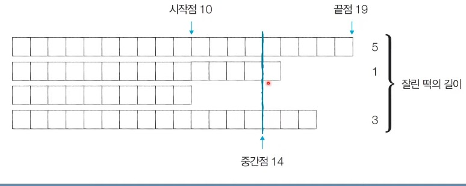
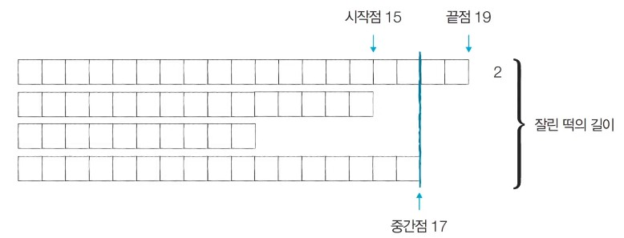
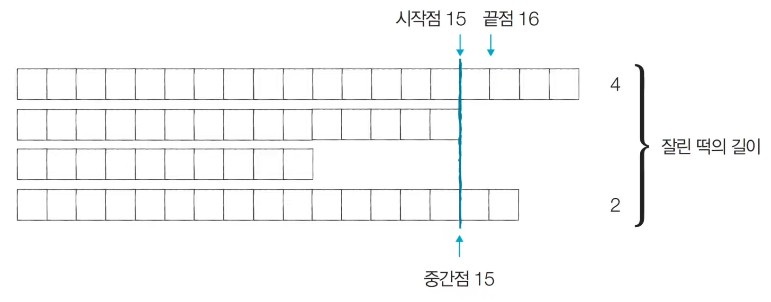
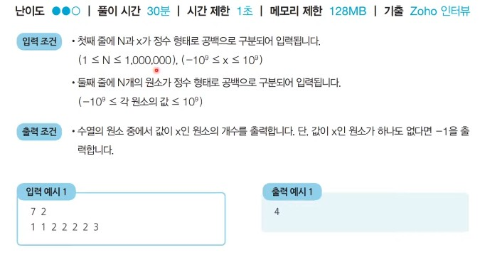
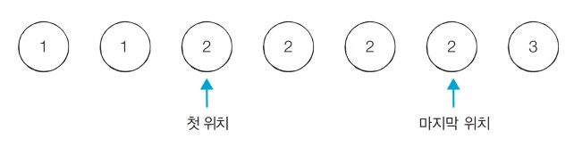

# 27강: 이진 탐색 기초 문제 풀이 + 백준 문제 (랜선 자르기, 나무자르기)

### <문제>  떡볶이 떡 만들기 : 문제 설명

- 오늘 아무개는 여행 가신 부모님을 대신해서 떡집 일을 하기로 했다. 오늘은 떡볶이 떡을 만드는 날이다. 아무개네 떡볶이 떡은 재밌게도 떡볶이 떡의 길이가 일정하지 않다. 대신에 한 봉지 안에 들어가는 떡의 총 길이는 절단기로 잘라서 맞춰준다. 
- 절단기에 **높이(H)** 를 지정하면 줄지어진 떡을 한 번에 절단한다. 높이가 H보다 긴 떡은 H 위의 부분이 잘릴것이고, 낮은 떡은 잘리지 않는다.
- 예들 들어 높이가 19, 14, 10, 17cm인 떡이 나란히 있고 절단기 높이를 15cm로 지정하면 자른 뒤 떡의 높이는 15, 14, 10, 15cm가 될 것이다. 잘린 떡의 길이는 차례대로 4, 0, 0, 2cm이다. 손님은 6cm만큼의 길이를 가져간다.
- 손님이 왔을 때 요청한 총 길이가 M일 때 **적어도 M만큼의 떡을 얻기 위해 절단기에 설정할 수 있는 높이의 최댓값을 구하는 프로그램**을 작성하라



### <문제> 떡볶이 떡 만들기 : 문제 해결 아이디어

- 적잘한 높이를 찾을 때까지 이진 탐색을 수행하여 높이 H를 반복해서 조정한다.
- '현재 이 높이로 자르면 조건을 만족할 수 있는가?'를 확인한 뒤에 <u>조건의 만족 여부('예' 혹은 '아니오')에 따라서 탐색 번위를 좁혀서 해결</u>할 수 있다.
- 절단기의 높이는 0부터 10억까지의 정수 중 하나다.
  - 이렇게 큰 탐색 범위를 보면 가장 먼저 **이진 탐색**을 떠올려야 한다.
- 문제에서 제시된 예시를 통해 그림으로 이해해보자.

- **[Step 1]** 시작점 : 0, 끝점 : 19, 중간점 : 9, 이때 필요한 떡의 크기 : M = 6 이므로, 결과 저장



- **[Step 2]** 시작점 : 10, 끝점 : 19, 중간점 : 14, 이때 필요한 떡의 크기 : M = 6 이므로, 결과 저장



- **[Step 3]** 시작점 : 15, 끝점 : 19, 중간점 : 17, 이때 필요한 떡의 크기 : M = 6 이므로, 결과 저장하지 않음




- **[Step 4]** 시작점 : 15, 끝점 : 16, 중간점 : 15, 이때 필요한 떡의 크기 : M = 6 이므로, 결과 저장



- 이진 탐색 과정을 반복하면 답을 도출 할 수 있다.
- 중간점의 값은 <u>시간이 지날수록 **"최적화된 값"**</u>이 되기 때문에, 과정을 반복하면서 얻을 수 있는 떡의 길이 합이 필요한 떡의 길이보다 크거가 같을 때마다 **중간점의 값을 기록**하면 된다.

### <문제> 떡볶이 떡 만들기 : 답안 예시 (Python)

```python
# 떡의 개수(N)와 요청한 떡의 길이(M)을 입력
n, m = list(map(int, input().split(' ')))
# 각 떡의 개별 높이 정보를 입력
array = list(map(int, input().split()))

# 이진 탐색을 위한 시작점과 끝점 설정
start = 0
end = max(array)

# 이진 탐색 수행 (반복적)
result = 0
while(start <= end):
    total = 0
    mid = (start + end) // 2
    for x in array:
        # 잘랐을 때의 떡볶이 양 계산
        if x > mid:
            total += x - mid
    # 떡볶이 양이 부족한 경우 더 많이 자르기 (오른쪽 부분 탐색)
    if total < m:
        end = mid - 1
    # 떡볶이 양이 충분한 경우 덜 자르기 (왼쪽 부분 탐색)
    else:
        result = mid # 최대한 덜 잘랐을 때가 정답이므로, 여기에서 result에 기록
        start = mid + 1

# 정답 출력
print(result)
```

### <문제> 떡볶이 떡 만들기 : 답안 예시 (C++)

```c++
#include <bits/stdc++.h>

using namespace std;

// 떡의 개수(N)와 요청한 떡의 길이(M)
int n, m;
// 각 떡의 개별 높이 정보 
vector<int> arr;

int main(void) {
    cin >> n >> m;
    for (int i = 0; i < n; i++) {
        int x;
        cin >> x;
        arr.push_back(x);
    }
    // 이진 탐색을 위한 시작점과 끝점 설정
    int start = 0;
    int end = 1e9;
    // 이진 탐색 수행 (반복적) 
    int result = 0; 
    while (start <= end) {
        long long int total = 0;
        int mid = (start + end) / 2;
        for (int i = 0; i < n; i++) {
            // 잘랐을 때의 떡의 양 계산
            if (arr[i] > mid) total += arr[i] - mid; 
        }
        if (total < m) { // 떡의 양이 부족한 경우 더 많이 자르기(왼쪽 부분 탐색)
            end = mid - 1;
        }
        else { // 떡의 양이 충분한 경우 덜 자르기(오른쪽 부분 탐색)
            result = mid; // 최대한 덜 잘랐을 때가 정답이므로, 여기에서 result에 기록 
            start = mid + 1;
        }
    }
    cout << result << '\n';
}
```

### <문제> 떡볶이 떡 만들기 : 답안 예시 (Java)

```java
import java.util.*;

public class Main {

    public static void main(String[] args) {
        Scanner sc = new Scanner(System.in);
        
        // 떡의 개수(N)와 요청한 떡의 길이(M)
        int n = sc.nextInt();
        int m = sc.nextInt();

        // 각 떡의 개별 높이 정보 
        int[] arr = new int[n];
        for (int i = 0; i < n; i++) {
            arr[i] = sc.nextInt();
        }

        // 이진 탐색을 위한 시작점과 끝점 설정
        int start = 0;
        int end = (int) 1e9;
        // 이진 탐색 수행 (반복적)
        int result = 0; 
        while (start <= end) {
            long total = 0;
            int mid = (start + end) / 2;
            for (int i = 0; i < n; i++) {
                // 잘랐을 때의 떡의 양 계산
                if (arr[i] > mid) total += arr[i] - mid; 
            }
            if (total < m) { // 떡의 양이 부족한 경우 더 많이 자르기(왼쪽 부분 탐색)
                end = mid - 1;
            }
            else { // 떡의 양이 충분한 경우 덜 자르기(오른쪽 부분 탐색)
                result = mid; // 최대한 덜 잘랐을 때가 정답이므로, 여기에서 result에 기록 
                start = mid + 1;
            }
        }

        System.out.println(result);
    }

}
```

### <문제> 정렬된 배열에서 특정 수의 개수 구하기 : 문제 설명

- N개의 원소를 포함하고 잇는 수열이 오름차순으로 정렬되어 있다. 이때 이 <u>수열에서 x가 등장하는 횟수를 계한</u>하시오. 예를 들어 수열 {1, 1, 2, 2, 2, 2, 3}이 있을 때 x = 2라면, 현재  수열에서 값이 2인 원소가 4개이므로 4를 출력
- 단, 이 문제는 시간 복잡도 **O(ligN)**으로 알고리즘을 설계하지 않으면 **시간 초과**팜정을 받는다.



### <문제> 정렬된 배열에서 특정 수의 개수 구하기 : 문제 해결 아이디어

- 시간 복잡도 **O(logN)** 으로 동작하는 알고리즘을 요구하고 있다.
  - 일반적인 <u>선형 탐색 (Linear Search)로는 시간 초과 판정을 받는다.
  - 하지만 데이터가 정렬되어 있기 때무에 이진 탐색을 수행할 수 있다.
- 특정 값이 등장하는 첫 번째 위치와 마지막 위치를 찾아 위치 차이를 계산해 문제를 해결할 수 있다.



```python
from bisect import bisect_left , bisect_right

def count_by_range(a, left_value,right_value):
    right_index = bisect_right(a, right_value)
    left_index  = bisect_left(a, left_value)
    return right_index - left_index

n,x = = map(int,input().split())
a_list = list(map(int, input().split()))

count = count_by_range(a_list,x,x)

if  count == 0:
    print(-1)
else:
    print(count)
```

### <문제> 랜선 자르기

```python
k,n = map(int,input().split())
rope_list = [ int(input()) for _ in range(k)]
start = 1
end = max(rope_list)

while (start <= end):
    total = 0
    mid = (start +  end) // 2
    for x in rope_list:
        total += x // mid
 

    if total < n:
        end = mid - 1
    else :
        start = mid + 1
        

print(end)
>
4 11
802
743
457
539
200
```

- 이건 길이 최대가 아니라 개수를 기준으로 최대 길이를 찾는 것이기에 for문안에 if로 조건을 주지 않는다.

### <문제> 나무자르기

```python
n,m = map(int,input().split())
rope_list = list(map(int, input().split()))
    
start = 0
end = max(rope_list)

result = 0
while (start <= end):
    total = 0
    mid = (start +  end) // 2
    for x in rope_list:
        if x > mid:
            total += x - mid
    if total < m:
        end = mid - 1
    else :
        result = mid
        start = mid + 1

print(result)  
>
4 7
20 15 10 17
15
```

- 떡볶이 떡 처럼 길이 제한이 있기에 if구문이 있어야 한다.