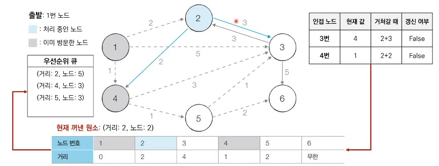

# 30강: 다익스트라 최단 경로 알고리즘 + 백준 문제(최단경로, 특정한 최단 경로)

### 최단 경로 문제

- **가장 짧은 경로를 찾는 알고리즘**
- **다양한 문제 상황**
  - 한 지점에서 다른 한 지점까지의 최단 경로
  - 한 지점에서 다른 모든 지점까지의 최단 경로
  - 모든 지점에서 다른 지점까지의 최단 경로
- 각 지점은 그래프에서 노드로 표현
- 지점 간 연결된 도로는 그래프에서 간선으로 표현


### 다익스트라 최단 경로 알고리즘 개요

- **특정한 노드**에서 출발하여 **다른 모든 노드**로 가는 최단 경로를 계산
- 다익스트라 최단 경로 알고리즘은 음의 간서이 없을 때 정상적으로 동작
  - 현실 세계의 도로(간선)은 음의 간선으로 표현되지 않는다.
- 다익스트라 최단 경로 알고리즘은 그리디 알고리즘으로 분리된다.
  - **매 상황에서 가장 비용이 적은 노드를 선택**해 임의의 과정을 반복한다.

### 다익스트라 최단 경로 알고리즘

- 알고리즘의 **동작 과정**은 다음과 같다.
  1. 출발 노드를 설정
  2. 최단 거리 테이블을 초기화
  3. 방문하지 않은 노드 중에서 최단 거리가 가장 짧은 노드를 선택
  4. 해당 노드를 거쳐 다른 노드로 가는 비용을 계산하여 최단 거리 테이블을 갱신
  5. 위 과정에서 3번과 4번을 반복

- 알고리즘 동작 과정에서 최단 거리 테이블은 각 노드에 대한 현재까지의 최단 거리 정보를 가지고 있다.
- 처리 과정에서 더 짧은 경로를 찾으면 '이제부터는 이 경로가 제일 짧은 경로야'라고 갱신한다.


### 다익스트라 알고리즘 : 동작 과정 살펴보기

- **[초기 상태]** : 그래프를 준비하고 출발 노드를 설정한다.


- **[Step 1]** : 방문하지 않은 노드 중에서 최단 거리가 가장 짧은 노드인 **1번** 노드를 처리한다.


- **[Step 2]** : 방문하지 않은 노드 중에서 최단 거리가 가장 짧은 노드인 **4번** 노드를 처리한다.


- **[Step 4]** : 방문하지 않은 노드 중에서 최단 거리가 가장 짧은 노드인 **5번** 노드를 처리한다.


- **[Step 5]** : 방문하지 않은 노드 중에서 최단 거리가 가장 짧은 노드인 **3번** 노드를 처리한다.


- **[Step 6]** : 방문하지 않은 노드 중에서 최단 거리가 가장 짧은 노드인 **6번** 노드를 처리한다.


### 다익스트라 알고리즘의 특징

- 그리디 알고리즘 : **매 상황에서 방문하지 않은 가장 비용이 적은 노트를 선택**해 임의의 관정을 반복한다.
- 단계를 거치며 **한 번 처리된 노드의 최단 거리는 고정**되어 더 이상 바뀌지 않는다.
  - **한 단계당 하나의 노드에 대한 최단 거리를 확실히 찾는 것으로 이해**할 수 있다.
- 다익스트라 알고리즘을 수행한 뒤에 <u>테이블의 각 노드까지의 최단 거리 정보가 저장</u>된다.
  - 완벽한 형태의 최단 경로를 구하려면 소스코드에 추가적인 기능을 더 넣어야 한다.

### 다익스트라 알고리즘 : 간단한 구현 방법 (Python)

- 단계마다 방문하지 않은 노드 중에서 최단 거리가 가장 짧은 노드를 선택하기 위해 **매 단계마다 1차원 테이블의 모든 원소를 확인(순차 탐색)**한다.

```python
import sys
input = sys.stdin.readline
INF = int(1e9) # 무한을 의미하는 값으로 10억을 설정

# 노드의 개수, 간선의 개수를 입력받기
n, m = map(int, input().split())
# 시작 노드 번호를 입력받기
start = int(input())
# 각 노드에 연결되어 있는 노드에 대한 정보를 담는 리스트를 만들기
graph = [[] for i in range(n + 1)]
# 방문한 적이 있는지 체크하는 목적의 리스트를 만들기
visited = [False] * (n + 1)
# 최단 거리 테이블을 모두 무한으로 초기화
distance = [INF] * (n + 1)

# 모든 간선 정보를 입력받기
for _ in range(m):
    a, b, c = map(int, input().split())
    # a번 노드에서 b번 노드로 가는 비용이 c라는 의미
    graph[a].append((b, c))

# 방문하지 않은 노드 중에서, 가장 최단 거리가 짧은 노드의 번호를 반환
def get_smallest_node():
    min_value = INF
    index = 0 # 가장 최단 거리가 짧은 노드(인덱스)
    for i in range(1, n + 1):
        if distance[i] < min_value and not visited[i]:
            min_value = distance[i]
            index = i
    return index

def dijkstra(start):
    # 시작 노드에 대해서 초기화
    distance[start] = 0
    visited[start] = True
    for j in graph[start]:
        distance[j[0]] = j[1]
    # 시작 노드를 제외한 전체 n - 1개의 노드에 대해 반복
    for i in range(n - 1):
        # 현재 최단 거리가 가장 짧은 노드를 꺼내서, 방문 처리
        now = get_smallest_node()
        visited[now] = True
        # 현재 노드와 연결된 다른 노드를 확인
        for j in graph[now]:
            cost = distance[now] + j[1]
            # 현재 노드를 거쳐서 다른 노드로 이동하는 거리가 더 짧은 경우
            if cost < distance[j[0]]:
                distance[j[0]] = cost

# 다익스트라 알고리즘을 수행
dijkstra(start)

# 모든 노드로 가기 위한 최단 거리를 출력
for i in range(1, n + 1):
    # 도달할 수 없는 경우, 무한(INFINITY)이라고 출력
    if distance[i] == INF:
        print("INFINITY")
    # 도달할 수 있는 경우 거리를 출력
    else:
        print(distance[i])
```

### 다익스트라 알고리즘 : 간단한 구현 방법 (C++)

```c++
#include <bits/stdc++.h>
#define INF 1e9 // 무한을 의미하는 값으로 10억을 설정

using namespace std;

// 노드의 개수(N), 간선의 개수(M), 시작 노드 번호(Start)
// 노드의 개수는 최대 100,000개라고 가정
int n, m, start;
// 각 노드에 연결되어 있는 노드에 대한 정보를 담는 배열
vector<pair<int, int> > graph[100001];
// 방문한 적이 있는지 체크하는 목적의 배열 만들기
bool visited[100001];
// 최단 거리 테이블 만들기
int d[100001];

// 방문하지 않은 노드 중에서, 가장 최단 거리가 짧은 노드의 번호를 반환
int getSmallestNode() {
    int min_value = INF;
    int index = 0; // 가장 최단 거리가 짧은 노드(인덱스)
    for (int i = 1; i <= n; i++) {
        if (d[i] < min_value && !visited[i]) {
            min_value = d[i];
            index = i;
        }
    }
    return index;
}

void dijkstra(int start) {
    // 시작 노드에 대해서 초기화
    d[start] = 0;
    visited[start] = true;
    for (int j = 0; j < graph[start].size(); j++) {
        d[graph[start][j].first] = graph[start][j].second;
    }
    // 시작 노드를 제외한 전체 n - 1개의 노드에 대해 반복
    for (int i = 0; i < n - 1; i++) {
        // 현재 최단 거리가 가장 짧은 노드를 꺼내서, 방문 처리
        int now = getSmallestNode();
        visited[now] = true;
        // 현재 노드와 연결된 다른 노드를 확인
        for (int j = 0; j < graph[now].size(); j++) {
            int cost = d[now] + graph[now][j].second;
            // 현재 노드를 거쳐서 다른 노드로 이동하는 거리가 더 짧은 경우
            if (cost < d[graph[now][j].first]) {
                d[graph[now][j].first] = cost;
            }
        }
    }
}

int main(void) {
    cin >> n >> m >> start;

    // 모든 간선 정보를 입력받기
    for (int i = 0; i < m; i++) {
        int a, b, c;
        cin >> a >> b >> c;
        // a번 노드에서 b번 노드로 가는 비용이 c라는 의미
        graph[a].push_back({b, c});
    }

    // 최단 거리 테이블을 모두 무한으로 초기화
    fill_n(d, 100001, INF);
    
    // 다익스트라 알고리즘을 수행
    dijkstra(start);

    // 모든 노드로 가기 위한 최단 거리를 출력
    for (int i = 1; i <= n; i++) {
        // 도달할 수 없는 경우, 무한(INFINITY)이라고 출력
        if (d[i] == INF) {
            cout << "INFINITY" << '\n';
        }
        // 도달할 수 있는 경우 거리를 출력
        else {
            cout << d[i] << '\n';
        }
    }
}
```

### 다익스트라 알고리즘 : 간단한 구현 방법 (Java)

```java
import java.util.*;

class Node {

    private int index;
    private int distance;

    public Node(int index, int distance) {
        this.index = index;
        this.distance = distance;
    }

    public int getIndex() {
        return this.index;
    }

    public int getDistance() {
        return this.distance;
    }
}

public class Main {

    public static final int INF = (int) 1e9; // 무한을 의미하는 값으로 10억을 설정
    // 노드의 개수(N), 간선의 개수(M), 시작 노드 번호(Start)
    // 노드의 개수는 최대 100,000개라고 가정
    public static int n, m, start;
    // 각 노드에 연결되어 있는 노드에 대한 정보를 담는 배열
    public static ArrayList<ArrayList<Node>> graph = new ArrayList<ArrayList<Node>>();
    // 방문한 적이 있는지 체크하는 목적의 배열 만들기
    public static boolean[] visited = new boolean[100001];
    // 최단 거리 테이블 만들기
    public static int[] d = new int[100001];

    // 방문하지 않은 노드 중에서, 가장 최단 거리가 짧은 노드의 번호를 반환
    public static int getSmallestNode() {
        int min_value = INF;
        int index = 0; // 가장 최단 거리가 짧은 노드(인덱스)
        for (int i = 1; i <= n; i++) {
            if (d[i] < min_value && !visited[i]) {
                min_value = d[i];
                index = i;
            }
        }
        return index;
    }

    public static void dijkstra(int start) {
        // 시작 노드에 대해서 초기화
        d[start] = 0;
        visited[start] = true;
        for (int j = 0; j < graph.get(start).size(); j++) {
            d[graph.get(start).get(j).getIndex()] = graph.get(start).get(j).getDistance();
        }
        // 시작 노드를 제외한 전체 n - 1개의 노드에 대해 반복
        for (int i = 0; i < n - 1; i++) {
            // 현재 최단 거리가 가장 짧은 노드를 꺼내서, 방문 처리
            int now = getSmallestNode();
            visited[now] = true;
            // 현재 노드와 연결된 다른 노드를 확인
            for (int j = 0; j < graph.get(now).size(); j++) {
                int cost = d[now] + graph.get(now).get(j).getDistance();
                // 현재 노드를 거쳐서 다른 노드로 이동하는 거리가 더 짧은 경우
                if (cost < d[graph.get(now).get(j).getIndex()]) {
                    d[graph.get(now).get(j).getIndex()] = cost;
                }
            }
        }
    }

    public static void main(String[] args) {
        Scanner sc = new Scanner(System.in);

        n = sc.nextInt();
        m = sc.nextInt();
        start = sc.nextInt();

        // 그래프 초기화
        for (int i = 0; i <= n; i++) {
            graph.add(new ArrayList<Node>());
        }

        // 모든 간선 정보를 입력받기
        for (int i = 0; i < m; i++) {
            int a = sc.nextInt();
            int b = sc.nextInt();
            int c = sc.nextInt();
            // a번 노드에서 b번 노드로 가는 비용이 c라는 의미
            graph.get(a).add(new Node(b, c));
        }

        // 최단 거리 테이블을 모두 무한으로 초기화
        Arrays.fill(d, INF);
        
        // 다익스트라 알고리즘을 수행
        dijkstra(start);

        // 모든 노드로 가기 위한 최단 거리를 출력
        for (int i = 1; i <= n; i++) {
            // 도달할 수 없는 경우, 무한(INFINITY)이라고 출력
            if (d[i] == INF) {
                System.out.println("INFINITY");
            }
            // 도달할 수 있는 경우 거리를 출력
            else {
                System.out.println(d[i]);
            }
        }
    }
}
```

### 다익스트라 알고리즘 : 간단한 구현 방법 성능 분석

- 총 **O(V)**번에 걸쳐서 최단 거리가 가장 짧은 노드를 매번 선형 탐색해야 한다.
- 따라서 전체 시간 복잡도는 **O(V<sup>2</sup>)**이다.
- 일반적으로 코딩 테스트의 최단 경로 문제에서 전체 노드의 개수가 5,000개 이하라면 이 코드로 문제를 해결할 수 있다.
  - 하지만 노드의 개수가 10,000개를 넘어가는 문제라면 어떻게 해야 할까?

### 우선순위 큐(Priority Queue)

- <u>우선순위가 가장 높은 데이터를 가장 먼저 삭제</u>하는 자료구조
- 예를 들어 여러 개의 물건 데이터를 자료구조에 넣었다가 가치가 높은 물건 데이터부터 꺼내서 확인해야 하는 경우에 우선순위 큐를 이용할 수 있다.
- Python, C++, Java를 포함한 대부분의 프로그래밍 언어에서 **표준 라이브러리 형태로 지원**한다.

| 자료구조                    | 추출되는 데이터             |
| --------------------------- | --------------------------- |
| 스택(Stack)                 | 가장 나중에 삽입된 데이터   |
| 큐(Queue)                   | 가장 먼저 삽입된 데이터     |
| 우선순위 큐(Priority Queue) | 가장 우선순위가 높은 데이터 |

### 힙(Heap)

- <u>우선순위 큐(Priority Queue)를 구현하기 위해 사용하는 자료구조 중 하나</u>
- **최소 힙(Min Heap)과 최대 힙(Max Heap)**이 있다.
- 다익스트라 최단 경로 알고리즘을 포함해 다양한 알고리즘에서 사용된다.

| 우선순위 큐 구현 방식 | 삽입 시간 | 삭제 시간 |
| --------------------- | --------- | --------- |
| 리스트                | O(1)      | O(N)      |
| 힙(Heap)              | O(logN)   | O(logN)   |

### 힙 라이브러리 사용 예제 : 최소 힙

```python
import heapq

#오름차순 힙 정렬(Heap Sort)
def heapsort(iterable):
    h = []
    result = []
    # 모든 원소를 차례데로 힙에 삽입
    for value in iterable:
        heapq.heappush(h, value)
    #힙에 삽입된 모든 원소를 차례대로 꺼내어 담기
    for i in range(len(h)):
        result.append(heapq.headppop(h))
       return result

result = heapsort([1, 3, 5, 7, 9, 2, 4, 6, 8, 0])
print(result)
>
[0, 1, 2, 3, 4, 5, 6, 7, 8, 9]
```

### 힙 라이브러리 사용 예제 : 최대 힙

```python
import heapq

#오름차순 힙 정렬(Heap Sort)
def heapsort(iterable):
    h = []
    result = []
    # 모든 원소를 차례데로 힙에 삽입
    for value in iterable:
        heapq.heappush(h, -value)
    #힙에 삽입된 모든 원소를 차례대로 꺼내어 담기
    for i in range(len(h)):
        result.append(-heapq.headppop(h))
       return result

result = heapsort([1, 3, 5, 7, 9, 2, 4, 6, 8, 0])
print(result)
>
[9, 8, 7, 6, 5, 4, 3, 2, 1, 0]
```

### 다익스트라 알고리즘 : 개선된 구현 방법

- 단계마다 <u>방문하지 않은 노드 중에서 최단 거리가 가장 짧은 노드를 선택</u>하기 위해 **힙(Heap)** 자료구조를 이용한다.
- 다익스트라 알고리즘이 동작하는 **기본 원리는 동일**하다.
  - 현재 가장 가까운 노드를 저장해 놓기 위해서 힙 자료구조를 추가적으로 이용한다는 점이 다르다.
  - 현재의 최단 거리가 가장 짧은 노드를 선택해야 하므로 최소 힙을 사용한다.

### 다익스트라 알고리즘 : 동작 과정 살펴보기 (우선순위 큐)

- **[초기 상태]** 그래프를 준비하고 출발 노드를 설정하여 우선순위 큐에 삽입한다.


- **[Step 1]** 우선순위 큐에서 원소를 꺼낸다. **1번** 노드는 아직 방문하지 않았으므로 이를 처리한다.


- **[Step 2]** 우선순위 큐에서 원소를 꺼낸다. **4번** 노드는 아직 방문하지 않았으므로 이를 처리한다.


- **[Step 3]** 우선순위 큐에서 원소를 꺼낸다. **2번** 노드는 아직 방문하지 않았으므로 이를 처리한다.



- **[Step 4]** 우선순위 큐에서 원소를 꺼낸다. **5번** 노드는 아직 방문하지 않았으므로 이를 처리한다.


- **[Step 5]** 우선순위 큐에서 원소를 꺼낸다. **3번** 노드는 아직 방문하지 않았으므로 이를 처리한다.


- **[Step 6]** 우선순위 큐에서 원소를 꺼낸다. **3번** 노드는 이미 방문했으므로 무시한다.


- **[Step 7]** 우선순위 큐에서 원소를 꺼낸다. **6번** 노드는 아직 방문하지 않았으므로 이를 처리한다.


- **[Step 8]** 우선순위 큐에서 원소를 꺼낸다. **3번** 노드는 이미 방문했으므로 무시한다.


### 다익스트라 알고리즘 : 개선된 구현 방법 (Python)

```python
import heapq
import sys
input = sys.stdin.readline
INF = int(1e9) # 무한을 의미하는 값으로 10억을 설정

# 노드의 개수, 간선의 개수를 입력받기
n, m = map(int, input().split())
# 시작 노드 번호를 입력받기
start = int(input())
# 각 노드에 연결되어 있는 노드에 대한 정보를 담는 리스트를 만들기
graph = [[] for i in range(n + 1)]
# 최단 거리 테이블을 모두 무한으로 초기화
distance = [INF] * (n + 1)

# 모든 간선 정보를 입력받기
for _ in range(m):
    a, b, c = map(int, input().split())
    # a번 노드에서 b번 노드로 가는 비용이 c라는 의미
    graph[a].append((b, c))

def dijkstra(start):
    q = []
    # 시작 노드로 가기 위한 최단 경로는 0으로 설정하여, 큐에 삽입
    heapq.heappush(q, (0, start))
    distance[start] = 0
    while q: # 큐가 비어있지 않다면
        # 가장 최단 거리가 짧은 노드에 대한 정보 꺼내기
        dist, now = heapq.heappop(q)
        # 현재 노드가 이미 처리된 적이 있는 노드라면 무시
        if distance[now] < dist:
            continue
        # 현재 노드와 연결된 다른 인접한 노드들을 확인
        for i in graph[now]:
            cost = dist + i[1]
            # 현재 노드를 거쳐서, 다른 노드로 이동하는 거리가 더 짧은 경우
            if cost < distance[i[0]]:
                distance[i[0]] = cost
                heapq.heappush(q, (cost, i[0]))

# 다익스트라 알고리즘을 수행
dijkstra(start)

# 모든 노드로 가기 위한 최단 거리를 출력
for i in range(1, n + 1):
    # 도달할 수 없는 경우, 무한(INFINITY)이라고 출력
    if distance[i] == INF:
        print("INFINITY")
    # 도달할 수 있는 경우 거리를 출력
    else:
        print(distance[i])
```

### 다익스트라 알고리즘 : 개선된 구현 방법 (C++)

```c++
import heapq
import sys
input = sys.stdin.readline
INF = int(1e9) # 무한을 의미하는 값으로 10억을 설정

# 노드의 개수, 간선의 개수를 입력받기
n, m = map(int, input().split())
# 시작 노드 번호를 입력받기
start = int(input())
# 각 노드에 연결되어 있는 노드에 대한 정보를 담는 리스트를 만들기
graph = [[] for i in range(n + 1)]
# 최단 거리 테이블을 모두 무한으로 초기화
distance = [INF] * (n + 1)

# 모든 간선 정보를 입력받기
for _ in range(m):
    a, b, c = map(int, input().split())
    # a번 노드에서 b번 노드로 가는 비용이 c라는 의미
    graph[a].append((b, c))

def dijkstra(start):
    q = []
    # 시작 노드로 가기 위한 최단 경로는 0으로 설정하여, 큐에 삽입
    heapq.heappush(q, (0, start))
    distance[start] = 0
    while q: # 큐가 비어있지 않다면
        # 가장 최단 거리가 짧은 노드에 대한 정보 꺼내기
        dist, now = heapq.heappop(q)
        # 현재 노드가 이미 처리된 적이 있는 노드라면 무시
        if distance[now] < dist:
            continue
        # 현재 노드와 연결된 다른 인접한 노드들을 확인
        for i in graph[now]:
            cost = dist + i[1]
            # 현재 노드를 거쳐서, 다른 노드로 이동하는 거리가 더 짧은 경우
            if cost < distance[i[0]]:
                distance[i[0]] = cost
                heapq.heappush(q, (cost, i[0]))

# 다익스트라 알고리즘을 수행
dijkstra(start)

# 모든 노드로 가기 위한 최단 거리를 출력
for i in range(1, n + 1):
    # 도달할 수 없는 경우, 무한(INFINITY)이라고 출력
    if distance[i] == INF:
        print("INFINITY")
    # 도달할 수 있는 경우 거리를 출력
    else:
        print(distance[i])
```

### 다익스트라 알고리즘 : 개선된 구현 방법 (Java)

```java
#include <bits/stdc++.h>
#define INF 1e9 // 무한을 의미하는 값으로 10억을 설정

using namespace std;

// 노드의 개수(N), 간선의 개수(M), 시작 노드 번호(Start)
// 노드의 개수는 최대 100,000개라고 가정
int n, m, start;
// 각 노드에 연결되어 있는 노드에 대한 정보를 담는 배열
vector<pair<int, int> > graph[100001];
// 최단 거리 테이블 만들기
int d[100001];

void dijkstra(int start) {
    priority_queue<pair<int, int> > pq;
    // 시작 노드로 가기 위한 최단 경로는 0으로 설정하여, 큐에 삽입
    pq.push({0, start});
    d[start] = 0;
    while (!pq.empty()) { // 큐가 비어있지 않다면
        // 가장 최단 거리가 짧은 노드에 대한 정보 꺼내기
        int dist = -pq.top().first; // 현재 노드까지의 비용 
        int now = pq.top().second; // 현재 노드
        pq.pop();
        // 현재 노드가 이미 처리된 적이 있는 노드라면 무시
        if (d[now] < dist) continue;
        // 현재 노드와 연결된 다른 인접한 노드들을 확인
        for (int i = 0; i < graph[now].size(); i++) {
            int cost = dist + graph[now][i].second;
            // 현재 노드를 거쳐서, 다른 노드로 이동하는 거리가 더 짧은 경우
            if (cost < d[graph[now][i].first]) {
                d[graph[now][i].first] = cost;
                pq.push(make_pair(-cost, graph[now][i].first));
            }
        }
    }
}

int main(void) {
    cin >> n >> m >> start;

    // 모든 간선 정보를 입력받기
    for (int i = 0; i < m; i++) {
        int a, b, c;
        cin >> a >> b >> c;
        // a번 노드에서 b번 노드로 가는 비용이 c라는 의미
        graph[a].push_back({b, c});
    }

    // 최단 거리 테이블을 모두 무한으로 초기화
    fill(d, d + 100001, INF);
    
    // 다익스트라 알고리즘을 수행
    dijkstra(start);

    // 모든 노드로 가기 위한 최단 거리를 출력
    for (int i = 1; i <= n; i++) {
        // 도달할 수 없는 경우, 무한(INFINITY)이라고 출력
        if (d[i] == INF) {
            cout << "INFINITY" << '\n';
        }
        // 도달할 수 있는 경우 거리를 출력
        else {
            cout << d[i] << '\n';
        }
    }
}
```

### 다익스트라 알고리즘 : 개선된 구현 방법 성능 분석

- 힙 자료구조를 이용하는 다익스트라 알고리즘의 시간 복잡도는 **O(ElogV)**이다.
- 노드를 하나씩 꺼내 검사하는 반복문(while문)은 노드의 개수 V 이상의 횟수로는 처리되지 않는다.
  - 결과적으로 현재 우선순위 큐에서 꺼낸 노드와 연결된 다른 노드들을 확인하는 총횟수는 최대 간선의 개수(E)만큼 연산이 수행될 수 있다.
- 직관적으로 <u>전체 과정은 E개의 원소를 우선순위 큐에 넣었다가 모두 빼내는 연산과 매우 유사</u>하다.
  - 시간 복잡도를 O(ElogE)로 판단할 수 있다.
  - 중복 간선을 포함하지 않는 경우에 이를 o(ElogV)로 정리할 수 있다.
    - O(ElogE) -> O(ElogV<sup>2</sup>) -> O(2ElogV) -> O(ElogV)

### <문제> 최단 경로

```python
import heapq

INF = int(1e9)

n,m = map(int,input().split())
start = int(input())

graph = [[] for _ in range(n+1)]

distance = [INF] * (n+1)

for _ in range(m):
    a, b, c = map(int,input().split())
    graph[a].append([b,c])
    
def dijkstra(start):
    q = []
    heapq.heappush(q,(0,start))
    distance[start] = 0
    while q:
        dist, now = heapq.heappop(q)
        if distance[now] < dist :
            continue
        for i in graph[now] :
            cost = dist + i[1]
            if cost < distance[i[0]]:
                distance[i[0]] = cost
                heapq.heappush(q,(cost, i[0]))
                
dijkstra(start)
for i in range(1,n+1):
    if distance[i] == INF:
        print('INF')
    else:
        print(distance[i])
```

- 위의 예시랑 똑같다.

### <문제> 특정한 최단 경로

```python
import heapq

INF = int(1e9)

n,m = map(int,input().split())


graph = [[] for _ in range(n+1)]

distance = [INF] * (n+1)

for _ in range(m):
    a, b, c = map(int,input().split())
    graph[a].append([b,c])
    graph[b].append([a,c])
    

start1, start2 = map(int, input().split())
    
def dijkstra(start):
    distance = [INF for _ in range(n+1)]
    q = []
    heapq.heappush(q,(0,start))
    distance[start] = 0
    while q:
        dist, now = heapq.heappop(q)
        if distance[now] < dist :
            continue
        for i in graph[now] :
            cost = dist + i[1]
            if cost < distance[i[0]]:
                distance[i[0]] = cost
                heapq.heappush(q,(cost, i[0]))
    return distance            
start_0 = dijkstra(1)
start_1 = dijkstra(start1)
start_2 = dijkstra(start2)

result = min(start_0[start1] + start_1[start2]+start_2[n], start_0[start2]+start_2[start1]+start_1[n])

if result >= INF:
    print(-1)
else:
    print(result)
```

- 서로의 경로를 저장해주고 다익스트라를 실행한다.
- 그러면 그 값과 맨 처음 시작 노드로 가는 길이를 찾아서 더 작은 값을 지정한다.