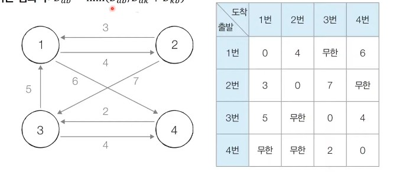
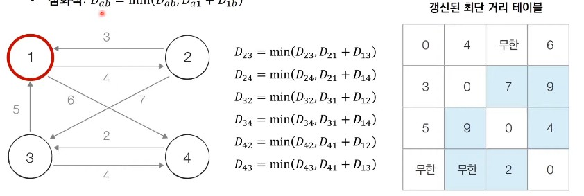
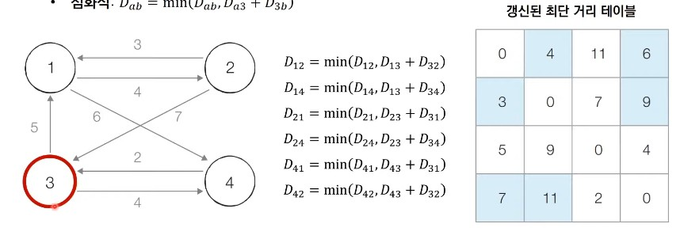
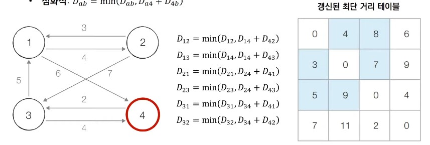

# 31강: 플로이드 워셜 알고리즘 + 백준문제(플로이드, 운동)

- <u>모든 노트에서 다른 모든 노드까지의 최단 경로를 모두 계산</u>한다.
- 플로이드 워셜 알고리즘은 다익스트라 알고리즘과 마찬가자로 단계별로 **거쳐 가는 노드를 기준으로 알고리즘을 수행**한다.
  - 다만 매 단계마다 방문하지 않은 노드 중에 최단 거리를 갖는 노드를 찾는 과정이 필요하지 않다.
- 플로이드 워셜은 2차원 테이블에 최단 거리 정보를 저장한다.
- 플로이드 워셜 알고리즘은 다이나믹 프로그래밍 유형에 속한다.

- 각 단계마다 **특정한 노드 k를 거쳐 가는 경우를 확인**한다.
  - a에서 b로 가는 최단 거리보다 a에서 k를 거쳐 b로 가는 거리가 더 짧은지 검사한다.
- 점화식은 다음과 같다.


### 플로이트 워셜 알고리즘 : 동작 과정 살펴보기

- **[초기 상태]** 그래프를 준비하고 최단 거리 테이블을 초기화한다.
  - **기본 점화식** : D<sub>ab</sub> = min( D<sub>ab</sub>,  D<sub>ak</sub> +  D<sub>kb</sub>)



- **[Step 1]** **1번** 노드를 거쳐 가는 경우를 고려하여 테이블을 갱신한다.
  - **점화식** : D<sub>ab</sub> = min( D<sub>ab</sub>,  D<sub>a1</sub> +  D<sub>1b</sub>)



- **[Step 2]** **2번** 노드를 거쳐 가는 경우를 고려하여 테이블을 갱신한다.
  - **점화식** : D<sub>ab</sub> = min( D<sub>ab</sub>,  D<sub>a2</sub> +  D<sub>2b</sub>)

   

- **[Step 3]** **3번** 노드를 거쳐 가는 경우를 고려하여 테이블을 갱신한다.
  - **점화식** : D<sub>ab</sub> = min( D<sub>ab</sub>,  D<sub>a3</sub> +  D<sub>3b</sub>)



- **[Step 4]** **4번** 노드를 거쳐 가는 경우를 고려하여 테이블을 갱신한다.
  - **점화식** : D<sub>ab</sub> = min( D<sub>ab</sub>,  D<sub>a4</sub> +  D<sub>4b</sub>)		

​	

### 플로이드 워셜 알고리즘

```python
INF = int(1e9) # 무한을 의미하는 값으로 10억을 설정

# 노드의 개수 및 간선의 개수를 입력받기
n = int(input())
m = int(input())
# 2차원 리스트(그래프 표현)를 만들고, 모든 값을 무한으로 초기화
graph = [[INF] * (n + 1) for _ in range(n + 1)]

# 자기 자신에서 자기 자신으로 가는 비용은 0으로 초기화
for a in range(1, n + 1):
    for b in range(1, n + 1):
        if a == b:
            graph[a][b] = 0

# 각 간선에 대한 정보를 입력 받아, 그 값으로 초기화
for _ in range(m):
    # A에서 B로 가는 비용은 C라고 설정
    a, b, c = map(int, input().split())
    graph[a][b] = c

# 점화식에 따라 플로이드 워셜 알고리즘을 수행
for k in range(1, n + 1):
    for a in range(1, n + 1):
        for b in range(1, n + 1):
            graph[a][b] = min(graph[a][b], graph[a][k] + graph[k][b])

# 수행된 결과를 출력
for a in range(1, n + 1):
    for b in range(1, n + 1):
        # 도달할 수 없는 경우, 무한(INFINITY)이라고 출력
        if graph[a][b] == 1e9:
            print("INFINITY", end=" ")
        # 도달할 수 있는 경우 거리를 출력
        else:
            print(graph[a][b], end=" ")
    print()
```

### 플로이드 워셜 알고리즘 성능 분석

- 노드의 개수가 N개일 때 알고리즘상으로 N번의 단계를 수행한다.
  - 각 단계마다 **O(N<sup>2</sup>)**의 연산을 통해 현재 노드를 거쳐 가는 모든 경로를 고려한다.
- 따라서 플로이드 워셜 알고리즘의 총 시간 복잡도는 **O(N<sup>3</sup>)**이다.

### <문제> 최단경로

```python
import heapq

INF = int(1e9)INF = int(1e9) 


n = int(input())
m = int(input())

graph = [[INF] * (n + 1) for _ in range(n + 1)]


for a in range(1, n + 1):
    for b in range(1, n + 1):
        if a == b:
            graph[a][b] = 0


for _ in range(m):
    a, b, c = map(int, input().split())
    if graph[a][b] == INF:
        graph[a][b]= c
    elif graph[a][b] != INF and c < graph[a][b]:
        graph[a][b] = c

for k in range(1, n + 1):
    for a in range(1, n + 1):
        for b in range(1, n + 1):
            graph[a][b] = min(graph[a][b], graph[a][k] + graph[k][b])

for k in range(1, n + 1):
    for a in range(1, n + 1):
        for b in range(1, n + 1):
            if graph[a][b] == INF:
                graph[a][b] = 0
            if graph[a][k] == INF:
                graph[a][k] = 0
            if graph[k][b] == INF:
                graph[k][b] = 0                        
print(graph)
for i in range(1,n+1):
    list_num = map(str,graph[i][1:])
    print(' '.join(list_num))

n,m = map(int,input().split())
start = int(input())

graph = [[] for _ in range(n+1)]

distance = [INF] * (n+1)

for _ in range(m):
    a, b, c = map(int,input().split())
    graph[a].append([b,c])
    
def dijkstra(start):
    q = []
    heapq.heappush(q,(0,start))
    distance[start] = 0
    while q:
        dist, now = heapq.heappop(q)
        if distance[now] < dist :
            continue
        for i in graph[now] :
            cost = dist + i[1]
            if cost < distance[i[0]]:
                distance[i[0]] = cost
                heapq.heappush(q,(cost, i[0]))
                
dijkstra(start)
for i in range(1,n+1):
    if distance[i] == INF:
        print('INF')
    else:
        print(distance[i])
```

### <문제> 특정한 최단 경로

```python
INF = int(100000) 

n,m = map(int, input().split())


graph = [[INF] * (n + 1) for _ in range(n + 1)]


for a in range(1, n + 1):
    for b in range(1, n + 1):
        if a == b:
            graph[a][b] = 0


for _ in range(m):
    a, b, c = map(int, input().split())
    graph[a][b] = c


    for a in range(1, n + 1):
        for b in range(1, n + 1):
            graph[a][b] = min(graph[a][b], graph[a][k] + graph[k][b])

        
small_list = INF           
for a in range(1, n + 1):
    for b in range(1, n + 1):
        if (graph[a][b]  + graph[b][a])<= small_list:
            if graph[a][b] != 0 and graph[b][a] != 0:
                small_list = (graph[a][b]  + graph[b][a])
            
if small_list < INF:
    print(small_list)
else:
    print(-1)
```

