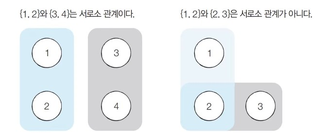
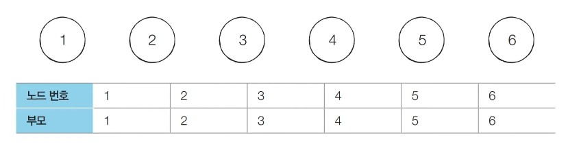
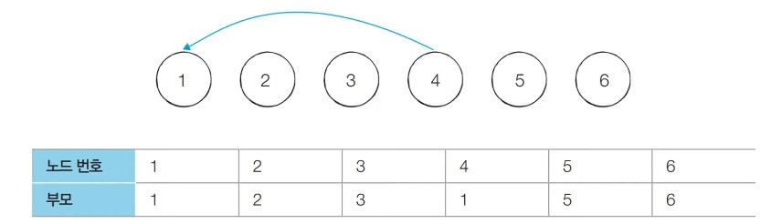
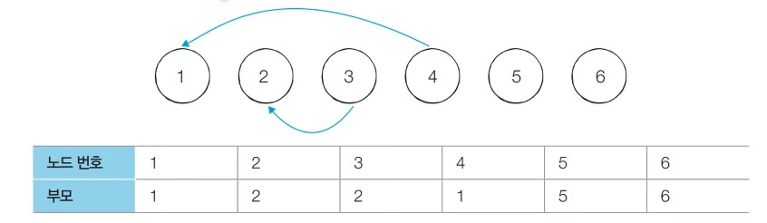
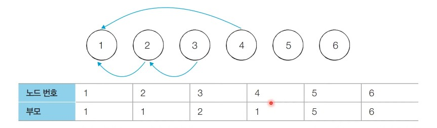
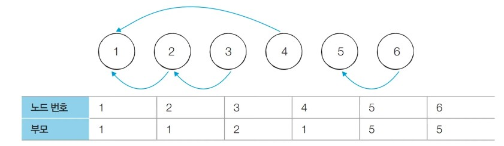
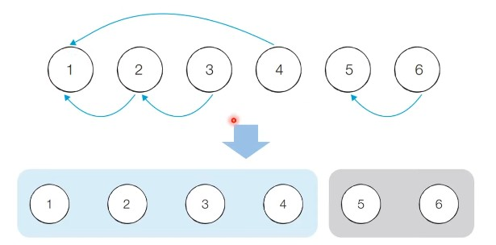
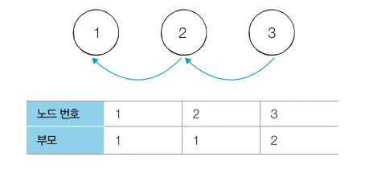
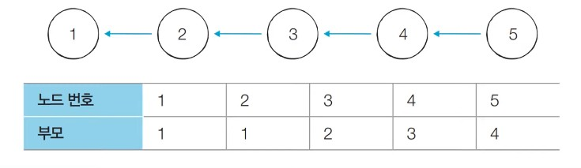
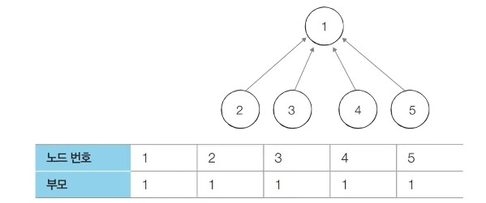

# 33강: 서로소 집합 자료구조

### 서로소 집합(Disjoint Sets)

- <u>공통 원소가 없는 두 집합</u>을 의미



### 서로소  집합 자료구조

- <u>서로소 부분 집합들로 나누어진 원소들의 데이터를 처리하기 위한 자료구조</u>이다.
- 서로소 집합 자료구조는 두 종류의 연산을 지원한다.
  - **합집합(Union) ** : 두 개의 원소가 포함된 집힙을 하나의 집합으로 합치는 연산이다.
  - **찾기(Find)** : 특정한 원소가 속한 집합이 어떤 집합인지 알려주는 연산
- 서로조 집합 자료구조는 **합치기 찾기(Union) 자료구조**하고 불리기도 한다.

- 여러 개의 합치기 연산이 주어졌을 떄 서로소 집합 자료구조의 동작 과정은 다음과 같다.

  1.합집합(Union)연산을 확인하여, 서로 연견될 두 노드 A, B를 확인한다.

  ​	1) A와 B의 루트 노드 A', B'를 각각 찾는다.

  ​	2) A'를 B'를의 부모 노드로 설정한다.

  2. 모든 합칩합(Union) 연산을 처리할 때까지 1번의 과정을 반복한다.

### 서로소 집합 자료구조 : 동작 과정 살펴보기

- **처리할 연산들** : Union(1, 4), Union(2, 3), Union(2, 4), Union(5, 6)
- **[초기 단계]** 노드의 개수 크기의 부모 테이블을 초기화한다.



- **처리할 연산들 : Union(1, 4)**, Union(2, 3), Union(2, 4), Union(5, 6)
- **[Step 1]** 노드 1과 노드 4의 루트 노드를 각각 찾는다. 현재 루트 노드는 각각 1과 4이므로 더 큰 번호에 해당하는 루트 노드 4의 부모를 1로 설정한다.



- **처리할 연산들 : Union(1, 4), Union(2, 3)**, Union(2, 4), Union(5, 6)
- **[Step 2]** 노드 2와 노드 3의 루트 노드를 각각 찾는다. 현재 루트 노드는 각각 2와 3이므로 더 큰 번호에 해당하는 루트 노드 3의 부모를 2로 설정한다.



- **처리할 연산들 : Union(1, 4), Union(2, 3), Union(2, 4)**, Union(5, 6)
- **[Step 3]** 노드 2와 노드 4의 루트 노드를 각각 찾는다. 현재 루트 노드는 각각 2와 1이므로 더 큰 번호에 해당하는 루트 노드 2의 부모를 1로 설정한다.



- **처리할 연산들 : Union(1, 4), Union(2, 3), Union(2, 4), Union(5, 6)**
- **[Step 3]** 노드 5와 노드 6의 루트 노드를 각각 찾는다. 현재 루트 노드는 각각 5와 6이므로 더 큰 번호에 해당하는 루트 노드 6의 부모를 5로 설정한다.



### 서로소 집합 자료구조 : 연결성

- 서로소 집합 자료구조에서는 **연결성**을 통해 손쉽게 집합의 형태를 확인할 수 있다.



- 기본적인 형태의 서로소 집합 자료구조에서는 루트 노드에 즉시 접근할 수 없다.
  - 루트 노드를 찾기 위해 <u>부모 테이블을 계속해서 확인</u>하며 거슬러 올라가야 한다.
- 다음 예시에서 노드 3의 루트를 찾기 위해서는 노드 2를 거쳐 노드 1에 접근해야 한다.



### 서로소 집합 자료구조 : 기본작인 구현 방법 (Python)

```python
# 특정 원소가 속한 집합을 찾기
def find_parent(parent, x):
    # 루트 노드가 아니라면, 루트 노드를 찾을 때까지 재귀적으로 호출
    if parent[x] != x:
        return find_parent(parent, parent[x])
    return x

# 두 원소가 속한 집합을 합치기
def union_parent(parent, a, b):
    a = find_parent(parent, a)
    b = find_parent(parent, b)
    if a < b:
        parent[b] = a
    else:
        parent[a] = b

# 노드의 개수와 간선(Union 연산)의 개수 입력 받기
v, e = map(int, input().split())
parent = [0] * (v + 1) # 부모 테이블 초기화하기

# 부모 테이블상에서, 부모를 자기 자신으로 초기화
for i in range(1, v + 1):
    parent[i] = i

# Union 연산을 각각 수행
for i in range(e):
    a, b = map(int, input().split())
    union_parent(parent, a, b)

# 각 원소가 속한 집합 출력하기
print('각 원소가 속한 집합: ', end='')
for i in range(1, v + 1):
    print(find_parent(parent, i), end=' ')

print()

# 부모 테이블 내용 출력하기
print('부모 테이블: ', end='')
for i in range(1, v + 1):
    print(parent[i], end=' ')
```

### 서로소 집합 자료구조 : 기본작인 구현 방법 (C++)

```c++
#include <bits/stdc++.h>

using namespace std;

// 노드의 개수(V)와 간선(Union 연산)의 개수(E)
// 노드의 개수는 최대 100,000개라고 가정
int v, e;
int parent[100001]; // 부모 테이블 초기화하기

// 특정 원소가 속한 집합을 찾기
int findParent(int x) {
    // 루트 노드가 아니라면, 루트 노드를 찾을 때까지 재귀적으로 호출
    if (x == parent[x]) return x;
    return findParent(parent[x]);
}

// 두 원소가 속한 집합을 합치기
void unionParent(int a, int b) {
    a = findParent(a);
    b = findParent(b);
    if (a < b) parent[b] = a;
    else parent[a] = b;
}

int main(void) {
    cin >> v >> e;

    // 부모 테이블상에서, 부모를 자기 자신으로 초기화
    for (int i = 1; i <= v; i++) {
        parent[i] = i;
    }

    // Union 연산을 각각 수행
    for (int i = 0; i < e; i++) {
        int a, b;
        cin >> a >> b;
        unionParent(a, b);
    }

    // 각 원소가 속한 집합 출력하기
    cout << "각 원소가 속한 집합: ";
    for (int i = 1; i <= v; i++) {
        cout << findParent(i) << ' ';
    }
    cout << '\n';

    // 부모 테이블 내용 출력하기
    cout << "부모 테이블: ";
    for (int i = 1; i <= v; i++) {
        cout << parent[i] << ' ';
    }
    cout << '\n';
}
```

### 서로소 집합 자료구조 : 기본작인 구현 방법 (Java)

```java
import java.util.*;

public class Main {

    // 노드의 개수(V)와 간선(Union 연산)의 개수(E)
    // 노드의 개수는 최대 100,000개라고 가정
    public static int v, e;
    public static int[] parent = new int[100001]; // 부모 테이블 초기화하기

    // 특정 원소가 속한 집합을 찾기
    public static int findParent(int x) {
        // 루트 노드가 아니라면, 루트 노드를 찾을 때까지 재귀적으로 호출
        if (x == parent[x]) return x;
        return findParent(parent[x]);
    }

    // 두 원소가 속한 집합을 합치기
    public static void unionParent(int a, int b) {
        a = findParent(a);
        b = findParent(b);
        if (a < b) parent[b] = a;
        else parent[a] = b;
    }

    public static void main(String[] args) {
        Scanner sc = new Scanner(System.in);

        v = sc.nextInt();
        e = sc.nextInt();

        // 부모 테이블상에서, 부모를 자기 자신으로 초기화
        for (int i = 1; i <= v; i++) {
            parent[i] = i;
        }

        // Union 연산을 각각 수행
        for (int i = 0; i < e; i++) {
            int a = sc.nextInt();
            int b = sc.nextInt();
            unionParent(a, b);
        }

        // 각 원소가 속한 집합 출력하기
        System.out.print("각 원소가 속한 집합: ");
        for (int i = 1; i <= v; i++) {
            System.out.print(findParent(i) + " ");
        }
        System.out.println();

        // 부모 테이블 내용 출력하기
        System.out.print("부모 테이블: ");
        for (int i = 1; i <= v; i++) {
            System.out.print(parent[i] + " ");
        }
        System.out.println();
    }
}
```

### 서로소 집합 자료구조 : 기본적인 구현 방법의 문제점

- 합집합(Union) 연산이 편향되게 이루어지는 경우 찾기(Find) 함수가 비효율적으로 동작한다.
- 최악의 경우에는 찾기(Find)함수가 모든 노드를 다 확인하게 되어 시간 복잡도가 O(V)이다.
  - 다음과 같이 {1, 2, 3, 4, 5}의 총 5개의 원소가 존재하는 상황을 확인해보자.
  - **수행된 연산들** : Union(4, 5), Union(3, 4), Union(2, 3), Union(1, 2)



### 서로소 집합 자료구조 : 경로 압축

- 찾기(Find)함수를 최적화하기 위한 방법으로 압축(Payh Compression)을 이용할 수 있다.
  - 찾기(Find)함수를 재귀적으로 호출한 뒤에 <u>부모 테이블 값을 바로 갱신</u>한다.

```python
# 특정 원소가 속한 집합을 찾기
def find_parent(parent, x):
    # 루트 노드가 아니라면, 루트 노드를 찾을 때까지 재귀적으로 호출
    if parent[x] != x:
        return find_parent(parent, parent[x])
    return  parent[x]
```

- 경로 압축 기법을 적용하면 각 노드에 대하여 <u>찾기(Find) 함수를 호출한 이후에</u> 해당 노드의 루트 노드가 바로 부모 노드가 된다.
- 동일한 예시에 대해서 **모든 합칩합(Union) 함수를 처리한 후 각 원소에 대하여 찾기(Find) 함수를 수행하면 다음과 같이 부모 테이블이 갱신** 된다.
- 기본적인 방법에 비하여 시간 복잡도가 개선된다.



### 서로소 집합 자료구조 : 경로 압축 (Python)

```python
# 특정 원소가 속한 집합을 찾기
def find_parent(parent, x):
    # 루트 노드가 아니라면, 루트 노드를 찾을 때까지 재귀적으로 호출
    if parent[x] != x:
        parent[x] = find_parent(parent, parent[x])
    return parent[x]

# 두 원소가 속한 집합을 합치기
def union_parent(parent, a, b):
    a = find_parent(parent, a)
    b = find_parent(parent, b)
    if a < b:
        parent[b] = a
    else:
        parent[a] = b

# 노드의 개수와 간선(Union 연산)의 개수 입력 받기
v, e = map(int, input().split())
parent = [0] * (v + 1) # 부모 테이블 초기화하기

# 부모 테이블상에서, 부모를 자기 자신으로 초기화
for i in range(1, v + 1):
    parent[i] = i

# Union 연산을 각각 수행
for i in range(e):
    a, b = map(int, input().split())
    union_parent(parent, a, b)

# 각 원소가 속한 집합 출력하기
print('각 원소가 속한 집합: ', end='')
for i in range(1, v + 1):
    print(find_parent(parent, i), end=' ')

print()

# 부모 테이블 내용 출력하기
print('부모 테이블: ', end='')
for i in range(1, v + 1):
    print(parent[i], end=' ')
```

### 서로소 집합 자료구조 : 경로 압축 (C++)

```c++
#include <bits/stdc++.h>

using namespace std;

// 노드의 개수(V)와 간선(Union 연산)의 개수(E)
// 노드의 개수는 최대 100,000개라고 가정
int v, e;
int parent[100001]; // 부모 테이블 초기화

// 특정 원소가 속한 집합을 찾기
int findParent(int x) {
    // 루트 노드가 아니라면, 루트 노드를 찾을 때까지 재귀적으로 호출
    if (x == parent[x]) return x;
    return parent[x] = findParent(parent[x]);
}

// 두 원소가 속한 집합을 합치기
void unionParent(int a, int b) {
    a = findParent(a);
    b = findParent(b);
    if (a < b) parent[b] = a;
    else parent[a] = b;
}

int main(void) {
    cin >> v >> e;

    // 부모 테이블상에서, 부모를 자기 자신으로 초기화
    for (int i = 1; i <= v; i++) {
        parent[i] = i;
    }

    // Union 연산을 각각 수행
    for (int i = 0; i < e; i++) {
        int a, b;
        cin >> a >> b;
        unionParent(a, b);
    }

    // 각 원소가 속한 집합 출력하기
    cout << "각 원소가 속한 집합: ";
    for (int i = 1; i <= v; i++) {
        cout << findParent(i) << ' ';
    }
    cout << '\n';

    // 부모 테이블 내용 출력하기
    cout << "부모 테이블: ";
    for (int i = 1; i <= v; i++) {
        cout << parent[i] << ' ';
    }
    cout << '\n';
}
```

### 서로소 집합 자료구조 : 경로 압축 (Java)

```java
import java.util.*;

public class Main {

    // 노드의 개수(V)와 간선(Union 연산)의 개수(E)
    // 노드의 개수는 최대 100,000개라고 가정
    public static int v, e;
    public static int[] parent = new int[100001]; // 부모 테이블 초기화하기

    // 특정 원소가 속한 집합을 찾기
    public static int findParent(int x) {
        // 루트 노드가 아니라면, 루트 노드를 찾을 때까지 재귀적으로 호출
        if (x == parent[x]) return x;
        return parent[x] = findParent(parent[x]);
    }

    // 두 원소가 속한 집합을 합치기
    public static void unionParent(int a, int b) {
        a = findParent(a);
        b = findParent(b);
        if (a < b) parent[b] = a;
        else parent[a] = b;
    }

    public static void main(String[] args) {
        Scanner sc = new Scanner(System.in);

        v = sc.nextInt();
        e = sc.nextInt();

        // 부모 테이블상에서, 부모를 자기 자신으로 초기화
        for (int i = 1; i <= v; i++) {
            parent[i] = i;
        }

        // Union 연산을 각각 수행
        for (int i = 0; i < e; i++) {
            int a = sc.nextInt();
            int b = sc.nextInt();
            unionParent(a, b);
        }

        // 각 원소가 속한 집합 출력하기
        System.out.print("각 원소가 속한 집합: ");
        for (int i = 1; i <= v; i++) {
            System.out.print(findParent(i) + " ");
        }
        System.out.println();

        // 부모 테이블 내용 출력하기
        System.out.print("부모 테이블: ");
        for (int i = 1; i <= v; i++) {
            System.out.print(parent[i] + " ");
        }
        System.out.println();
    }
}
```

