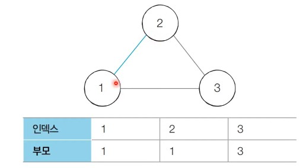
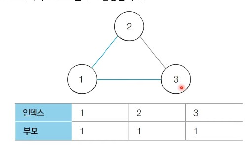
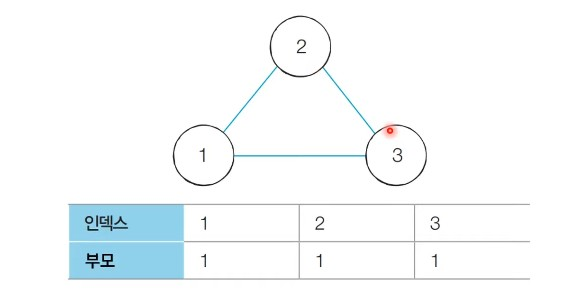

# 34강: 서로소 집합을 활용한 사이클 판별

- 서로소 집합은 **무방향 그래프 내애서의 사이클을 판별**할 때 사용할 수 있다.
  - 방향 그래프에서의 사이클 여부는 DFS를 이용하여 판별할 수 있다.
- **사이클 판별 알고리즘**은 다음과 같다.
  1. 각 간선을 하나씩 확인하며 두 노드의 루트 노드를 확인한다.
     1. 루트 노드가 서로 다르다면 두 노드에 대하여 합집합(Union) 연산을 수행한다.
     2. 루트 노드가 서로 같다면 사이클(Cycle)이 발생한 것이다.
  2. 그래프에 포함되어 있는 모든 간선에 대하여 1번 과정을 반복한다.

### 서로소 집합을 활용한 사이클 판별 : 동작 과정 살펴보기

- **[초기 단계]** : 모든 노드에 대하여 자기 자신을 부모로 설정하는 형태로 부모 테이블을 초기화한다.


- **[Step 1]** : 간선 (1, 2)를 확인한다. 노드 1과 노드 2의 루트 노드는 각각 1과 2이다. 따라서 더 큰 번호에 해당하는 노드 2의 부모 노드를 1로 변경한다.



- **[Step 2]** : 간선 (1, 3)을 확인한다. 노드 1과 노드 3의 루트 노드는 각각 1과 3이다. 따라서 더 큰 번호에 해당하는 노드 2의 부모 노드를 1로 변경한다.



- **[Step 3]** : 간선 (2, 3)를 확인한다. 이미 노드 2와 노드 3의 루트 노드는 모두 1이다. 다시 말해 **사이클이 발생**한다는 것을 알 수 있다.



### 서로소 집합을 활용한 사이클 판별 (Python)

```python
# 특정 원소가 속한 집합을 찾기
def find_parent(parent, x):
    # 루트 노드가 아니라면, 루트 노드를 찾을 때까지 재귀적으로 호출
    if parent[x] != x:
        parent[x] = find_parent(parent, parent[x])
    return parent[x]

# 두 원소가 속한 집합을 합치기
def union_parent(parent, a, b):
    a = find_parent(parent, a)
    b = find_parent(parent, b)
    if a < b:
        parent[b] = a
    else:
        parent[a] = b

# 노드의 개수와 간선(Union 연산)의 개수 입력 받기
v, e = map(int, input().split())
parent = [0] * (v + 1) # 부모 테이블 초기화하기

# 부모 테이블상에서, 부모를 자기 자신으로 초기화
for i in range(1, v + 1):
    parent[i] = i

cycle = False # 사이클 발생 여부

for i in range(e):
    a, b = map(int, input().split())
    # 사이클이 발생한 경우 종료
    if find_parent(parent, a) == find_parent(parent, b):
        cycle = True
        break
    # 사이클이 발생하지 않았다면 합집합(Union) 연산 수행
    else:
        union_parent(parent, a, b)

if cycle:
    print("사이클이 발생했습니다.")
else:
    print("사이클이 발생하지 않았습니다.")
```

### 서로소 집합을 활용한 사이클 판별 (C++)

```c++
#include <bits/stdc++.h>

using namespace std;

// 노드의 개수(V)와 간선(Union 연산)의 개수(E)
// 노드의 개수는 최대 100,000개라고 가정
int v, e;
int parent[100001]; // 부모 테이블 초기화

// 특정 원소가 속한 집합을 찾기
int findParent(int x) {
    // 루트 노드가 아니라면, 루트 노드를 찾을 때까지 재귀적으로 호출
    if (x == parent[x]) return x;
    return parent[x] = findParent(parent[x]);
}

// 두 원소가 속한 집합을 합치기
void unionParent(int a, int b) {
    a = findParent(a);
    b = findParent(b);
    if (a < b) parent[b] = a;
    else parent[a] = b;
}

int main(void) {
    cin >> v >> e;

    // 부모 테이블상에서, 부모를 자기 자신으로 초기화
    for (int i = 1; i <= v; i++) {
        parent[i] = i;
    }

    bool cycle = false; // 사이클 발생 여부

    for (int i = 0; i < e; i++) {
        int a, b;
        cin >> a >> b;
        // 사이클이 발생한 경우 종료
        if (findParent(a) == findParent(b)) {
            cycle = true;
            break;
        }
        // 사이클이 발생하지 않았다면 합집합(Union) 연산 수행
        else {
            unionParent(a, b);
        }
    }

    if (cycle) {
        cout << "사이클이 발생했습니다." << '\n';
    }
    else {
        cout << "사이클이 발생하지 않았습니다." << '\n';
    }
}
```

### 서로소 집합을 활용한 사이클 판별 (Java)

```java
import java.util.*;

public class Main {

    // 노드의 개수(V)와 간선(Union 연산)의 개수(E)
    // 노드의 개수는 최대 100,000개라고 가정
    public static int v, e;
    public static int[] parent = new int[100001]; // 부모 테이블 초기화하기

    // 특정 원소가 속한 집합을 찾기
    public static int findParent(int x) {
        // 루트 노드가 아니라면, 루트 노드를 찾을 때까지 재귀적으로 호출
        if (x == parent[x]) return x;
        return parent[x] = findParent(parent[x]);
    }

    // 두 원소가 속한 집합을 합치기
    public static void unionParent(int a, int b) {
        a = findParent(a);
        b = findParent(b);
        if (a < b) parent[b] = a;
        else parent[a] = b;
    }

    public static void main(String[] args) {
        Scanner sc = new Scanner(System.in);

        v = sc.nextInt();
        e = sc.nextInt();

        // 부모 테이블상에서, 부모를 자기 자신으로 초기화
        for (int i = 1; i <= v; i++) {
            parent[i] = i;
        }

        boolean cycle = false; // 사이클 발생 여부

        for (int i = 0; i < e; i++) {
            int a = sc.nextInt();
            int b = sc.nextInt();
            // 사이클이 발생한 경우 종료
            if (findParent(a) == findParent(b)) {
                cycle = true;
                break;
            }
            // 사이클이 발생하지 않았다면 합집합(Union) 연산 수행
            else {
                unionParent(a, b);
            }
        }

        if (cycle) {
            System.out.println("사이클이 발생했습니다.");
        }
        else {
            System.out.println("사이클이 발생하지 않았습니다.");
        }
    }
}
```

