# 35강: 크루스칼 알고리즘  + 백준문제 (상근이의 여행, 최소 스패닝 트리)

### 신장 트리

- <u>그래프에서 모든 노드를 포함하면서 사이클이 존재하지 않는 부분 그래프</u>
  - 모든 노드가 포함되어 서로 연결되면서 사이클이 존재하지 않는다는 조건은 **트리**의 조건이기도 하다.

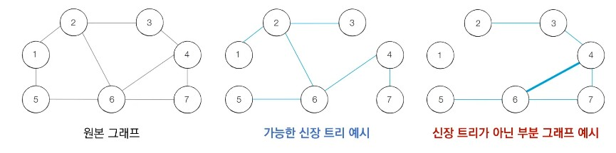

### 최소 신장 트리

- <u>최소한의 비용으로 구성되는 신장 트리를 찾아야 할 때</u> 어떻게 해야 할까?
- 예를 들어 N개의 도시가 존재하는 상황에서 두 도시 사이에 도로를 놓아 **전체 도시가 서로 연결**될 수 있게 도로를 설치하는 경우를 생각해 보자.
  - 두 도시 A,B를 선택했을 때 A에서 B로 이동하는 경로가 반드시 존재하도록 도로를 설치한다.

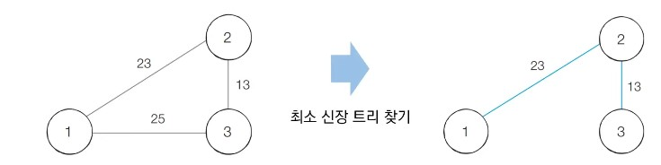

### 크루스칼 알고리즘

- 대표적인 **최소 신장 트리 알고리즘**이다.
- 그리디 알고리즘으로 분류된다.
- 구체적인 동작 과정은 다음과 같다.
  1. 간선 데이터를 비용에 따라 **오름차순으로 정렬**한다.
  2. 간선을 하니씩 확인하며 <u>현재의 간선이 사이클을 발생시키는지 확인</u>한다.
     1. 사이클이 발생하지 않는 경우 최소 신장 트리에 포함시킨다.
     2. 사이클이 발생하는 경우 최소 신장 트리에 포함시키지 않는다.
  3. 모든 간선에 대하여 2번의 과정을 반복한다.

### 크루스칼 알고리즘 : 동작 과정 살펴보기

- **[초기 단계]** 그래프의 모든 간선 정보에 대하여 **오름차순 정렬을 수행**한다.
  - 간선의 개수는 전체 노드의 -1개

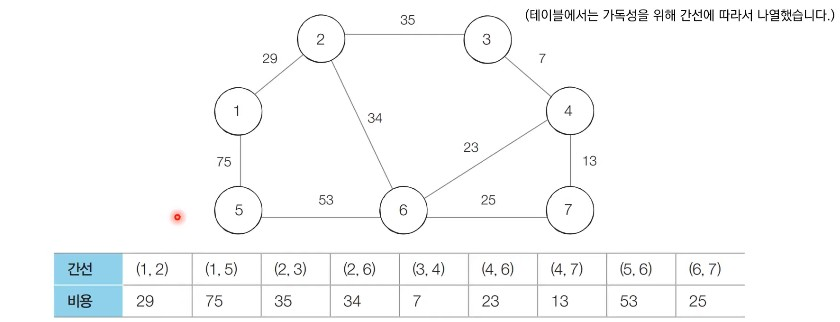

- **[Step 1]** 아직 처리하지 않은 간선 중에서 가장 짧은 간선인 (3, 4)를 선택하여 처리한다.

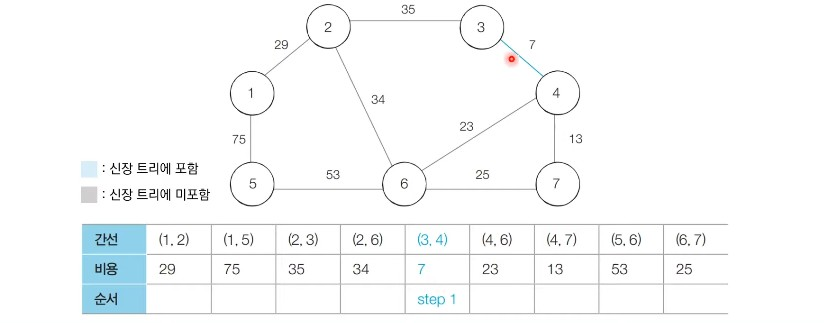

- **[Step 2]** 아직 처리하지 않은 간선 중에서 가장 짧은 간선인 (4, 7)을 선택하여 처리한다.

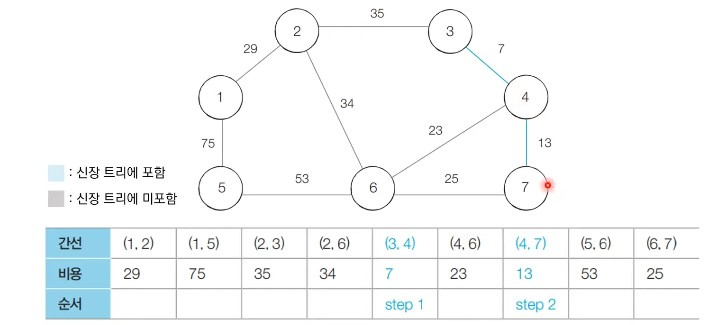

- **[Step 3]** 아직 처리하지 않은 간선 중에서 가장 짧은 간선인 (4, 6)을 선택하여 처리한다.

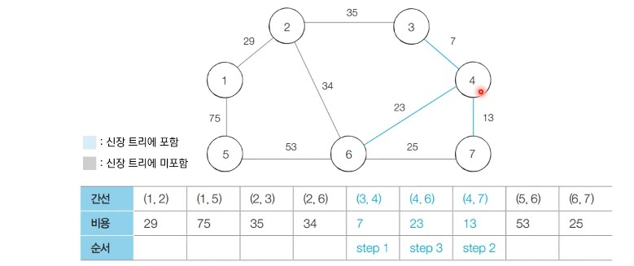

- **[Step 4]** 아직 처리하지 않은 간선 중에서 가장 짧은 간선인 (6, 7)을 선택하여 처리한다.
  - 사이클이 발생하므로 넘어간다.

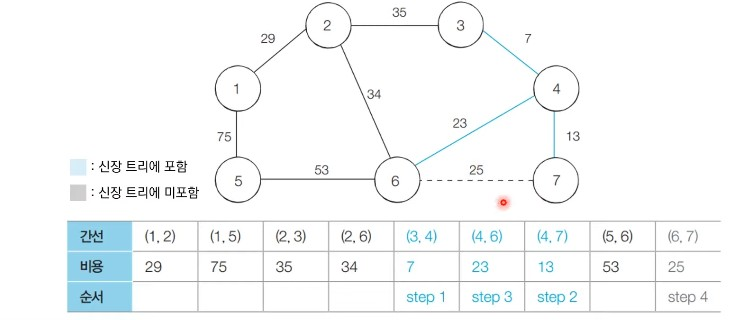

- **[Step 5]** 아직 처리하지 않은 간선 중에서 가장 짧은 간선인 (1, 2)를 선택하여 처리한다.

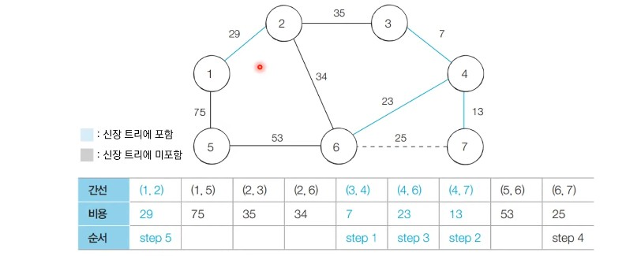

- **[Step 6]** 아직 처리하지 않은 간선 중에서 가장 짧은 간선인 (2, 6)를 선택하여 처리한다.

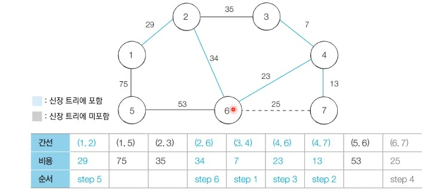

- **[Step 7]** 아직 처리하지 않은 간선 중에서 가장 짧은 간선인 (2, 3)을 선택하여 처리한다.
  - 이미 포함되어 있어서 사이클 발생하므로 건너뛴다.

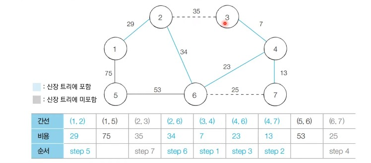

- **[Step 8]** 아직 처리하지 않은 간선 중에서 가장 짧은 간선인 (5, 6)을 선택하여 처리한다.

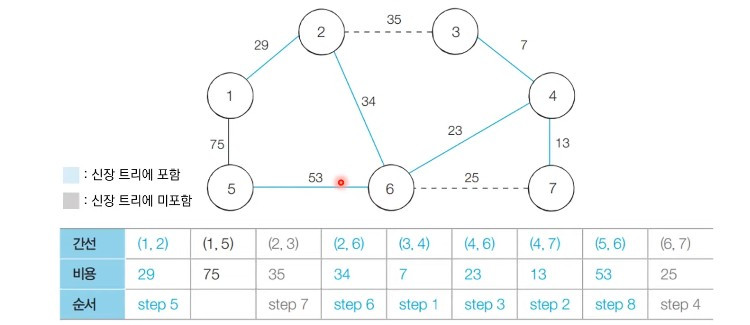

- **[Step 9]** 아직 처리하지 않은 간선 중에서 가장 짧은 간선인 (1, 5)를 선택하여 처리한다.
  - 이미 포함되어 있어서 사이클 발생하므로 건너뛴다.

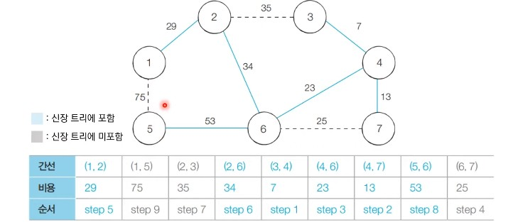

- **[알고리즘 수행 결과]**
  - 최소 신장 트리에 포함되어 있는 간선의 비용만 모두 더하면, 그 값이 최종 비용에 해당한다.

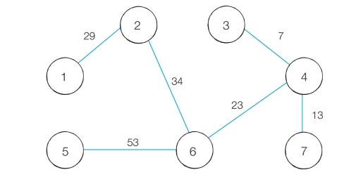

### 크루스칼 알고리즘 (Python)

```python
# 특정 원소가 속한 집합을 찾기
def find_parent(parent, x):
    # 루트 노드가 아니라면, 루트 노드를 찾을 때까지 재귀적으로 호출
    if parent[x] != x:
        parent[x] = find_parent(parent, parent[x])
    return parent[x]

# 두 원소가 속한 집합을 합치기
def union_parent(parent, a, b):
    a = find_parent(parent, a)
    b = find_parent(parent, b)
    if a < b:
        parent[b] = a
    else:
        parent[a] = b

# 노드의 개수와 간선(Union 연산)의 개수 입력 받기
v, e = map(int, input().split())
parent = [0] * (v + 1) # 부모 테이블 초기화하기

# 모든 간선을 담을 리스트와, 최종 비용을 담을 변수
edges = []
result = 0

# 부모 테이블상에서, 부모를 자기 자신으로 초기화
for i in range(1, v + 1):
    parent[i] = i

# 모든 간선에 대한 정보를 입력 받기
for _ in range(e):
    a, b, cost = map(int, input().split())
    # 비용순으로 정렬하기 위해서 튜플의 첫 번째 원소를 비용으로 설정
    edges.append((cost, a, b))

# 간선을 비용순으로 정렬
edges.sort()

# 간선을 하나씩 확인하며
for edge in edges:
    cost, a, b = edge
    # 사이클이 발생하지 않는 경우에만 집합에 포함
    if find_parent(parent, a) != find_parent(parent, b):
        union_parent(parent, a, b)
        result += cost

print(result)
```

### 크루스칼 알고리즘 (C++)

```c++
#include <bits/stdc++.h>

using namespace std;

// 노드의 개수(V)와 간선(Union 연산)의 개수(E)
// 노드의 개수는 최대 100,000개라고 가정
int v, e;
int parent[100001]; // 부모 테이블 초기화
// 모든 간선을 담을 리스트와, 최종 비용을 담을 변수
vector<pair<int, pair<int, int> > > edges;
int result = 0;

// 특정 원소가 속한 집합을 찾기
int findParent(int x) {
    // 루트 노드가 아니라면, 루트 노드를 찾을 때까지 재귀적으로 호출
    if (x == parent[x]) return x;
    return parent[x] = findParent(parent[x]);
}

// 두 원소가 속한 집합을 합치기
void unionParent(int a, int b) {
    a = findParent(a);
    b = findParent(b);
    if (a < b) parent[b] = a;
    else parent[a] = b;
}

int main(void) {
    cin >> v >> e;

    // 부모 테이블상에서, 부모를 자기 자신으로 초기화
    for (int i = 1; i <= v; i++) {
        parent[i] = i;
    }

    // 모든 간선에 대한 정보를 입력 받기
    for (int i = 0; i < e; i++) {
        int a, b, cost;
        cin >> a >> b >> cost;
        // 비용순으로 정렬하기 위해서 튜플의 첫 번째 원소를 비용으로 설정
        edges.push_back({cost, {a, b}});
    }

    // 간선을 비용순으로 정렬
    sort(edges.begin(), edges.end());

    // 간선을 하나씩 확인하며
    for (int i = 0; i < edges.size(); i++) {
        int cost = edges[i].first;
        int a = edges[i].second.first;
        int b = edges[i].second.second;
        // 사이클이 발생하지 않는 경우에만 집합에 포함
        if (findParent(a) != findParent(b)) {
            unionParent(a, b);
            result += cost;
        }
    }

    cout << result << '\n';
}
```

### 크루스칼 알고리즘 (Java)

```java
import java.util.*;

class Edge implements Comparable<Edge> {

    private int distance;
    private int nodeA;
    private int nodeB;

    public Edge(int distance, int nodeA, int nodeB) {
        this.distance = distance;
        this.nodeA = nodeA;
        this.nodeB = nodeB;
    }

    public int getDistance() {
        return this.distance;
    }

    public int getNodeA() {
        return this.nodeA;
    }

    public int getNodeB() {
        return this.nodeB;
    }

    // 거리(비용)가 짧은 것이 높은 우선순위를 가지도록 설정
    @Override
    public int compareTo(Edge other) {
        if (this.distance < other.distance) {
            return -1;
        }
        return 1;
    }
}

public class Main {

    // 노드의 개수(V)와 간선(Union 연산)의 개수(E)
    // 노드의 개수는 최대 100,000개라고 가정
    public static int v, e;
    public static int[] parent = new int[100001]; // 부모 테이블 초기화하기
    // 모든 간선을 담을 리스트와, 최종 비용을 담을 변수
    public static ArrayList<Edge> edges = new ArrayList<>();
    public static int result = 0;

    // 특정 원소가 속한 집합을 찾기
    public static int findParent(int x) {
        // 루트 노드가 아니라면, 루트 노드를 찾을 때까지 재귀적으로 호출
        if (x == parent[x]) return x;
        return parent[x] = findParent(parent[x]);
    }

    // 두 원소가 속한 집합을 합치기
    public static void unionParent(int a, int b) {
        a = findParent(a);
        b = findParent(b);
        if (a < b) parent[b] = a;
        else parent[a] = b;
    }

    public static void main(String[] args) {
        Scanner sc = new Scanner(System.in);

        v = sc.nextInt();
        e = sc.nextInt();

        // 부모 테이블상에서, 부모를 자기 자신으로 초기화
        for (int i = 1; i <= v; i++) {
            parent[i] = i;
        }

        // 모든 간선에 대한 정보를 입력 받기
        for (int i = 0; i < e; i++) {
            int a = sc.nextInt();
            int b = sc.nextInt();
            int cost = sc.nextInt();
            edges.add(new Edge(cost, a, b));
        }

        // 간선을 비용순으로 정렬
        Collections.sort(edges);

        // 간선을 하나씩 확인하며
        for (int i = 0; i < edges.size(); i++) {
            int cost = edges.get(i).getDistance();
            int a = edges.get(i).getNodeA();
            int b = edges.get(i).getNodeB();
            // 사이클이 발생하지 않는 경우에만 집합에 포함
            if (findParent(a) != findParent(b)) {
                unionParent(a, b);
                result += cost;
            }
        }

        System.out.println(result);
    }
}
```

### 크루스칼 알고리즘 성능 분석

- 크루스칼 알고리즘은 간선의 개수가 E개일 때, **O(ElogE)**의 시간 복잡도를 가진다.
- 크루스칼 알고리즘에서 가장 많은 시간을 요구하는 곳은 간선의 정렬을 수행하는 부분이다.
  - 표준 라이브러리를 이용해 E개의 데이터를 정렬하기 위한 시간 복잡도는 O(ElogE)이다.

### <문제> 상근이의 여행

```python

def find_parent(parent, x):
    if parent[x]  != x:
        parent[x] = find_parent(parent, parent[x])
    return parent[x]

def union_parent(parent, a, b):
    a = find_parent(parent, a)
    b = find_parent(parent, b)
    if a < b:
        parent[b] = a
    else:
        parent[a] = b
        
t = int(input())  
while t:
    n,m = map(int, input().split())
    parent = [0] * (n + 1)

    edges = []
    result = 0

    for i in range(1, n+1):
        parent[i] = i


    for _ in range(m):
        a,b = map(int, input().split())
        edges.append((1,a,b))

    for edgs in edges:
        cost , a, b = edgs
        if find_parent(parent,a) != find_parent(parent, b):
            union_parent(parent, a,b)
            result += cost
    print(result)    
    t -= 1
```

### <문제> 최소 스패닝 트리

```python
def find_parent(parent, x):
    if parent[x]  != x:
        parent[x] = find_parent(parent, parent[x])
    return parent[x]

def union_parent(parent, a, b):
    a = find_parent(parent, a)
    b = find_parent(parent, b)
    if a < b:
        parent[b] = a
    else:
        parent[a] = b

v,e= map(int, input().split())
parent = [0] * (v + 1)

edges = []
result = 0

for i in range(1, v+1):
    parent[i] = i


for _ in range(e):
    a,b,c = map(int, input().split())
    edges.append((c,a,b))

edges.sort(key=lambda x:x[0])
v_count = 0
for edgs in edges:
    c , a, b = edgs
    if find_parent(parent,a) != find_parent(parent, b):
        union_parent(parent, a,b)
        result += c
        v_count+=1
    if v_count==v-1:
        break
print(result)
```

