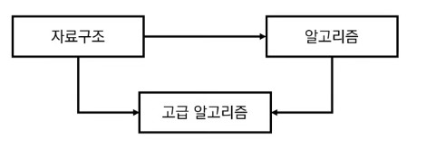
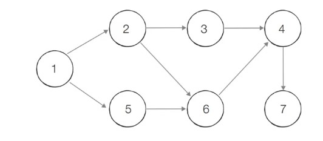
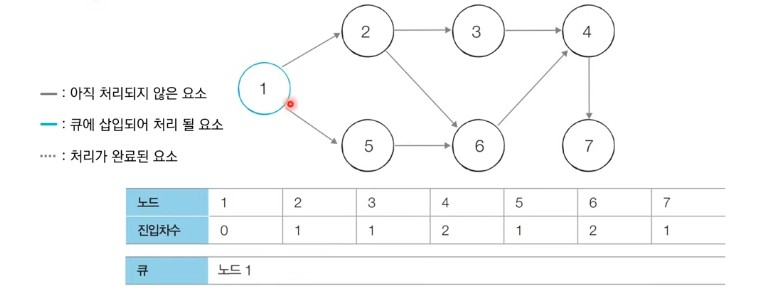
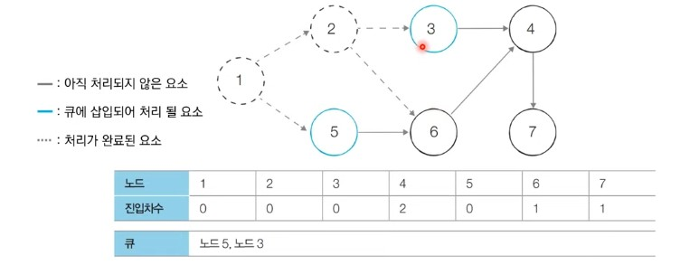
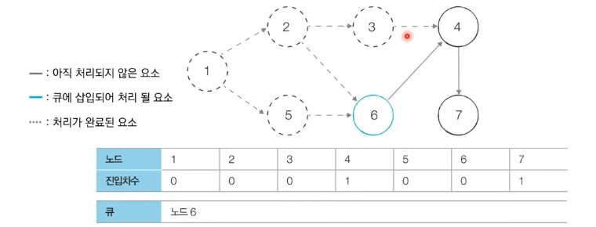
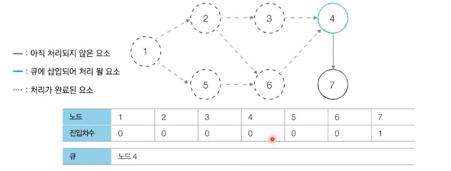
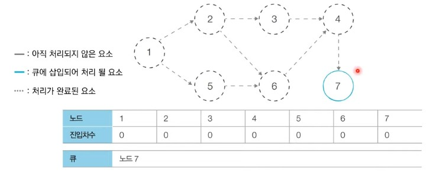
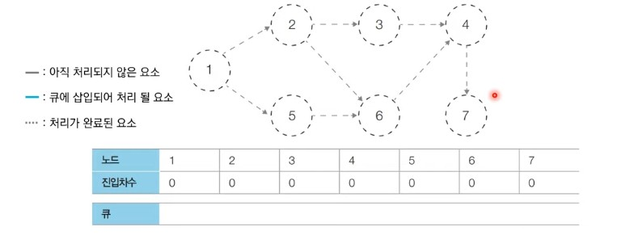

# 36강: 위상 정렬 + 백준문제(줄세우기, 최종순위)

- **사이클이 없는 방향 그래프**의 모든 노드를 **방향성에 거스르지 않도록 순서대로 나열**하는 것을 의미
- 예시) 선수 과목을 고려한 학습 순서 설정



- 위 세 과목을 모두 듣기 위한 **적절한 학습 순서**는?
  - 자료구조 -> 알고리즘 -> 고급 알고리즘 (O)
  - 자료구조 -> 고급 알고리즘 -> 알고리즘 (X)

### 진입차수와 진출차수

- **진입차수(Indegree)** : 특정한 노드로 들어오는 간선의 개수
- **진출차수(Outdegree)** : 특정한 노드에서 나가는 간선의 개수


### 위상 정렬 알고리즘

- **큐**를 이용하는  **위상 정렬 알고리즘의 동작 과정**

     1.진입 차수가 0인 모든 노드를 큐에 넣는다.

  2. 큐가 빌 때까지 다음의 과정을 반복한다.
     1. 큐에서 원소를 꺼내 해당 노드에서 나가는 간선을 그래프에서 제거한다.
     2. 새롭게 진입차수가 0인 된 노드에 큐를 넣는다.

- 결과적으로 **각 노드가 큐에 들어온 순서가 위상 정렬을 수행한 결과**와 같다.

### 위상 정렬 동작 예시

- 위상 정렬을 수행할 그래프를 준비한다.
  - 이때 그래프는 **사이클이 없는 방향 그래프 (DAG)**여야 한다.



- **[초기 단계]** 초기 단계에서는 **진입차수가 0인 모든 노드**를 큐에 넣는다.
  - 처음에 **노드 1**이 큐에 삽입된다.



- **[Step 1]** 큐에서 **노드 1**을 꺼낸 뒤에 **노드 1**에서 나가는 간선을 제거한다.
  - 새롭게 **진입차수가 0이 된 노드**들을 큐에 삽입한다.


- **[Step 2]** 큐에서 **노드 2**를 꺼낸 뒤에 **노드 2**에서 나가는 간선을 제거한다.
  - 새롭게 **진입차수가 0이 된 노드**들을 큐에 삽입한다.



- **[Step 3]** 큐에서 **노드 5**를 꺼낸 뒤에 **노드 5**에서 나가는 간선을 제거한다.
  - 새롭게 **진입차수가 0이 된 노드**들을 큐에 삽입한다.


- **[Step 4]** 큐에서 **노드 3**을 꺼낸 뒤에 **노드 3**에서 나가는 간선을 제거한다.
  - 새롭게 **진입차수가 0이 된 노드**가 없으므로 그냥 넘어간다.



- **[Step 5]** 큐에서 **노드 6**을 꺼낸 뒤에 **노드 6**에서 나가는 간선을 제거한다.
  - 새롭게 **진입차수가 0이 된 노드**들을 큐에 삽입한다.



- **[Step 6]** 큐에서 **노드 4**를 꺼낸 뒤에 **노드 4**에서 나가는 간선을 제거한다.
  - 새롭게 **진입차수가 0이 된 노드**들을 큐에 삽입한다.



- **[Step 7]** 큐에서 **노드 7**을 꺼낸 뒤에 **노드 7**에서 나가는 간선을 제거한다.
  - 새롭게 **진입차수가 0이 된 노드**가 없으므로 그냥 넘어간다.



### 위상 정렬 동작 예시

- **[위상 정렬 결과]**
  - 큐에 삽입된 전체 노드 순서 : **1 -> 2 -> 5 -> 3 -> 6 -> 4 -> 7**

### 위상 정렬의 특징

- 위상 정렬은 DAG에 대해서만 수행 가능
  - **DAG ( Direct Acyclic Graph)**: 순환하지 않는 방향 그래프
- 위상 정렬에서는 **여러 가지 답이 존재**할 수 있다.
  - 한 단계에서 큐에 새롭게 들어가는 원소가 2개 이상인 경우가 있다면 여러 가지 답이 존재
- **모든 원소를 방문하기 전에 큐가 빈다면 사이클이 존재**한다고 판단할 수 있다.
  - 사이클에 포함된 원소 중에서 어떠한 원소도 큐에 들어가지 못한다.
- 스택을 활용한 DFS를 이용해 위상 정렬을 수행할 수도 있다.

### 위상 정렬 알고리즘 (Python)

```python
from collections import deque

# 노드의 개수와 간선의 개수를 입력 받기
v, e = map(int, input().split())
# 모든 노드에 대한 진입차수는 0으로 초기화
indegree = [0] * (v + 1)
# 각 노드에 연결된 간선 정보를 담기 위한 연결 리스트 초기화
graph = [[] for i in range(v + 1)]

# 방향 그래프의 모든 간선 정보를 입력 받기
for _ in range(e):
    a, b = map(int, input().split())
    graph[a].append(b) # 정점 A에서 B로 이동 가능
    # 진입 차수를 1 증가
    indegree[b] += 1

# 위상 정렬 함수
def topology_sort():
    result = [] # 알고리즘 수행 결과를 담을 리스트
    q = deque() # 큐 기능을 위한 deque 라이브러리 사용

    # 처음 시작할 때는 진입차수가 0인 노드를 큐에 삽입
    for i in range(1, v + 1):
        if indegree[i] == 0:
            q.append(i)

    # 큐가 빌 때까지 반복
    while q:
        # 큐에서 원소 꺼내기
        now = q.popleft()
        result.append(now)
        # 해당 원소와 연결된 노드들의 진입차수에서 1 빼기
        for i in graph[now]:
            indegree[i] -= 1
            # 새롭게 진입차수가 0이 되는 노드를 큐에 삽입
            if indegree[i] == 0:
                q.append(i)

    # 위상 정렬을 수행한 결과 출력
    for i in result:
        print(i, end=' ')

topology_sort()
```

### 위상 정렬 알고리즘 (C++)

```c++
#include <bits/stdc++.h>

using namespace std;

// 노드의 개수(V)와 간선의 개수(E)
// 노드의 개수는 최대 100,000개라고 가정
int v, e;
// 모든 노드에 대한 진입차수는 0으로 초기화
int indegree[100001];
// 각 노드에 연결된 간선 정보를 담기 위한 연결 리스트 초기화
vector<int> graph[100001];

// 위상 정렬 함수
void topologySort() {
    vector<int> result; // 알고리즘 수행 결과를 담을 리스트
    queue<int> q; // 큐 라이브러리 사용

    // 처음 시작할 때는 진입차수가 0인 노드를 큐에 삽입
    for (int i = 1; i <= v; i++) {
        if (indegree[i] == 0) {
            q.push(i);
        }
    }

    // 큐가 빌 때까지 반복
    while (!q.empty()) {
        // 큐에서 원소 꺼내기
        int now = q.front();
        q.pop();
        result.push_back(now);
        // 해당 원소와 연결된 노드들의 진입차수에서 1 빼기
        for (int i = 0; i < graph[now].size(); i++) {
            indegree[graph[now][i]] -= 1;
            // 새롭게 진입차수가 0이 되는 노드를 큐에 삽입
            if (indegree[graph[now][i]] == 0) {
                q.push(graph[now][i]);
            }
        }
    }

    // 위상 정렬을 수행한 결과 출력
    for (int i = 0; i < result.size(); i++) {
        cout << result[i] << ' ';
    }
}

int main(void) {
    cin >> v >> e;

    // 방향 그래프의 모든 간선 정보를 입력 받기
    for (int i = 0; i < e; i++) {
        int a, b;
        cin >> a >> b;
        graph[a].push_back(b); // 정점 A에서 B로 이동 가능
        // 진입 차수를 1 증가
        indegree[b] += 1;
    }

    topologySort();
}
```

### 위상 정렬 알고리즘 (Java)

```java
import java.util.*;

public class Main {

    // 노드의 개수(V)와 간선의 개수(E)
    // 노드의 개수는 최대 100,000개라고 가정
    public static int v, e;
    // 모든 노드에 대한 진입차수는 0으로 초기화
    public static int[] indegree = new int[100001];
    // 각 노드에 연결된 간선 정보를 담기 위한 연결 리스트 초기화
    public static ArrayList<ArrayList<Integer>> graph = new ArrayList<ArrayList<Integer>>();

    // 위상 정렬 함수
    public static void topologySort() {
        ArrayList<Integer> result = new ArrayList<>(); // 알고리즘 수행 결과를 담을 리스트
        Queue<Integer> q = new LinkedList<>(); // 큐 라이브러리 사용

        // 처음 시작할 때는 진입차수가 0인 노드를 큐에 삽입
        for (int i = 1; i <= v; i++) {
            if (indegree[i] == 0) {
                q.offer(i);
            }
        }

        // 큐가 빌 때까지 반복
        while (!q.isEmpty()) {
            // 큐에서 원소 꺼내기
            int now = q.poll();
            result.add(now);
            // 해당 원소와 연결된 노드들의 진입차수에서 1 빼기
            for (int i = 0; i < graph.get(now).size(); i++) {
                indegree[graph.get(now).get(i)] -= 1;
                // 새롭게 진입차수가 0이 되는 노드를 큐에 삽입
                if (indegree[graph.get(now).get(i)] == 0) {
                    q.offer(graph.get(now).get(i));
                }
            }
        }

        // 위상 정렬을 수행한 결과 출력
        for (int i = 0; i < result.size(); i++) {
            System.out.print(result.get(i) + " ");
        }
    }

    public static void main(String[] args) {
        Scanner sc = new Scanner(System.in);

        v = sc.nextInt();
        e = sc.nextInt();

        // 그래프 초기화
        for (int i = 0; i <= v; i++) {
            graph.add(new ArrayList<Integer>());
        }

        // 방향 그래프의 모든 간선 정보를 입력 받기
        for (int i = 0; i < e; i++) {
            int a = sc.nextInt();
            int b = sc.nextInt();
            graph.get(a).add(b); // 정점 A에서 B로 이동 가능
            // 진입 차수를 1 증가
            indegree[b] += 1;
        }

        topologySort();
    }
}
```

### 위상 정렬 알고리즘 성능 분석

- 위상 정렬을 위해 차례대로 모든 노드를 확인하며 각 노드에서 나가는 간선을 차례대로 제거해야 한다.
  - 위상 정렬 알고리즘의 시간 복잡도는 **O(V + E)**이다.

### <문제> 줄세우기

```python
from collections import deque

n,m = map(int, input().split())

indegree = [0] * (n + 1)

graph = [[] for i in range(n + 1)]

for _ in range(m):
    a, b = map(int, input().split())
    graph[a].append(b)
    indegree[b] +=1
    
def topology_sort():
    result = []
    q = deque()
    
    for i in range(1, n +1):
        if indegree[i] == 0:
            q.append(i)
            
    while q:
        now = q.popleft()
        result.append(now)
        for i in graph[now]:
            indegree[i] -= 1
            if indegree[i] == 0:
                q.append(i)
                
                
    for i in result:
        print(i, end=' ')
        
topology_sort()
```

### <문제> 최종순위

```python
from collections import deque
import sys

input = sys.stdin.readline


def topology_sort():
    global isImpossible, isAmbiguous

    for _ in range(n):
        if not q:
            isImpossible = True
            return
        if len(q) > 1:
            isAmbiguous = True
            return

        target = q.popleft()
        sequence.append(target)

        for x in graph[target]:
            indegree[x] -= 1

            if not indegree[x]:
                q.append(x)


T = int(input())

for _ in range(T):
    n = int(input())

    isImpossible = False
    isAmbiguous = False
    sequence = []
    indegree = [0] * (n + 1)
    graph = [[] for _ in range(n + 1)]

    lastYear = list(map(int, input().split()))

    for i in range(0, n):
        for j in range(i + 1, n):
            indegree[lastYear[j]] += 1
            graph[lastYear[i]].append(lastYear[j])

    m = int(input())
    for _ in range(m):
        a, b = map(int, input().split())

        isNotFound = True

        for x in graph[a]:
            if x == b:
                isNotFound = False
                indegree[b] -= 1
                indegree[a] += 1
                graph[a].remove(b)
                graph[b].append(a)

        if isNotFound:
            indegree[a] -= 1
            indegree[b] += 1
            graph[b].remove(a)
            graph[a].append(b)

    q = deque()
    for i in range(1, n + 1):
        if not indegree[i]:
            q.append(i)

    topology_sort()

    if isImpossible:
        print("IMPOSSIBLE")
    elif isAmbiguous:
        print("?")
    else:
        print(*sequence)
```

