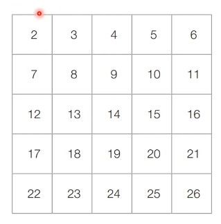
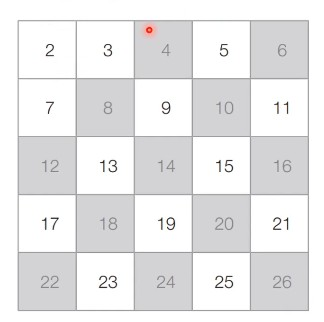
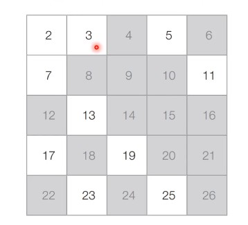
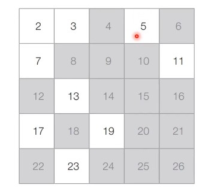
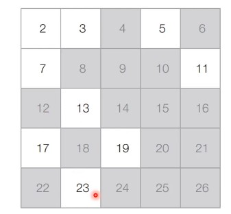

# 38강 : 에라토스테네스의 체

### 다수의 소수 판별

- 하지만 <u>특정한 수의 범위 안에 존재하는 모든 소수</u>를 찾아야 할 때는 어떻게 할까?
  - **에라토스테네스의 체 알고리즘**을 사용할 수 있다.

### 에라토스테네스의 체 알고리즘

- <u>다수의 자연수에 대하여 소수 여부를 판별</u>할 때 사용하는 대표적은 알고리즘이다.
- 에라토스테네스의 체는 N보다 작거나 같은 모든 소수를 찾을 때 사용할 수 있다.
- 에라테스테네스의 체 알고리즘의 **구체적인 동작 과정**은 다음과 같다.
  1. 2부터 N까지의 모든 자연수를 나열한다.
  2. 남은 수 중에서 아직 처리하지 않은 가장 작은 수 i를 찾는다.
  3. 남은 수 중에서 i의 배수를 모두 제거한다 (i는 제거하지 않는다.)
  4. 더 이상 반복할 수 없을 때까지 2번과 3번의 과정을 반복한다.

### 에라토스테네스의 체 알고리즘 동작 예시

- **[초기 단계]** 2부터 26까지의 모든 자연수를 나열한다. (N = 26)



- **[Step 1]** 아직 처리하지 않은 가장 작은 수 2를 제외한 2의 배수는 모두 제거한다.



- **[Step 2]** 아직 처리하지 않은 가장 작은 수 3을 제외한 3의 배수는 모두 제거한다.



- **[Step 3]** 아직 처리하지 않은 가장 작은 수 5를 제외한 5의 배수는 모두 제거한다.



- **[Step 4]** 마찬가지의 과정을 반복했을 때 최종적인 결과는 다음과 같다.



### 에라토스테네스의 체 알고리즘 (Python)

```python
import math

n = 1000 # 2부터 1,000까지의 모든 수에 대하여 소수 판별
array = [True for i in range(n + 1)] # 처음엔 모든 수가 소수(True)인 것으로 초기화

# 에라토스테네스의 체 알고리즘 
for i in range(2, int(math.sqrt(n)) + 1): # 2부터 n의 제곱근까지의 모든 수를 확인하며
    if array[i] == True: # i가 소수인 경우 (남은 수인 경우)
        # i를 제외한 i의 모든 배수를 지우기
        j = 2 
        while i * j <= n:
            array[i * j] = False
            j += 1

# 모든 소수 출력
for i in range(2, n + 1):
    if array[i]:
        print(i, end=' ')
```

### 에라토스테네스의 체 알고리즘 (C++)

```c++
#include <bits/stdc++.h>

using namespace std;

int n = 1000; // 2부터 1,000까지의 모든 수에 대하여 소수 판별
// 처음엔 모든 수가 소수(True)인 것으로 초기화(0과 1은 제외)
vector<int> arr(n + 1, true);

int main() {
    // 에라토스테네스의 체 알고리즘 수행
    // 2부터 n의 제곱근까지의 모든 수를 확인하며
    for (int i = 2; i <= (int) sqrt(n); i++) {
        // i가 소수인 경우(남은 수인 경우)
        if (arr[i] == true) {
            // i를 제외한 i의 모든 배수를 지우기
            int j = 2;
            while (i * j <= n) {
                arr[i * j] = false;
                j += 1;
            }
        }
    }
    // 모든 소수 출력
    for (int i = 2; i <= n; i++) {
        if (arr[i]) cout << i << ' ';
    }
}
```

### 에라토스테네스의 체 알고리즘 (Java)

```java
import java.util.*;

class Main {
    public static int n = 1000; // 2부터 1,000까지의 모든 수에 대하여 소수 판별
    public static boolean[] arr = new boolean[n + 1];

    public static void main(String[] args) {
        Arrays.fill(arr, true); // 처음엔 모든 수가 소수(True)인 것으로 초기화(0과 1은 제외)
        // 에라토스테네스의 체 알고리즘 수행
        // 2부터 n의 제곱근까지의 모든 수를 확인하며
        for (int i = 2; i <= Math.sqrt(n); i++) {
            // i가 소수인 경우(남은 수인 경우)
            if (arr[i] == true) {
                // i를 제외한 i의 모든 배수를 지우기
                int j = 2;
                while (i * j <= n) {
                    arr[i * j] = false;
                    j += 1;
                }
            }
        }
        // 모든 소수 출력
        for (int i = 2; i <= n; i++) {
            if (arr[i]) System.out.print(i + " ");
        }
    }
}
```

### 에라토스테네스의 체 알고리즘 성능 분석

- 에라토스테네스의 체 알고리즘의 시간 복잡도는 사실상 선형 시간에 가까울 정도로 매우 빠르다.
  - 시간 복잡도는 **_O(NloglogN)_**이다.
- 에라토스테네스의 체 알고리즘은 다수의 소수를 찾아야 하는 문제에서 효과적으로 사용될 수 있다.
  - 하지만 각 자연수에 대한 소수 여부를 저장해야 하므로 메모리가 많이 필요하다.
  - **10억**이 소수인지 아닌지 판별해야 할 때 에라토스테네스의 체를 사용할 수 있을까?
    - 소수여부를 기억하기 위해 10억개의 메모리를 기억해야 하므로 비효율적일수 있다.