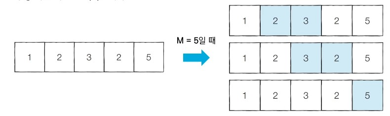
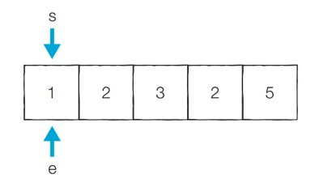
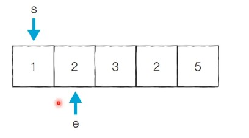
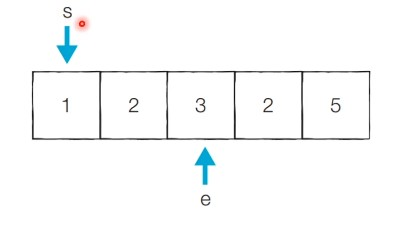
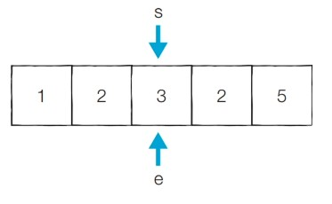
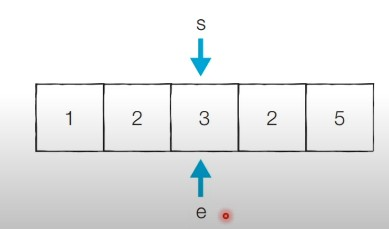
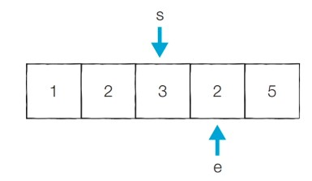
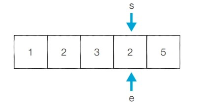
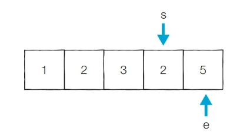
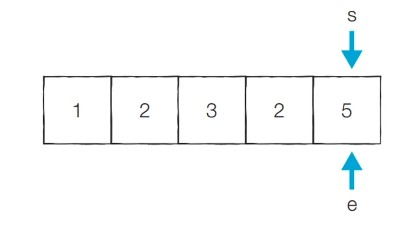

# 39강: 투 포인터

- **투 포인터 알고리즘**은 <u>리스트에 순차적으로 접근해야 할 때 두 개의 점의 위치를 기록하면서 처리</u>하는 알고리즘
- 흔히 2, 3, 4, 5, 6, 7번 학생을 지목해야 할 때 간단히 '2번부터 7번까지의 학생'이라고 부르곤 한다.
- 리스트에 담김 데이터에 순차적으로 접근해야 할 때는 **시작점**과  **끝점** 2개의 점으로 접근할 데이터의 범위를 표현할 수 있다.

### 특정한 합을 가지는 부분 연속 수열 찾기 : 문제 설명

- N개의 자연수로 구성된 수열이 있다.
- **합이 M인 부분 연속 수열의 개수**를 구해보자.
- 수행 시간 제한은 **O(N)**이다.



### 특정한 합을 가지는 부분 연속 수열 찾기 : 문제 해결 아이디어

- <u>투 포인터를 활용</u>하여 다음과 같은 **알고리즘**으로 문제를 해결할 수 있다.
  1. 시작점(start)과 끝점(end)이 첫 번째 원소의 인덱스(0)를 가리키도록 한다.
  2. 현재 부분 합이 M과 같다면, 카운트한다.
  3. 현재 부분 합이 M보다 작다면, end를 1 증가시킨다.
  4. 현재 부분 합이 M보다 크거나 같다면, start를 1 증가시킨다.
  5. 모든 경우를 확인할 때까지 2번부터 4번까지의 과정을 반복한다.

- _M_ = 5
- **[초기 단계]** 시작점과 끝점이 첫 번째 원소의 인덱스를 가리키도록 한다.
  - 현재의 부분합은 1이므로 무시한다.
  - **현재 카운트 : ** 0



- _M_ = 5

- **[Step 1]** 이전 단계에서의 부분합이 1이었기 때문에 end를 1 증가시킨다.
  - 현재의 부분합은 3이므로 무시한다.
  - **현재 카운트 : ** 0



- _M_ = 5

- **[Step 2]** 이전 단계에서의 부분합이 3이었기 때문에 end를 1 증가시킨다.
  - 현재의 부분합은 6이므로 무시한다.
  - **현재 카운트 : ** 0



- _M_ = 5

- **[Step 3]** 이전 단계에서의 부분합이 6이었기 때문에 start를 1 증가시킨다.
  - 현재의 부분합은 5이므로 카운트를 증가시킨다.
  - **현재 카운트 : ** 1



- _M_ = 5

- **[Step 4]** 이전 단계에서의 부분합이 5이었기 때문에 start를 1 증가시킨다.
  - 현재의 부분합은 3이므로 무시한다.
  - **현재 카운트 : ** 1



- _M_ = 5

- **[Step 5]** 이전 단계에서의 부분합이 3이었기 때문에 end를 1 증가시킨다.
  - 현재의 부분합은 5이므로 카운트를 증가시킨다.
  - **현재 카운트 : ** 2



- _M_ = 5

- **[Step 6]** 이전 단계에서의 부분합이 5이었기 때문에 start를 1 증가시킨다.
  - 현재의 부분합은 2이므로 무시한다.
  - **현재 카운트 : ** 2



- _M_ = 5

- **[Step 7]** 이전 단계에서의 부분합이 2이었기 때문에 end를 1 증가시킨다.
  - 현재의 부분합은 7이므로 무시한다.
  - **현재 카운트 : ** 2



- _M_ = 5

- **[Step 8]** 이전 단계에서의 부분합이 7이었기 때문에 start를 1 증가시킨다.
  - 현재의 부분합은 5이므로 카운트를 증가시킨다.
  - **현재 카운트 : ** 3



### 특정한 합을 가지는 부분 연속 수열 찾기 : 코드 예시 (Python)

```python
n = 5 # 데이터의 개수 N
m = 5 # 찾고자 하는 부분합 M
data = [1, 2, 3, 2, 5] # 전체 수열

count = 0
interval_sum = 0
end = 0

# start를 차례대로 증가시키며 반복
for start in range(n):
    # end를 가능한 만큼 이동시키기
    while interval_sum < m and end < n:
        interval_sum += data[end]
        end += 1
    # 부분합이 m일 때 카운트 증가
    if interval_sum == m:
        count += 1
    interval_sum -= data[start]

print(count)
```

### 특정한 합을 가지는 부분 연속 수열 찾기 : 코드 예시 (C++)

```c++
#include <bits/stdc++.h>

using namespace std;

int n = 5; // 데이터의 개수 N
int m = 5; // 찾고자 하는 부분합 M
int arr[] = {1, 2, 3, 2, 5}; // 전체 수열

int main() {
    int cnt = 0;
    int intervalSum = 0;
    int end = 0;

    // start를 차례대로 증가시키며 반복
    for (int start = 0; start < n; start++) {
        // end를 가능한 만큼 이동시키기
        while (intervalSum < m && end < n) {
            intervalSum += arr[end];
            end += 1;
        }
        // 부분합이 m일 때 카운트 증가
        if (intervalSum == m) {
            cnt += 1;
        }
        intervalSum -= arr[start];
    }

    cout << cnt << '\n';
}
```

### 특정한 합을 가지는 부분 연속 수열 찾기 : 코드 예시 (Java)

```java
import java.util.*;

class Main {
    public static int n = 5; // 데이터의 개수 N
    public static int m = 5; // 찾고자 하는 부분합 M
    public static int[] arr = {1, 2, 3, 2, 5}; // 전체 수열

    public static void main(String[] args) {
        int cnt = 0;
        int intervalSum = 0;
        int end = 0;

        // start를 차례대로 증가시키며 반복
        for (int start = 0; start < n; start++) {
            // end를 가능한 만큼 이동시키기
            while (intervalSum < m && end < n) {
                intervalSum += arr[end];
                end += 1;
            }
            // 부분합이 m일 때 카운트 증가
            if (intervalSum == m) {
                cnt += 1;
            }
            intervalSum -= arr[start];
        }

        System.out.println(cnt);
    }
}
```

