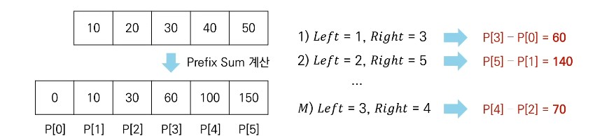

# 40강: 구간 합 빠르게 계산하기

### 구간 합 (Interval Sum)

- **구간 합 문제** : 연속적으로 나열된 N개의 수가 있을 때 <u>특정 구간의 모든 수를 합한 값을 계산</u>하는 문제
- 예를 들어 5개의 데이터로 구성된 수열 {10, 20, 30, 40, 50}이 있다고 가정하자.
  - 두 번째 수부터 네 번째 수까지의 합은 20 +30 + 40 = 90 이다.

### 구간 합 빠르게 계산하기 : 문제 설명

- _N_개의 정수로 구성된 수열이 있다.

- _M_개의 쿼리(Query)정보가 주어진다.
  - 각 쿼리는 _Left_와 _Right_로 구성된다.
  - 각 쿼리에 대하여 [_Left, Right_]구간에 포함된 데이터들의 합을 출력해야 한다.
- 수행 시간 제한은 **_O(N + M)_**이다.

### 구간 합 빠르게 계산하기 : 문제 해결 아이디어

- **접두사 합(Prefix Sum)** : 배열의 맨 앞부터 특정 위치까지의 합을 미리 구해 놓은 것
- 접두사 합을 활용한 **알고리즘**은 다음과 같다.
  - _N_개의 수 위치 각각에 대하여 접두사 합을 계산하여 _P_에 저장한다.
  - 매 _M_개의 쿼리 정보를 확인할 때 구간 합은 _P[Right] - P[Left - 1]_이다.



### 구간 합 빠르게 계산하기 : 코드 예시 (python)

```python
  
# 데이터의 개수 N과 전체 데이터 선언
n = 5
data = [10, 20, 30, 40, 50]

# 접두사 합(Prefix Sum) 배열 계산
sum_value = 0
prefix_sum = [0]
for i in data:
    sum_value += i
    prefix_sum.append(sum_value)

# 구간 합 계산 (세 번째 수부터 네 번째 수까지)
left = 3
right = 4
print(prefix_sum[right] - prefix_sum[left - 1])
```

### 구간 합 빠르게 계산하기 : 코드 예시 (C++)

```c++
#include <bits/stdc++.h>

using namespace std;

int n = 5; // 데이터의 개수 N과 데이터 입력받기
int arr[] = {10, 20, 30, 40, 50};
int prefixSum[6];

int main() {
    // 접두사 합(Prefix Sum) 배열 계산
    int sumValue = 0;

    for (int i = 0; i < n; i++) {
        sumValue += arr[i];
        prefixSum[i + 1] = sumValue;
    }

    // 구간 합 계산(세 번째 수부터 네 번째 수까지)
    int left = 3;
    int right = 4;
    cout << prefixSum[right] - prefixSum[left - 1] << '\n';
}
```

### 구간 합 빠르게 계산하기 : 코드 예시 (Java)

```java
import java.util.*;

class Main {
    public static int n = 5; // 데이터의 개수 N과 데이터 입력받기
    public static int arr[] = {10, 20, 30, 40, 50};
    public static int[] prefixSum = new int[6];

    public static void main(String[] args) {
        // 접두사 합(Prefix Sum) 배열 계산
        int sumValue = 0;

        for (int i = 0; i < n; i++) {
            sumValue += arr[i];
            prefixSum[i + 1] = sumValue;
        }

        // 구간 합 계산(세 번째 수부터 네 번째 수까지)
        int left = 3;
        int right = 4;
        System.out.println(prefixSum[right] - prefixSum[left - 1]);
    }
}
```

