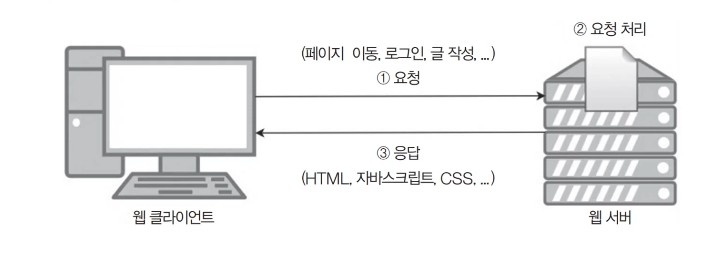
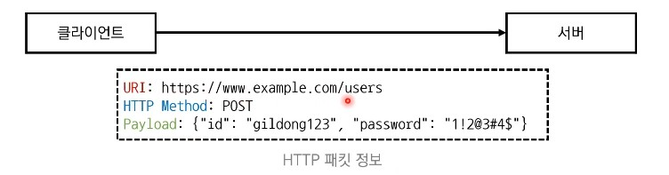

# 41강: 개발형 코딩 테스트

- **정해진 목적에 따라서 동작하는 완성된 프로그램을 개발** 하는 것을 요규하는 코딩 테스트 유형


- 일부 기업은 해커톤을 통해 채용을 진행
  - **해커톤(Hackathon)** 이란?
    - <u>단기간에 아이디어를 제품화하는 프로젝트 이벤트</u>

- 개발형 코딩 테스트는 분야에 따라 상세 요구사항이 다를 수 있다.
  - **예시1)** 모바일 클라이언트 개발 : 안드로이드, iOS앱 개발
  - **예시2)** 웹 서버 개발 : 스프린(Spring), 장고(Django) 등의 서버 개발 프레임워크 활용
- 하지만 분야에 상관없이 꼭 알아야 하는 개념과 도구에 대해서 학습할 필요가 있다.
  - 서버, 클라이언트, JSON, REST API, •••

### 서버와 클라이언트

- 클라이언트가 요청(Request)을 보내면 서버가 응답(Response)한다.


### 클라이언트(Clinet) = 고객

- 서버로 요청을 보내고 응답이 도착할 때까지 기다린다.
- 서버로부터 응답을 받은 뒤에는 서버의 응답을 화면에 출력한다.
  - **예시 1)** 웹 브라우저 : 서버로부터 받은 HTML, CSS코드를 화면에 적절한 형태로 출력한다.
  - **예시2)** 게임 앱 : 서버로부터 받은 경험치, 친구 귓속말 정보 등을 화면에 적절한 형태로 출력한다.


### 서버(Server) = 서비스 제공자

- 클라이언트로부터 받은 요청을 처리해 응답을 전송한다.
  - **예시)** 웹 서버 : 로그인 요청을 받아 아이디와 비밀번호가 정확한지 검사하고 그 결과를 응답한다.



### HTTP 개요

- **HTTP(HyperText Transfer Protocol)** 는 <u>웹상에서 데이터를 주고받기 위한 프로토콜</u> 을 의미
  - 보통은 웹 문서(HTML 파일)를 주고받는 데 사용된다.
  - 모바일 앱 및 게임 개발 등에서 특정 형식의 데이터를 주고받는 용도로도 사용된다.
- 클라이언트는 <u>요청의 목적에 따라서</u> 적절한 HTTP 메서드를 이용해 통신을 진행한다.
  - 대표적인 **HTTP 메서드** 는 다음과 같다.

| HTTP 메서트 | 설명                        | 사용예시                    |
| ----------- | --------------------------- | --------------------------- |
| GET         | 특정한 데이터의 조회를 요정 | 특정 페이지 접속, 정보 검색 |
| POST        | 특정한 데이터의 생성을 요청 | 회원가입, 글쓰기            |
| PUT         | 특정한 데이터의 수정을 요청 | 회원 정보 수정              |
| DELETE      | 특정한 데이터의 삭제를 요청 | 회원 정보 삭제              |

### 파이썬 웹 요청 예제 : GET 방식

```python
import requests

target = 'http://google.com'
response = requests.get(url=target)
print(response.text)
>
<!doctype html><html itemscope=" "...
```

### 개발형 코딩 테스트 준비하기

- 2020 카카오 2차 코딩 테스트 안내문에 쓰여 있던 문장


- 개발형 코딩 테스트의 핵심 키워드 :**JSON. REST API**

### REST의 등장 배경

- **HTTP** 는 GET, POST, PUT, DELETE 등의 <u>다양한 HTTP 메서드를 지원</u> 한다.
  - 실제로는 서버가 각 메서드의 기본 설명을 따르지 않아도 프로그램을 개발할 수 있다.
  - 하지만 저마다 다른 방식으로 개발하면 문제가 될 수 있어 기준이 되는 아키텍처가 필요하다.


### REST 개요

- **REST (Representational State Transfer)** 는 <u>각 자원(Resource)에 대하여 자원의 상태에 대한 정보를 주고받는 개발 방식</u>을 의미
- REST의 **구성 요소**
  - 자원 : URL를 이용 - 사용자
  - 행위(Verb) : HTTP 메서드를 이용 - 회원등록
  - 표현 : 페이로드를 이용 - 아이디는~




### REST API란?

- **API (Application Programming Interface)** : <u>프로그램이 상호작용하기 위한 인터페이스</u> 를 의미한다.
- **REST API** : <u>REST 아키텍처를 따르는 API</u>를 의미한다.
- **REST API 호출** : <u>REST 방식을 따르고 있는 서버에 특정한 요청을 전송</u> 하는 것을 의미

### JSON

- **JSON (JavaScript Object Natation)** : 데이터를 주고받는 데 사용하는 경량의 데이터 형식
- JSON 형식을 따르는 데이터 예시는 다음과 같다.

```
{
	"id":"dsdad",
	"password": "1231",
}
```

- JSON 데이터는 **키와 값의 쌍**으로 이루어진 데이터 객체를 지정한다.

### JSON 객체 사용 예제

```python
import sys
# 사전 자료형 (dict) 데이터 선언
user = {
	"id":"dsdad",
	"password": "1231",
}

# 파이썬 변수를 JSON 객체로 변환
json_data = json.dumps(user, indent=4)
print(json_data)
>
{
	"id":"dsdad",
	"password": "1231",
}
```

### JSON 객체 파일 저장 예제

```python
import json

# 사전 자료형 (dict) 데이터 선언
user = {
	"id":"dsdad",
	"password": "1231",
}

# json 데이터로 변환하여 파일로 저장
with open('user.json', 'w', encoding='utf-8') as file:
    json_data = json.dump(user, file, indext = 4)
```

### REST API 호출 실습해보기

- **API 호출 경로** : http://jsonplaceholder.typicode.com/users/1
  - 모든 사용자에게 같은 주소를 주지 않고 특정한 토큰을 부여하여 접근하게 한다.
- **HTTP 메서드** : GET

```
{
	"id":"dsdad",
	"password": "1231",
	(생략)
}
```

- **API 호출 경로** : http://jsonplaceholder.typicode.com/users
  - 모든 데이터 조회

### REST API를 호출하여 회원 정보를 처리하는 예제

```python
import requests

# REST API 경로에 접속하여 응답(Response) 데이터 받아오기
target = 'http://jsonplaceholder.typicode.com/users'
response = requests.get(url=target)

# 응답(Response) 데이터가 JSON 형식이므로 바로 파이썬 객체로 변환
data = response.json()

# 모든 사용자(user) 정보를 확인하며 이름 정보만 삽입
name_list = []
for user in data:
	name_list.append(user['name'])
print(name_list)	
```

