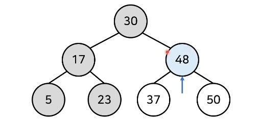

# 트리(Tree) 자료구조 10분 핵심 요약

### 트리 (Tree)

- 트리는 가계도와 같은 **계층적인 구조**를 표현할 때 사용할 수 있는 자료구조


**[트리 관련 용어]**

- 루트 노드(root node) : 부모가 없는 최상위 노드
- 단말 노드(leaf node) : 자식이 없는 노드
- 크기(size) : 트리에 포함된 모든 노드의 개수
- 깊이(depth) : 루트 노드부터의 거리
- 높이(height) : 깊이 중 최댓값
- 치수(degree) : 각 노드의 (자식 방향) 간선 개수

- 기본적으로 트리의 크기가 N일 때, 전체 간선의 개수는 N-1개이다.

### 이진 탐색 트리 (Binary Search Tree)

- **이진 탐색**이 동작할 수 있도록 고안된 효율적인 탐색이 가능한 자료구조의 일종이다.
- 이진 탐색 트리의 특징 : **왼쪽 자식 노드 < 부모 노드 < 오른쪽 자식 노드**
  - 부모 노드보다 왼쪽 자식 노드가 작다.
  - 부모 노드보다 오른쪽 자식 노드가 크다.


- 이진 탐색 드리가 이미 구성되어 있다고 가정하고 데이터를 조회하는 과정을 살펴보자.
- 찾고자 하는 원소 : 37
- **[Step 1]** 루트 노드부터 방문하여 탐색을 진행한다.
  - 1) 현재 노드와 찾는 원소 37을 비교
  - 2) 찾는 원소가 더 크므로 오른쪽 방문


- **[Step 2]** 현재 노드와 값을 비교한다.
  - 1) 현재 노드와 찾는 원소 37을 비교
  - 2) 찾는 원소가 더 작으므로 왼쪽 방문



- **[Step 3]** 현재 노드와 값을 비교한다.
  - 1) 현재 노드와 찾는 원소 37을 비교
  - 2) 원소를 찾았으므로 탐색을 종료


### 트리의 순회 (Tree Traversal)

- 트리 자료구조에 포함된 노드를 특정한 방법으로 한 번씩 방문하는 방법을 의미한다.
  - 트리의 정보를 시작적으로 확인할 수 있다.
- **대표적인 트리 순회** 방법은 다음과 같다.
  - **전위 순회(pre-order traverse)** : 루트를 먼저 방문한다.
  - **중위 순회(in-ordr traverse)** : 왼쪽 자식을 방문한 뒤에 루트를 방문한다.
  - **후위 순회(post-order traverse)** : 오른쪽 자식을 방문한 뒤에 루트를 방문한다.


- **전위 순회(pre-order traverse)** : A -> B -> D -> E -> C -> F -> G
- **중위 순회(in-ordr traverse)** : D -> B -> E -> A -> F -> C -> G
- **후위 순회(post-order traverse)** : D -> E -> B -> F -> G -> C -> A
- [입력예시]

```python
7
ABC
BDE
CFG
D None None
E None None
F None None
G None None
```

### 트리의 순회 (Tree Traversal) 구현 예제

```python
class Node:
    def __init__(self, data, left_node, right_node):
        self.data = data
        self.left_node = left_node
        self.right_node = right_node

# 전위 순회(Preorder Traversal)
def pre_order(node):
    print(node.data, end=' ')
    if node.left_node != None:
        pre_order(tree[node.left_node])
    if node.right_node != None:
        pre_order(tree[node.right_node])

# 중위 순회(Inorder Traversal)
def in_order(node):
    if node.left_node != None:
        in_order(tree[node.left_node])
    print(node.data, end=' ')
    if node.right_node != None:
        in_order(tree[node.right_node])

# 후위 순회(Postorder Traversal)
def post_order(node):
    if node.left_node != None:
        post_order(tree[node.left_node])
    if node.right_node != None:
        post_order(tree[node.right_node])
    print(node.data, end=' ')

n = int(input())
tree = {}

for i in range(n):
    data, left_node, right_node = input().split()
    if left_node == "None":
        left_node = None
    if right_node == "None":
        right_node = None
    tree[data] = Node(data, left_node, right_node)

pre_order(tree['A'])
print()
in_order(tree['A'])
print()
post_order(tree['A'])

'''
[예시 입력]
7
A B C
B D E
C F G
D None None
E None None
F None None
G None None
[예시 출력]
A B D E C F G 
D B E A F C G 
D E B F G C A 
'''
```


