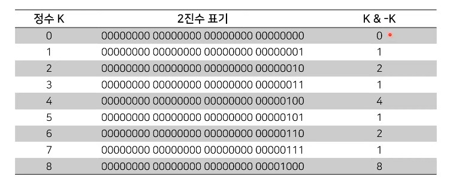
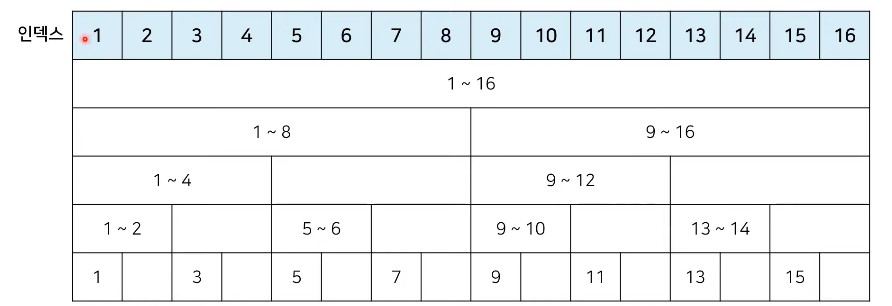
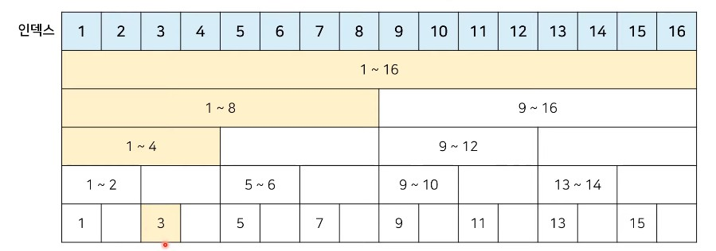
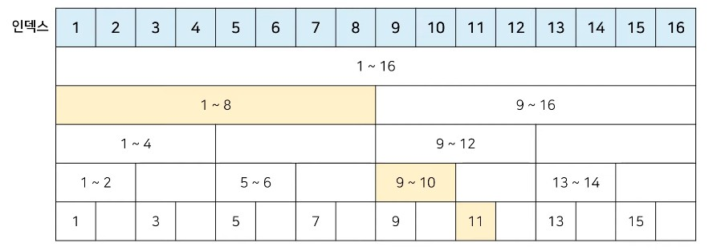

# 자료구조: 바이너리 인덱스 트리(Binary Indexed Tree, BIT, 펜윅 트리) 10분 정복

### 데이터 업데이트가 가능한 상황에서의 구간 합 (Interval Sum) 문제

- 어떤 N개의 수가 주어져 있다. 그런데 중간에 수의 변경이 빈번히 일어나고 그 중간에 어떤 부분의 합을 구하려 한다. 만약에 1, 2, 3, 4, 5라는 수가 있고, 3번재 수를 6으로 바꾸고 2번째부터 5번째까지 합을 구하라고 한다면 17을 출력하면 되는 것이다. 그리고 그 상태에서 다섯 번째 수를 2로 바꾸고 3번재부터 5번째까지 합을 구하라고 한다면 12가 될 것이다.
- **데이터 개수** : N(1 <= N <= 1,000,000)
- **데이터 변경 횟수** : M(1<=M<=10,000)
- **구간 합 계산 횟수** : K(1 <= K <= 10,000)

### 바이너리 인덱스 트리 (Binary Indexed Tree)

- **바이너리 인덱스 트리(binary indexed tree)**는 2진법 인덱스 구조를 활용해 구간 합 문제를 효과적으로 해결해 줄 수 있는 자료구조를 의미한다.
  - **펜윅 트리(fenwick tree)**라고도 한다.

- 정수에 따른 2진수 표기

| 정수 |             2진수 표기             |
| :--: | :--------------------------------: |
|  7   | 00000000 00000000 00000000 0000111 |
|  -7  | 11111111 11111111 11111111 1111001 |

- **0이 아닌 마지막 비트를 찾는 방법**
  - 특정한 숫자 K의 0이 아닌 마지막 비트를 찾기 위해서 **K & -K**를 계산하면 된다.

- K & -K 계산 결과 예시



```python
n = 8
for i in range(n+1):
	print(i,"의 마지막 비트:", (i & -i))
```

### 바이너리 인덱스 트리 : 트리 구조 만들기

- **트리 구조 만들기** : 0이 아닌 마지막 비트 = 내가 저장하고 있는 값들의 개수



### 바이너리 인덱스 트리 : 업데이트 (Update)

- **특정 값을 변경할 때** : 0이 아닌 마지막 비트만큼 더하면서 구간들의 값을 변겨 (예시 = 3rd)



### 바이너리 인덱스 트리 : 누적 합 (Prefix Sum)

- **1부터 N까지의 합(누적 합) 구하기** : 0이 아닌 마지막 비트만큼 빼면서 구간들의 값의 합 계산 (예시 = 11th)

