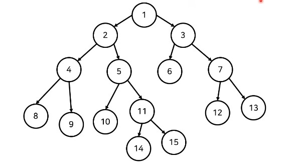
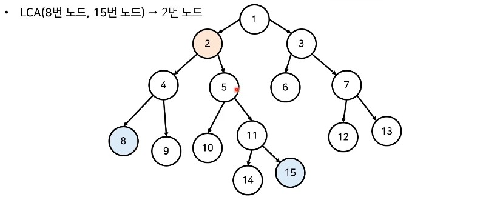
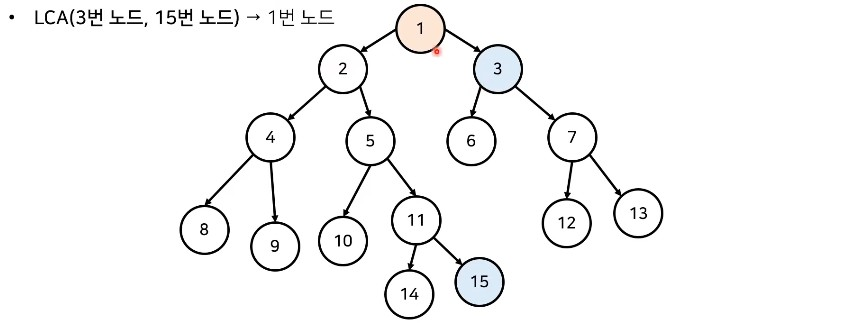
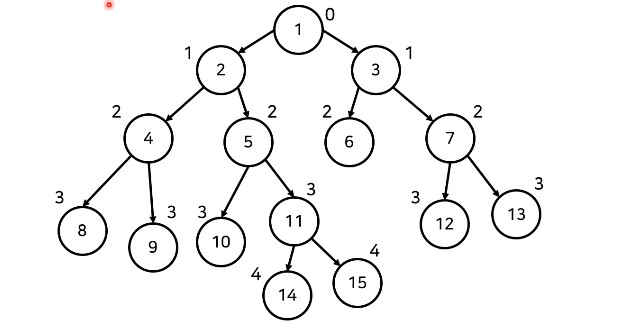
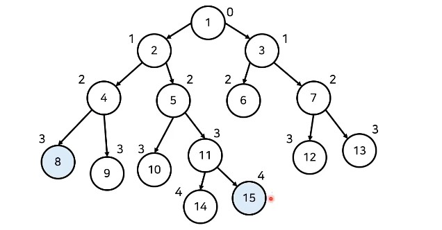
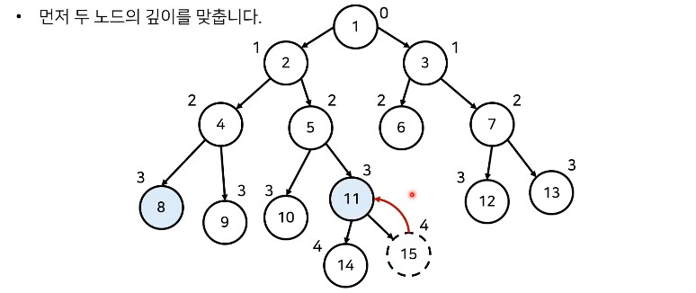
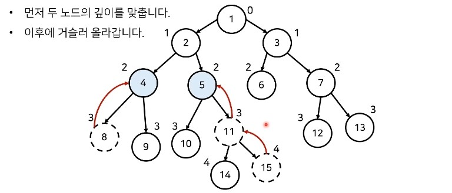
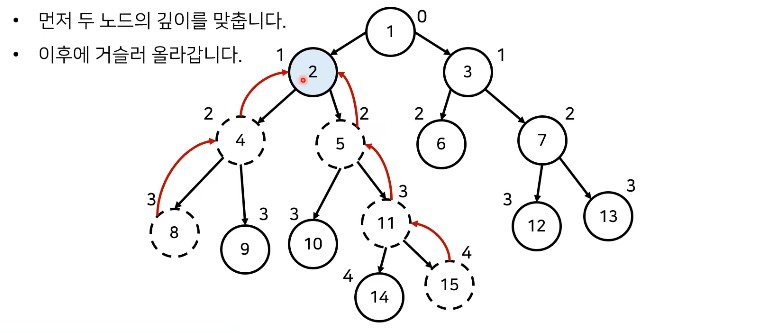
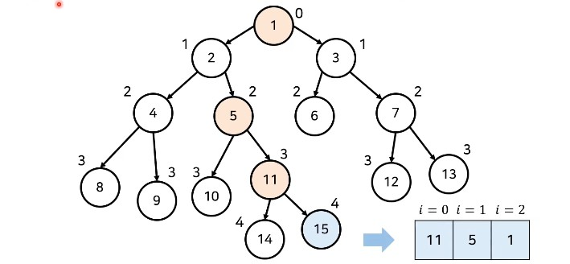

# 최소 공통 조상(Lowest Common Ancestor, LCA) 

### 최소 공통 조상 (Lowest Common Ancestor) : 기초 문제

- N(2 <= N <= 50,000)개의 정점으로 이루어진 트리가 주어진다. 트리의 각 정점은 1번부터 N번까지 번호가 매겨져 있으며, 루트는 1번이다. 두 노드의 쌍 M(1<= M <= 10,000)개가 주어졌을 때, 두 노드의 가장 가까운 공통 조상이 몇 번인지  출력한다.

### 최소 공통 조상 (Lowest Common Ancestor) 

- **최소 공통 조상 (Lowest Common Ancestor) ** 문제는 <u>두 노드의 공통된 조상 중에서 가장 가까운 조상을 찾는 문제</u> 이다.







### 기본적인 최소 공통 조상 (LCA) 알고리즘

- **최소 공통 조상** 찾기 알고리즘은 다음과 같다.
  1. 모든 노드에 대한 깊이(depth)를 계산한다.
  2. 최소 공통 조상을 찾을 두 노드를 확인한다.
     1. 먼저 두 노드의 깊이(depth)가 동일하도록 거슬러 올라간ㄷ.
     2. 이후에 부모가 같아질 때까지 반복적으로 두 노드의 부모 방향으로 거슬러 올라간다.
  3. 모든 LCA(a, b)연산에 대하여 2번의 과정을 반복한다.

### 기본적인 최소 공통 조상 (LCA) 알고리즘 : 연산 과정 살펴보기

- DFS를 이용해 모든 노드에 대하여 깊이(depth)를 계산할 수 있다.



- **LCA(8번 노드, 15번 노드)**



- - 먼저 두 노드의 깊이를 맞춘다.







### 기본적인 최소 공통 조상 (LCA) 알고리즘 : 파이썬 (python)

```python
import sys
sys.setrecursionlimit(int(1e5)) # 런타임 오류를 피하기 위한 재귀 깊이 제한 설정

n = int(input())

parent = [0] * (n + 1) # 부모 노드 정보
d = [0] * (n + 1) # 각 노드까지의 깊이
c = [0] * (n + 1) # 각 노드의 깊이가 계산되었는지 여부
graph = [[] for _ in range(n + 1)] # 그래프(graph) 정보

for _ in range(n - 1):
    a, b = map(int, input().split())
    graph[a].append(b)
    graph[b].append(a)

# 루트 노드부터 시작하여 깊이(depth)를 구하는 함수
def dfs(x, depth):
    c[x] = True
    d[x] = depth
    for y in graph[x]:
        if c[y]: # 이미 깊이를 구했다면 넘기기
            continue
        parent[y] = x
        dfs(y, depth + 1)

# A와 B의 최소 공통 조상을 찾는 함수
def lca(a, b):
    # 먼저 깊이(depth)가 동일하도록
    while d[a] != d[b]:
        if d[a] > d[b]:
            a = parent[a]
        else:
            b = parent[b]
    # 노드가 같아지도록
    while a != b:
        a = parent[a]
        b = parent[b]
    return a

dfs(1, 0) # 루트 노드는 1번 노드

m = int(input())

for i in range(m):
    a, b = map(int, input().split())
    print(lca(a, b))
```

### 기본적인 최소 공통 조상 (LCA) 알고리즘 : 시간 복잡도 분석

- 매 쿼리마다 부모 방향으로 거슬러 올라가기 위해 최악의 경우 **O(N)**의 시간 복잡도가 요구된다.
  - 따라서 모든 쿼리를 처리할 때의 시간 복잡도는 **O(NM)**이다.

### 최소 공통 조상 (Lowest Common Ancestor) : 심화 문제

- N(2 <= N <= 100,000)개의 정점으로 이루어진 트리가 주어진다. 트리의 각 정점은 1번부터 N번까지 번호가 매겨져 있으며, 루트는 1번이다. 두 노드의 쌍 M(1 <= M <= 100,000)개가 주어졌을 때, 두 노드의 가장 가까운 공통 조상이 몇 번인지 출력한다.

### 최소 공통 조상 (LCA) 알고리즘 개선하기

- 각 노드가 <u>거슬러 올라가는 속도를 빠르게 만드는 방법</u>에 대하여 고민해보자.
  - 만약 총 **15칸** 거슬러 올라가야 한다면?
    - 8칸 -> 4칸 -> 2칸 -> 1칸
- 2의 제곱 형태로 거슬로 올라가도록 하면 **O(logN)**의 시간 복잡도를 보장할 수 있다.
- 메모리를 조금 더 사용하여 각 노드에 대하여 2<sup>_i_</sup>번째 부모에 대한 정보를 기록하자.

### 개선된 최소 공통 조상 (LCA) 알고리즘 : 모든 노드의 깊이와 부모 구하기

- 모든 노드에 대하여 깊이(depth)와 2<sup>_i_</sup>번째 부모에 대한 정보를 계산한다.

