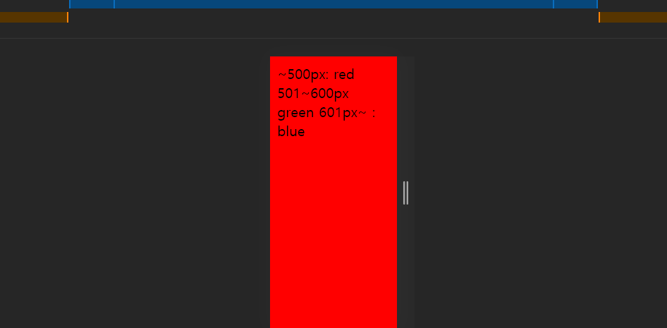

# CSS 수업 : mediaquery 1 - 기본

- 미디어에따라 보여지는 것
- 반응형의 심장과 같은 존재

```html
<!doctype>
<html>
    <head>
       <meta charset="UTF-8">
        <style>
            @media (width:500px){
                body{
                    background-color: red;
                }
            }
        </style>
    </head>
    <body>

    </body>
</html>
```

- 500px가 되면 body의 색상을 레드로 바꾼다.

```html
<!doctype>
<html>
    <head>
       <meta charset="UTF-8">
        <style>
            @media (max-width:500px){
                body{
                    background-color: red;
                }
            }
        </style>
    </head>
    <body>

    </body>
</html>
```

- 500px 이하가 되면 실행된다.

```html
<!doctype>
<html>
    <head>
       <meta charset="UTF-8">
        <style>
            @media (min-width:500px){
                body{
                    background-color: red;
                }
            }
        </style>
    </head>
    <body>

    </body>
</html>
```

- 500px이상일 때 실헹된다.

```html
<!doctype>
<html>
    <head>
       <meta charset="UTF-8">
        <style>
            
            @media (max-width:500px){
                body{
                    background-color: red;
                }
            }
            @media (max-width:600px){
                body{
                    background-color: green;
                }
            }
        </style>
    </head>
    <body>
        ~500px: red
        501~600px  green
        601px~ : blue
    </body>
</html>
```

- 500px이하에서 브라우저는 첫번째와 두번째가 같다면 나중에 나오는게 우선순위가 높다.

```html
<!doctype>
<html>
    <head>
       <meta charset="UTF-8">
        <meta name="viewport" content="width=device-width, initial-scale=1.0">
        <style>
            @media (max-width:600px){
                body{
                    background-color: green;
                }
            }
            @media (max-width:500px){
                body{
                    background-color: red;
                }
            }
            @media (min-width:601px){
                body{
                    background-color: blue;
                }
            }
        </style>
    </head>
    <body>
        ~500px: red
        501~600px  green
        601px~ : blue
    </body>
</html>
```

