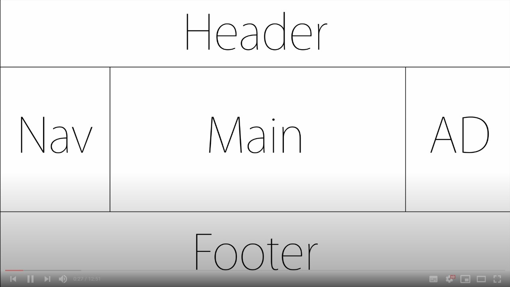

# CSS 수업 - flex 4 : holy grail layout



```html
<!doctype>
<html>
    <head>

    </head>
    <body>
        <div class="container">
           <header>
               <h1>생활코딩</h1>
           </header>
            <section>
                <nav>
                    <li>html</li>
                    <li>css</li>
                    <li>javascript</li>
                </nav>
                <main>
                    생활코딩은 일반인을 위한 코딩 수업입니다.
                </main>
                <aside>
                    AD
                </aside>
            </section>
            <footer>
                <a href="https://open">홈페이지</a>
            </footer>
        </div>    
    </body>
</html>
```


```html
<!doctype>
<html>
    <head>
        <style>
            .container{
                display:flex;
                flex-direction: column;
            }
            header{
                border-bottom: 1px solid gray;
                padding-left: 20px;
            }
            footer {
                border-top: 1px solid gray;
                padding-left: 20px;
                text-align: center;
            }
            .content{
                display: flex;
            }
            .content nav{
                border-right: 1px solid gray;
            }
            .content aside{
                border-left: 1px solid gray;
            }
            nav, aside {
                flex-basis: 150px;
                flex-shrink: 0;
            }
            main{
                padding: 10px;
            }
        </style>
    </head>
    <body>
        <div class="container">
           <header>
               <h1>생활코딩</h1>
           </header>
            <section class="content">
                <nav>
                    <li>html</li>
                    <li>css</li>
                    <li>javascript</li>
                </nav>
                <main>
                    생활코딩은 일반인을 위한 코딩 수업입니다.
                </main>
                <aside>
                    AD
                </aside>
            </section>
            <footer>
                <a href="https://open">홈페이지</a>
            </footer>
        </div>    
    </body>
</html>
```


- flex를 줘서 가운데 내용만 화면이 커질때 커지고 작아지는 속성을 부여한다. nav와 광고부분은 크기를 그대로 유지한다.