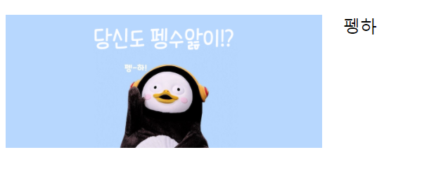
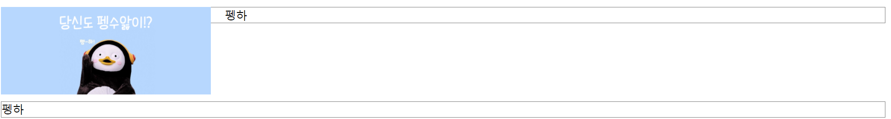

# CSS 수업 - float 1

- 레이아웃 잡을때도 많이 사용한다.
- 요즘은 flex로 많이 잡는다.

```html
<!DOCTYPE html>
<html>
    <head>
        <style>
            img{
                width:300px;
                float: left;
                margin-right: 20px;
                margin-bottom: 10px;
            }
        </style>
    </head>
    <body>
        
        <p>
            펭하
        </p>
    </body>
</html> 
```



```html
<!DOCTYPE html>
<html>
    <head>
        <style>
            img{
                width:300px;
                float: left;
                margin-right: 20px;
                margin-bottom: 10px;
            }
            p{
                border:1px solid gray;
            }
        </style>
    </head>
    <body>
        
        <p>
            펭하
        </p>
        <p style="clear: both;">
            펭하
        </p>
    </body>
</html> 
```



- clear이랑 float랑 같아야지 적용된다. 일일이 확인하기 번거로워서 both를 사용한다.