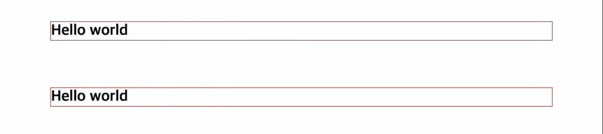
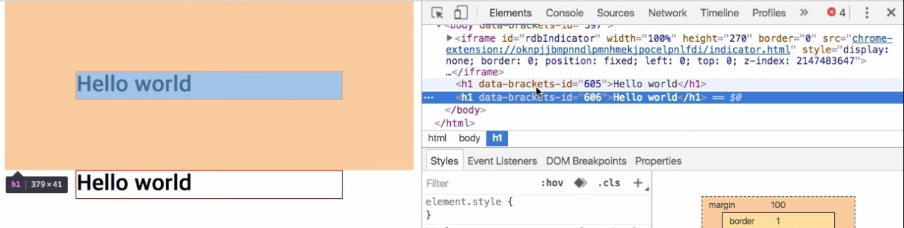
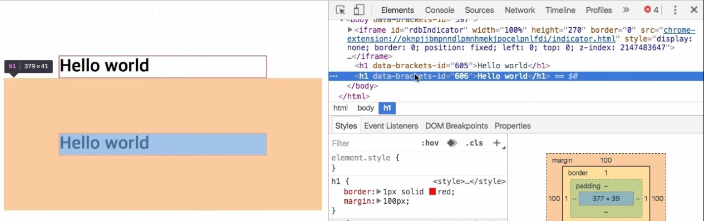

# CSS 수업 - inline block

### inline vs block line

```html
<style>
    h1{display:lnline;}
</style>
<body>
    <h1>hello worls</h1>
 	안녕하세요. <a href=''>생활코딩</a>입니다.
</body>
```

- \<h1>을 블럭태그
- 안녕하세요  부분이 lnline태그
- 둘을 언제든지 바꿀수 있다.
  - h1{display:lnline;} 이렇게 하면 인라인으로 바뀐다.

# CSS 수업 - box model

- css에서 굉장히 중요한 부분
- 각각의 태그들이 표현될 때 부피같은 것을 결정해준다.

```html
<html>
    <head>
        <style>
            p{
                border-width:10px solid red;
                padding :20px;
                margin:40px;
                width:80px;
            }
        </style>
    </head>
    <body>
        <p>
            css
        </p>
        <p>
            안녕하세요. <a herf='http://a.com'>생활코딩</a>입니다.
        </p>
    </body>
</html>
```

- 테두리가 박스의 기준점을 정해주는 것이라 중요하다.
- 인라인에서는 높이와 넓이가 무시된다.


# CSS 수업 - 마진 겹침 1

- 마진이 사라지는 경우가 있음. 

```html
<html>
    <head>
        <style>
            h1{
                border: 1px solid red;
                margin: 100px;
            }
        </style>
    </head>
    <body>
        <h1>
            hello world
        </h1>
        <h1>
            hello world
        </h1>
    </body>
</html>
```







- 마진이 겹쳤다.
- 마진값중에 더 큰 값이 두 개 사이의 마진값이 된다.
- 만약에 양쪽다 마진이 있다면 2배가 되어버린다.