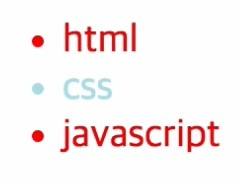
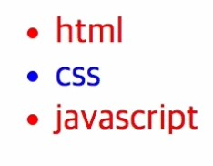
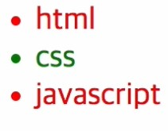
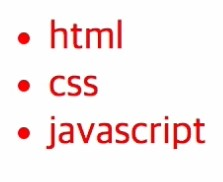

# CSS 수업 - stylish

### [사용자들이 커스텀 해놓은 사이트](https://userstyles.org/)

- !importan
  - 이게 들어간게 적용된다. 다 이긴다.

# CSS 수업 - 캐스케이딩 소개

- Cascading style sheet의 약자가 css

- 웹브라우저
  - 1900년대 초반에는 기본적인 디자인이 있었음
- 사용자도 본이이 사용하는 웹페이지의 권한이 있었야 한다는 의견이 나오기 시작
- 웹 페이지를 만드는 사람도 어떤 모습으로 보여지는기 결정권이 있어야한다는 의견도 나옴
- 이러한 조화를 위해서 css가 대두되었는데 조건이 필요함.
- **우선순위**
  - 웹브라우저 < 사용자 < 저자

# CSS 수업 - 캐스케이딩 실습

```html
<html>
    <head>
        <style>
            li{color:red;}
            #idsel{color:blue;}
            .classsel{color:green;}
        </style>
    </head>
    <body>
        <ul>
            <li>html</li>
            <li id='idsel' class='classsel' style='color:powerblue'>css</li>
            <li>java</li>
        </ul>
    </body>
</html>
```



- 태그의 스타일이 먼저 적용됨

#### 태그의 스타일 지움

```html
<li id='idsel' class='classsel'>css</li>
```



- 스타일 태그에 적힌게 적용된다.

#### id선택자 지우기

```html
<style>
  li{color:red;}
  .classsel{color:green;}
</style>
```



#### class도 지우기

```html
<style>
  li{color:red;}
</style>
```



### 적용되는 순서

1. style attribyte
   1. style 속성이 더 태그에 가까워서 구체적이고 명시적이다.
2. id selector
   1. 특정 id만 부여
3. class selector
   1. 그다음 포괄적
4. tag selector
   1. 제일 포괄적(일반적)

- 뭐가 더 구체적이고 명시적이냐, 뭐가 더 포괄적이냐.

### 모든 우선순위를 뛰어넘는 법 [ !important ]

```html
<style>
    li{color:red !important;}
    #idsel{color:blue;}
   .classsel{color:green;}
</style>
```


- 다른 속성을 다 이기고 적용된다.