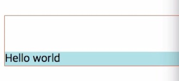
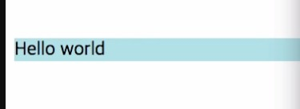
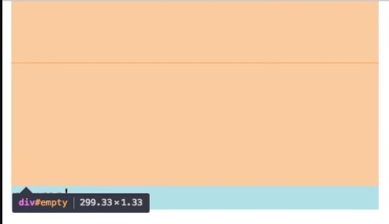

# CSS 수업 - 마진 겹침 2

- 부모와 자식 모두에 마진이 있을경우

```html
<html>
    <head>
        <style>
            #parent{
                border:1px solid tomato;
                margin-top:100px;
            }
            #child{
                background-color:powerblue;
                margin-top:50px;
            }
        </style>
    </head>
    <body>
        <div id='parent'>
            <div id='child'>
                Hello world
            </div>
        </div>
    </body>
</html>
```



- 부모 태그의 border를 주석처리한 경우



- child의 마진값이 부모의 마진 보다 넘어가면 내려간다.
- parent는 child의 마진까지 작아지면 움직이지 않는다.
- 부모가 투명한 경우 -> 부모와 자식과 비교했을 때 더 큰값이 사용된다.

# CSS 수업 - 마진 겹침 3

```html
<html>
    <head>
        <style>
            #empty{
                margin-top:50px;
                margin-bottom:100px;
                border:1px solid tomato;
            }
            #normal{
                backgrouund-color:powerblue;
                margin-top:100px;
            }
        </style>
    </head>
    <body>
        <div id='empty'></div>
        <div id='normal'>normal</div>
    </body>
</html>
```



- 두개의 마진이 겹쳤다.
- 시각적인 요소가 없으면 마진이 없어진다.
- 시각적인 요소가 없다면 위,아래 중에 큰 값이 그것의 마진값이 된다.
- 시각적인 요소가 들어가면 위,아래 마진이 모두 들어간다.