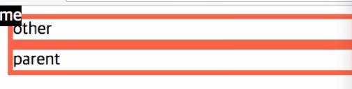
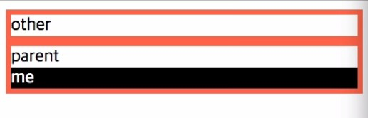
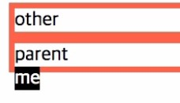
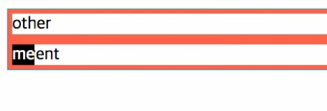

# CSS 수업 - 마진 겹침 2

- 부모와 자식 모두에 마진이 있을경우

```html
<html>
    <head>
        <style>
            #parent{
                border:1px solid tomato;
                margin-top:100px;
            }
            #child{
                background-color:powerblue;
                margin-top:50px;
            }
        </style>
    </head>
    <body>
        <div id='parent'>
            <div id='child'>
                Hello world
            </div>
        </div>
    </body>
</html>
```


- 부모 태그의 border를 주석처리한 경우


- child의 마진값이 부모의 마진 보다 넘어가면 내려간다.
- parent는 child의 마진까지 작아지면 움직이지 않는다.
- 부모가 투명한 경우 -> 부모와 자식과 비교했을 때 더 큰값이 사용된다.

# CSS 수업 - 마진 겹침 3

```html
<html>
    <head>
        <style>
            #empty{
                margin-top:50px;
                margin-bottom:100px;
                border:1px solid tomato;
            }
            #normal{
                backgrouund-color:powerblue;
                margin-top:100px;
            }
        </style>
    </head>
    <body>
        <div id='empty'></div>
        <div id='normal'>normal</div>
    </body>
</html>
```


- 두개의 마진이 겹쳤다.
- 시각적인 요소가 없으면 마진이 없어진다.
- 시각적인 요소가 없다면 위,아래 중에 큰 값이 그것의 마진값이 된다.
- 시각적인 요소가 들어가면 위,아래 마진이 모두 들어간다.

# CSS 수업 - 포지션 1 : relative VS static

- 포지션은 각각의 위치를 정해준다.

```html
<html>
    <head>
        <style>
            html{
                border:1px solid gray;
            }
            div{
                border:5px solid tomato;
                margin:10px;
            }
            #me{
                position:relative;
                left:100px;
                top:100px;
            }
        </style>
    </head>
    <body>
        <div id='other'>
            other
        </div>
        <div id='parent'>
            parent
            <div id='me'>
                me
            </div>
        </div>
    </body>
</html>
```

- left가 우선, top이 우선.
- 포지션
  - 이 값의 기본은 static다.
  - 원래 위치해야하는곳에 정적으로 위치힌다.
  - 바꾸고 싶으면 상대적으로 바꾼다.
    - 이 때 오프셋을 사용할 수 있다.

# CSS 수업 - 포지션 2 : absolute

```html
<html>
    <head>
        <style>
            #parent, #other{
                border:5px solid tomato;
            }
            #me{
                background-color:blakk;
                color:white;
                position: absolute;
                left:0px;
                top:0px;
            }
        </style>
    </head>
    <body>
        <div id='other'>
            other
        </div>
        <div id='parent'>
            parent
            <div id='me'>
                me
            </div>
        </div>
    </body>
</html>
```



```html
 #me{
                background-color:blakk;
                color:white;
                position: relative;
                left:0px;
                top:0px;
            }
```



- relateive를 하면 부모를 기준으로 만들어지고 absolute를 하면 부모 기준 상관없이 html 기준으로 시작된다.

```html
 #me{
                background-color:blakk;
                color:white;
                position: absolute;
            }
```

- 포지션 값이 없으면 부모를 기준으로 시작한다.



- 기본값은 원래 있어야 할 곳에 있는 곳이 기본값이다.

- 크기를 키우고 싶으면 `width:200px;`를 추가한다.

```html
<html>
    <head>
        <style>
            #parent, #other{
                border:5px solid tomato;
            }
            #parent{
                position:relative;
            }
            #me{
                background-color:blakk;
                color:white;
                position: absolute;
                left:0px;
                top:0px;
            }
        </style>
    </head>
    <body>
        <div id='other'>
            other
        </div>
        <div id='parent'>
            parent
            <div id='me'>
                me
            </div>
        </div>
    </body>
</html>
```



- ststic가 아닌 부모가 나타날때까지 지나가다가 static가 아닌게 나오면 거기서부터 시작한다.
- 부무와의 관계가 끊기기 때문에 본인의 크기로 지정된다.