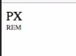
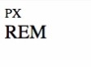

# CSS 수업 - 속성을 공부하는 방법

- 선언부의 구체적인 효과 하나를 속성이라고 함

- 마이크로소프트에서 발표한 css많이 사용되는 순서

  ​	https://blogs.windows.com/msedgedev/2016/04/11/css-usage-platform-data/

  ​	- 지금 들어가면 잘 안되는것 같지만 대략적인 정보를 알 수 있다.

# CSS 수업 - 타이포그래피 : font-size

### 단위

- px : 절대적
- em : 상대적
- rem : 상대적
- 오늘날에는 rem을 쓰면 된다.
  - 폰트 크기를 조정할 수 있어서 좋다.
- 사용자가 브라우저의 글꼴을 키울때 px는 변하지않고 rem은 변한다.

```html
<html>
    <head>
        <style>
            #px{font-size:16px;}
            #rem{font-size:1rem;}
        </style>
    </head>
    <body>
        <div id='px'>
            PX
        </div>
        <div id='rem'>
            REM
        </div>
    </body>
</html>
```

- 브라우저 폰트 Very Small



- 브라우저 폰트 Large



- 사용자가 폰트 크기를 조정하면 rem은 변하고 px는 변하지 않는다.

# CSS 수업 - 타이포그래피 : color

### color name

```html
<html>
    <head>
        <style>
            h1{color:red;}
            
        </style>
    </head>
    <body>
        <h1>
            Hello World
        </h1>
    </body>
</html>
```

### hex(16진수)

- #FF0000

### rgb

- Red, Green, Blue

- rgb(255,255,255)