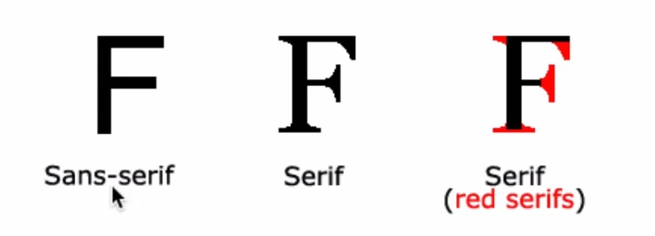

# CSS 수업 - 속성을 공부하는 방법

- 선언부의 구체적인 효과 하나를 속성이라고 함

- 마이크로소프트에서 발표한 css많이 사용되는 순서

  ​	https://blogs.windows.com/msedgedev/2016/04/11/css-usage-platform-data/

  ​	- 지금 들어가면 잘 안되는것 같지만 대략적인 정보를 알 수 있다.

# CSS 수업 - 타이포그래피 : font-size

### 단위

- px : 절대적
- em : 상대적
- rem : 상대적
- 오늘날에는 rem을 쓰면 된다.
  - 폰트 크기를 조정할 수 있어서 좋다.
- 사용자가 브라우저의 글꼴을 키울때 px는 변하지않고 rem은 변한다.

```html
<html>
    <head>
        <style>
            #px{font-size:16px;}
            #rem{font-size:1rem;}
        </style>
    </head>
    <body>
        <div id='px'>
            PX
        </div>
        <div id='rem'>
            REM
        </div>
    </body>
</html>
```

- 브라우저 폰트 Very Small


- 브라우저 폰트 Large


- 사용자가 폰트 크기를 조정하면 rem은 변하고 px는 변하지 않는다.

# CSS 수업 - 타이포그래피 : color

### color name

```html
<html>
    <head>
        <style>
            h1{color:red;}
            
        </style>
    </head>
    <body>
        <h1>
            Hello World
        </h1>
    </body>
</html>
```

### hex(16진수)

- #FF0000

### rgb

- Red, Green, Blue
- rgb(255,255,255)
- 255가 낮을수록 어두워진다.

# CSS 수업 - 타이포그래피 : font

```html
<html>
    <head>
        <style>
            #type1{
                font-size:5rem;
                font-family:arial, verdana, 'Helvetica Neue', monospace;
                font-weight: bold;
                line-height: 2;
            }
            p{
                font: bold 5rem/2 arial, verdana, 'Helvetica Neue', serif;
            }
            
        </style>
    </head>
    <body>
        <p id='type1'>
            Hello World
        </p>
        <p id='type2'>
            Hello World
        </p>
    </body>
</html>
```

- 원하는 폰트가 깔려있지 않을 수 있음.
  - arial이 없으면 verdana가 적용되고 둘다 없으면 Helvetica Neue가 적용된다.



- Sans는 부정의 의미가 있어서 장식이 없다.

- monospace
  - 고정폭, 폰트의 모든 폭을 동일하게 설정

- line-height
  - 위 아래 폰트 간격
- font-weight
  - 폰트 굵기

- font: bold 5rem/2 arial, verdana, 'Helvetica Neue', serif;
  - 모든 속성들을 나열

# CSS 수업 - 타이포그래피 : 웹폰트

```html
<html>
    <head>
    	<link href='폰트링크' rel='stylesheet'>
        <style>
            #font1{
                font-family: 'Open Sans Condensed', sans-serif;
            }
            #font2{
                font-family: 'Indie Flower', cursive;
            }
        </style>
    </head>
    <body>
        <p id='font1'>
            Hello World
        </p>
        <p id='font2'>
            Hello World
        </p>
    </body>
</html>
```

- 폰트링크를 연결하고 font-family로 지정해주면 적용된다.(구글폰트 기준)

- \<link href='폰트링크' rel='stylesheet'>
  - href='폰트링크' 에서 링크에 해당되는 것을 다운받는다.
- 폰트생성기로 보유하고 있는 폰트를 웹폰트로 만들 수 있다.
- font-family에서 이름을 바꿔서 적용 가능

# CSS 수업 - 상속

```html
<html>
    <head>
        <style>
            li{color:red;}
            h1{color:red;}
            html{color:red;}
            #select{color:bliak;}
            body{border:1px solid red;}
        </style>
    </head>
    <body>
        <h1>
            수업내용
        </h1>
        <ul>
            <il>html</il>
            <li>css</li>
            <li id='select'>javascript</li>
        </ul>
    </body>
</html>
```

- 부모의 색상을 자식이 물려받는게 가장 편리함
- #select : 이건 생산성이 더 높음 

- 어떤 상속이 상복받는게 나을지 아닐지 판단하여 속성이 적용된다.