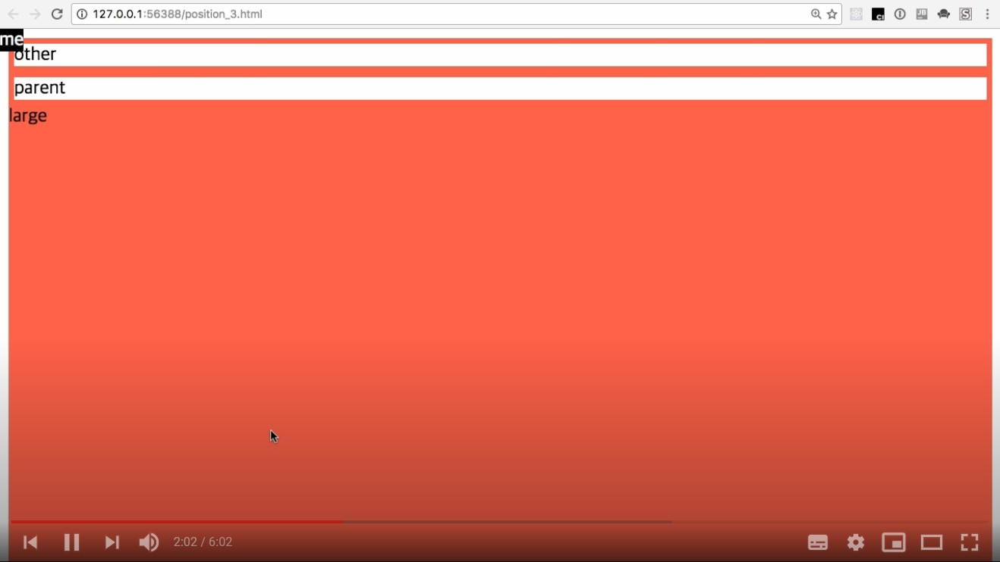
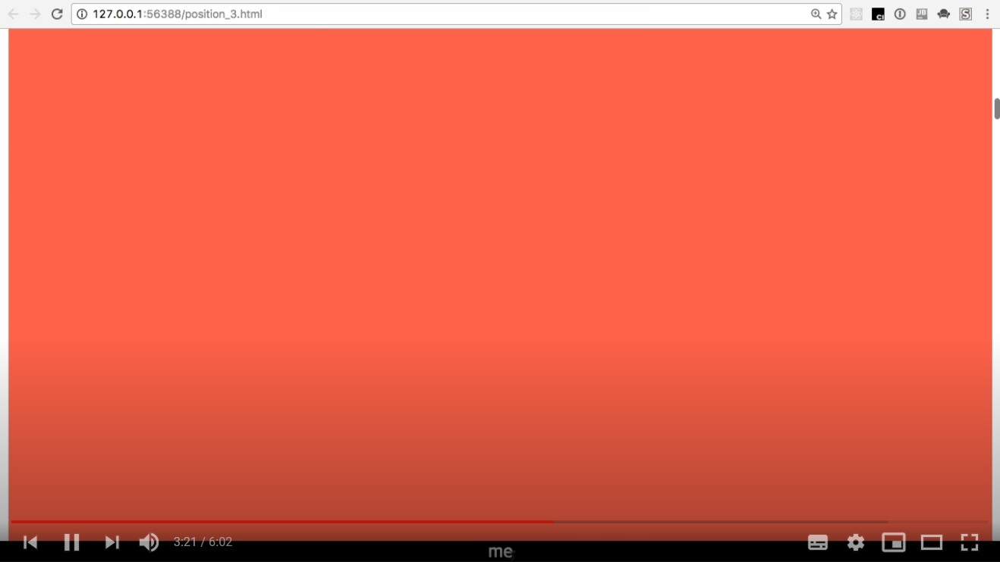
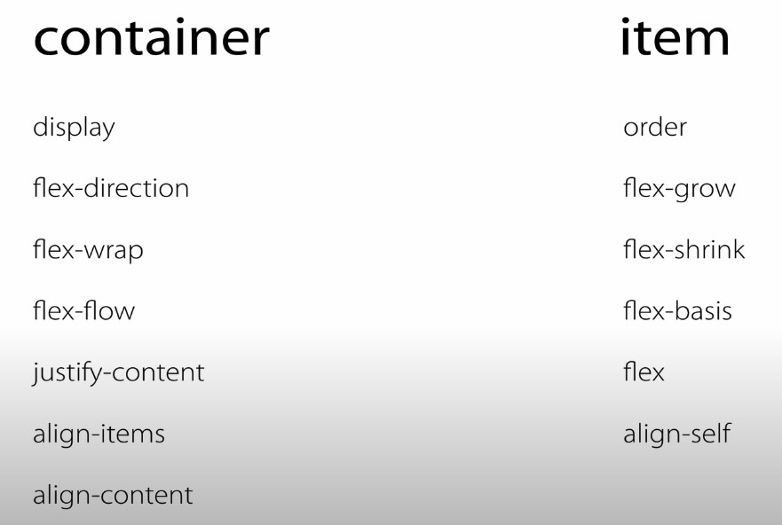

# CSS 수업 - 포지션 3 : fixed

```html
<html>
    <head>
        <style>
            #parent, #other{
                border:5px solid tomato;
            }
            #large {
                height:10000px;
                background-color:tomato;
            }
            #me{
                background-color:blakk;
                color:white;
                position: fixed;
                left:0px;
                top:0px;
            }
        </style>
    </head>
    <body>
        <div id='other'>
            other
        </div>
        <div id='parent'>
            parent
            <div id='me'>
                me
            </div>
        </div>
        <div id='large'>
            large
        </div>
    </body>
</html>
```

- 부모 값중 위치가 정해지지 않은 것들중에 absolute가 적용된다.



- 스크롤을 내려도 me는 고정되어있다.

- 특정한 요소를 고정시키고 싶으면 fixed를 사용한다.

```html
#me{
                background-color:blakk;
                color:white;
                position: fixed;
                left:0px;
                bottom:0px;
				width:100%;
				text-align:center;
            }
```



- me가 맽밑에 고정된다.
- fixed도 absolute랑 비슷하다.
- 부모 크기도 자식과 연결이 끊겼기 때문에 자식의 크기를 포함하지 않는다.
- 자식은 부모와 연결이 끊겨서 본인 크기만 가져간다.

# CSS 수업 - flex 1 : intro

- 주로 레이아웃 잡을 때 사용한다.
- 테이블
  - 구조화된 정보를 의미
  - 테이블로 레이아웃을 짜는게 문제점이 많았다.

- 플럭스가 드디어 등장함.

- 플럭스를 사용하기 위해서 

```html
<container>
<item>
```

- 부모와 자식이 있어야 한다.



- 서로 부여해야 할 속성이 다르다.

# CSS 수업 - flex 2 : basic

```html
<!doctype>
<html>
    <head>
        <style>
            .container{
                background-color: powderblue;
            }
            .item{
                background-color: tomato;
                color: white;
                border: 1px solid white;
            }
        </style>
    </head>
    <body>
        <div class="condatiner">
            <div class="item">1</div>
            <div class="item">2</div>
            <div class="item">3</div>
            <div class="item">4</div>
            <div class="item">5</div>
        </div>
    </body>
</html>
```


- 부모에게 `display: flex;` 을 주는게 시작이다.


- flex 적용 후 달라졌다.

- flex는 태그들을 정렬하는 방법

- `flex-direction: row` 가 기본값
- `flex-direction: row-reverse;` 하면 뒤바뀐다.


- `flex-direction: column`
- 컬럼으로 정렬


- ` flex-direction: column-reverse;`


- `height: 300px;` 를 부여하면 flex를 한 것과 안 한것의 차이가 드러난다.

```html
  .container{
                background-color: powderblue;
                height: 300px;
                display: flex;
                flex-direction: column-reverse;
            }
```


- 원래 밑에쪽에 공간이 있었는데 reverse를 통해 바꾸니 순서가 바뀌었다.

