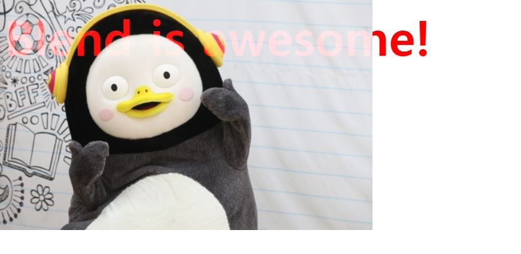

#  [생활코딩] CSS 수업 - blend 3 : mix-blend-mode

```html
<!doctype>
<html>
<head>
<style>
    body{
        background-image: url(https://img.hankyung.com/photo/201910/AKR20191001176700005_03_i.jpg);
        background-repeat: no-repeat;
    }
    .blend{
        font-size: 2rem;
        font-weight: bold;
        color: red;
        mix-blend-mode: screen;
    }
    </style>
    </head>
    <body>
        <div class='blend'>
            <h1>Blend is awesome!</h1>
        </div>
    </body>
</html>
```

- mix-blend-mode
  - 블랜드를 주고 싶은 이미지와 요소를 섞는 것



