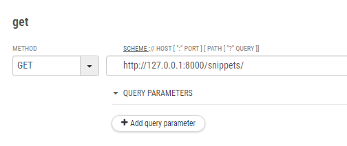
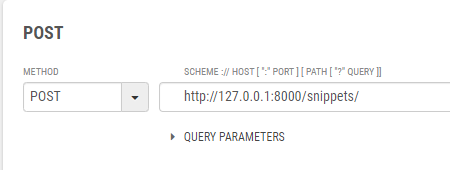
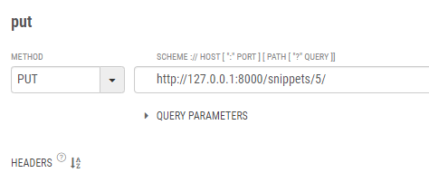
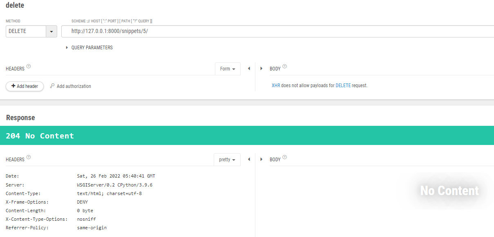

# [Django REST framework] 1-1. View와 Serializer 연결하기

### Veiw 설정

> 함수 기반으로 작성
>
> 이번에는 REST framework 대신 일반적인 django view를 사용해서 구현

#### restapi > appapi > views.py

- 먼저 필요한 패키지를 선언한다.

```python
from django.http import HttpResponse, JsonResponse
from django.views.decorators.csrf import csrf_exempt
from rest_framework.parsers import JSONParser
from .models import Snippet
from .serializers import SnippetSerializer
```

- snippet를 조회하는 def를 생성한다.

```python
@csrf_exempt
def snippet_list(request):
    if request.method == 'GET':
        snippets = Snippet.objects.all()
        serializer = SnippetSerializer(snippets, many=True)
        return JsonResponse(serializer.data, safe=False)

    if request.method == 'POST':
        data = JSONParser().parse(request)
        serializer = SnippetSerializer(data=data)
        if serializer.is_valid():
            serializer.save()
            return JsonResponse(serializer.data, status=201)
        return JsonResponse(serializer.data, status=400)
```

- 각각의 snippet를 수정하거나 업데이트 하는 def도 생성한다.

```python
@csrf_exempt
def snippet_detail(request, pk):
    try:
        snippet = Snippet.objects.get(pk=pk)
    except Snippet.DoesNotExist:
        return HttpResponse(status=404)

    if request.method == 'GET':
        serializer = SnippetSerializer(snippet)
        return JsonResponse(serializer.data)

    elif request.method == 'PUT':
        data = JSONParser().parse(request)
        serializer = SnippetSerializer(snippet, data=data)
        if serializer.is_valid():
            serializer.save()
            return JsonResponse(serializer.data)
        return JsonResponse(serializer.data, status=400)

    elif request.method == 'DELETE':
        snippet.delete()
        return HttpResponse(status=204)
```

| 응답번호 | 내용                                                         |
| -------- | ------------------------------------------------------------ |
| 200      | 성공 - 서버가 요청을 제대로 처리                             |
| 201      | 작성됨 - 성공적으로 요청되었으며 서버가 새 리소를 작성       |
| 204      | 콘텐츠 없음 - 서버가 요청을 성공적으로 처리했지만 콘텐츠를 제공하지 않음 |
| 400      | 잘못된 요청 - 서버가 요청의 구문을 인식하지 못함             |
| 404      | 찾을 수 없음 - 서버가 요청한 페이지를 찾을 수 없음           |

### url 설정

#### restapi > appapi > urls.py

```python
from django.urls import path, include
from .views import *

urlpatterns = [
    path('snippets/', snippet_list),
    path('snippets/<int:pk>/', snippet_detail),
]
```

###  api 테스트

#### GET

- 요청



- 응답 결과

```
[
    {
        "id": 1,
        "title": "",
        "code": "foo = \"bar\"\n",
        "linenos": false,
        "language": "python",
        "style": "friendly"
    },
    {
        "id": 2,
        "title": "",
        "code": "print(\"hello, world\")\n",
        "linenos": false,
        "language": "python",
        "style": "friendly"
    },
    {
        "id": 3,
        "title": "",
        "code": "foo = \"bar\"\n",
        "linenos": false,
        "language": "python",
        "style": "friendly"
    },
    {
        "id": 4,
        "title": "",
        "code": "print(\"hello, world\")\n",
        "linenos": false,
        "language": "python",
        "style": "friendly"
    }
]
```

### POST

- 요청



```
body
{
  "code":"print('post test')\n"
}
```

- 응답결과

```
{
    "id": 5,
    "title": "",
    "code": "print('post test')",
    "linenos": false,
    "language": "python",
    "style": "friendly"
}
```

### put

- 요청



```
body
{
  "title": "put_update",
  "code" : "print('put_update')\n"
}
```

- 응답 결과

```
{
    "id": 5,
    "title": "put_update",
    "code": "print('put_update')",
    "linenos": false,
    "language": "python",
    "style": "friendly"
}
```

### delete

- 요청



- 응답결과

```
204 no content
```

