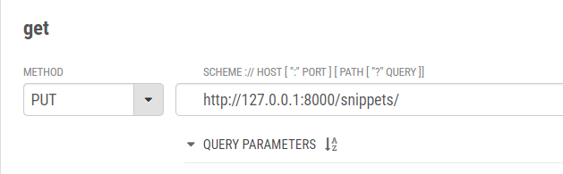
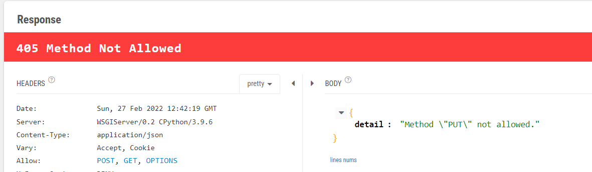
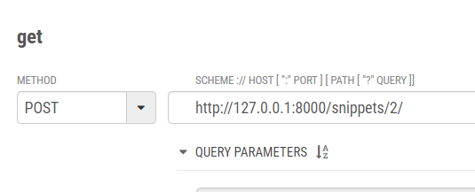
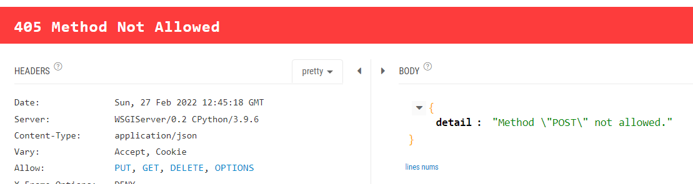
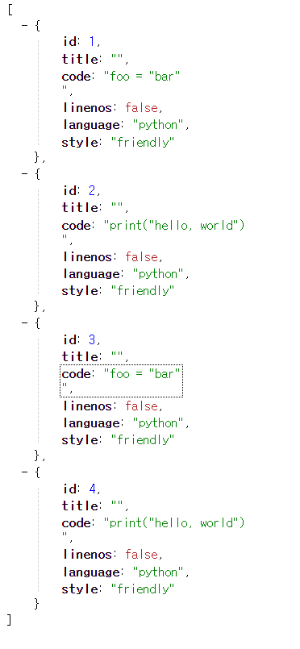
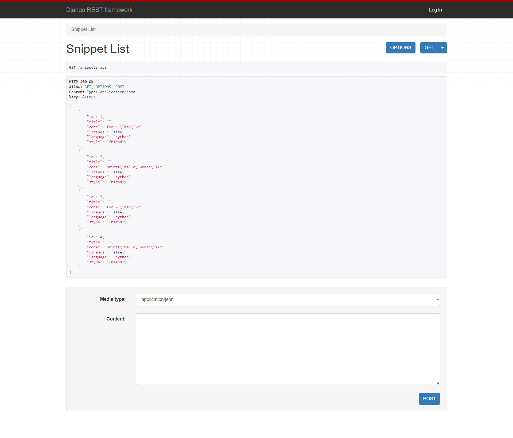

# [Django REST framework] 2. Response objects

### api_view, status

#### restapi > appapi > views.py

- 데코레이터로 응답 형태를 지정할 수 있다.
- 리턴되는 상탯값을 status모듈에서 사용할 수 있다.

```python
from rest_framework import status
from rest_framework.decorators import api_view
from rest_framework.response import Response
from .models import Snippet
from .serializers import SnippetSerializer

@api_view(['GET', 'POST'])
def snippet_list(request):
    if request.method == 'GET':
        snippets = Snippet.objects.all()
        serializer = SnippetSerializer(snippets, many=True)
        return Response(serializer.data)

    elif request.method == 'POST':
        serializer = SnippetSerializer(data=request.data)
        if serializer.is_valid():
            serializer.save()
            return Response(serializer.data, status=status.HTTP_201_CREATED)
        return Response(serializer.errors, status=status.HTTP_400_BAD_REQUEST)
    

@api_view(['GET', 'PUT', 'DELETE'])
def snippet_detail(request, pk):
    try:
        snippet = Snippet.objects.get(pk=pk)
    except Snippet.DoesNotExist:
        return Response(status=status.HTTP_404_NOT_FOUND)

    if request.method == 'GET':
        serializer = SnippetSerializer(snippet)
        return Response(serializer.data)

    if request.method == 'PUT':
        serializer = SnippetSerializer(snippet, data=request.data)
        if serializer.is_valid():
            serializer.save()
            return Response(serializer.data)
        return Response(serializer.errors, status=status.HTTP_400_BAD_REQUEST)

    if request.method == 'DELETE':
        snippet.delete()
        return Response(status=status.HTTP_204_NO_CONTENT)
```

| 응답번호 | 내용                                                         |
| -------- | ------------------------------------------------------------ |
| 200      | 성공 - 서버가 요청을 제대로 처리                             |
| 201      | 작성됨 - 성공적으로 요청되었으며 서버가 새 리소를 작성       |
| 204      | 콘텐츠 없음 - 서버가 요청을 성공적으로 처리했지만 콘텐츠를 제공하지 않음 |
| 400      | 잘못된 요청 - 서버가 요청의 구문을 인식하지 못함             |
| 404      | 찾을 수 없음 - 서버가 요청한 페이지를 찾을 수 없음           |

- 이 전과 달라진 점이 있다면 `JsonResponse`가 `Response`로 변경되었다.
- json으로 parse하지 않아도 된다.
- status가 명확하게 어떤 이유인지 알 수 있도록 해준다.

### 실행해보기

>  `snippet_list`에 put 요청 날리기

- 요청



- 응답 결과



- allow에 put이 없기 때문에 405에러가 발생한다.

> `snippet_detail`에 post 요청 

- 요청



```
body
{
  "id" : "steve",
  "pw" : "1234",
  "email" : "sss@ccc.com"
}
```

- 응답 결과



- allow에 post이 없기 때문에 405 에러를 반환한다.

### format 옵션

#### restapi > appapi > views.py

- `format=None` 추가하기

```python
@api_view(['GET', 'POST'])
def snippet_list(request, format=None):
    if request.method == 'GET':
        snippets = Snippet.objects.all()
        serializer = SnippetSerializer(snippets, many=True)
        return Response(serializer.data)

    elif request.method == 'POST':
        serializer = SnippetSerializer(data=request.data)
        if serializer.is_valid():
            serializer.save()
            return Response(serializer.data, status=status.HTTP_201_CREATED)
        return Response(serializer.errors, status=status.HTTP_400_BAD_REQUEST)


@api_view(['GET', 'PUT', 'DELETE'])
def snippet_detail(request, pk, format=None):
    try:
        snippet = Snippet.objects.get(pk=pk)
    except Snippet.DoesNotExist:
        return Response(status=status.HTTP_404_NOT_FOUND)

    if request.method == 'GET':
        serializer = SnippetSerializer(snippet)
        return Response(serializer.data)

    if request.method == 'PUT':
        serializer = SnippetSerializer(snippet, data=request.data)
        if serializer.is_valid():
            serializer.save()
            return Response(serializer.data)
        return Response(serializer.errors, status=status.HTTP_400_BAD_REQUEST)

    if request.method == 'DELETE':
        snippet.delete()
        return Response(status=status.HTTP_204_NO_CONTENT)
```

#### restapi > appapi > urls.py

- `format_suffix_patterns` 설정하기

```python
from django.urls import path
from .views import *
from rest_framework.urlpatterns import format_suffix_patterns

urlpatterns = [
    path('snippets/', snippet_list),
    path('snippets/<int:pk>/', snippet_detail),
]

urlpatterns = format_suffix_patterns(urlpatterns)
```

### 실행하기

##### json

- 응답 결과를 json으로 전달

- ```apl
  # header에 추가
  http http://127.0.0.1:8000/snippets/ Accept:application/json
  
  # url에 추가
  http http://127.0.0.1:8000/snippets.json
  ```



##### html

- 응답결과를 html 형식으로 전달

```apl
# header에 추가
http http://127.0.0.1:8000/snippets/ Accept:text/html

# url에 추가
http http://127.0.0.1:8000/snippets.api
```



