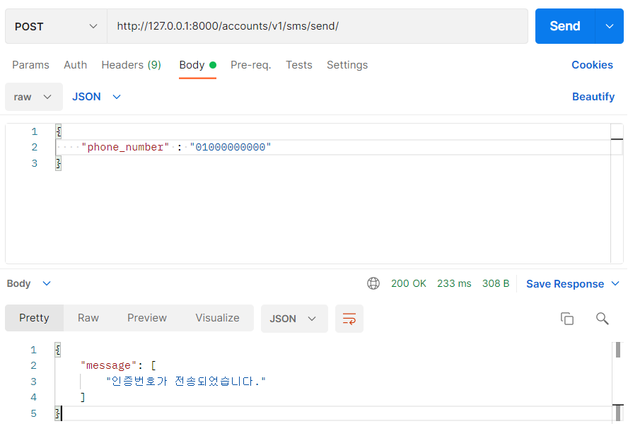
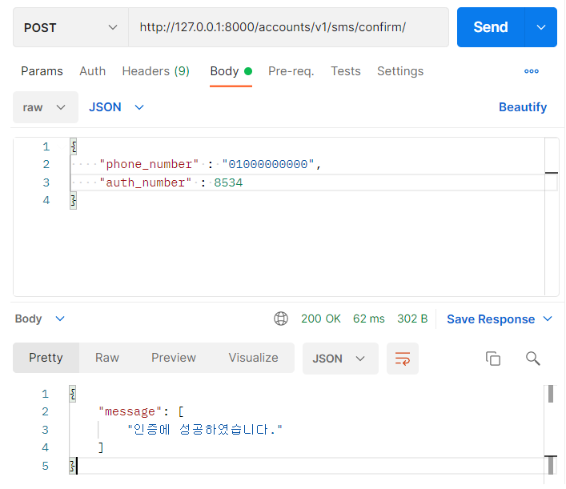

# [Django REST framework] 2. 휴대폰 인증 문자 API

- 1.휴대폰 인증 문자 모델 생성하기에서 만든 모델이 정확하게 동작하는지 API로 만들어서 확인하는 작업이다.

### 전화번호 인증 메시지 보내기 View

- 기본적으로 모든 요청은 인증된 사용자만 접근하도록 설정하였기에 `AllowAny`를 하여 모든 사용자가 접근 가능하도록 한다.

1. serializer로 먼저 사용자에게 입력받은 전화번호가 형식에 맞는지 확인한다.
2. valid
   1. vaild에 통과하지 못하면 해당 에러 메시지를 반환한다.
   2. 통과하는 경우 다음단계로 넘어간다.
3. 전화번호가 `SmsAuth`모델에 있으면 인증번호를 업데이트하고 없으면 새로 객체를 생성한다.

```python
class SMSAuthSendView(APIView):
    '''
        전화번호 인증하기
        전화번호 인증 메시지 보내는 view
    '''
    permission_classes = [AllowAny]

    def post(self, request):
        try:
            data = json.loads(request.body)
            # 만약 키 값에 phone_number이 없을 경우
            # 전화번호가 11자리 숫자가 맞는지 확인하기
            serializer = SMSSendSerializer(data=data)
            # 형식에 어긋나면 에러 메시지 반환
            if not serializer.is_valid():
                return Response(serializer.errors, status.HTTP_400_BAD_REQUEST)
            # 형식에 맞을 경우
            # 전화번호와 인증번호를 저장하거나 업데이트 하기
            SmsAuth.objects.update_or_create(phone_number=data['phone_number'])
            # 전송완료 되었으면 200 응답
            return Response({'message': ['인증번호가 전송되었습니다.']}, status.HTTP_200_OK)
        # 전송하지 못했을 경우 400 응답
        except KeyError:
            return Response({'message': ['필드 이름을 확인하세요.']}, status.HTTP_400_BAD_REQUEST)
        except TypeError:
            return Response({'message': ['필드 타입을 확인하세요']}, status.HTTP_400_BAD_REQUEST)
```

### SMSSendSerializer

1. 전화번호가 모델에서 정한 형식과 일치하는지 확인하기위해 정규식으로 확인한다.
2. RegexValidator를 사용하면 정규식의 형태와 해당 정규식이 아닐경우 나타내는 메시지도 설정 가능하다.

```python
# 전화번호 형식 확인하기
class SMSSendSerializer(serializers.ModelSerializer):
    phone_number = serializers.CharField(max_length=11, validators=[
        RegexValidator(regex=r"^010?[0-9]\d{3}?\d{4}$", message='전화번호 형식이 잘못되었습니다.')])

    class Meta:
        model = SmsAuth
        fields = ['phone_number']
```

### API 응답 결과



- 형식에 어긋나지 않으면 다음과 같이 정상적으로 메시지를 반환한다.

### 인증번호 일치하는지 확인하는 View

1. 인증번호를 보내는 View와 동일하게 사용자가 입력한 data를 먼저 `SmsConfirmSerializer`에서 확인한 후 다음 단계로 넘어간다.
2. 전화번호랑 인증번호를 `SmsAuth` 모델에 생성했던 `check_auth_number`함수에 인자로 넣어준다.
3. 일치하는 객체가 있다면 `User` 모델 중에서 해당 전화번호와 일치하는 `user` 를 filter한다.
4. user가 없거나 user는 있지만 회원가입을 하지 않은 경우
   1. user가 없으면 user를 생성하고
   2. user는 있지만 회원가입 하지 않은경우 회원가입 할 수 있다는 인증 완료 메시지를 반환한다.
5. 인증 번호가 다르거나 error의 경우 해당 error에 맞게 메시지를 반환한다.

```python
class SMSAuthConfirmView(APIView):
    permission_classes = [AllowAny]

    def post(self, request):
        try:
            data = json.loads(request.body)
            serializer = SmsConfirmSerializer(data=data)
            # 가입 진행을 위한 유효성 확인
            if not serializer.is_valid():
                return Response(serializer.errors, status.HTTP_400_BAD_REQUEST)
            phone_number, auth_number = data['phone_number'], data['auth_number']
            # 사용자가 입력한 인증번호랑 db에 저장된 인증번호랑 같은지 비교
            result = SmsAuth.check_auth_number(phone_number, auth_number)
            # 사용자가 입력한 인증번호 == db에 저장된 인증번호
            if result:
                user = User.objects.filter(phone_number=phone_number)
                # 사용자가 입력한 휴대전화번호로 가입된 User가 없거나
                # 이미 인증 확인을 진행했었지만 가입하지 않은 경우
                if not user.exists() or (user.exists() and len(user[0].email) == 0):
                    # User가 없다면 User 생성
                    if not user.exists():
                        User.objects.create(username=phone_number, phone_number=phone_number)
                    return Response({'message': ['인증에 성공하였습니다.']}, status.HTTP_200_OK)
            # 입력한 번호랑 저장된 인증번호가 다른 경우 확인 메시지 반환
            return Response({'auth_number': ['인증번호를 확인하세요.']}, status.HTTP_400_BAD_REQUEST)
        except KeyError:
            return Response({'message': ['필드 이름을 확인하세요']}, status.HTTP_400_BAD_REQUEST)
        except TypeError:
            return Response({'message': ['필드 타입을 확인하세요']}, status.HTTP_400_BAD_REQUEST)
```

### SmsConfirmSerializer

1. 여기서는 인증번호 유효성이 추가 되었다.
   1. 우리가 모델에서 인증번호를 1000 ~ 9999 사이의 4자리 숫자로 설정하였으니 여기서도 그 범위를 설정하여 준다.
   2. 또한 `IntegerField`를 뜯어보면 "1234"를 숫자 1234로 인식할 수 있게 되어있어 이 부분에서도 수정하였다.
   3. 모델처럼 무조건 숫자가 들어오도록 하고 싶어 추가적으로 int인지 확인하는 `validate_auth_number`를 커스텀하였다.
2. 전화번호 validate같은 경우 해당 번호로 가입 내역이 있는지 없는지 판단하기 위해 추가하였다.
   1. `SmsAuth`모델에서 해당 전화번호로 인증한 내역이 없으면 인증부터 해야 하는 메시지를 반환한다.
   2. 만약 회원인데 다시 가입하려는 경우 로그인 하라는 메시지를 반환한다.
   3. 1,2가 아니면 전화번호를 반환한다.

```python
class SmsConfirmSerializer(serializers.ModelSerializer):
    phone_number = serializers.CharField(max_length=11, validators=[
        RegexValidator(regex=r"^010?[0-9]\d{3}?\d{4}$", message='전화번호 형식이 잘못되었습니다.')])
    auth_number = serializers.IntegerField(min_value=1000, max_value=9999)

    class Meta:
        model = SmsAuth
        fields = ['phone_number', 'auth_number']

    def validate_auth_number(self, value):
        value = self.initial_data.get('auth_number')
        if isinstance(value, int):
            return value
        raise serializers.ValidationError(_("유효한 정수(integer)를 넣어주세요."))

    def validate_phone_number(self, phone_number):
        '''
        가입 내역이 있는지 확인하기
        '''
        # 전화 번호 인증 확인하기
        phone_number_obj = SmsAuth.objects.filter(phone_number=phone_number)
        user = User.objects.filter(phone_number=phone_number)
        # 전화 번호 인증하지 않았을 경우
        if not phone_number_obj.exists():
            raise serializers.ValidationError(_("전화번호 인증을 진행해주세요."))
        else:
            if not user.exists() or (user.exists() and len(user[0].email) == 0):
                # 1. 인증번호 확인 과정을 거치지 않았거나
                # 2. 인증과정은 거쳤지만 가입하지 않은 경우
                # phone_number 리턴
                return phone_number
            elif user.exists() and len(user[0].email) > 0:
                # 이미 회원인데 다시 가입하려는 경우
                raise serializers.ValidationError(_("가입내역이 있습니다. 로그인을 진행해주세요."))
```

### API 응답 결과

