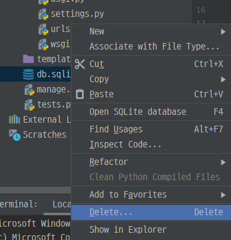
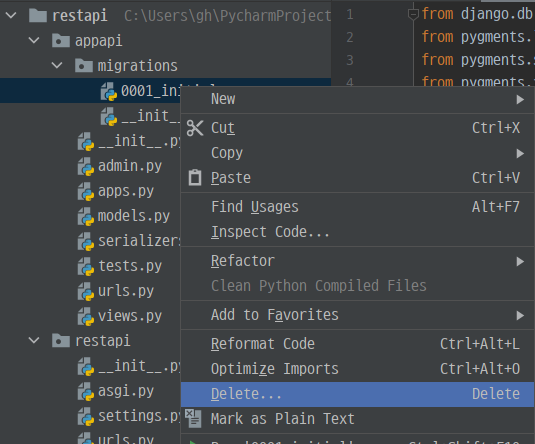
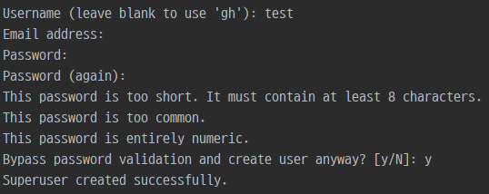
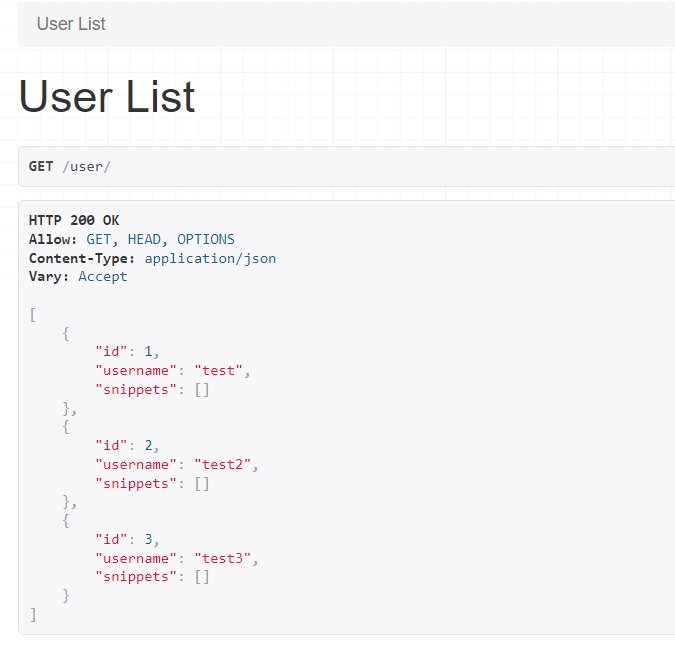
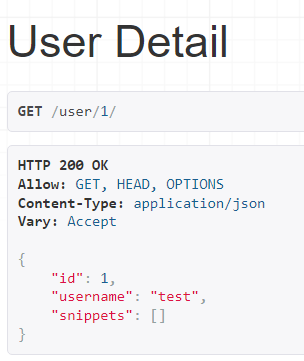

# [Django REST framework] 4. Authentication& Permissions

- 1 ~3장까지의 rest api는 누구나 접근해서 조회하거나 생성, 수정, 삭제할 수 있었다.
- 이러한 자유성에 제한을 줘보자.

### 모델에 필드 추가하기

#### restapi > appapi > models.py

```python
from pygments.lexers import get_lexer_by_name
from pygments.formatters.html import HtmlFormatter
from pygments import highlight

class Snippet(BaseModel):
    title = models.CharField(max_length=100, blank=True, default='')
    code = models.TextField()
    linenos = models.BooleanField(default=False)
    language = models.CharField(choices=LANGUAGE_CHOICES, default='python', max_length=100)
    style = models.CharField(choices=STYLE_CHOICES, default='friendly', max_length=100)
    owner = models.ForeignKey('auth.User', related_name='snippets', on_delete=models.CASCADE # 추가
    highlighted = models.TextField() #추가

    class Meta:
        ordering = ['created_at']
	
    # 추가
    def save(self, *args, **kwargs):
        lexer = get_lexer_by_name(self.language)
        linenos = 'table' if self.linenos else False
        options = {'title' : self.title} if self.title else {}
        formatter = HtmlFormatter(style=self.style, linenos=linenos, full=True, **options)
        self.highlighted = highlight(self.code, lexer, formatter)
        super().save(*args, **kwargs)
```

- 기존 `Snippet` 모델을 수정하였다.

### db 삭제

- 기존 db에는 우리가 저장한 데이터들이 존재하기 때문에 삭제하고 다시 생성하자.
  - migrations 파일도 같이 삭제한다.

- DB 삭제



- migrations 파일 삭제



- migrations, migrate 하기
  - 그러면 다시 db와 migrations 파일이 생성된다.

```bash
python manage.py makemigrations appapi
python manage.py migrate
```

### 유저 생성

- 빠르게 유저 생성을 위해서 `createsuperuser`를 사용하여 유저를 생성한다.
  - 유저 이름은 test, test2, test3으로 하였다.

```bash
python manage.py createsuperuser
```



### 유저 모델 endpoint 설정하기

#### restapi > appapi > serializers.py

```python
from django.contrib.auth.models import User

class UserSerializer(serializers.ModelSerializer):
    snippets = serializers.PrimaryKeyRelatedField(many=True, queryset=Snippet.objects.all())

    class Meta:
        model = User
        fields = ['id', 'username', 'snippets']
```

- `snippets`가 User model을 외래키로 설정하고 있는데 이 필드를  `ModelSerializer` 클래스가 default로 추가하지 않기 때문에 직접 추가한다.

- `PrimaryKeyRelatedField`는 기본 키를 사용하여 관계의 대상을 나타내기 위해 사용될 수 있다.

### view 설정하기

#### restapi > appapi > views.py

- 읽기 전용으로만 설정해보자.

```python
from django.contrib.auth.models import User

class UserList(generics.ListAPIView):
    queryset = User.objects.all()
    serializer_class = UserSerializer


class UserDetail(generics.RetrieveAPIView):
    queryset = User.objects.all()
    serializer_class = UserSerializer
```

### url 설정하기

#### restapi > appapi > urls.py

```python
urlpatterns = [
    path('snippets/', SnippetList.as_view()),
    path('snippets/<int:pk>/', SnippetDetail.as_view()),
    path('user/', UserList.as_view()),
    path('user/<int:pk>/', UserDetail.as_view()),
]
```

### 실행해보기

##### http://127.0.0.1:8000/user/



- UserSerializer 에서 지정한 snippets가 같이 나온것을 알 수 있다.
  - 아직 snippets에 저장한 내용이 없어서 빈 리스트가 나온다.

##### http://127.0.0.1:8000/user/1/



- 1번 유저의 정보를 볼 수 있다.