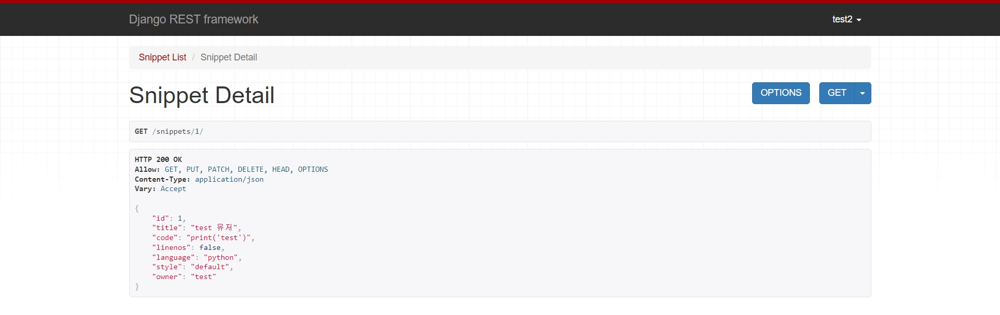

# [Django REST framework] 4. Authentication& Permissions

- 1 ~3장까지의 rest api는 누구나 접근해서 조회하거나 생성, 수정, 삭제할 수 있었다.
- 이러한 자유성에 제한을 줘보자.

### 모델에 필드 추가하기

#### restapi > appapi > models.py

```python
from pygments.lexers import get_lexer_by_name
from pygments.formatters.html import HtmlFormatter
from pygments import highlight

class Snippet(BaseModel):
    title = models.CharField(max_length=100, blank=True, default='')
    code = models.TextField()
    linenos = models.BooleanField(default=False)
    language = models.CharField(choices=LANGUAGE_CHOICES, default='python', max_length=100)
    style = models.CharField(choices=STYLE_CHOICES, default='friendly', max_length=100)
    owner = models.ForeignKey('auth.User', related_name='snippets', on_delete=models.CASCADE # 추가
    highlighted = models.TextField() #추가

    class Meta:
        ordering = ['created_at']
	
    # 추가
    def save(self, *args, **kwargs):
        lexer = get_lexer_by_name(self.language)
        linenos = 'table' if self.linenos else False
        options = {'title' : self.title} if self.title else {}
        formatter = HtmlFormatter(style=self.style, linenos=linenos, full=True, **options)
        self.highlighted = highlight(self.code, lexer, formatter)
        super().save(*args, **kwargs)
```

- 기존 `Snippet` 모델을 수정하였다.

### db 삭제

- 기존 db에는 우리가 저장한 데이터들이 존재하기 때문에 삭제하고 다시 생성하자.
  - migrations 파일도 같이 삭제한다.

- DB 삭제


- migrations 파일 삭제


- migrations, migrate 하기
  - 그러면 다시 db와 migrations 파일이 생성된다.

```bash
python manage.py makemigrations appapi
python manage.py migrate
```

### 유저 생성

- 빠르게 유저 생성을 위해서 `createsuperuser`를 사용하여 유저를 생성한다.
  - 유저 이름은 test, test2, test3으로 하였다.

```bash
python manage.py createsuperuser
```


### 유저 모델 endpoint 설정하기

#### restapi > appapi > serializers.py

```python
from django.contrib.auth.models import User

class UserSerializer(serializers.ModelSerializer):
    snippets = serializers.PrimaryKeyRelatedField(many=True, queryset=Snippet.objects.all())

    class Meta:
        model = User
        fields = ['id', 'username', 'snippets']
```

- `snippets`가 User model을 외래키로 설정하고 있는데 이 필드를  `ModelSerializer` 클래스가 default로 추가하지 않기 때문에 직접 추가한다.

- `PrimaryKeyRelatedField`는 기본 키를 사용하여 관계의 대상을 나타내기 위해 사용될 수 있다.

### view 설정하기

#### restapi > appapi > views.py

- 읽기 전용으로만 설정해보자.

```python
from django.contrib.auth.models import User

class UserList(generics.ListAPIView):
    queryset = User.objects.all()
    serializer_class = UserSerializer


class UserDetail(generics.RetrieveAPIView):
    queryset = User.objects.all()
    serializer_class = UserSerializer
```

### url 설정하기

#### restapi > appapi > urls.py

```python
urlpatterns = [
    path('snippets/', SnippetList.as_view()),
    path('snippets/<int:pk>/', SnippetDetail.as_view()),
    path('user/', UserList.as_view()),
    path('user/<int:pk>/', UserDetail.as_view()),
]
```

### 실행해보기

##### http://127.0.0.1:8000/user/


- UserSerializer 에서 지정한 snippets가 같이 나온것을 알 수 있다.
  - 아직 snippets에 저장한 내용이 없어서 빈 리스트가 나온다.

##### http://127.0.0.1:8000/user/1/


- 1번 유저의 정보를 볼 수 있다.

### snippets을 User와 연결시키기

- snippets을 생성할 때 어떤 유저가 생성하는지 같이 저장하기 위해 `perform_create()`를 오버라이딩 한다.

#### restapi > appapi > views.py

```python
class SnippetList(generics.ListCreateAPIView):
    queryset = Snippet.objects.all()
    serializer_class = SnippetSerializer

    def perform_create(self, serializer):
        serializer.save(owner=self.request.user)
```

- `perform_create()`는 처음사용해 보는 기능인데 유용해보인다.

### serializer 업데이트

- `SnippetSerializer`에 어떤 유저가 만들었는지 `owner`를 추가한다.

#### restapi > appapi > serializers.py

```python
class SnippetSerializer(serializers.ModelSerializer):
    owner = serializers.ReadOnlyField(source='owner.username')

    class Meta:
        model = Snippet
        fields = ['id', 'title', 'code', 'linenos', 'language', 'style', 'owner']
```

### view에 permissions 요청 추가

- REST framework에는 다양한 permission 클래스가 있지만, 이번에 사용할 기능은 `IsAuthenticatedOrReadOnly`다.
  - authenticated 된 요청만 읽기, 쓰기가 되고 unauthenticated는 읽기만 가능하다.

#### restapi > appapi > views.py

```python
from rest_framework import permissions

class SnippetList(generics.ListCreateAPIView):
    queryset = Snippet.objects.all()
    serializer_class = SnippetSerializer
    permission_classes = [permissions.IsAuthenticatedOrReadOnly]

    def perform_create(self, serializer):
        serializer.save(owner=self.request.user)


class SnippetDetail(generics.RetrieveUpdateDestroyAPIView):
    queryset = Snippet.objects.all()
    serializer_class = SnippetSerializer
    permission_classes = [permissions.IsAuthenticatedOrReadOnly]
```

### Browsable API 로그인 추가하기

- 기존에는 url에 접근해서 바로 snippet를 추가할 수 있었는데 로그인을 해야 생성할 수 있도록 변경하자.

#### restapi > restapi > urls.py

```python
urlpatterns = [
    path('admin/', admin.site.urls),
    path('', include('appapi.urls')),
    path('api-auth/', include('rest_framework.urls')),
]
```

### 실행해보기

##### permission 차이

- permission_classes 없을 때
  - 밑에 snippet를 바로 생성할 수 있도록 post 요청 창이 있다.


- permission_classes 있을 때
  - post 요청 창이 사라지고 오른쪽 위에 `Login in` 버튼이 생겼다.


##### 로그인 후

- permission_classes를 충족하니 오른쪽에 로그인한 유저가 나오고 snippet를 생성할 수 있는  post 창이 다시 생겼다.


### 데이터 생성해보기


- 결과를 보면 내가 로그인한 user가 owner로 들어가있고 입력했던 값들이 모두 잘 들어가서 201 응답을 보내주었다.

```python
class SnippetList(generics.ListCreateAPIView):
    queryset = Snippet.objects.all()
    serializer_class = SnippetSerializer
    permission_classes = [permissions.IsAuthenticatedOrReadOnly]

    def perform_create(self, serializer):
        print(self.request.user)
        serializer.save(owner=self.request.user)
```

- snippet를 생성할 때 user가 잘 들어오나 궁금해서 print를 해보았다.
  - test로 잘 들어온다.
  - 나중에 로그인 기능이 필요하면 잘 사용할 것 같다.


### User snippets 생성 번호 보기


- test 유저가 2개를 생성하여 snippets에 1,2번이 들어있다.

### Object level permissions

- snippet를 생성한 유저만 해당 snippet를 수정하거나 삭제할 수 있도록 권한을 줘보자.
- 커스텀 하여 만들자.

#### restapi  > appapi > permissions.py

```python
from rest_framework import permissions


class IsOwnerOrReadOnly(permissions.BasePermission):
    def has_object_permission(self, request, view, obj):
        if request.method in permissions.SAFE_METHODS:
            return True

        return obj.owner == request.user
```

#### restapi > appapi > views.py

```python
from .permissions import IsOwnerOrReadOnly

class SnippetDetail(generics.RetrieveUpdateDestroyAPIView):
    queryset = Snippet.objects.all()
    serializer_class = SnippetSerializer
    permission_classes = [permissions.IsAuthenticatedOrReadOnly, IsOwnerOrReadOnly]
```

- `SnippetDetail`에 생성한 권한 class를 추가한다.

### 실행해보기

http://127.0.0.1:8000/snippets/1/

##### 조회하는 snippet 생성 유저 == 로그인 유저


- test 유저가 생성한 snippet이기 때문에 `delete`, `put`기능을 사용할 수 있다.

##### 조회하는snippet 유저 != 로그인 유저




- 로그인을 하지 않았거나 유저가 다르면 `delete`, `put` 기능을 사용할 수 없다.

