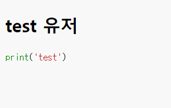
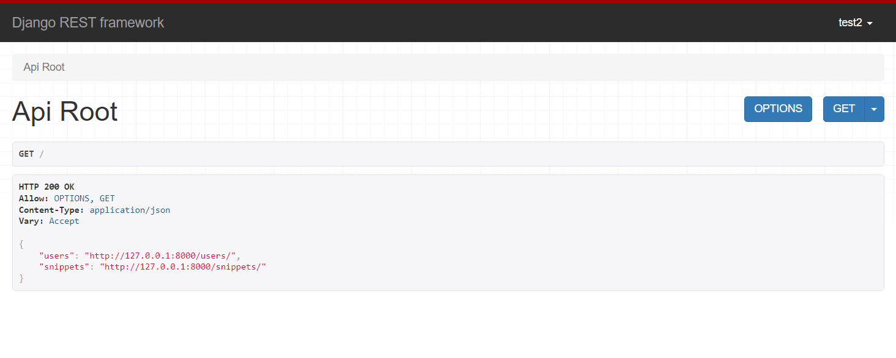
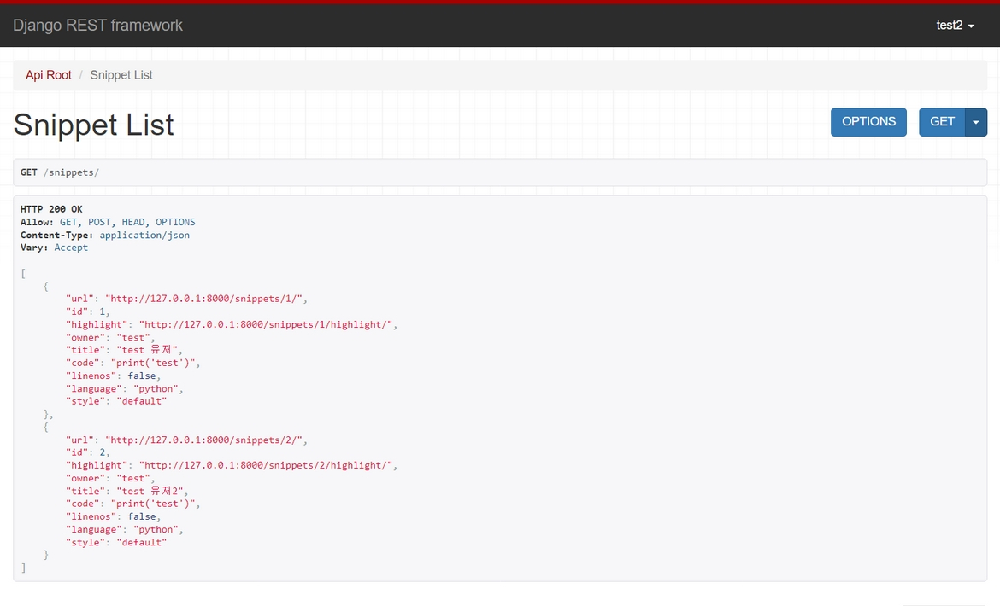
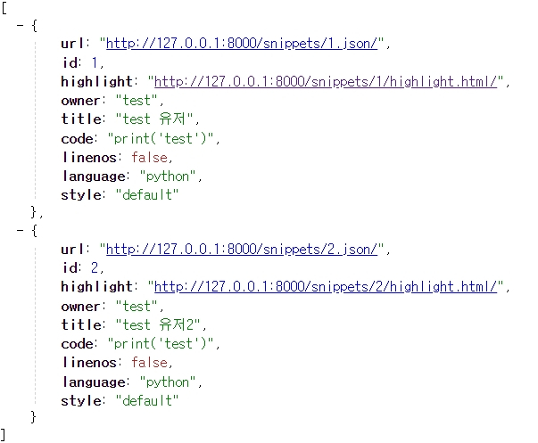
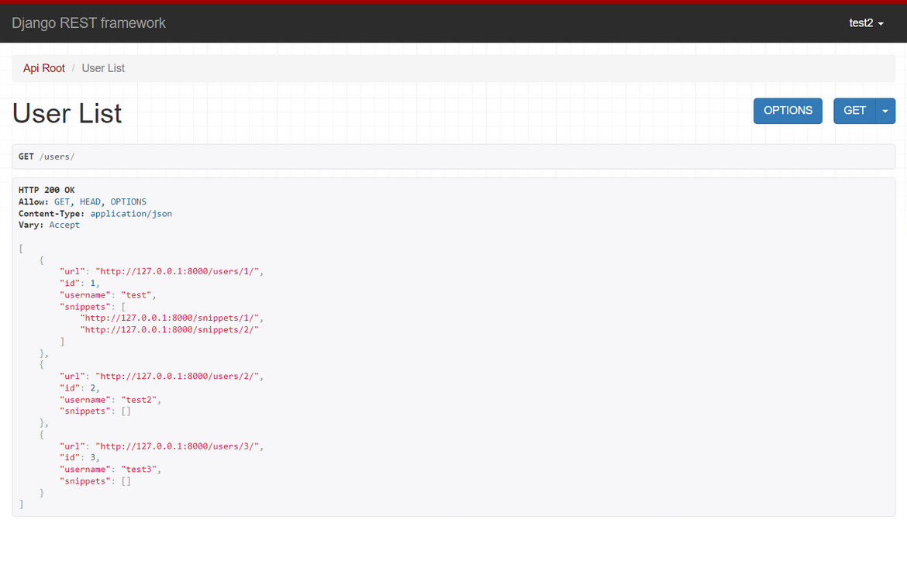
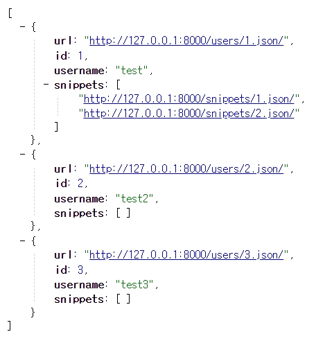
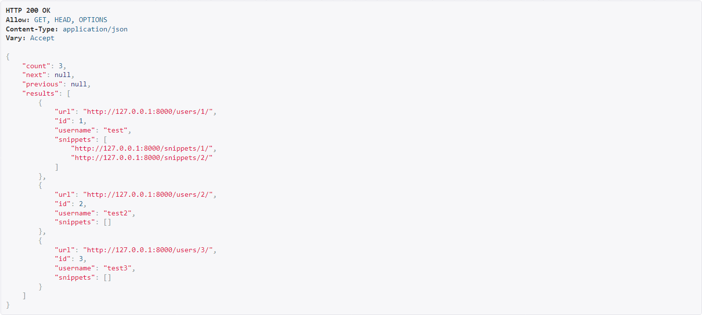

# [Django REST framework] 5: Relationships & Hyperlinked APIs

### endpoint for the root of our API 만들기

- 이전에 만들었던 api는 endpoint가 `snippet`, `user` 각각 2개였다.
- 이걸 하나의 endpoint로 만들자.

#### restapi > appapi > views.py

```python
from rest_framework.decorators import api_view
from rest_framework.response import Response
from rest_framework.reverse import reverse

@api_view(['GET'])
def api_root(request, format=None):
    return Response({'users': reverse('user-list', request=request, format=format),
                     'snippets': reverse('snippet-list', request=request, format=format)})
```

- `reverse`는 정규화된 url을 반환한다.
- 나중에 `urls.py`에서 이름으로 식별한다.

### endpoint for the highlighted snippets 만들기

#### restapi > appapi > views.py

- `get()`를 만들어서 해보자.

```python
from rest_framework import renderers

class SnippetHighlight(generics.GenericAPIView):
    queryset = Snippet.objects.all()
    renderer_classes = [renderers.StaticHTMLRenderer]

    def get(self, requets, *args, **kwargs):
        snippet = self.get_object()
        return Response(snippet.highlighted)
```

#### restapi > appapi > urls.py

```python
urlpatterns = [
    path('', api_root),
    path('snippets/<int:pk>/highlight/', SnippetHighlight.as_view()),
]
```

### 실행해보기

- `path('', api_root)`는 view에서 현재 연결된 url이 없어서 오류가 난다.

http://127.0.0.1:8000/snippets/1/highlight/



- view에서 `renderer_classes = [renderers.StaticHTMLRenderer]`를 설정했기에 우리가 알던 html이 아니라 이런 화면이 나온다.

### Hyperlinking our API

- serializer에 적용된 `ModelSerializer`를 `HyperlinkedModelSerializer`로 변경해여 한다.

#### restapi > appapi > serializers.py

```python
class SnippetSerializer(serializers.HyperlinkedModelSerializer):
    owner = serializers.ReadOnlyField(source='owner.username')
    highlight = serializers.HyperlinkedIdentityField(view_name='snippet-highlight', format='html')

    class Meta:
        model = Snippet
        fields = ['url', 'id', 'highlight', 'owner', 'title', 'code', 'linenos', 'language', 'style']


class UserSerializer(serializers.HyperlinkedModelSerializer):
    snippets = serializers.HyperlinkedRelatedField(many=True, view_name='snippet-detail', read_only=True)

    class Meta:
        model = User
        fields = ['url', 'id', 'username', 'snippets']
```

### url에 이름 부여하기

- 현재 serializer이나 view에 url과 연결되는 이름들을 작성하였다. 
  - 이것들은 연결시킬 수 있도록 url에 이름을 부여해보자.

```python
urlpatterns = [
    path('', api_root),
    path('snippets/', SnippetList.as_view(), name='snippet-list'),
    path('snippets/<int:pk>/', SnippetDetail.as_view(), name='snippet-detail'),
    path('snippets/<int:pk>/highlight/', SnippetHighlight.as_view(), name='snippet-highlight'),
    path('users/', UserList.as_view(), name='user-list'),
    path('users/<int:pk>/', UserDetail.as_view(), name='user-detail'),
]
```

### 실행해보기

http://127.0.0.1:8000/

- view에서 작성한 2개의 Response로 갈 수 있게 링크가 걸려있다.
  - 각각의 링크를 클릭하면 해당 링크로 이동해서 결과를 보여준다.



http://127.0.0.1:8000/snippets/

- `serializer`에서 수정해서 바로 이동할 수 있도록 하이퍼링크가 걸려있다.



- json 형태로 봐도 링크가 걸려있다



http://127.0.0.1:8000/users/

- user detail로 들어갈 수 있는 링크와 유저가 생성한 snippet로 들어갈 수 있는 링크가 있다.



http://127.0.0.1:8000/users.json



### 페이지네이션 추가

- 한 페이지에 보여주고 싶은 page_size를 조정할 수 있다.

### restapi > restapi > settings.py

```python
REST_FRAMEWORK = {
    'DEFAULT_PAGINATION_CLASS': 'rest_framework.pagination.PageNumberPagination',
    'PAGE_SIZE': 10
}
```

### 실행해보기



- 아까는 보이지 않았던 `count`, `next`, `previous`가 생겼다.

