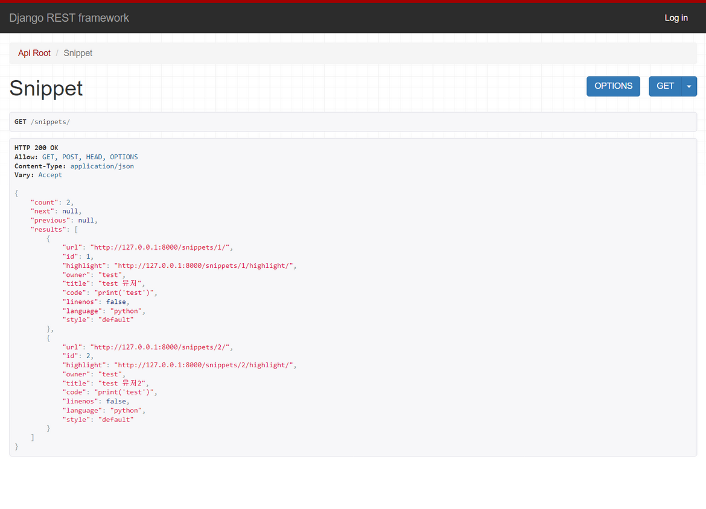
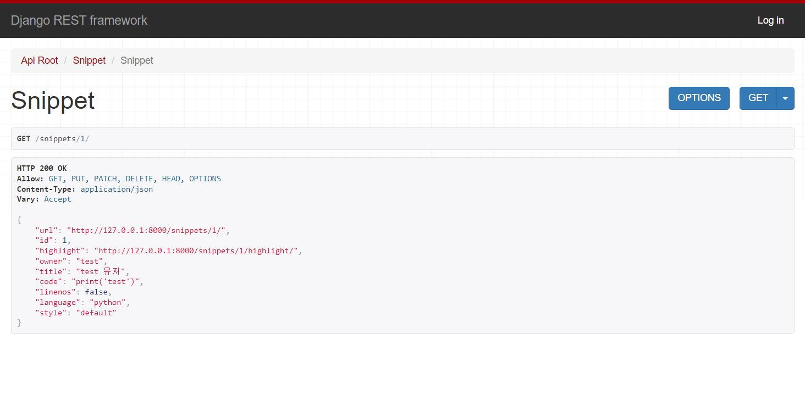
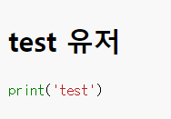
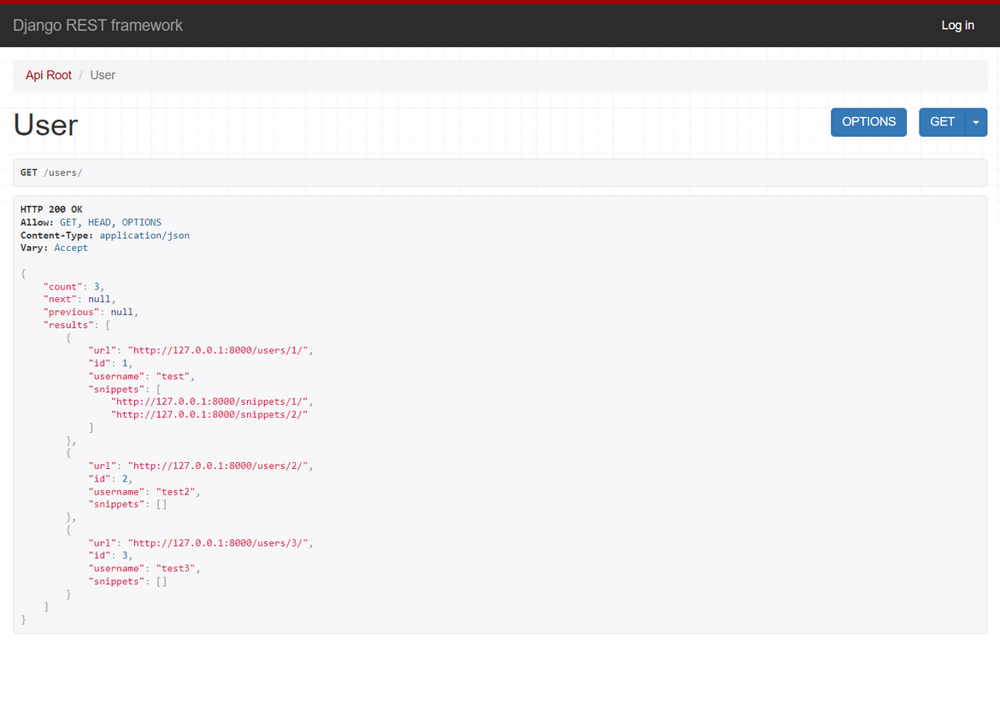
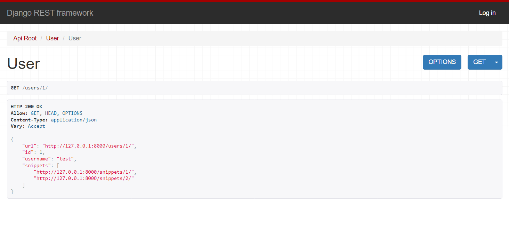
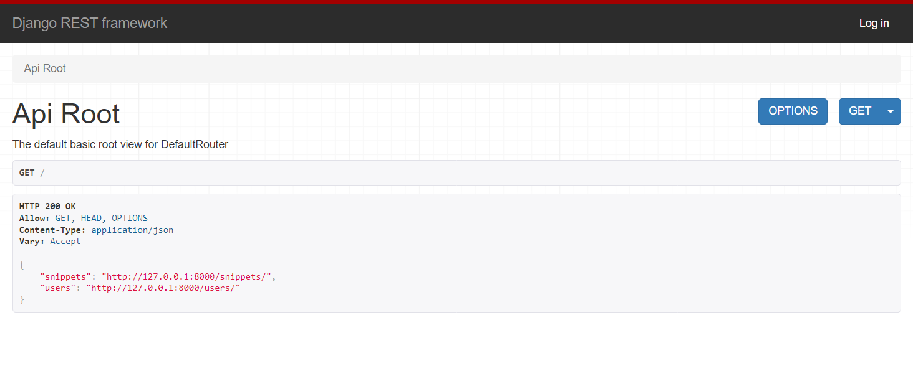

# [Django REST framework] 6. ViewSets & Routers

### ViewSets 사용하기

####  restapi > appapi > views.py

- List, Detail을 나누었던 것을 하나로 합쳐서 사용할 수 있다.

```python
class UserViewSet(viewsets.ReadOnlyModelViewSet):
    queryset = User.objects.all()
    serializer_class = UserSerializer
```

- `ReadOnlyModelViewSet` 는 list, retrieve 를 함께 사용할 수 있다.

```python
class SnippetViewSet(viewsets.ModelViewSet):
    queryset = Snippet.objects.all()
    serializer_class = SnippetSerializer
    permission_classes = [permissions.IsAuthenticatedOrReadOnly, IsOwnerOrReadOnly]

    @action(detail=True, renderer_classes=[renderers.StaticHTMLRenderer])
    def highlight(self, request, *args, **kwargs):
        snippet = self.get_object()
        return Response(snippet.highlighted)

    def perform_create(self, serializer):
        serializer.save(owner=self.request.user)
```

- `@action` 데코레이터는 action을 커스텀 할 수 있다.

  - endpoint가 `create`/ `update` / `delete`가 아닌 스타일에 적용할 수 있다.

  - default 응답은 `get` 이다.

  - `post` 요청은 다음과 같이 `methods`를 추가한다.

  - ```python
        @action(methods=['post'], detail=True)
        def perform_create(self, serializer):
            serializer.save(owner=self.request.user)
    ```

  - `detail=True`의 뜻
    - a single object를 보여준다.
  - `detail=False` 면 a list of objects을 보여준다. 
    - detail 적는걸 pass해도 같은 결과를 return한다.

### url 수정하기

### restapi > appapi > urls.py

- 먼저 각각의 요청에 맞는 함수 실행을 연결 시키도록 선언해준다.

```python
snippet_list = SnippetViewSet.as_view({
    'get': 'list',
    'post': 'create'
})

snippet_detail = SnippetViewSet.as_view({
    'get': 'retrieve',
    'put': 'update',
    'patch': 'partial_update',
    'delete': 'destroy'
})

snippet_highlight = SnippetViewSet.as_view({
    'get': 'highlight'
}, renderer_classes=[renderers.StaticHTMLRenderer])

user_list = UserViewSet.as_view({
    'get': 'list'
})

user_detail = UserViewSet.as_view({
    'get': 'retrieve'
})

urlpatterns = [
    path('', api_root),
    path('snippets/', snippet_list, name='snippet-list'),
    path('snippets/<int:pk>/', snippet_detail, name='snippet-detail'),
    path('snippets/<int:pk>/highlight/', snippet_highlight, name='snippet-highlight'),
    path('users/', user_list, name='user-list'),
    path('users/<int:pk>/', user_detail, name='user-detail'),
]
```

- url과 연결시킨다.

### 실행해보기

http://127.0.0.1:8000/snippets/



http://127.0.0.1:8000/snippets/1/



http://127.0.0.1:8000/snippets/1/highlight/



http://127.0.0.1:8000/users/



http://127.0.0.1:8000/users/1/



- 모두 잘 작동한다.

### Router 사용하기

- URL을 다시 디자인하는건 불편하다.
- 자동으로 연결되도록 router를 사용하자.

```python
from rest_framework.routers import DefaultRouter

router = DefaultRouter()
router.register(r'snippets', SnippetViewSet)
router.register(r'users', UserViewSet)

urlpatterns = [
    path('', include(router.urls)),
]
```

### 실행해보기

http://127.0.0.1:8000/`



- `api_root()`로 만들었던 view 없이도 같은 화면을 보여준다.

- 모든 화면이 1차로 연결했던 url처럼 잘 작동한다.
  - 알아서 구분해서 연결해준다.
- 더욱이 urlpatterns 에 `format_suffix_patterns`를 다시 선언하지 않아도 url.json으로 하면 json 형식으로 변환해준다.

- 참 좋은 기능이다. 매우 편리하다.