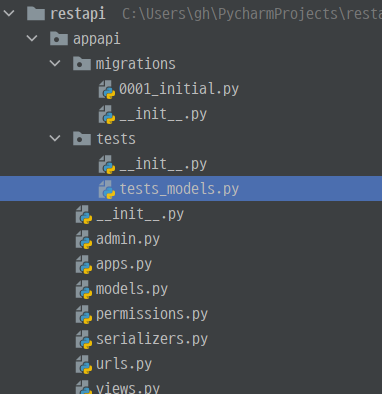
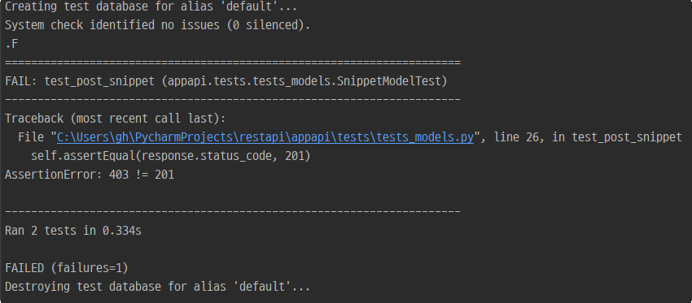
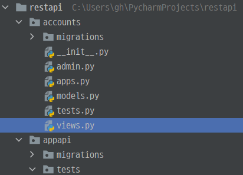

# [Django REST framework] 7. 테스트 코드 작성 기본

### [test request 만들기]

- 장고에 존재하는 `RequestFactory` class를 확장해서 사용한 `APIRequestFactory` 클래스를 사용하자.
  - 기본적인 `get()`, `.post()`, `.put()`, `.patch()`, `.delete()`, `.head()` and `options()`을 사용할 수 있다.

#### [기본적인 test 코드]

- 아래와 같이 기본적인 구조를 따르면서 작성하자.

```python
from django.contrib.auth.models import AnonymousUser, User
from django.test import RequestFactory, TestCase

from .views import MyView, my_view

class SimpleTest(TestCase):
    def setUp(self):
        # Every test needs access to the request factory.
        self.factory = RequestFactory()
        self.user = User.objects.create_user(
            username='jacob', email='jacob@…', password='top_secret')

    def test_details(self):
        # Create an instance of a GET request.
        request = self.factory.get('/customer/details')

        # Recall that middleware are not supported. You can simulate a
        # logged-in user by setting request.user manually.
        request.user = self.user

        # Or you can simulate an anonymous user by setting request.user to
        # an AnonymousUser instance.
        request.user = AnonymousUser()

        # Test my_view() as if it were deployed at /customer/details
        response = my_view(request)
        # Use this syntax for class-based views.
        response = MyView.as_view()(request)
        self.assertEqual(response.status_code, 200)
```

- 기본적인 구조는 아래와 같이 appapi에 tests폴더를 만들어서 작업하였다.

  - ```bash
    python manage.py test
    ```

  - 위에 명령어를 실행하면 test 파일을 찾아서 실행시켜 준다.



##### restapi > appapi > tests > tests_models.py

##### get 요청

- 기본 formats은 `multipart` 와 `json`이다.

```python
from django.contrib.auth.models import AnonymousUser, User
from django.test import TestCase
from ..models import Snippet
from rest_framework.test import APIRequestFactory
from ..views import SnippetViewSet, UserViewSet


class SnippetModelTest(TestCase):
    def setUp(self):
        self.factory = APIRequestFactory()

    def test_get_snippet(self):
        request = self.factory.get('/snippets/', content_type='application/json')
        view = SnippetViewSet.as_view(actions={'get': 'list'})
        response = view(request)
        self.assertEqual(response.status_code, 200)
```

- `json` 형태로 보내려면 `format`를 추가하면 된다.

```python
class SnippetModelTest(TestCase):
    def setUp(self):
        self.factory = APIRequestFactory()

    class SnippetModelTest(TestCase):
    def setUp(self):
        self.factory = APIRequestFactory()

    def test_get_snippet(self):
        request = self.factory.get('/snippets/',  format='json')
        view = SnippetViewSet.as_view(actions={'get': 'list'})
        response = view(request)
        self.assertEqual(response.status_code, 200)
```

- `content_type`을 확실하게 지정해서 보내야 한다면 추가하면 된다.
  - `content_type='application/json'`은 클라이언트가 서버로 요청을 보낼 때 `json`으로 요청을 보낸다는 뜻이다.

```python
class SnippetModelTest(TestCase):
    def setUp(self):
        factory = APIRequestFactory()
    
    def test_get_snippet(self):
        request = self.factory.get('/snippets/', content_type='application/json')
        view = SnippetViewSet.as_view(actions={'get': 'list'})
        response = view(request)
        self.assertEqual(response.status_code, 200)

```

- as_view를 사용하면 보내는 요청에 대한 것을 정확하게 기입해줘야 한다.
  - 후에 cilent를 사용하면 router를 사용한 것처럼 바로 연결시켜준다.

```bash
Ran 1 test in 0.003s

OK
Destroying test database for alias 'default'...
```

- 성공했다는 결과를 보여준다.

##### post 요청

```python
class SnippetModelTest(TestCase):
    def setUp(self):
        self.factory = APIRequestFactory()

    def test_get_snippet(self):
        request = self.factory.get('/snippets/', content_type='application/json')
        view = SnippetViewSet.as_view(actions={'get': 'list'})
        response = view(request)
        self.assertEqual(response.status_code, 200)

    def test_post_snippet(self):
        request = self.factory.post('/snippets/', {'code': 'print("테스트코드")'})
        view = SnippetViewSet.as_view(actions={'get': 'list', "post": 'create'})
        response = view(request)
        self.assertEqual(response.status_code, 201)
```



- `post`요청을 하려면 로그인을 해서 user를 넘겨줘야 하는데 그렇지 않고 code만 넘겨줬다.

| 에러코드 | 내용                                                         |
| -------- | ------------------------------------------------------------ |
| 403      | 작동중인 서버에 클라이언트의 요청이 도달했으나, 서버가 클라이언트의 접근을 거부<br/>즉, 지정된 URL에 엑서스 할 수 있는 권한이 없다는 뜻이다. |

### [authentication 부여하기]

- `post`요청 같은 경우 로그인을 해여한다.
- 직접 authentication을 force하여 해결하는 방법이다.

```python
from django.contrib.auth.models import AnonymousUser, User
from django.test import TestCase
from ..models import Snippet
from rest_framework.test import APIRequestFactory
from ..views import SnippetViewSet, UserViewSet
from rest_framework.test import force_authenticate # 추가된 import


class SnippetModelTest(TestCase):
    def setUp(self):
        self.factory = APIRequestFactory()
        # user 객체를 생성
        self.user = User.objects.create_user(username='test', password='1234')

    def test_get_snippet(self):
        request = self.factory.get('/snippets/', content_type='application/json')
        view = SnippetViewSet.as_view(actions={'get': 'list'})
        response = view(request)
        self.assertEqual(response.status_code, 200)

    def test_post_snippet(self):
        # 위에서 생성한 user 객체 불러오기
        user = self.user
        request = self.factory.post('/snippets/', {'code': 'print("테스트코드")'})
        # user를 post 요청에 인증시키기
        force_authenticate(request, user=user)
        view = SnippetViewSet.as_view(actions={'get': 'list', "post": 'create'})
        response = view(request)
        self.assertEqual(response.status_code, 201)
```

```bash
Creating test database for alias 'default'...
System check identified no issues (0 silenced).
..
----------------------------------------------------------------------
Ran 2 tests in 0.401s

OK
Destroying test database for alias 'default'...
```

- `force_authentication` 을 하여 `snippet`가 생성되었다.

- 만약에 `token`을 부여해야 한다면 해당 설정을 추가하면 된다.

```python
force_authenticate(request, user=user, token=user.auth_token)
```

- 세션 인증 user 로그인 이라면 아래와 같이 설정한다.

```python
def test_post_snippet(self):
    user = self.user
    request = self.factory.post('/snippets/', {'code': 'print("테스트코드")'})
    request.user = user
    view = SnippetViewSet.as_view(actions={'get': 'list', "post": 'create'})
    response = view(request)
    self.assertEqual(response.status_code, 201)
```

### [CSRF 토큰]

- 장고의 기본 `RequestFactory`에서는 필요하지 않다.
  - 일반적으로 미들웨어에 존재한다.
- REST framework에서는 view안에 존재하기 때문에 `APIRequestFactory`에서만 동작한다.

```python
def setUp(self):
    self.factory = APIRequestFactory(enforce_csrf_checks=True)
    self.user = User.objects.create_user(username='test', password='1234')
```

### [API client]

- 장고의 `Client` 클래스를 확장한 것이다.

| 클래스명 | 내용                                                         |
| -------- | ------------------------------------------------------------ |
| Client   | - 더미 웹 브라우저 역할<br/>- GET, POST 요청을 테스트 할 수 있음 |

##### get 요청

```python
from django.contrib.auth.models import AnonymousUser, User
from django.test import TestCase
from ..models import Snippet
from rest_framework.test import APIRequestFactory
from ..views import SnippetViewSet, UserViewSet
from rest_framework.test import force_authenticate
from rest_framework.test import APIClient


class SnippetModelTest(TestCase):
    def setUp(self):
        self.client = APIClient()

    def test_get_snippet(self):
        response = self.client.get('/snippets/')
        print(response.data)
        self.assertEqual(response.status_code, 200)
```

- `client`를 사용하면 request, response로 view를 불러와서 지정하지 않아도 바로 응답을 받을 수 있다.

```bash
Creating test database for alias 'default'...
System check identified no issues (0 silenced).
OrderedDict([('count', 0), ('next', None), ('previous', None), ('results', [])])
.
----------------------------------------------------------------------
Ran 1 test in 0.015s

OK
Destroying test database for alias 'default'...
```

##### post 요청

```python
class SnippetModelTest(TestCase):
    def setUp(self):
        self.client = APIClient()

    def test_get_snippet(self):
        response = self.client.get('/snippets/')
        self.assertEqual(response.status_code, 200)

    def test_post_snippet(self):
        response = self.client.post('/snippets/', {'code': "print('테스트코드')"})
        self.assertEqual(response.status_code, 201)
```

```bash
======================================================================
FAIL: test_post_snippet (appapi.tests.tests_models.SnippetModelTest)
----------------------------------------------------------------------
Traceback (most recent call last):
  File "C:\Users\gh\PycharmProjects\restapi\appapi\tests\tests_models.py", line 21, in test_post_snippet
    self.assertEqual(response.status_code, 201)
AssertionError: 403 != 201

----------------------------------------------------------------------
Ran 2 tests in 0.016s

FAILED (failures=1)
Destroying test database for alias 'default'...
```

- user 로그인이 되어있지 않아서 `403`에러를 반환한다.

### [로그인하기]

```python
class SnippetModelTest(TestCase):
    def setUp(self):
        self.client = APIClient()
        self.user = User.objects.create_user(username='test', password='1234')
        self.client.login(username='test', password='1234')

    def test_get_snippet(self):
        response = self.client.get('/snippets/')
        self.assertEqual(response.status_code, 200)

    def test_post_snippet(self):
        response = self.client.post('/snippets/', {'code': "print('테스트코드')"})
        self.assertEqual(response.status_code, 201)
```

- `login`기능을 사용하면 로그인을 할 수 있다.
  - 세션 로그인을 포함해서 인증을 허락한다.

### [로그아웃]

- `logout()` fucn를 사용하면 된다.

```python
def test_logout(self):
    self.client.logout()
```

### [header에.credentials(**kwargs) 추가하기]

- `credentials()` func를 불러와서 추가할 수 있다.
- Token은 settings에 INSTALLED_APPS에 "rest_framework.authtoken"가 추가 되어있어야 한다.

```python
def setUp(self):
    self.user = User.objects.create_user(username='test', password='1234')
    self.token = Token.objects.get_or_create(user=self.user)
    self.client = APIClient()
    self.client.credentials(HTTP_AUTHORIZATION='Token ' + str(self.token[0]))
```

- 헤더를 초기화 하려면 아래와 같이 하면 된다.

```python
# Stop including any credentials
client.credentials()
```

### [모든 요청에 인증하기]

- 계속 요청하지 않고 모든 요청에 인증을 부여하려면 `force_authenticate(user=None, token=None)` func를 사용하면 된다.

```python
def setUp(self):
    self.user = User.objects.create_user(username='test', password='1234')
    self.client = APIClient()
    self.client.force_authenticate(user=self.user)
```

- 다시 해제하고 싶으면 user에 None을 넣으면 된다.

```python
def setUp(self):
    self.user = User.objects.create_user(username='test', password='1234')
    self.client = APIClient()
    self.client.force_authenticate(user=None)
```

### [CSRF 인증]

- csrf 인증은 세션 인증 view에서 사용될 것이다.
- `APIClient`에 `enforce_csrf_checks=True`를 추가한다.

```python
class SnippetModelTest(TestCase):
    def setUp(self):
        self.user = User.objects.create_user(username='test', password='1234')
        self.client = APIClient(enforce_csrf_checks=True)
        self.client.force_authenticate(user=self.user)
```

### [Requests Client]

- 다른 Python 서비스에서 api를 사용할 때를 테스트 할 수 있다.
- 모든 url을 입력해야 테스트 할 수 있다.

```python
from rest_framework.test import RequestsClient


class SnippetModelTest(TestCase):
    def setUp(self):
        self.user = User.objects.create_user(username='test', password='1234')
        self.client = RequestsClient()

    def test_get_snippet(self):
        response = self.client.get('http://127.0.0.1:8000/snippets/')
        assert response.status_code == 200
```

- json으로 데이터를 가져올 수 있다.

```python
def test_get_snippet(self):
    response = self.client.get('http://127.0.0.1:8000/snippets/')
    print(response.json())
    assert response.status_code == 200
```

```bash
Creating test database for alias 'default'...
System check identified no issues (0 silenced).
{'count': 0, 'next': None, 'previous': None, 'results': []}
.
----------------------------------------------------------------------
Ran 1 test in 0.171s

OK
Destroying test database for alias 'default'...
```

### [RequestsClient and working with the database]

- Snippets의 개수를 확인하고 싶을 때 모델에서 직접 `Snippet.objects.count()`로 확인하는 방법도 있지만 api를 통해서 확인하는 것도 방법이다.
- api를 통해서 정말로 몇개의 데이터가 넘어오는지 알 수 있다.

### [Headers & Authentication]

- RequestClient에서 인증이나 header를 주려면 `HTTPBasicAuth` func를 사용하거나 `headers.update`를 하면 된다.

```python
class SnippetModelTest(TestCase):
    def setUp(self):
        self.user = User.objects.create_user(username='test', password='1234')
        self.client = RequestsClient()

    def test_get_snippet(self):
        response = self.client.get('http://127.0.0.1:8000/snippets/')
        print(response.json())
        assert response.status_code == 200

    def test_post_snippet(self):
        response = self.client.post('http://127.0.0.1:8000/snippets/', {'code': "print('테스트코드')"})
        print(response.json())
        self.assertEqual(response.status_code, 201)
```

- `get` 요청은 정상적으로 처리되지만 `post` 요청은 인증이 되지 않아서 실패한다.

```python
def setUp(self):
    self.user = User.objects.create_user(username='test', password='1234')
    self.client = RequestsClient()
    self.client.auth = HTTPBasicAuth('test', '1234')
    self.client.headers.update({'x-test': 'true'})
```

```bash
Creating test database for alias 'default'...
System check identified no issues (0 silenced).
{'count': 0, 'next': None, 'previous': None, 'results': []}
.{'url': 'http://testserver/snippets/1/', 'id': 1, 'highlight': 'http://testserver/snippets/1/highlight/', 'owner': 'test', 'title': '', 'code': "print('테스트코드')", 'linenos': False, 'language': 'python', 'style': 'friendly'}
.
----------------------------------------------------------------------
Ran 2 tests in 0.674s

OK
Destroying test database for alias 'default'...
```

- user이름과 비밀번호를 입력하면 인증이 활성화 되서  `post`요청도 정상적으로 처리된다.

### [CSRF]

- JavaScript에서 비동기로 post를 요청할 때 csrf 토큰이 필요한 경우가 있다. 
- 먼저 `get`요청으로 token을 얻고 `post`로 요청을 보낸다.

```python
def test_csrf_snippet(self):
    response = self.client.get('http://localhost:8000/snippets.api')
    assert response.status_code == 200
    csrftoken = response.cookies['csrftoken']

    # Interact with the API.
    response = self.client.post('http://localhost:8000/snippets/', json={'code': "print('테스트코드')"}, headers={'X-CSRFToken': csrftoken})
    assert response.status_code == 201
```

- 그냥 `http://localhost:8000/snippets/`으로 get 요청을 보내면 응답 헤더에 cookies가 없어서 계속 오류가 난다.
  - html 템플릿으로 반환해주는 .api를 붙여야 csrftoken을 얻어올 수 있다.

### [Live tests]

- `RequestsClient`와 `CoreAPICilent`는 조심스럽게 사용해야 한다.
- 실제 데이터에 영향을 주지 않도록 해야한다.

### [CoreAPIClient]

- coreapi를 사용하는 경우에 테스트하면 된다.

```bash
pip install coreapi pyyaml
```

### [API Test cases]

- `APISimpleTestCase`
- `APITransactionTestCase`
- `APITestCase`
- `APILiveServerTestCase`
- self.client는 기본적으로 `APIClient`다.

### [accounts app 만들어서 User 관리하기]

- `accounts` app을 하나 만든다.

```bash
python manage.py startapp accounts
```



##### restapi > accounts > models.py

- User를 accounts에서 사용하기 위하여 모델에 `User`를 다시 선언한다.
- `AbstractUser`를 사용하면 기존 `django` 의 `User`기능은 그대로 사용하면서 원하는 필드를 추가할 수 있다.

```python
from django.contrib.auth.models import AbstractUser


# Create your models here.
class User(AbstractUser):
    pass
```

##### restapi > restapi > settings.py

- auth 유저 모델은 `accounts`의 `User`를 쓰겠다고 선언해줘야 한다.

```python
AUTH_USER_MODEL = 'accounts.User'
```

### [rest-auth 사용하기]

- 로그인, 회원가입, 소셜 로그인등을 사용하기 위하여 설치한다.

```bash
pip install django-rest-auth
```

##### restapi > restapi > settings.py

- `INSTALLED_APPS`에 추가한다.
  - 새로 만든 `accounts`와 `rest-auth` 관련 app 들을 추가한다.

```python
INSTALLED_APPS = [
    'django.contrib.admin',
    'django.contrib.auth',
    'django.contrib.contenttypes',
    'django.contrib.sessions',
    'django.contrib.messages',
    'django.contrib.staticfiles',

    # rest_framework
    'rest_framework',
    "rest_framework.authtoken",

    # rest-auth
    'rest_auth',
    'allauth',
    'allauth.account',
    'rest_auth.registration',

    # install app
    'accounts',
    'appapi',
]
```

##### restapi > restapi > urls.py

- `rest-auth`를 연결할 urls를 설정한다.

```python
urlpatterns = [
    path('admin/', admin.site.urls),
    path('', include('appapi.urls')),
    # path('accounts/', include('accounts.urls')),

    # rest-auth
    path('api-auth/', include('rest_framework.urls')),
    path('rest-auth/', include('rest_auth.urls')),
    path('rest-auth/signup/', include('rest_auth.registration.urls')),
]
```

- 로그인같은 경우 현재 rest_framework를 사용하고 있어서 그걸로 사용하고 있고, 회원가입같은 경우 `signup`은 다른 문자로 변경해도 된다.

### [urls 확인하기]

- 현재 연결되어 있는 urls를 확인하고 `reverse`에 적어야 하기 때문에 라이브러리를 설치하고 urls를 확인하자.
  - 설치 후 `settings.py`에서 `INSTALLED_APPS`에 추가해야 한다.

```bash
pip install django-extensions
```

```bash
python manage.py show_urls
```

```
/rest-auth/signup/      rest_auth.registration.views.RegisterView       rest_register
/rest-auth/signup/account-confirm-email/<key>/  django.views.generic.base.TemplateView  account_confirm_email
/rest-auth/signup/verify-email/ rest_auth.registration.views.VerifyEmailView    rest_verify_email
```

- 그럼 우리가 `reverse`에 어떤 이름을 넣어야 할 지 알 수 있다.

```python
from django.urls import reverse
from rest_framework import status
from rest_framework.test import APITestCase
from ..models import Snippet
from accounts.models import User

class AccountsTests(APITestCase):
    def test_create_account(self):
        url = reverse('rest_register')
        data = {'username': 'testcase', 'password1': "123456789zzz", "password2": '123456789zzz'}
        response = self.client.post(url, data, format='json')
        self.assertEqual(response.status_code, status.HTTP_201_CREATED)
        self.assertEqual(User.objects.count(), 1)
        self.assertEqual(User.objects.get(username='testcase').username, 'testcase')
```

- 위에서 찾은 url로 연결하고 데이터를 넣으면 201 응답을 반환해준다.

```
Creating test database for alias 'default'...
System check identified no issues (0 silenced).
.
----------------------------------------------------------------------
Ran 1 test in 0.191s

OK
Destroying test database for alias 'default'...
```

##### 일부러 틀리기

```python
def test_create_accounts_password_wrong(self):
    url = reverse('rest_register')
    data = {'username': 'testcase', 'password1': "123456789ddd", "password2": '123456789zzz'}
    response = self.client.post(url, data, format='json')
    print(response.json())
    self.assertEqual(response.status_code, status.HTTP_201_CREATED)
```

- 비밀번호를 일치하지 않게 요청을 보내면 400 에러를 보낸다.
- print로 에러 내용을 확인할 수 있다.

```bash
Creating test database for alias 'default'...
System check identified no issues (0 silenced).
.{'non_field_errors': ["The two password fields didn't match."]}
F
======================================================================
FAIL: test_create_accounts_password_wrong (appapi.tests.tests_models.AccountsTests)
----------------------------------------------------------------------
Traceback (most recent call last):
  File "C:\Users\gh\PycharmProjects\restapi\appapi\tests\tests_models.py", line 22, in test_create_accounts_password_wrong
    self.assertEqual(response.status_code, status.HTTP_201_CREATED)
AssertionError: 400 != 201

----------------------------------------------------------------------
Ran 2 tests in 0.202s

FAILED (failures=1)
Destroying test database for alias 'default'...
```

### [URL 패턴 테스트]

```python
from django.urls import reverse, include, path
from rest_framework import status
from rest_framework.test import APITestCase, URLPatternsTestCase
from ..models import Snippet
from accounts.models import User

class AccountsTests(APITestCase, URLPatternsTestCase):
    urlpatterns = [
        path('', include('appapi.urls')),
        path('api-auth/', include('rest_framework.urls')),
        path('rest-auth/', include('rest_auth.urls')),
        path('rest-auth/signup/', include('rest_auth.registration.urls')),
    ]

    def test_create_account(self):
        url = reverse('rest_register')
        data = {'username': 'testcase', 'password1': "123456789zzz", "password2": '123456789zzz'}
        response = self.client.post(url, data, format='json')
        self.assertEqual(response.status_code, status.HTTP_201_CREATED)
        self.assertEqual(User.objects.count(), 1)
        self.assertEqual(User.objects.get(username='testcase').username, 'testcase')
```

- class 내부에 urlpatterns를 다시 생성해서 실제로 그 url로 가는지 테스트 할 수 있다.

### [테스트 응답]

##### 응답 데이터 확인하기

```python
class AccountsTests(APITestCase):
    def setUp(self):
        url = reverse('rest_register')
        data = {'username': 'testcase', 'password1': "123456789zzz", "password2": '123456789zzz'}
        self.client.post(url, data, format='json')

    def test_get_user(self):
        url = reverse('user-detail', kwargs={'pk': 1})
        response = self.client.get(url, format='json')
        print(response.data)
        self.assertEqual(response.data,
                         {'url': 'http://testserver/users/1/', 'id': 1, 'username': 'testcase', 'snippets': []})
```

- 먼저 데이터를 `setUp`으로 생성해 놓아야 `get`요청으로 userlist를 조회할 때 출력된다.
  - 위에서 작업한 것처럼 `setUp`대신 `test_create_account`으로 데이터 생성 후 `test_get_user`로 테스트 하면 데이터가 없어서 조회가 안 된다.
- detail을 조회하기 위해 reverse에 pk를 넘겨주려먼 `kwargs`를 추가하면 된다.
- `response.data`를 하면 리턴 데이터의 값을 알 수 있다.
  - 리턴 받은 값이 우리가 비교하려고 한 값과 일치한다.

```
Creating test database for alias 'default'...
System check identified no issues (0 silenced).
{'url': 'http://testserver/users/1/', 'id': 1, 'username': 'testcase', 'snippets': []}
.
----------------------------------------------------------------------
Ran 1 test in 0.210s

OK
Destroying test database for alias 'default'...
```

- `json.loads(response.content)`으로 해도 된다.

```python
def test_get_user(self):
    url = reverse('user-detail', kwargs={'pk': 1})
    response = self.client.get(url, format='json')
    print(json.loads(response.content))
    self.assertEqual(json.loads(response.content),
                         {'url': 'http://testserver/users/1/', 'id': 1, 'username': 'testcase', 'snippets': []})
```

### [Rendering responses]

- view를 사용해서 직접 테스트하는 경우 렌더링이 되지 않는다.
- 그래서 해당 응답 데이터를 확인하려면 `response.content`로 확인하면 된다.

```python
class AccountsTests(APITestCase):
    def setUp(self):
        self.factory = APIRequestFactory()
        url = reverse('rest_register')
        data = {'username': 'testcase', 'password1': "123456789zzz", "password2": '123456789zzz'}
        self.client.post(url, data, format='json')

    def test_get_user(self):
        url = reverse('user-detail', kwargs={'pk': 1})
        view = UserViewSet.as_view({'get': 'retrieve'})
        request = self.factory.get(url)
        response = view(request, pk=1)
        response.render()
        print(response.content)
```

```
Creating test database for alias 'default'...
System check identified no issues (0 silenced).
b'{"url":"http://testserver/users/1/","id":1,"username":"testcase","snippets":[]}'
.
----------------------------------------------------------------------
Ran 1 test in 0.225s

OK
Destroying test database for alias 'default'...
```

### [테스트 설정]

##### 기본 형식 설정하기

- 테스트 요청에서 사용되는 기본 형식을 설정할 수 있다.
  - 아래 예시는 `json`을 기본으로 하는 설정이다.

##### restapi  > restapi > settings.py

```python
REST_FRAMEWORK = {
	...,
    'TEST_REQUEST_DEFAULT_FORMAT': 'json'
}
```

##### 다른 요청을 사용해야 할 경우

```python
REST_FRAMEWORK = {
	...,
    'TEST_REQUEST_RENDERER_CLASSES': [
        'rest_framework.renderers.MultiPartRenderer',
        'rest_framework.renderers.JSONRenderer',
        'rest_framework.renderers.TemplateHTMLRenderer'
    ]
}
```

