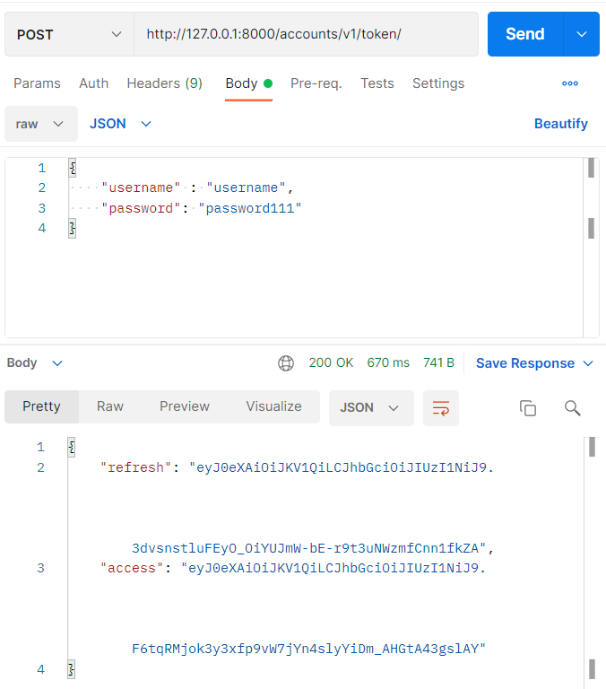
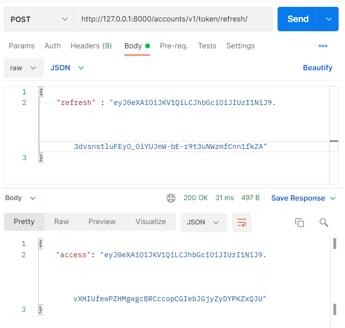

# [Django REST framework] 로그인 API 구현하기

- 로그인은 `simple-jwt` 라이브러리를 사용하였다.
  - [공식문서](https://django-rest-framework-simplejwt.readthedocs.io/en/latest/getting_started.html)

- 이 페이지에서는 간단하게 설치하고 설정하고 토큰을 받아오는 부분만 설명하려고 한다.

> ### 자세한 사용법 보러가기

[참고 블로그](https://medium.com/chanjongs-programming-diary/django-rest-framework-drf-%ED%99%98%EA%B2%BD%EC%97%90%EC%84%9C-jwt-%EA%B8%B0%EB%B0%98-authentication-%EC%84%B8%ED%8C%85%ED%95%98%EA%B8%B0-with-simplejwt-%EC%B4%88%EA%B8%B0-%ED%99%98%EA%B2%BD-%EC%84%B8%ED%8C%85-1-e54c3ed2420c)

> ### 설치하기

```bash
pip install djangorestframework-simplejwt
```

> ### 환경 설정

```python
REST_FRAMEWORK = {
    ...
    'DEFAULT_AUTHENTICATION_CLASSES': (
        ...
        'rest_framework_simplejwt.authentication.JWTAuthentication',
    )
    ...
}

REST_USE_JWT = True

SIMPLE_JWT = {
    'ACCESS_TOKEN_LIFETIME': timedelta(days=1),
    'REFRESH_TOKEN_LIFETIME': timedelta(days=15),
    'ROTATE_REFRESH_TOKENS': False,
    'BLACKLIST_AFTER_ROTATION': True,
}
```

> ### 오류 메시지 수정하기

- 아이디 혹은 비밀번호가 틀리면 오류를 영어로 반환해준다. 그 오류를 한글로 변경하기 위해 `serializer`, `view`, `urls`를 수정하였다.

### seriailzer

- `TokenObtainPairSerializer`을 상속받아 `default_error_messages`만 다시 선언하였다.

```python
class CustomTokenObtainPairSerializer(TokenObtainPairSerializer):
    '''
    TokenObtainPairSerializer 커스텀
    '''
    default_error_messages = {
        "no_active_account": _("지정된 자격 증명에 해당하는 활성화된 사용자를 찾을 수 없습니다.")
    }
```

### view

- `TokenObtainPairView`을 상속받아 `serializer_class`를 다시 만들었던 `serializer`로 변경한다.

```python
class MyTokenObtainPairView(TokenObtainPairView):
    serializer_class = CustomTokenObtainPairSerializer
```

### urls

- `urls.py`는 프로젝트에 있는 파일을 수정하면 된다.
- 공식문서에 나와있는 아래의 코드를 다음과 같이 변경하면 된다.

```python
# 변경 전
path('api/token/', TokenObtainPairView.as_view(), name='token_obtain_pair'),

# 변경 후
from accounts.views import MyTokenObtainPairView
path('accounts/v1/token/', MyTokenObtainPairView.as_view(), name='token_obtain_pair'),
```

- url을 다시 만든 `view`로 연결하면 된다.

> ### API 응답 결과

- refresh : access 토큰을 다시 발행하기 위한 토큰
- access : 로그인을 위한 토큰



> ### access 토큰 refresh API

- 로그인 할 때 얻었던 `refresh`토큰을 인증하면 새로운 `access`토큰을 반환한다.


