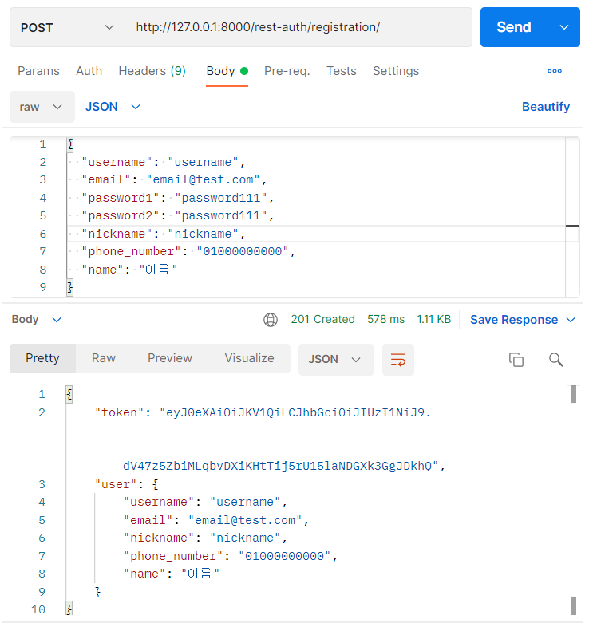

# [Django REST framework] 회원가입 API 구현하기

- [휴대폰 인증 문자 API 구현하기](https://maximum-curry30.tistory.com/358)를 통해 전화 번호 인증을 통과한 사용자는 회원가입을 진행할 수 있다.

- 회원가입은 `rest-auth`에서 제공하는 register를 사용할 것이다.

  

> ### rest-auth 설치하기

##### 1.django-rest-auth install

```bash
pip install django-rest-auth
```

##### 2. INSTALLED_APPS에 추가하기

```python
INSTALLED_APPS = (
    ...,
    'rest_framework',
    'rest_framework.authtoken',
    ...,
    'rest_auth'
)
```

##### 3. django-rest-auth[with_social] install

```bash
pip install django-rest-auth[with_social]
```

##### 4. settings.py 설정하기

```python
INSTALLED_APPS = (
    ...,
    'django.contrib.sites',
    'allauth',
    'allauth.account',
    'rest_auth.registration',
)

SITE_ID = 1
```

##### 5. 프로젝트 urls.py에 주소 추가하기

- url로 되어있는 부분은 path로 변경하고 정규식에서 r과 ^를 빼고 적어도 된다.

```python
urlpatterns = [
    ...,
    url(r'^rest-auth/', include('rest_auth.urls')),
    url(r'^rest-auth/registration/', include('rest_auth.registration.urls'))
]
```


> ### 회원가입 Serializer

- 기본적으로 제공하는 serializer은 모델에 추가한 필드들의 유효성 검사나 오류 메시지등이 부족하다.
- 그래서 `RegisterSerializer`을 상속받아 다시 만들었다.

| 변수명 or 함수명      | 설명                                                         |
| --------------------- | ------------------------------------------------------------ |
| username              | 기본적으로 `RegisterSerializer`에 들어있지만 아이디가 무조건 영어로 시작하도록 그 뒤에는 영어, 숫자, 특수문자(_언더바만 허용)만 오도록 정규식을 만들어 유효성 검사를 다시 만들었다. |
| nickname              | 자음, 모음을 제외한 모든 문자 사용 가능, 나머지는 오류 메시지 반환 |
| name                  | 사용자의 실명이 들어갈 부분이라 영문 혹은 한글만 허용, 나머지는 오류 메시지 반환 |
| validate_name         | 사용자가 영어와 한글을 혼합하여 작성한 경우 모두 영어인지 혹은 모두 한글인지 확인한다. |
| validate_nickname     | 같은 닉네임은 사용할 수 없기에 닉네임 중복을 확인한다.       |
| validate_phone_number | 전화번호 인증 내역이 있는지, 이미 가입한 회원인지 파악한다.  |
| get_cleaned_data      | 부모에 있는 `get_cleaned_data`은 추가로 필드에 입력한 것 중에 없는것들이 있어 다시 작성한다. |
| save                  | 인증번호 확인 과정에서 미리 `User`를 생성하였기 때문에 여기서 부모의 `save`를 불러오면 그대로 user 객체가 하나 더 생성된다. 그렇기 때문에 `save` 함수를 다시 만들어 사용자의 전화번호와 일치하는 `User`객체를 가져와서 해당 객체의 정보를 업데이트 하는 방식으로 진행한다. |

```python
class CustomRegisterSerializer(RegisterSerializer):
    # 필요한 필드 다시 적기
    username = serializers.CharField(
        max_length=get_username_max_length(),
        min_length=allauth_settings.USERNAME_MIN_LENGTH,
        required=allauth_settings.USERNAME_REQUIRED,
        validators=[RegexValidator(regex=r"^([a-zA-Z])[a-zA-Z0-9_]*$", message='ID 형식이 잘못되었습니다.')]
    )
    nickname = serializers.CharField(max_length=20, validators=[
        RegexValidator(regex=r"[^ㄱ-ㅣ]$", message='닉네임 형식이 잘못되었습니다.')])
    phone_number = serializers.CharField(max_length=11,
                                         validators=[RegexValidator(regex=r"^010?[0-9]\d{3}?\d{4}$",
                                                                    message='전화번호 형식이 잘못되었습니다.')])
    name = serializers.CharField(max_length=50,
                                 validators=[RegexValidator(regex=r"^[a-zA-Z|가-힣]*$", message='이름 형식이 잘못되었습니다.')])
    email = serializers.EmailField(required=True)

    def validate_name(self, name):
        eng = re.compile(r"^[a-zA-Z]*$")
        korea = re.compile(r"^[가-힣]*$")
        if eng.match(name):
            return name
        elif korea.match(name):
            return name
        raise serializers.ValidationError(_('이름 형식이 잘못되었습니다.'))

    def validate_nickname(self, nickname):
        if User.objects.filter(nickname=nickname).count() > 0:
            raise serializers.ValidationError(_('이미 이 닉네임으로 등록된 사용자가 있습니다.'))
        return nickname

    def validate_phone_number(self, phone_number):
        '''
            미리 전화번호로 User가 있는지 확인하고 가입 단계로 넘어오겠지만
            혹시 모를 경우를 대비해 다시 한 번 전화번호 확인
        '''
        # 전화 번호 인증 확인하기
        phone_number_obj = SmsAuth.objects.filter(phone_number=phone_number)
        user = User.objects.filter(phone_number=phone_number)
        # 1. 전화 번호 인증을 진행하지 않았을 경우
        # 2. 전화번호 인증만 진행한 경우(인증번호 확인 작업 x)
        if not phone_number_obj.exists() or not user.exists():
            raise serializers.ValidationError(_("전화번호 인증 후 회원가입을 진행해주세요."))
        elif phone_number_obj.exists() and user.exists():
            # 전화번호 인증과 인증번호 확인 까지 완료
            if len(user[0].email) > 0:
                # 이미 회원인데 다시 가입하려는 경우
                raise serializers.ValidationError(_("가입내역이 있습니다. 로그인을 진행해주세요."))
            else:
                # email의 길이가 0보다 크지 않다는건 
                # 회원가입을 진행하지 않았다는 뜻이기에 phone_number 리턴
                return phone_number

    # 추가된 필드를 다시 저장해줘야 해서 재정의하기
    def get_cleaned_data(self):
        # 먼저 부모 클래스를 진행해서 data를 가져오고
        data = super().get_cleaned_data()
        # 그 다음에 우리가 정의한 값들을 data에 추가하기
        data['nickname'] = self.validated_data.get('nickname', '')
        data['phone_number'] = self.validated_data.get('phone_number', '')
        data['name'] = self.validated_data.get('name', '')
        return data

    @transaction.atomic
    def save(self, request):
        '''
            원래는 super().save(request)를 상속받아서 새로운 객체를 생성하지만
            전화번호를 인증하는 과정에서 미리 User객체를 생성하였기 때문에
            해당 객체를 다시 불러와 객체의 속성값을 업데이트 하는 방법으로 진행
        '''
        # 위에서 다시 정의한 함수를 실행하여 data 얻기
        data = self.get_cleaned_data()
        phone_number = data.get('phone_number')
        user = User.objects.get(phone_number=phone_number)
        user.nickname = data.get('nickname')
        user.username = data.get('username')
        user.email = data.get('email')
        # 비밀번호 같은 경우 user.password로 하면 암호화되서 저장이 안되기 때문에
        # set_password()로 해야 암호화되서 저장됨
        user.set_password(data.get("password1"))
        user.nickname = data.get('nickname')
        user.phone_number = phone_number
        user.name = data.get('name')
        user.save()
        return user
```


> ### 커스텀한 Serializer 환경 설정에 등록하기

- 기본 `RegisterSerializer` 말고 새로 만든 것을 등록하려면 환경설정에 추가하면 된다.

```python
REST_AUTH_REGISTER_SERIALIZERS = {
    'REGISTER_SERIALIZER': 'app이름.파일이름.CustomRegisterSerializer',
}
```


> ### API 응답 결과

- 회원가입 시 토큰은 jwt 토큰을 사용하였다.

